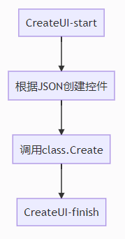
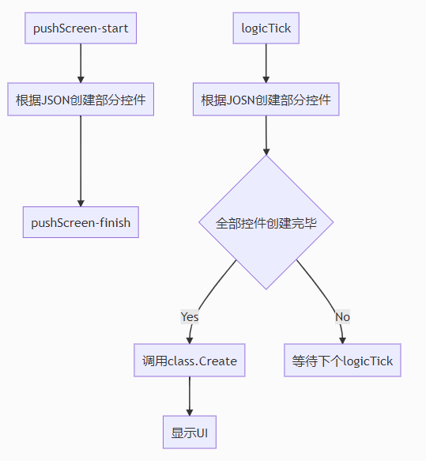
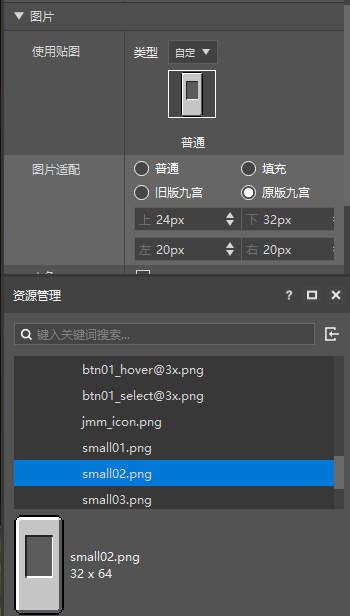
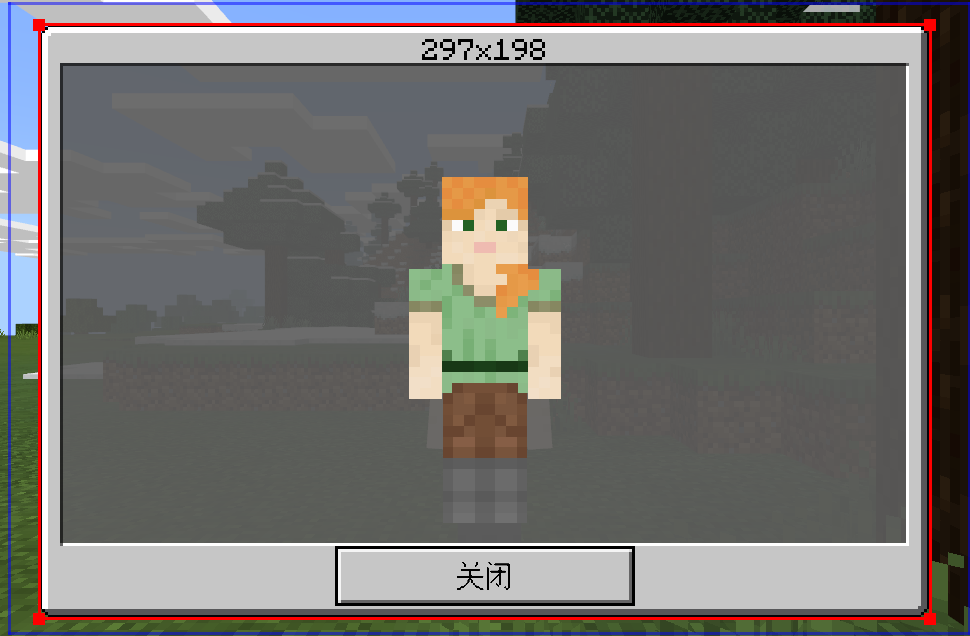
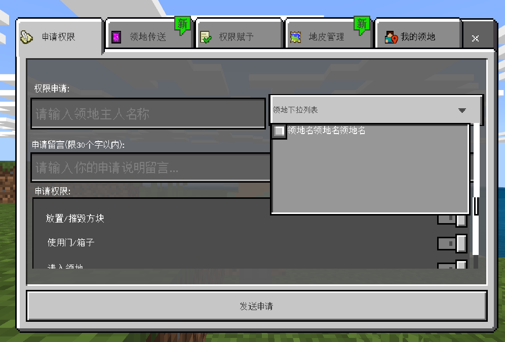
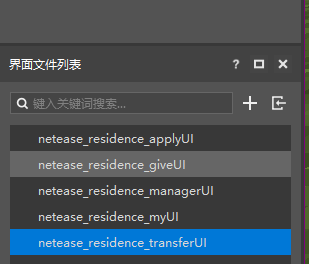

# UI界面表现提升技巧
## 实现UI管理器对象
* UI界面要最终显示，需要经历【注册】，【创建】，【显示】这三个关键步骤，并且，这三个关键步骤，是可以分离的。
### UI界面的【注册】，
* 通过API【RegisterUI】注册一个UI界面，在没有卸载Mod的情况下，同一UI只需要注册一次
* 经测试，注册界面消耗的时间，与界面本身的复杂度（控件数量、用到的资源图片）基本无关，是一个相对稳定的均值。
### UI界面的【创建】
* 通过API【CreateUI】创建一个UI界面，在没有卸载Mod，并且没有调用API【SetRemove】销毁界面的情况下，同一个UI只需要创建一次
* 创建UI界面的整个流程中，在生成了UI上的全部控件之后，会调用UI界面对应的类的【Create】成员函数，一般会在这个成员函数中对按钮的响应等功能进行初始化，假如【Create】成员函数中执行了【Clone】等消耗较大的API， 那么也会拖慢整个UI的创建流程
* 经测试，创建界面消耗的时间，受界面本身的复杂度影响，一个UI界面包含的控件数量越多，创建的速度就越慢，一个UI界面使用到的图片资源的总尺寸越大，创建的速度就越慢
* 一般来说，单个不是特别复杂的UI界面的创建时间，在10-40ms之间，按照游戏帧率30来计算，每帧的平均时间为33ms，40ms左右的时间刚刚好不至于产生能够感知到的卡顿。
### UI界面的【显示】
* 通过API【SetScreenVisible】显示/隐藏一个UI界面。
* 在UI界面已经完成创建的情况下，仅仅使用API【SetScreenVisible】显示一个UI界面，基本都仅仅消耗1ms左右。
* 经测试，对UI里面的控件的具体显示功能进行调整，那么消耗的时间回合具体调整的内容相关。
* 对图片控件进行【SetVisible】、【SetSprite】等操作，消耗的时间与对应的图片资源的尺寸相关
* 对文本控件进行【SetText】、【SetTextColor】等操作，消耗的时间与文本的总长度相关，并且设置中文比设置纯英文和数字慢得多。
* 对控件进行【Clone】操作，与控件本身的复杂度（子控件的数量）正相关。
### UI界面的【销毁】
* 通过API【SetRemove】销毁一个UI界面，调用【SetRemove】之后，需要重新【CreateUI】后才能显示这个UI。
* 经测试，【SetRemove】消耗的时间在1-3ms左右，基本不太可能导致可感知的客户端卡顿。
### 管理器代码示例
* 使用管理器分离UI界面的【注册】、【创建】和【显示】，可以有效避免**同时大量创建界面**的情况发生，避免客户端出现可感知的卡顿。
* 管理器基于**Create On Use**的原则设计，通过管理器获取/显示UI界面，可以基本保证**同一时间仅创建一个UI**与**每个UI仅创建一次**
* 管理器提供**CleanCacheUI**函数，可以在合适的时候调用释放已经完成【创建】的UI界面，以释放内存占用。
```
class UIDef:
	UIBig1 = "UIBig1"
	UIBig2 = "UIBig2"
	...

UIData = {
	UIDef.UIBig1 : {
		"cls":"neteaseUiSampleScript.ui.netease_uisample_big.UiSampleScreen",
		"screen":"netease_uisample_big01.main",
		"isHud":1,
		"layer":clientApi.GetMinecraftEnum().UiBaseLayer.PopUpLv1,
	},
	UIDef.UIBig2 : {
		"cls":"neteaseUiSampleScript.ui.netease_uisample_big.UiSampleScreen",
		"screen":"netease_uisample_big03.main",
		"isHud":1,
		"layer":clientApi.GetMinecraftEnum().UiBaseLayer.PopUpLv1,
	},
	UIDef.UIBig3 : {
		...
}

class UIMgr(object):
	def __init__(self):
		super(UIMgr, self).__init__()
		self.mModName = "NeteaseUiSample"
		self.mUIDict = {}
		self.mClientSystem = None

	def Destroy(self):
		pass
	# UI管理器的初始化，一般在客户端引擎事件【UiInitFinished】的回调中调用
	def Init(self, system):
		self.mClientSystem = system
		# 在初始化时，执行所有可能用到的UI的【注册】环节
		# UI的【注册】环节消耗比较大，在初始化时执行主要是因为客户端初始化的整个流程一般会消耗好几秒，额外消耗几十到一百多毫秒用来【注册】UI界面，影响不是很大。
		for uiKey, config in UIData.iteritems():
			cls, screen = config["cls"], config["screen"]
			clientApi.RegisterUI(self.mModName, uiKey, cls, screen)

	# 封装了UI的【创建】过程
	def CreateSingleUI(self, uiKey):
		config = UIData.get(uiKey, None)
		if not config:
			return None
		extraParam = {}
		if config.has_key("isHud"):
			extraParam["isHud"] = config["isHud"]
		ui = clientApi.CreateUI(self.mModName, uiKey, extraParam)
		if not ui:
			return None
		layer = config.get("layer", None)
		if not layer is None:
			ui.InitLayer(layer)
		ui.InitSystem(self.mClientSystem, uiKey)
		ui.InitScreen()
		# 缓存已经完成【创建】的UI
		self.mUIDict[uiKey] = ui
		return ui

	def GetUI(self, uiKey):
		# 优先从缓存中获取UI界面对象
		ui = self.mUIDict.get(uiKey, None)
		if ui:
			return ui
		# 假如没有缓存，那么新【创建】一个
		return self.CreateSingleUI(uiKey)
	
	# 【显示】一个UI界面
	# 假如UI还没有【创建】过，那么先执行【创建】流程
	# 假如UI已经完成了【创建】，那么直接从缓存中获取UI实例
	# 在一般的应用中，只有第一次【显示】UI界面的时候，才会附带一个额外的【创建】流程
	# 之后的再次【显示】界面，就不需要再次【创建】界面，大大提升界面【显示】的速度
	def ShowUI(self, uiKey):
		ui = self.GetUI(uiKey)
		if not ui:
			return
		ui.Show()

	def CleanCacheUI(self):
		if not self.mUIDict:
			return
		for uiKey, ui in self.mUIDict.iteritems():
			ui.SetRemove()
		self.mUIDict.clear()

	def RemoveUI(self, uiKey):
		ui = self.mUIDict.get(uiKey, None)
		if not ui:
			return False
		del self.mUIDict[uiKey]
		ui.SetRemove()
		return True
```
## 使用pushScreen优化单个UI的创建
* API【pushScreen】整合了UI界面的【创建】和【显示】两个环节，只需要【注册】和【pushScreen】即可显示一个UI
* 对于同一个UI界面，【pushScreen】不建议与【CreateUI】混用
* 【pushScreen】只能同时显示一个UI界面，在一个UI界面显示的状态下，调用【pushScreen】显示另外一个UI界面，会自动隐藏之前的UI界面
* 使用【pushScreen】【创建】并【显示】一个UI界面，实际上是一个异步的过程，所以相对于【CreateUI】方法来说，整个界面的【创建】工作是分时完成的，可以最大限度地防止客户端卡顿地现象发生。
* 【CreateUI】的执行流程

*  【pushScreen】的执行流程

* 【pushScreen】【创建】界面是一个异步的过程，从流程图上可见，必须等待引擎调用注册时输入的ScreenNode类的【Create】成员函数后，界面的初始化工作才完成，之后才能正常地对界面上地控件进行各种调整。
## 其他小技巧
###  使用九宫贴图替代大尺寸贴图
* 当前UI编辑器中，已经提供了非常好用的九宫拉伸预览功能，使用九宫拉伸，可以用很小尺寸的贴图，实现各种背景贴图效果

使用一张32X64的小尺寸贴图，通过九切拉伸，可以展现出297X198的背景图效果，如下图

### 拆分含有分页的复杂界面
* 经测试，单个UI界面【创建】和【显示】需要消耗的时间，受整个UI界面中的控件总数影响最大，控件总数越多，【创建】和【显示】消耗的时间越大。
* 那么当一个界面上由于功能太多，导致控件太多，最终导致【创建】【显示】消耗时间太多导致客户端出现卡顿时，就可以尝试把一个界面拆分为多个子界面的方式来优化客户端表现。
* 以领地插件为例，下面是领地插件界面的示意图

* 可见界面整体是非常复杂的，每个分页上面就含有很多控件，并且整个界面还有五个分页

* 为了优化整个界面的实际表现，从UI的工程上就可以看到，事实上每个分页都是一个独立的子界面，表面上切换分页的行为，最终在代码上实际是用隐藏一个界面然后显示另外一个界面的方式来实现的。
示例代码如下：
```python
def OnApplyBtn(self, args):
	"""
	切换领地界面到【申请权限】分页
	"""
	touchEvent = args["TouchEvent"]
	touch_event_enum = extraClientApi.GetMinecraftEnum().TouchEvent
	if touchEvent == touch_event_enum.TouchUp:
		for keys in uiDef.UIData.keys():
			if keys != uiDef.UIDef.UIResidenceApply:
				ui = self.mUIMgr.GetUI(keys)
				ui.ClosePanel()
		ui = self.mUIMgr.GetUI(uiDef.UIDef.UIResidenceApply)
		if ui:
			ui.Show()
```
### 分时执行Clone等高消耗的操作
* 经测试，【创建】并【显示】下面的背景图+一个组合控件+一个ScrollView+一些按钮消耗的时间，仅为Clone100个组合控件的1/25（在一般配置的PC环境，【创建】并【显示】消耗36ms；而Clone100个组合控件消耗867ms）

* 那么当最终想要下图所示的含有100个组合控件的界面时，最好是最初时候仅【创建】并【显示】不含有组合控件的简单界面（初始化成员函数【Create】中隐藏组合控件的原型）。

* 然后在接下来的几十帧中，每帧创建个5-10个组合控件，直到全部创建完成
示例代码如下：
```python
def PlusSomePart(self, plusNum):
	baseOffset = len(self.mOnUseParts)
	basePos, baseSize = self.mScrollData["partBasePos"], self.mScrollData["partBaseSize"]
	offset = self.mScrollData["partBaseOffset"]
	for i in xrange(plusNum):
		data = self.GetFreePart()
		pos = (basePos[0], basePos[1]+(baseSize[1]+offset)*(baseOffset+i))
		baseUIControl = self.GetBaseUIControl(data["fullName"])
		baseUIControl.SetPosition(pos)
		baseUIControl.SetVisible(True)
		self.mOnUseParts.append(data["id"])
	self.ResizeScroll()
		
def OnButtonAsyncPlus(self, plusNum, args):
	self.mAyncPlusLeftNum += plusNum
	
def Update(self):
	if self.mAyncPlusLeftNum <= 0:
		return
	plusNum = min(5, self.mAyncPlusLeftNum)
	self.mAyncPlusLeftNum -= plusNum
	self.PlusSomePart(plusNum)
```
### 主动使用过渡性的加载进度界面
* UI界面，在客户端Mod没有卸载的情况下，仅需要【注册】、【创建】一次，之后就可以多次重复【显示/隐藏】。
* 经测试，对比【注册】【创建】行为，【显示/隐藏】消耗的时间基本都是10ms以内，哪怕此界面控件繁多，逻辑复杂。
* 可以在游戏启动后，主动添加一个带进度条的全屏界面，使用每帧【注册】并【创建】一个UI界面的方法，把需要用到的界面全部创建好，那么在游戏过程中，仅调用【显示/隐藏】功能的界面就不会卡顿了。