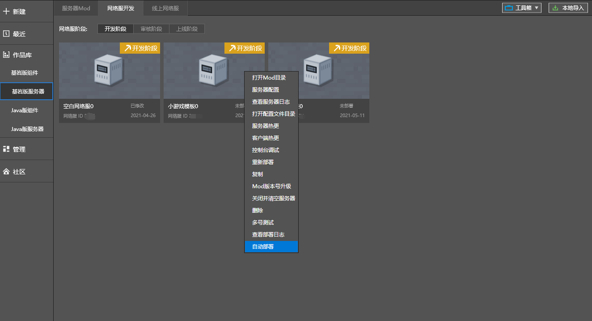
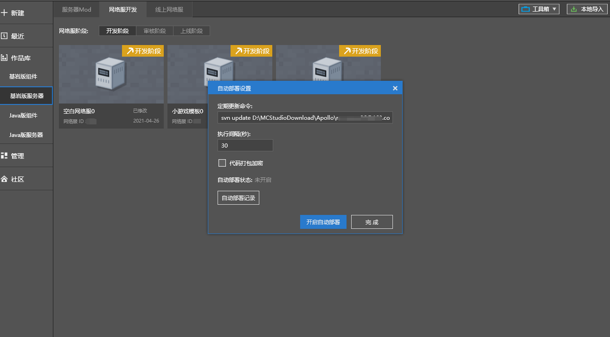
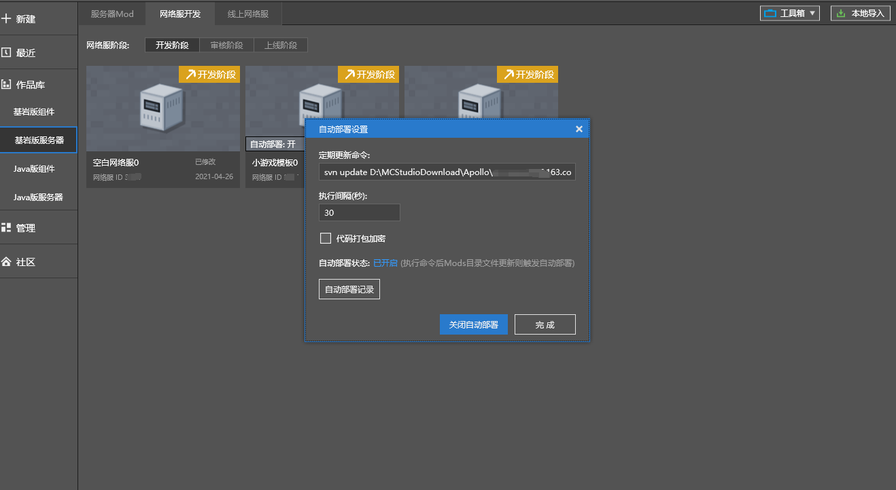
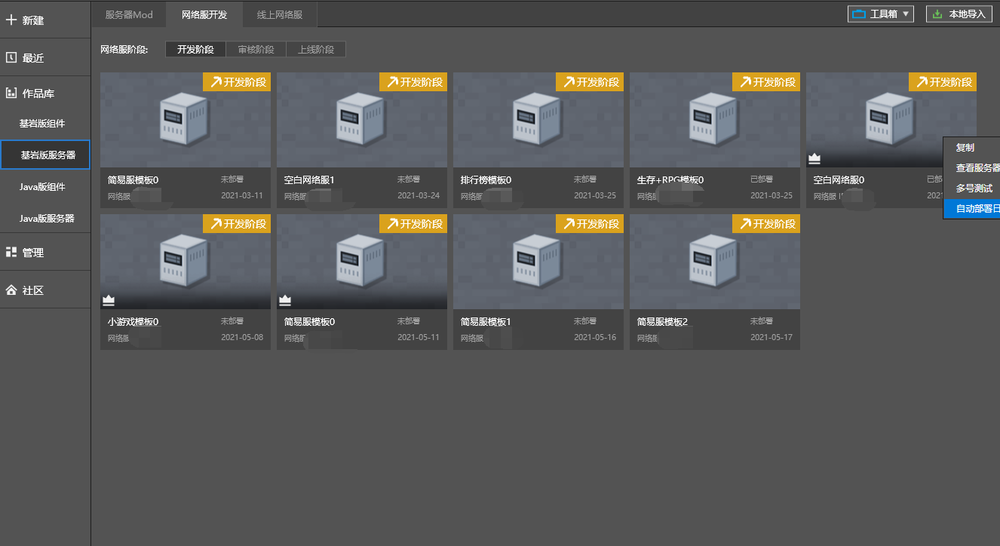

# 多账号协同部署

### 概述

​		团队开发过程中，可能需要协同提交代码、美术资源等内容，而这些内容可能涉及一定的查看权限。“**自动部署**”功能可便捷解决该问题，简要描述如下：

​		1）开发者自行通过版本维护工具，在某个本地目录进行协同提交。

​		2）主账号可对该目录开启自动部署：定期检测该目录内容，若存在更新，则执行部署操作。

### 自动部署流程

- 主账号右键点击网络服，选择“更多——自动部署”

  

- 按开发者所用的版本工具，调整自动更新命令。默认为svn update，也支持git或其他版本工具指令。

  

- 点击“开启自动部署”按钮，可开启自动部署功能。开启后，点击“自动部署记录”可查看自动部署结果。

  

- 对于自动部署中的网络游戏，点击“关闭自动部署”按钮，可关闭自动部署功能。

  

- 对于子账号，也能查看自动部署日志。

  