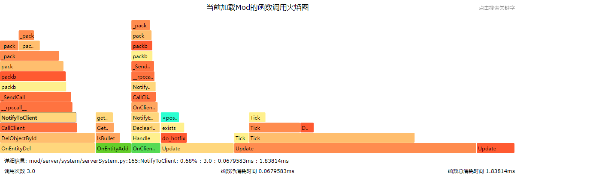

# 插件调试技巧集锦
## 定位内存增长
* 使用运营指令【/check-memory-run】检查服务器脚本层内存泄漏。需要执行两次指令，第一次生成快照，第二次生成同第一次的diff。
参数为：
关键字      | 数据类型| 说明        
---|:---|---:
serverId |int      |
useList |list      | 通常是 ["tracemalloc", "objreport"]
objNames |list      | 通常是空
示例：
* 第一步：ssh到控制服所在的服务器上，执行以下指令（其中4000为lobby服的服务器ID）
```bash
curl -X POST '42.186.17.79:8014/check-memory-run' -H 'Content-Type: application/json' --data-raw '{"serverId" : 4000,"useList":["tracemalloc","objreport"],"objNames":[]}'
```
* 第二步，通过studio登录一个客户端
* 第三步，客户端登录完成后，关闭客户端
* 第四步，客户端完全退出之后，再次执行
```bash
curl -X POST '42.186.17.79:8014/check-memory-run' -H 'Content-Type: application/json' --data-raw '{"serverId" : 4000,"useList":["tracemalloc","objreport"],"objNames":[]}'
```
此时从lobby4000的服务端日志上，可以看到
```
[2021-05-06 16:27:23 INFO] Python:[2021-05-06 16:27:23,359] [INFO][Engine] run_check use_list:['tracemalloc', 'objreport'] obj_names:[]
[2021-05-06 16:27:23 INFO] Python:[2021-05-06 16:27:23,399] [INFO][Engine] run_tracemalloc traceback
[2021-05-06 16:27:23 INFO] Python:[2021-05-06 16:27:23,422] [INFO][Engine] Top 10 differences 
[2021-05-06 16:27:23 INFO] Python:redirect.py:127: size=195 KiB (+195 KiB), count=1860 (+1860), average=107 B
[2021-05-06 16:27:23 INFO] Python:mod/server/memory/obj_report.py:43: size=48.0 KiB (+48.0 KiB), count=1 (+1), average=48.0 KiB
[2021-05-06 16:27:23 INFO] Python:/usr/local/lib/python2.7/re.py:261: size=12.0 KiB (+12.0 KiB), count=1 (+1), average=12.0 KiB
[2021-05-06 16:27:23 INFO] Python:mod/common/system/eventHandler.py:14: size=9928 B (+9928 B), count=20 (+20), average=496 B
[2021-05-06 16:27:23 INFO] Python:lib/msgpack/fallback.py:945: size=8832 B (+8832 B), count=16 (+16), average=552 B
[2021-05-06 16:27:23 INFO] Python:lib/msgpack/fallback.py:840: size=7728 B (+7728 B), count=14 (+14), average=552 B
[2021-05-06 16:27:23 INFO] Python:mod/server/serverrpchandler.py:17: size=7320 B (+7320 B), count=5 (+5), average=1464 B
[2021-05-06 16:27:23 INFO] Python:lib/msgpack/fallback.py:600: size=5808 B (+5808 B), count=11 (+11), average=528 B
[2021-05-06 16:27:23 INFO] Python:mod/server/component/compFactoryServer.py:36: size=5080 B (+5080 B), count=18 (+18), average=282 B
[2021-05-06 16:27:23 INFO] Python:mod/server/memory/obj_report.py:45: size=4960 B (+4960 B), count=5 (+5), average=992 B
[2021-05-06 16:27:23 INFO] Python:[2021-05-06 16:27:23,494] [INFO][Engine] [QA] [DIFF_MORE]
[2021-05-06 16:27:23 INFO] Python:+205		<type 'function'>
[2021-05-06 16:27:23 INFO] Python:+41		<type 'dict'>
[2021-05-06 16:27:23 INFO] Python:+22		<type 'tuple'>
[2021-05-06 16:27:23 INFO] Python:+18		<type 'property'>
[2021-05-06 16:27:23 INFO] Python:+15		<type 'list'>
[2021-05-06 16:27:23 INFO] Python:+11		<type 'weakref'>
[2021-05-06 16:27:23 INFO] Python:+11		<type 'type'>
[2021-05-06 16:27:23 INFO] Python:+9		<type 'module'>
[2021-05-06 16:27:23 INFO] Python:+8		<type 'getset_descriptor'>
[2021-05-06 16:27:23 INFO] Python:+7		<type 'set'>
[2021-05-06 16:27:23 INFO] Python:+6		<type 'builtin_function_or_method'>
[2021-05-06 16:27:23 INFO] Python:+5		<class 'redis.connection.Token'>
[2021-05-06 16:27:23 INFO] Python:+4		<class 'server.component.engineTypeCompServer.EngineTypeComponentServer'>
[2021-05-06 16:27:23 INFO] Python:+4		<class 'neteaseBattleScript.battleCommon.battleMob.BattleMob'>
[2021-05-06 16:27:23 INFO] Python:+4		<class 'server.component.nameCompServer.NameComponentServer'>
[2021-05-06 16:27:23 INFO] Python:+1		<type 'cell'>
[2021-05-06 16:27:23 INFO] Python:+1		<class 'threading._RLock'>
[2021-05-06 16:27:23 INFO] Python:+1		<class 'redis.connection.SocketBuffer'>
[2021-05-06 16:27:23 INFO] Python:+1		<class 'redis.connection.Connection'>
[2021-05-06 16:27:23 INFO] Python:+1		<class 'redis.connection.Encoder'>
[2021-05-06 16:27:23 INFO] Python:+1		<class 'redis.connection.PythonParser'>
[2021-05-06 16:27:23 INFO] Python:+1		<class 'common.system.eventHandler.EventHandlerNoArgs'>
[2021-05-06 16:27:23 INFO] Python:+1		<type '_io.BytesIO'>
[2021-05-06 16:27:23 INFO] Python:+1		<class 'serverhttp.HttpPool'>
[2021-05-06 16:27:23 INFO] Python:+1		<class 'redis.selector.PollSelector'>
[2021-05-06 16:27:23 INFO] Python:+1		<class 'http_util.CHttpPool'>
[2021-05-06 16:27:23 INFO] Python:+1		<class 'socket._socketobject'>
[2021-05-06 16:27:23 INFO] Python:[2021-05-06 16:27:23,495] [INFO][Engine] [QA] [DIFF_LESS]
```
* 【[INFO][Engine] Top 10 differences】这句日志下面的10行，代表了脚本层在两次【/check-memory-run】请求之间，新申请内存最多的10行代码。注意，是新申请，而不是新增，也就是只计算内存申请的总数，不考虑是否在之后释放。
比如说【Python:redirect.py:127: size=195 KiB (+195 KiB), count=1860 (+1860), average=107 B】代表redirect.py的127行的语句，一共申请了195KB的内存，这一行一共执行了1860次，平均每次申请107B的内存（当然这些新申请的内存很可能很快就释放了），一般来说top10的新申请内存，都会是python的系统调用，或者是引擎的调用。
* 【[INFO][Engine] [QA] [DIFF_MORE]】这句日志下面的内容，代表了脚本层在两次【/check-memory-run】请求之间，新增的python对象（也就是第一次调用【/check-memory-run】时还不存在，但是在第二次调用【/check-memory-run】时引用计数大于零的对象），这里列出的对象就是新增并且没有释放引用的对象。
比如说【Python:+4 <class 'neteaseBattleScript.battleCommon.battleMob.BattleMob'>】说明玩家登录后再退出，python层新增了4个【neteaseBattleScript.battleCommon.battleMob.BattleMob】对象，假如每次有玩家登录后退出，都会新增4个这种对象，就说明这个对象的引用管理上存在泄漏，在玩家退出之后依旧保留了引用
* 【[INFO][Engine] [QA] [DIFF_LESS]】这句日志下面的neritic，代表了脚本层在两次【/check-memory-run】请求之间，减少的python对象（也就是第一次调用【/check-memory-run】时引用计数大于零，但是在第二次调用【/check-memory-run】时引用计数已经清零的对象），一般来说这个信息可以用于排除一些疑似泄漏的对象（可能部分对象的释放存在延时，会干扰了内存泄漏的定位）。

## 实时定位性能问题
* 使用运营指令【/profile】测量python函数占用cpu时间。需要执行两次指令，第一次开始profile，第二次生成性能数据文件。性能数据文件放到可执行文件所在目录下的profile子目录中。性能数据文件名的格式：profile+生成文件的时间戳
参数为：
关键字      | 数据类型| 说明 
---|:---|---:
serverId |int      |服务器对应ID。0表示为master，-1表示所有服务器，其他表示lobby/game/service的服务器ID
bBegin |bool      |true：开始profile；false：完成profile|
示例：
* 第一步：ssh到控制服所在的服务器上，执行以下指令（其中4000为lobby服的服务器ID）
```bash
curl -X POST '42.186.17.79:8008/profile' -H 'Content-Type: application/json' --data-raw '{"serverId" : 4000,"bBegin":true}'
```
* 第二步，通过studio登录一个客户端
* 第三步，客户端登录完成后，关闭客户端
* 第四步，客户端完全退出之后，再次执行
```bash
curl -X POST '42.186.17.79:8008/profile' -H 'Content-Type: application/json' --data-raw '{"serverId" : 4000,"bBegin":false}'
```
此时可以从【netgame/app/{gameid}/lobby/lobby_lobby_4000/profile】目录中找到对应的profile_xxx文件，文件内容为：
```
         727372 function calls (725719 primitive calls) in 1.543 seconds

   Ordered by: internal time

   ncalls  tottime  percall  cumtime  percall filename:lineno(function)
     1356    0.259    0.000    1.169    0.001 baseSystemManager.py:137(Tick)
    56989    0.107    0.000    0.107    0.000 utils.py:4(GetKey)
    61020    0.096    0.000    0.182    0.000 baseSystem.py:207(GetNeedUpdate)
     1400    0.066    0.000    1.543    0.001 eventBus.py:132(Post)
    69156    0.056    0.000    0.056    0.000 collections.py:90(__iter__)
    61051    0.051    0.000    0.066    0.000 serverSystem.py:264(_GetApp)
     1356    0.050    0.000    1.341    0.001 serverApp.py:263(TickApp)
     1356    0.038    0.000    0.039    0.000 interface.py:89(Tick)
    62755    0.025    0.000    0.025    0.000 {method 'get' of 'dict' objects}
     6780    0.023    0.000    1.393    0.000 eventHandler.py:25(Call)
     1356    0.021    0.000    0.056    0.000 netServerApp.py:51(TickApp)
    61020    0.020    0.000    0.020    0.000 baseApp.py:114(GetNeedUpdate)
    68093    0.017    0.000    0.017    0.000 {method 'has_key' of 'dict' objects}
     1356    0.017    0.000    0.029    0.000 neteaseBattleScript.battleGameObjMgrServer:73(Tick)
     1356    0.015    0.000    0.022    0.000 hurtSysServer.py:17(UpdateHurt)
    61067    0.015    0.000    0.015    0.000 game.py:30(GetServer)
     1356    0.014    0.000    0.032    0.000 healthSysServer.py:17(UpdateHealth)
     1400    0.013    0.000    0.019    0.000 eventConf.py:907(GetScriptServerEventIDList)
     1356    0.013    0.000    0.052    0.000 gameSysServer.py:67(Update)
     1356    0.012    0.000    0.016    0.000 netgameApp.py:10(Tick)
  1275/26    0.011    0.000    0.023    0.001 fallback.py:741(_pack)
     1356    0.011    0.000    0.019    0.000 mobSpawnSysServer.py:16(UpdateSystemMobSpawnServer)
     1356    0.011    0.000    0.042    0.000 neteaseBattleScript.battleServerSystem:51(Update)
     1356    0.010    0.000    0.057    0.000 moveSysServer.py:53(Update)
     1400    0.010    0.000    0.028    0.000 serverEventBus.py:12(GetScriptEventIDList)
     1356    0.009    0.000    0.010    0.000 neteaseBattleScript.battleCommon.battleGameObjMgr:89(Tick)
     1360    0.009    0.000    0.013    0.000 Queue.py:93(empty)
```
*  【727372 function calls in 1.543 seconds】监控到727372次函数调用，总消耗cpu时间为1.543秒
*  【ncalls】函数调用的次数；
*  【tottime】函数的总的运行时间，除掉函数中调用子函数后的运行时间；
*  【percall】（第一个）等于 tottime/ncalls；
*  【cumtime】表示该函数及其所有子函数的调用运行的时间，即函数开始调用到返回的时间；
*  【percall】（第二个）即函数运行一次的平均时间，等于 cumtime/ncalls；
*  【filename:lineno(function)】函数所在的代码位置；
## 获取性能分析火焰图
* 使用API【StartProfile】和【StopProfile】可以获取python脚本层的性能分析火焰图，注意：性能统计的开销较大，不是很适合在正式服务器长期运行，且由于当前仅有API才能驱动，所以假如需要实时运行，需要自己封装成运营指令。
代码示例：
```python
def DoProfile(second):
	serverApi.StartProfile()
	def finishProfile():
		timestamp = int(time.time())
		filename = "profile_%d.svg" % timestamp
		serverApi.StopProfile(filename)
	comp = serverApi.GetEngineCompFactory().CreateGame(serverApi.GetLevelId())
	comp.AddTimer(second, finishProfile)
```
* 通过聊天或其他方式驱动上文函数后，能够在【netgame/app/{gameid}/lobby/lobby_lobby_4000】目录中找到对应的profile_xxx.svg文件，从服务器下载此文件后拖动到【Google Chrome】浏览器后，可以看到python脚本的调用火焰图

* 如火焰图所示，竖直方向表示调用栈，每一层都是一个函数。调用栈越深，火焰就越高，顶部就是正在执行的函数，下方都是它的父函数。分析性能时主要看火焰图的宽度（其中颜色没有特别意义），火焰图越宽，表示该函数对整体性能的消耗越大。因此需要对该函数进行优化。

* 将鼠标放在一个函数块上时，下方会显示当前函数对应的详细信息，以冒号隔开，其中每一项分别代表：所在文件行数、函数名称、占总性能的百分比、调用次数、函数净消耗时间、函数总消耗时间。

* 内存火焰图中的详细信息类似，分别代表：所在文件行数、当前选函数的这一行代码的运行内存占该函数内存的百分比、自身和调用总内存消耗、调用次数。
* 优化的核心主要是减少调用次数以及优化函数的写法。其中对于开发者而言，只需要关注开发者开发的代码即可，对于部分函数调用到mod框架或者引擎顶层框架进而导致性能消耗较大的，可以尝试通过减少调用次数来进行优化。
* 另外，火焰图支持通过右上方的Search框或者“F3”快捷键对函数关键词进行搜索。同时可以点击函数缩放查看对应的调用栈。
## 获取脚本收发包信息
* 使用API【StartRecordEvent】和【StopRecordEvent】可以获取python脚本层的收发包统计信息，注意：收发包统计的开销较大，不是很适合在正式服务器长期运行，且由于当前仅有API才能驱动，所以假如需要实时运行，需要自己封装成运营指令。
  代码示例：
```python
def DoProfileEvent(self, second):
	serverApi.StartRecordEvent()
	def finishProfile():
		result = serverApi.StopRecordEvent()
		for eventName, data in result.iteritems():
			head = "event[{}]".format(eventName)
			head = head.ljust(20)
			print "{} sendNum={} sendSize={} recvNum={} recvSize={}".format(head, data["send_num"], data["send_size"], data["recv_num"], data["recv_size"])
	comp = serverApi.GetEngineCompFactory().CreateGame(serverApi.GetLevelId())
	comp.AddTimer(second, finishProfile)
```
* 通过聊天或其他方式驱动上文函数后，能够在对应服务器进程的日志中，看到下面的日志。
```
[2021-05-07 11:03:48 INFO] Python:event[neteaseBattle:neteaseBattleDev:S2CRpcCall] sendNum=5 sendSize=1136 recvNum=0 recvSize=0
[2021-05-07 11:03:48 INFO] Python:event[neteaseBattle:neteaseBattleBeh:C2SRpcCall] sendNum=0 sendSize=0 recvNum=4 recvSize=315
[2021-05-07 11:03:48 INFO] Python:event[neteaseJewel:neteaseJewelDev:DisplayJewelBoardEvent] sendNum=1 sendSize=1008 recvNum=0 recvSize=0
```
* 日志中每一行，都是一个脚本事件的收发统计（服务端向客户端发送的包视为Send，客户端向服务端发送的包视为Recv）
* 【neteaseJewel:neteaseJewelDev:DisplayJewelBoardEvent】，用【:】分开的三个字符串，第一个【neteaseJewel】是脚本事件的namespace；第二个【neteaseJewelDev】是脚本事件的systemName；第三个【DisplayJewelBoardEvent】脚本事件的eventName。
* 【sendNum=5】代表在统计时间内，此脚本事件一共发送了5次；【sendSize=1136】代表在统计时间内，通过此脚本事件一共发送了【1136】个字节的信息（仅代表逻辑上的大小，不代表实际经过网络层加密和压缩之后的传输量，但依旧可以作为流量统计的标的）
* 【recvNum=4】代表在统计时间内，此脚本事件一共接收到了4次；【recvSize=315】代表在统计时间内，通过此脚本事件一共接收了【315】个字节的信息
## 获取引擎收发包信息
* 使用API【StartRecordPacket】和【StopRecordPacket】可以获取引擎层的收发包统计信息，注意：收发包统计的开销较大，不是很适合在正式服务器长期运行，且由于当前仅有API才能驱动，所以假如需要实时运行，需要自己封装成运营指令。
代码示例：
```python
def DoProfilePacket(self, second):
	serverApi.StartRecordPacket()
	def finishProfile():
		result = serverApi.StopRecordPacket()
		for packetName, data in result.iteritems():
			head = "packet[{}]".format(packetName)
			head = head.ljust(20)
			print "{} sendNum={} sendSize={} recvNum={} recvSize={}".format(head, data["send_num"], data["send_size"], data["recv_num"], data["recv_size"])
	comp = serverApi.GetEngineCompFactory().CreateGame(serverApi.GetLevelId())
	comp.AddTimer(second, finishProfile)
```
* 通过聊天或其他方式驱动上文函数后，能够在对应服务器进程的日志中，看到下面的日志。
```
[2021-05-07 11:25:54 INFO] Python:packet[NeteaseNetGameTransferPacket] sendNum=29 sendSize=1525 recvNum=271 recvSize=14162
[2021-05-07 11:25:54 INFO] Python:packet[MovePlayerPacket] sendNum=0 sendSize=0 recvNum=4 recvSize=120
[2021-05-07 11:25:54 INFO] Python:packet[LevelChunkPacket] sendNum=15 sendSize=360 recvNum=0 recvSize=0
[2021-05-07 11:25:54 INFO] Python:packet[LevelSoundEventPacket] sendNum=18 sendSize=596 recvNum=18 recvSize=556
[2021-05-07 11:25:54 INFO] Python:packet[ActorEventPacket] sendNum=2 sendSize=8 recvNum=0 recvSize=0
[2021-05-07 11:25:54 INFO] Python:packet[MoveActorDeltaPacket] sendNum=447 sendSize=5275 recvNum=0 recvSize=0
[2021-05-07 11:25:54 INFO] Python:packet[PyRpcPacket]  sendNum=5 sendSize=945 recvNum=5 recvSize=1025
[2021-05-07 11:25:54 INFO] Python:packet[SetActorMotionPacket] sendNum=32 sendSize=448 recvNum=0 recvSize=0
[2021-05-07 11:25:54 INFO] Python:packet[PlayerAuthInputPacket] sendNum=0 sendSize=0 recvNum=200 recvSize=10601
[2021-05-07 11:25:54 INFO] Python:packet[LevelEventPacket] sendNum=24 sendSize=417 recvNum=0 recvSize=0
[2021-05-07 11:25:54 INFO] Python:packet[RemoveActorPacket] sendNum=5 sendSize=30 recvNum=0 recvSize=0
[2021-05-07 11:25:54 INFO] Python:packet[UpdateBlockPacket] sendNum=1 sendSize=8 recvNum=0 recvSize=0
[2021-05-07 11:25:54 INFO] Python:packet[NetworkChunkPublisherUpdatePacket] sendNum=2 sendSize=10 recvNum=0 recvSize=0
[2021-05-07 11:25:54 INFO] Python:packet[ClientCacheMissResponsePacket] sendNum=2 sendSize=6 recvNum=0 recvSize=0
[2021-05-07 11:25:54 INFO] Python:packet[TextPacket]   sendNum=1 sendSize=45 recvNum=1 recvSize=24
[2021-05-07 11:25:54 INFO] Python:packet[NetMultiUserTransferPacket] sendNum=582 sendSize=14290 recvNum=0 recvSize=0
[2021-05-07 11:25:54 INFO] Python:packet[UpdateAttributesPacket] sendNum=6 sendSize=478 recvNum=0 recvSize=0
[2021-05-07 11:25:54 INFO] Python:packet[AnimatePacket] sendNum=0 sendSize=0 recvNum=25 recvSize=75
[2021-05-07 11:25:54 INFO] Python:packet[ClientCacheBlobStatusPacket] sendNum=0 sendSize=0 recvNum=2 recvSize=40
[2021-05-07 11:25:54 INFO] Python:packet[SetTimePacket] sendNum=1 sendSize=4 recvNum=0 recvSize=0
[2021-05-07 11:25:54 INFO] Python:packet[PlayerActionPacket] sendNum=0 sendSize=0 recvNum=17 recvSize=119
[2021-05-07 11:25:54 INFO] Python:packet[SetActorDataPacket] sendNum=50 sendSize=609 recvNum=0 recvSize=0
```
* 日志中的每一行，都是一个引擎消息包的收发统计（服务端向客户端发送的包视为Send，客户端向服务端发送的包视为Recv）；注意：由于Apollo网络服，实际上客户端是通过proxy的转发才能和特定的服务端进程交互的，【NeteaseNetGameTransferPacket】就是转发消息包的包名，所以这个消息包的数量基本会等于下面所有包的总和。
* 【LevelSoundEventPacket】就是引擎消息包的包名
* 【sendNum=18】代表在统计时间内，此引擎消息包一共发送了18次；【sendSize=596】代表在统计时间内，通过引擎消息包一共发送了【596】个字节的信息（仅代表逻辑上的大小，不代表实际经过网络层加密和压缩之后的传输量，但依旧可以作为流量统计的标的）
* 【recvNum=18】代表在统计时间内，此引擎消息包一共接收到了18次；【recvSize=556】代表在统计时间内，通过此引擎消息包一共接收了【556】个字节的信息
## Q&A
### 服务端的Mod似乎完全没有生效怎么办？
studio的日志显示和日志搜索功能，都是优先拉取最近一段时间的日志，由于服务端进程启动的时候会刷新大量日志，有可能一些早期的traceback日志都没有拉取到，所以需要主动把日志窗口的滚轮滚动到顶部，触发拉取更早时间的日志，可能在Mod加载的时候就出现了traceback，最终导致整个服务端的Mod都没有生效。修正对应的traceback后重新部署就可以了。
### 客户端的Mod似乎完全没有生效怎么办？
* 检查Mod的【worlds/level/】目录下的【world_behavior_packs.json】是否存在，并且其中的uuid和【behavior_packs】中的【manifest.json】中的uuid是否一致
* 检查Mod的【worlds/level/】目录下的【world_resource_packs.json】是否存在，并且其中的uuid和【resource_packs】中的【manifest.json】中的uuid是否一致
```
lovecraftGuild
    │  mod.sql
    │  readme.txt
    │  server.properties
    │
    ├─behavior_packs
      └─lovecraftGuildBehavior
        │  manifest.json    // uuid需要与worlds/level/world_behavior_packs.json一致
        │
        └─lovecraftGuildScript
    ├─developer_mods
    ├─resource_packs
      └─lovecraftGuildRes
        |  manifest.json    // uuid需要与worlds/level/world_resource_packs.json一致
        └─ui
        └─textures
    ├─worlds
      └─level
        |  world_behavior_packs.json
        |  world_resource_packs.json
    └─studio_res
```
