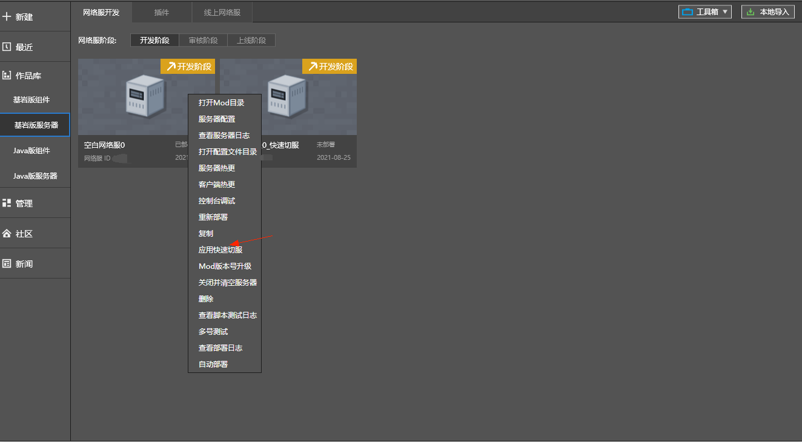
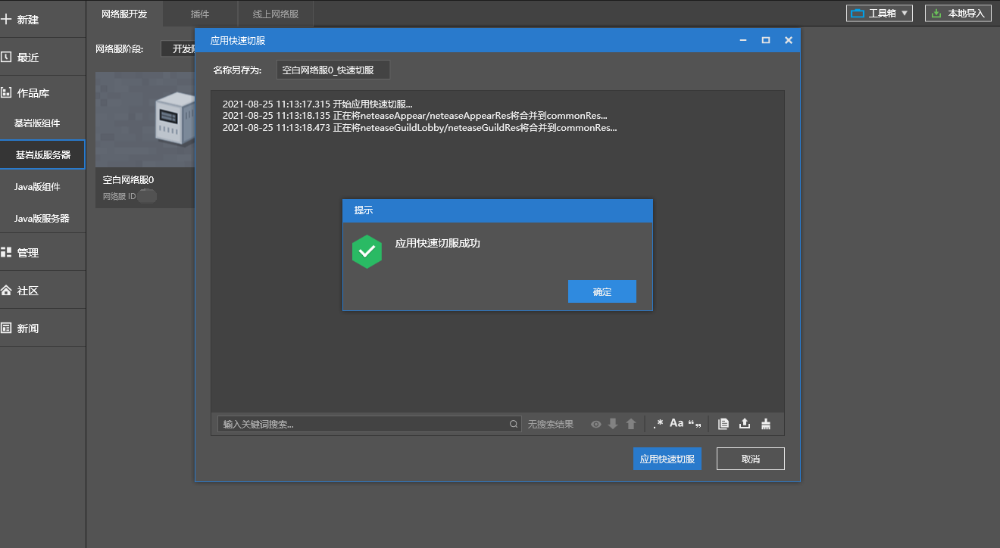
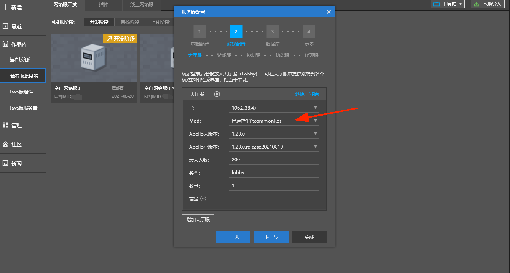
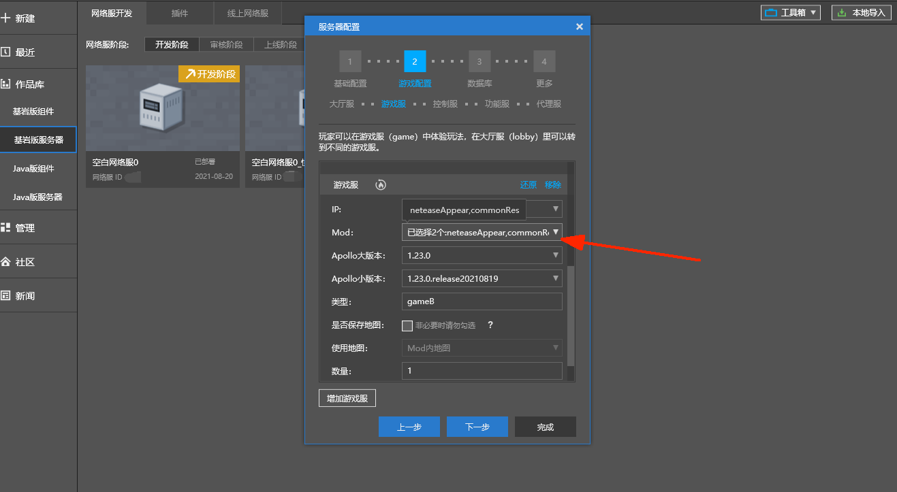

# 快速切服

### 应用场景

​		不同服务器之间跳转时，需要消耗一段等待时间。对于需要频繁切服的游戏类型（例如小游戏），快速切服具有重要的意义。

​		Apollo为以下两类跳转提供了快速切服方案。

### 跳转的服务器具有相同的mod

​		应用场景举例：假设该游戏具有两类game服，gameA、gameB部署了相同的插件。需要实现gameA到gameA或gameA到gameB之间的快速切服。		

​		详见接口介绍：

​		<a href="../../../mcdocs/1-ModAPI/接口/通用/调试.html#setkeepresourcewhentransfer" rel="noopenner"> SetKeepResourceWhenTransfer </a>

​		<a href="../../../mcdocs/1-ModAPI/接口/通用/调试.html#getkeepresourcewhentransfer" rel="noopenner"> GetKeepResourceWhenTransfer </a>

### 跳转的服务器具有不同的mod

#### 方案1：使用SetResourceFastload

​	设置资源快速加载，在进入游戏时快速加载资源，没有不同服资源一致的前提限制，但是速度没有使用`SetKeepResourceWhenTransfer`那么快

​	应用前提：物品和方块的自定义贴图需要定义在item_texture.json和terrain_texture.json中

​	详见接口介绍：

​	<a href="../../../mcdocs/1-ModAPI/接口/通用/调试.html#setresourcefastload" rel="noopenner"> SetResourceFastload </a>

​	<a href="../../../mcdocs/1-ModAPI/接口/通用/调试.html#getresourcefastload" rel="noopenner"> GetResourceFastload </a>

#### 方案2：使用SetKeepResourceWhenTransfer

​	合并不同服的资源，并把合并后的资源包部署到所有服，使得不同服的资源包一致，达到`SetKeepResourceWhenTransfer`的前提条件

​	应用前提：不同服务器之间，对原版资源的修改保持一致。（例如原生界面调整，自定义天空盒、太阳、月亮）

​	应用场景举例：假设该游戏具有两类game服，gameA部署了官方neteaseGuild插件，gameB部署了官方neteaseAppear插件，大厅服没有加载插件。需要实现三者之间的快速切服。

- ​	步骤1：右键点击需要快速切服功能的服务器，弹出菜单后选择“应用快速切服”

#### 

- ​	步骤2：选择应用快切之后的服务器命名，将点击“应用快速切服”，将生成快切网络。

- ​	步骤3：新生成的快切网络服中，大厅服、游戏服将额外生成一个commonRes的Mod，并自动勾选。

- ​		步骤4：调用接口：<a href="../../../mcdocs/1-ModAPI/接口/通用/调试.html#setkeepresourcewhentransfer" rel="noopenner"> SetKeepResourceWhenTransfer </a>，完成快速切服设置。

- ​		步骤5：部署完成后，该网络服将拥有快速切服功能。

​	特别说明：

- 此方案应用的快速切服，将改变原有网络服的mod结构，建议在新生成的mod上完成开发调试。
- 应用快速切服，实质上是对原有的mod的资源包进行合并。举例说明合并规则：modA的资源包路径为modA/resource_packs/modARes，modB资源包路径为modB/resource_packs/modBRes，这两部分合并到commonRes/resource_packs目录下。
- 合并过程中，如果存在相对路径一样的文件，如modA/resource_packs/modARes/textures/blocks/a.jpg和modB/resource_packs/modBRes/textures/blocks/a.jpg，这部分资源将合并失败，并在日志窗口进行报错提示。