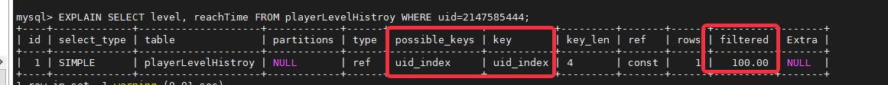
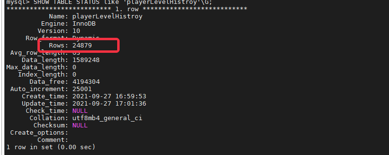

# 数据库优化小技巧
## 实用Q&A
### 如何遍历几十万行数据的大表
* 一次性读取一个拥有几十万数据的大表，很有可能会因为数据缓冲区不足导致失败，此时应该利用**ORDER BY**和**LIMIT**关键字进行分段查询
* 假设有那么一个数据表，记录了每个玩家的金币数，建表语句为：
```SQL
CREATE TABLE IF NOT EXISTS `neteaseUidToMoney` (
`uid` INT UNSIGNED NOT NULL COMMENT '玩家',
`money` INT UNSIGNED NOT NULL DEFAULT 0 COMMENT '金币',
`updateTime` INT UNSIGNED NOT NULL COMMENT '最后更新时间',
PRIMARY KEY (uid) COMMENT '主键',
INDEX `updateTime_index` (`updateTime`) COMMENT '更新时间索引'
)ENGINE=InnoDB DEFAULT CHARSET=utf8mb4;
```
* 需要遍历此表格，示例代码为：
```Python
self.mUidToMoney = {}
baseLimit = 5000
def queryCallback(dataList):
  if dataList is None:
    print "[ERROR] query uidToMoney failed."
    return
  maxUpdateTime = 0
  for data in dataList:
    uid, money, updateTime = data
    self.mUidToMoney[uid] = money
    maxUpdateTime = max(maxUpdateTime, updateTime)
  if len(dataList) < baseLimit:	# 查询结果数量小于baseLimit，认为是查询完成了
    return
  continueQueyr(maxUpdateTime, baseLimit)
# 继续查询，这里使用>=是为了防止因为Limit的原因，部分updateTime=maxUpdateTime的账号还没有被查询到
# 注意事项：这里查询的结果中可能存在部分之前的查询中已经查询出的数据，加载时应该以最新的数据为准
# 重复数据的来源1：之前一次查询中updateTime=maxUpdateTime的账号
# 重复数据的来源2：多次查询过程中，更新了自己的money数据的账号
def continueQueyr(updateTime, limit):
  sql = "SELECT uid, money, updateTime FROM neteaseUidToMoney WHERE updateTime>={} ORDER BY updateTime LIMIT {}".format(updateTime, limit)
  mysqlPool.AsyncQueryWithOrderKey("UidToMoney", sql, (), queryCallback)
#
sql = "SELECT uid, money, updateTime FROM neteaseUidToMoney ORDER BY updateTime LIMIT {}".format(baseLimit)
mysqlPool.AsyncQueryWithOrderKey("UidToMoney", sql, (), queryCallback)
```
### 查询结果显示错乱怎么办
* 有时候，我们使用命令行工具执行SELECT操作的时候，发现输出的结果乱掉了。屏幕的显示很奇怪，连 MySQL 的表格分割线 | 都不见了
* 这种情况，一般都是因为表格中有字符串或者 BLOB 类型，并且输出的结果中包含了一些特殊字符，大部分的SSH终端会解析这些特殊字符，导致显示混乱。
* 举例：
```bash
// 特殊字符【\r】表示回车。回车的意思是把光标移动到当前行的最开始（但是不换行）
echo -e "abcdefg\rzx"
// 最终的输出为
zxcdefg
// 因为【\r】会把光标回到最开头，然后继续输出 zx，zx 就把 ab 覆盖掉了
```
* 一般来说，简单一点的解决办法是把结果保存为文件，然后用VIM打开查看
```bash
mysql -e "SELECT xxx FROM xxx" > result.txt
vim result.txt
// 对于不可见的特殊字符，在 vim 中，会以一种特殊颜色（一般为蓝色），^ 开头的符号来表示。比如如果看到了蓝色的 ^@，表示文本中出现了一个 NULL 字符
// 有少部分特殊字符，连 vim 都会解析（比如 tab 字符，vim 就会解析）。在 vim 中输入命令 :set list，可以让 vim 不解析所有的特殊字符，全部直接显示出来。
```

## 建表小贴士
### 字符集
* 提供给服主的数据库，默认的内部操作字符集、客户端来源数据使用的字符集、连接层字符集、查询结果字符集等这些全部默认统一使用的是 utf8mb4
* **强烈建议**建表语句中，统一使用utf8mb4字符集
```SQL
CREATE TABLE IF NOT EXISTS `playerShortcut` (
`uid` INT UNSIGNED NOT NULL COMMENT '玩家',
`nickname` VARCHAR(40) NOT NULL DEFAULT '' COMMENT '昵称',
`createTime` INT UNSIGNED NOT NULL COMMENT '首次登录时间',
PRIMARY KEY (uid) COMMENT '主键'
)ENGINE=InnoDB DEFAULT CHARSET=utf8mb4;
-- nickname是肯定需要支持中文的，目前utf8mb4能够最大限度地支持中文，甚至支持部分表情符号
```
### 精确存储浮点数
* 涉及需要精确数据时，**建议**使用 DECIMAL 而非 FLOAT 来存储精确浮点数，以避免精度丢失问题
```SQL
CREATE TABLE IF NOT EXISTS `Salary` (
`_id` INT UNSIGNED NOT NULL auto_increment COMMENT '唯一ID，自增',
`uid` INT UNSIGNED NOT NULL COMMENT '玩家',
`salary` DECIMAL(19,4) NOT NULL DEFAULT 0 COMMENT '工资',
`updateTime` INT UNSIGNED NOT NULL COMMENT '最后更新时间',
PRIMARY KEY (_id) COMMENT '主键'
)ENGINE=InnoDB DEFAULT CHARSET=utf8mb4;
-- DECIMAL(19,4)代表19位整数+4位小数，保证加减之后的结果四舍五入能够精确到2位小数，刚好精确到分
```
### 分表
* 超大的表会严重拖慢 MySQL 的读写效率，甚至对其他表的读写效率也造成影响
* **强烈建议**单表不要超过 5 千万条数据
* 为了避免 MySQL 完全卡死甚至崩溃，单表数据库**必须**不能超过 1 亿，如果超过，业务**必须**自行对数据做分表
```SQL
CREATE TABLE IF NOT EXISTS `playerChatHistroy` (
`_id` INT UNSIGNED NOT NULL auto_increment COMMENT '唯一ID，自增',
`uid` INT UNSIGNED NOT NULL COMMENT '玩家',
`content` VARCHAR(500) NOT NULL DEFAULT '' COMMENT '聊天文本',
`chatTime` INT UNSIGNED NOT NULL COMMENT '聊天发送时间',
PRIMARY KEY (_id) COMMENT '主键'
INDEX `uid_index` (`uid`) COMMENT '玩家uid索引，方便检索属于某玩家的聊天记录'
INDEX `time_index` (`chatTime`) COMMENT '时间索引，方便清理过期内容'
)ENGINE=InnoDB DEFAULT CHARSET=utf8mb4;
-- 假如需要长时间保存聊天数据，那么可以创建多个分表
-- 根据uid%N的结果，把聊天数据分布到对应的分表里面~~~~
```
### 单表字段数
* 对于单表的字段数，没有硬性的限制，但是**建议**单表字段数不超过 30 个。太多字段的话建议考虑垂直分表，字段遵循少、精、短的原则。
* 较少的单表字段数方便做冷热数据分离和大字段分离
* 较少的单表字段数能让内存缓存更多有效数据，从而提高 IO 效率，提高业务性能
* 后期如果需要变更表结构，较少的单表字段数让操作会更快
### 显示指定主键
* 建议每个表都显式指定主键
```SQL
CREATE TABLE IF NOT EXISTS `playerPayHistroy` (
`_id` INT UNSIGNED NOT NULL PRIMARY KEY auto_increment COMMENT '唯一ID，自增', -- 显示指定主键方式一
`uid` INT UNSIGNED NOT NULL COMMENT '玩家',
`pay` VARCHAR(500) NOT NULL DEFAULT '' COMMENT '聊天文本'
)ENGINE=InnoDB DEFAULT CHARSET=utf8mb4;
--
CREATE TABLE IF NOT EXISTS `playerPayHistroy` (
`_id` INT UNSIGNED NOT NULL auto_increment COMMENT '唯一ID，自增',
`uid` INT UNSIGNED NOT NULL COMMENT '玩家',
`pay` VARCHAR(500) NOT NULL DEFAULT '' COMMENT '聊天文本',
PRIMARY KEY (_id) COMMENT '主键' -- 显示指定主键方式二
)ENGINE=InnoDB DEFAULT CHARSET=utf8mb4;
```
### 字段特征限制
* 所有字段**建议**均显式定义为 NOT NULL，如果确实有必要存 NULL（NULL 浪费空间，且影响性能），则建议用 0、特殊值或空串代替 NULL 值进行逻辑处理
* 字段类型在满足需求的条件下**建议**越小越好（类型最短原则）
* **建议**业务不要往 MySQL 里面存放二进制数据，尤其是大的二进制数据，因为 MySQL 处理二进制数据的性能很低，可以使用 base64 等工具将二进制数据转换成字符型数据后再存储。


## 索引小贴士
* **建议**业务针对常见查询添加索引
* 如下的建表语句，每次玩家升级都新增一条记录，记录了每个玩家到达每个等级的时间。
```SQL
CREATE TABLE IF NOT EXISTS `playerLevelHistroy` (
`_id` INT UNSIGNED NOT NULL auto_increment COMMENT '唯一ID，自增',
`uid` INT UNSIGNED NOT NULL COMMENT '玩家',
`level` INT UNSIGNED NOT NULL COMMENT '等级',
`reachTime` INT UNSIGNED NOT NULL COMMENT '达到目标等级的时间',
PRIMARY KEY (_id) COMMENT '主键'
)ENGINE=InnoDB DEFAULT CHARSET=utf8mb4;
```
* 假如想查询2021年9月1日前，等级已经升到10级的全部玩家
```SQL
SELECT uid, reachTime FROM playerLevelHistroy WHERE level=10 AND reachTime<1630425600;
```
* 添加索引前

* 添加索引后
```SQL
ALTER TABLE playerLevelHistroy ADD INDEX lv_time_index (`level`, `reachTime`);
```

### 活用EXPLAIN
* 任何新上线的 SQL，**强烈建议**先EXPLAIN一下，看看索引使用情况，避免全表扫描。
* 还是上面的playerLevelHistroy表，假如想查询指定uid的玩家每次升级的时间点
```SQL
SELECT level, reachTime FROM playerLevelHistroy WHERE uid=2147585444;
```
* EXPLAIN之后的结果为

* 没有索引的情况下性能堪虑，这里就需要添加索引
```SQL
ALTER TABLE playerLevelHistroy ADD INDEX uid_index (`uid`);
```
* 重新EXPLAIN的结果为

### 索引字段数限制
* 单个索引字段数**强烈建议**不要超过 5 个
### 单表索引数限制
* 单表索引数量**强烈建议**不超过 20 个，尽量避免冗余索引
* 索引并不是越多越好，有时在加速读的同时也引入了一些额外的写和锁开销，降低写入能力
### 索引字段特征限制
* **建议**选择区分度高的列作为索引。男女、性别这类索引基本占半的索引没用处
* 需要执行 ORDER BY和 GROUP BY 的字段**建议**建立合适的索引
* 多表 JOIN 时，WHERE 条件**建议**充分利用同一张表上的索引
* **建议**不要出现超过 20 长度的 varchar 索引


## 查询/修改小贴士
### 显式指定 SELECT 的相关字段
* **强烈建议**业务逻辑中尽可能避免使用【SELECT *】
* 显式指定 SELECT 的相关字段，能有效减少查询的数据总量（仅SELECT 需要用到的字段）
```SQL
-- 还是上面的playerLevelHistroy表格，查询指定uid的玩家每次升级的时间点
-- 使用
SELECT level, reachTime FROM playerLevelHistroy WHERE uid=2147585444;
-- 代替
SELECT * FROM playerLevelHistroy WHERE uid=2147585444;
-- 因为where限定了uid，其实没有每条记录获取uid的必要，同时，自增长的_id也没有获取的必要
```
* 加入未来对表格进行了新增列等操作，显示指定SELECT语句可以避免业务逻辑出现BUG
### 极简化使用事务
* **建议**能通过业务逻辑实现的功能，就不要使用事务
* **建议**业务尽量使用小事务而不要使用大而长的复杂事务。
### 使用IN代替OR
* 能用 IN 或者 OR 时，**建议**使用 IN 代替 OR
```SQL
SELECT uid, money FROM neteaseUidToMoney WHERE uid IN (1,2,3);
-- 代替
SELECT uid, money FROM neteaseUidToMoney WHERE uid=1 OR uid=2 OR uid=3;
```
* 如果 IN 的数量过多（超过1000）**建议**拆成批量的 SQL 语句
### 计数查询
* **建议**业务尽可能避免使用 SELECT COUNT 计数操作，因为该操作非常消耗资源
* 如果计数不需要非常准确，**建议**通过 SHOW TABLE STATUS 里面的 rows 值代替
```SQL
SHOW TABLE STATUS like 'playerLevelHistroy'\G;
```

* 如果计数需要非常准确，**建议**额外维护一张汇总表
### 模糊查询限制
* **强烈建议**避免左模糊或者全模糊的查找语句，这类语句无法使用索引
```SQL
-- %通配符在最右侧，那么此模糊查询可以使用索引（假如有的话）
SELECT uid, nickname FROM neteasePlayerCol WHERE nickname LIKE 'star%'
-- %通配符在左侧，那么此模糊查询就无法使用索引，只能全表扫描
SELECT uid, nickname FROM neteasePlayerCol WHERE nickname LIKE '%ship'
```

## 其他
### 判断业务需要的总连接数
* 在InitDB的时候，输入的参数即为当前进程使用的数据库连接数上限，假如多次调用InitDB，那么上限就取多次调用的最大值
* 单个服务端进程使用的数据库连接数*服务端进程的数量，即可得出数据库连接数的上限
* 考虑到一定的余量，可以在计算出的上限基础上加上300--500，做为预估的数据库连接数上限
* 默认的数据库连接数上限为**5000**，假如预估的连接数上限超过这个数，那么请在正式服上线之前通知运营人员，预先调整好数据库的允许连接数