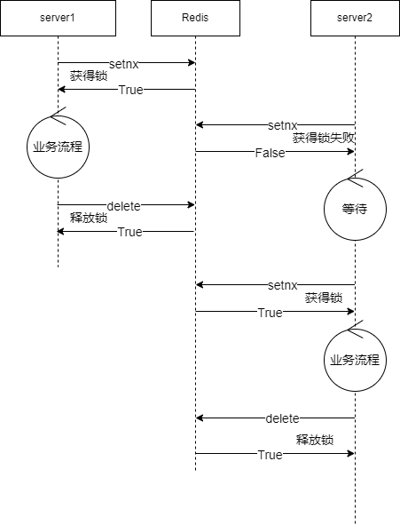

# Redis缓存的使用

### 概述

​		Redis是一个业务逻辑为单线程的，基于内存的键值数据存储，可以理解为一个数据类型更简单，但效率更高的service，他可以实现的功能使用service也可以实现，但是不需要额外编写service代码与占用额外的进程资源。

### 分布式锁

当某个业务可能在多个进程上执行，又需要保证原子性时，可以使用redis来添加锁。在业务前设置key获取锁，业务完成后删除key释放锁。

可参考neteaseChunkRes插件

### 保存全局数据

对于一些需要多个服同时频繁修改与访问的全局数据，可以存放在redis上。如果一次修改或访问需要多条redis操作，则还需要配合分布式锁使用。

例如

- 玩家的在线状态

  可参考neteaseFriend插件，玩家登录与登出时设置key，打开好友界面查询好友在线状态时获取key

- 全局弹幕

  可参考neteaseDanmu插件。

  玩家发的弹幕缓存在server内存，然后每一段时间插入到netease:danmu:list。

  server每一段时间从netease:danmu:list取一部分弹幕到netease:danmu:latest（分布式锁保证每7秒执行一次）。

  server每一段时间从netease:danmu:latest取弹幕并推送到客户端。

### 作为sql的缓存

相比于直接使用server内存作为sql缓存，在中间加入一层redis的好处有：避免server崩溃丢失大量数据，更多地减少sql请求的频率，以及降低server内存峰值。

例如neteaseQuest插件：

- 玩家任务进度有更新，先更新到内存
- 每隔4秒将内存数据整合写入redis
- 每隔444秒将redis数据整合写入sql

