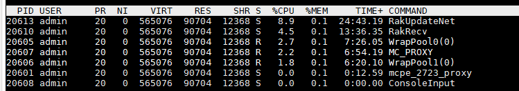

# 服务器部署优化

## 概述

通过对服务器部署的优化，可以最大限度地利用机器资源，提升全服承载力，同时减少服务器的卡顿，提升玩家的体验。

这篇文章提供一些服务器部署的最大人数，进程数量的建议，以及一些调整的思路来实现该目的。

一般来说proxy与game/lobby都会部署多个，可以调整每个服的最大人数来提升服务器体验与cpu利用率。

## 服务器最大人数建议

- 每个proxy可承载500人左右
- 没有开启任何性能开关的生存服，game/lobby最大人数建议为20~30人
- 根据不同性能开关的开启情况，game/lobby可承载100~200人

因此，假设全服预计同时在线人数最多为3000人，game与lobby内人数上限都定为2000人，则可以部署6个proxy，10~20个lobby，67~100个game。

## 服务器线程数据

一台物理机一般有很多个核心，通过调整一台物理机上的进程数量，可以充分利用cpu核心并且不超出机器的承载能力。

- Master与Service

  可以认为只有一个主线程，其他线程可以忽略，一个master或一个service最多占用一个核心

- game与lobby

  可以认为只有一个主线程，其他线程可以忽略，一个game或一个lobby最多占用一个核心

- proxy

  可以认为有两个加解密线程，两个raknet线程，一个主线程，加起来最多占用3个核心

因此，假设有一台32核的物理机，则可以部署6个proxy+14个game/lobby，或者32个game/lobby。

## 服务器最大人数调优

上述只给出了一个大致的建议，但是不同玩法的服务器承载人数都不一样，因此需要根据正式上线后的性能指标来进行调优。

选择一个高峰期，一般为周末晚上八点到九点，观察Grafana监控的在线人数，挑一个人数最多的game，lobby以及proxy

- game/lobby

  登录到机器上，使用`top -Hp <进程pid>`观察线程的占用。应该保证cpu最大的线程占用率不能长时间超过80%，建议常驻cpu定在70%左右。

  因此，假设该线程现在的常驻cpu在50%左右，承载了50人，那么可以调整该服最大人数为70人。如果该类型服同时在线预计2000人，则一共部署29个该类型服。

  而如果该线程常驻cpu已经高于70%，那么不建议增加最大人数。如果实际体验已经感到卡顿，则需要适当降低最大人数。

  

- proxy

  登录到机器上，使用`top -Hp <进程pid>`观察线程的占用。应该保证cpu最大的线程（人数多时一般会是WrapPool线程）占用率不能长时间超过80%，建议常驻cpu定在70%左右。

  因此，假设最大负载线程现在的常驻cpu在50%左右，承载了300人，那么一个proxy可以承载420人，如果预计全服最大同时在线人数为3000人，则一共部署8个proxy。

  而如果最大负载线程常驻cpu已经高于70%，那么不建议缩减proxy数量。如果实际体验已经感到卡顿，则应该适当增加proxy数量。

  

