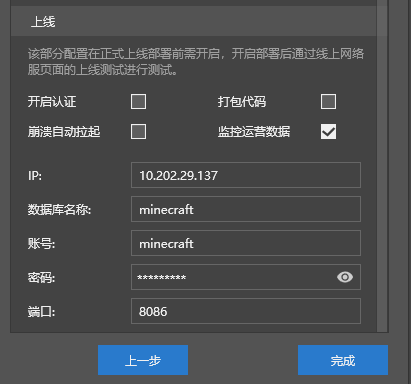
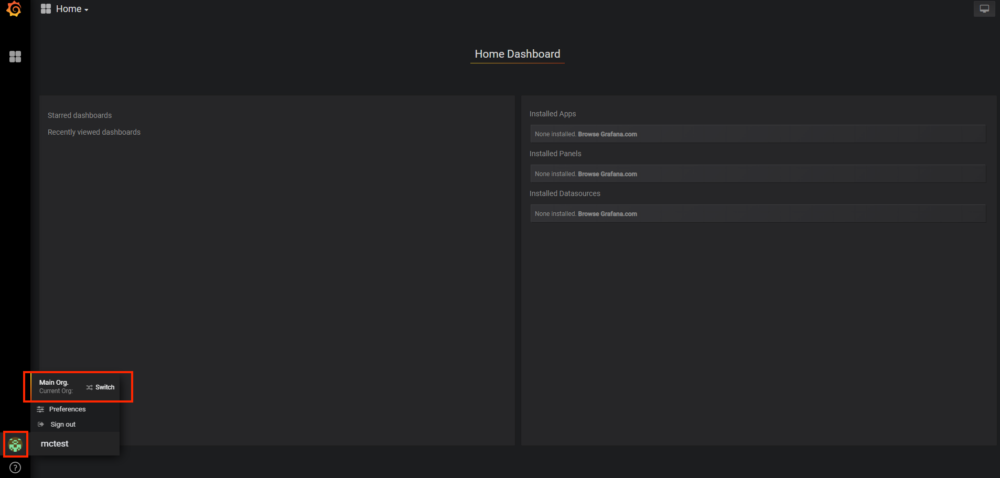
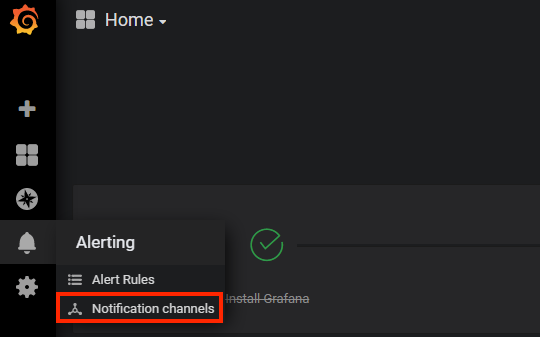
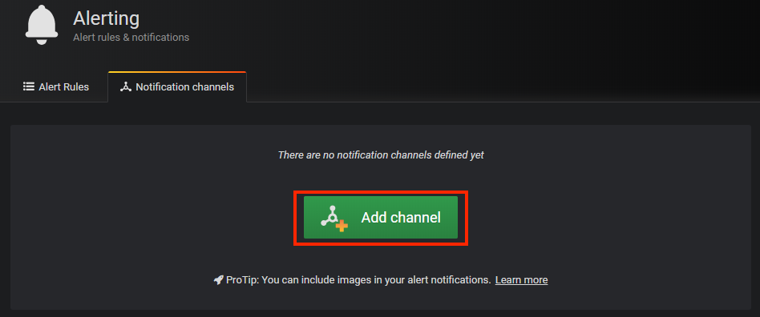
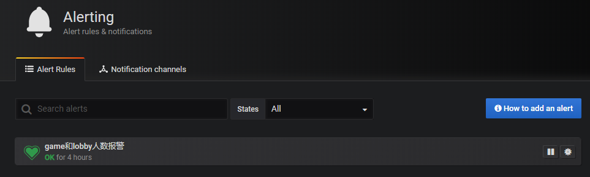

# Monitor监控报警系统
**Monitor监控系统** 是基于第三方开源监控服务 **Grafana** 搭建的，详情及教程可以参考<a href="https://grafana.com" target="_blank">**Grafana的官方网站**</a>，本教程只简要介绍如何在 **Apollo开服工具** 中使用 **Monitor监控系统**。

## 申请指南

每个游戏申请正式上线通过后，都会发放对应的项目代号，如：[sample]，这个项目代号就是该网络游戏的唯一标识，每个游戏都会有自己的项目代号。

**注意**：下文中用到[sample]的地方就代表了需要用项目代号去填，每个游戏请填写自己的项目代号！

拿到项目代号后，会同时拿到该项目在监控系统相关的InfluxDB，Grafana服务的账号和密码。

**注意**：InfluxDB的配置包括IP地址、端口、数据库名称、数据库账号、数据库密码；Grafana网站的配置仅有账号与密码。

## 上传监控数据
* 想要在Grafana网站上看到监控数据，首先需要在部署时开启监控数据的上传，并且正确配置监控数据库(**InfluxDB**) 的访问参数。
* 正确配置了监控数据库并重新部署服务器之后，引擎会自动收集一些基础信息并上传到监控数据库，比如说在线人数、各个服务器的状态等基本信息；而Apollo官方的**运营数据统计插件**能够收集并上传更多信息，强烈推荐在正式服中部署**运营数据统计插件**。

### 配置监控数据库（**InfluxDB**）访问参数
* 监控数据库的访问参数需要在部署前在MCSTUDIO中配置
* 在MCSTUDIO的**服务器配置**中，在**更多**分页下，下拉至**上线**的标题下，勾选**监控运营数据**，即可看到如下配置：

**IP**是influxdb的ip地址（上图的IP地址仅为示例）
**数据库名称**是你的项目独享的数据库名（上图的minecraft仅为示例）
**账号**是你的项目代号（上图的minecraft仅为示例）
**密码**是分配给你的influxdb的密码
**端口**是influxdb的访问端口（上图的8086仅为示例）

然后重新部署服务器，即可开启监控系统数据上传。

### 使用运营数据统计插件
* 引擎默认上传的监控数据，仅包含【当前各服务器进程的状态和在线人数】、【各服务器进程的cpu占用与内存占用】等少量数据。
* 使用官方插件中的运营数据统计插件（neteaseStatistics与neteaseStatisticsService），可以获得更多的运营相关数据，包括：
【daily_account_new】：新增账号数
【daily_account_login】：登录账号数
【daily_account_pay】：付费总值（钻石）
【daily_pay_rate】：付费率
【daily_pay_diamand】：人均付费值（钻石）
【daily_avg_oltime】：平均在线时长
【daily_avg_new_oltime】：新增用户平均在线时长
【daily_avg_login_cnt】：平均进入次数
【daily_retain1】：一天留存率
【daily_retain3】：三天留存率
【daily_retain7】：七天留存率
* 为了能够正确获取到付费的数据，在把neteaseStatistics部署于游戏服、大厅服；neteaseStatisticsService部署于功能服之后，需要在订单成功发货之后，调用插件提供的API：【sendPayEventByPlayerId】，具体使用方法见插件自带的readme说明。

## 查看监控数据
###  域名和账号

**域名**：<a href="https://monitor.apollo.netease.com" target="_blank">https://monitor.apollo.netease.com</a>

**账号**：[sample]（就是项目代号）

**密码**：游戏接入的时候会发放，16位随机字符串

**注意**：请尽量使用Google Chrome浏览器访问监控系统，其他浏览器可能不能完全支持网站的全部功能！

### 初次使用

使用给到的grafana账号密码登录 <a href="https://monitor.apollo.netease.com" target="_blank">**Monitor监控系统**</a>

登录成功后进入 **Home Dashboard**，鼠标指向左下角用户图标，发现目前正处于 **Main org.** 的组织中，点击它切换到自己项目组织下。

可以发现除了 **Main org.** 外还有另一个组织 **mctest**，其实就是跟你的项目代号名称一样的组织，这个就是对应你的游戏的组织，点击 **Switch to** 切换到自己的组织。

成功切换后，再次来到 **Home Dashboard** 面板，官方已经自动设置好了数据源，以及创建了一些监控图表。点击左侧的**Dashboard**，再点击**Manage**就可以看到根据模板预创建的监控图表

### 了解更多
有关Dashboard和Panel的更多概念和细节，可以参考B站视频<a href="https://www.bilibili.com/video/BV1w5411n7Le/?spm_id_from=333.788.recommend_more_video.-1">**Grafana入门系列(4)——Dashboard和Panel**</a>

## 接入报警系统

报警系统是基于 **Grafana** 搭建的，在 **Grafana** 的图表中设置好报警条件及阈值后，一旦符合报警的要求，就会自动触发报警。触发报警后 **Grafana** 将会发送一条报警消息到官方的报警服务器，然后由报警服务器决定该如何进行通知。目前通知方式需要联系官方管理员进行配置，暂不提供自定义配置。下面将对如何使用报警系统进行介绍：

### 设置报警通道

登录Monitor监控网站，鼠标指向左边选项栏中铃铛模样的标签，点击 **Notification channels**。

点击中间的 **Add channel** 按钮创建第一个报警通道。

在报警通道设置界面：

1. Name 部分：填一个名字，这里填 **NeteaseAlert**
2. Type 部分：选择 **webhook** 方式
3. Send on all alerts：勾选后表示默认所有的报警都会通过这个通道发
4. Include image：勾选后表示在报警的时候同时截图发送，因为目前的报警通知不支持图片，所以这里不用勾选
5. Disable Resolve Message：勾选后表示当状态从报警中恢复到正常时，不再发送信息，即不告知恢复正常，这里不用勾选
6. Send reminders：勾选后表示除了状态刚变成报警中时会发报警消息，过后每隔一段时间，如果依然处于报警中的状态，那么还会发一次重复报警
7. Send reminder every：表示每隔多长时间发送重复报警，这里填默认30分钟
8. Url：正式服的报警服务器：<http://alerter.apollo.netease.com/alert?project=sample> 其中 sample 请填你的项目代号
9. Http Method：选择 POST

之后点 **Send Test** 按钮检查是否配置正确，如果没问题，就点 **Save** 按钮保存。

完成以上配置后，Grafana 的报警消息到官方报警服务器就打通了。接着请联系管理员为你的游戏项目设置好对应的通知方式，期间可以通过上文描述的 **Send Test** 来测试。

### 为图表设置报警

在图表的设置界面，同样有一个铃铛模样的标签页，在这里选择 **Create Alert**。

具体的报警设置，按照如下说明来：

1. Name：就是这个报警的名字
2. Evaluate every：表示每隔多长时间检查下面的条件是否成立
3. For：这个选项可不设置，不设置表示每次检查一旦发现条件成立就会发通知。如果设置，则表示条件成立后，并不会将状态直接从 OK 改为 Alert，而是先变为 Pending 状态，这时候不会立即发通知，等这个条件一直满足超过设定的 For 的时间，才会将状态改为 Alert，并发送通知
4. Conditions：条件组中可以设置多个条件，只有判断成立才触发状态变更
5. avg()：用来控制如何将搜索出来的数据集计算得出一个可以跟阈值进行比较的值，可以换成 max(), min() 等等
6. query(A, 5m, now)：第一个参数指定了是用哪个语句来执行，就是代表了图表的查询语句标签页定义的语句。后面的两个参数 **5m, now** 则表示了时间区间，5分钟之前到现在。如果填成 **10m, now-2m** 则表示10分钟之前到2分钟之前的这段时间。
7. IS ABOVE 200：表示算出来的结果是否超过200，这种跟阈值对比的算法可以自行修改。
8. No Data & Error Handling：表示没有收到数据，或者执行出错的情况下，将状态设置成什么。
9. Send to：NeteaseAlert，因为之前我们将这个设置为所有报警都要发的通道。
10. Message：这里表示发出的报警的文字内容是什么。

以上设置完毕后，报警即开始生效。可以在 **Alerting** 管理界面管理定制好的各项报警规则，可以暂停或启动。

### 了解更多
有关基于Grafana的自定义报警，想要进一步了解可以参考B站视频<a href="https://www.bilibili.com/video/BV11v411W7gu?spm_id_from=333.999.0.0">**Grafana入门系列(12)——基于Grafana的报警**</a>

