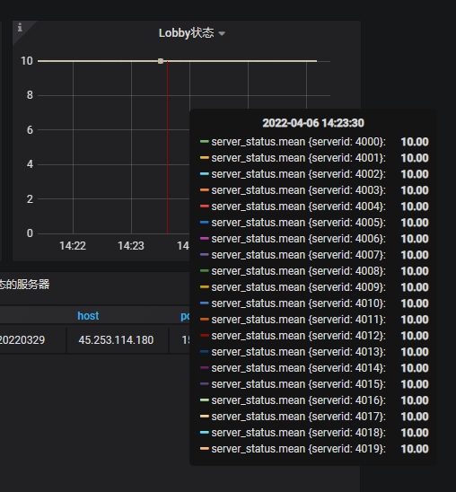
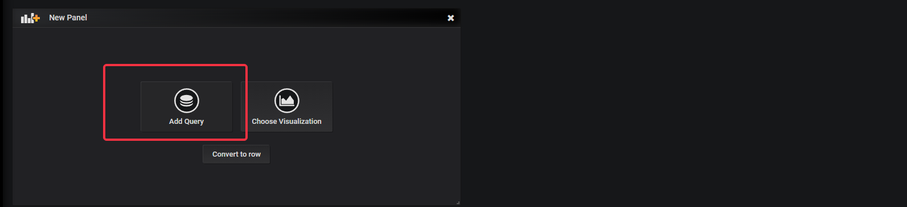
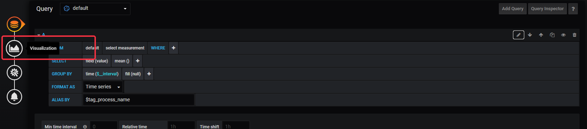
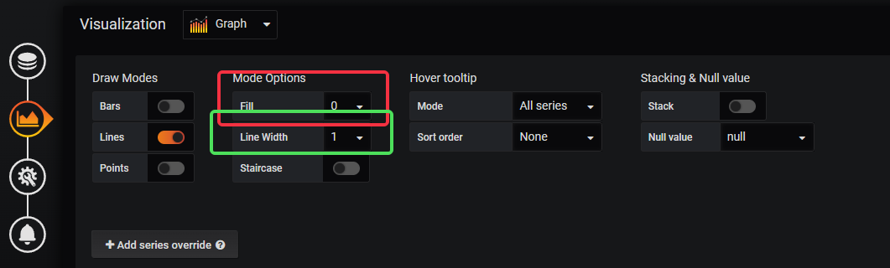
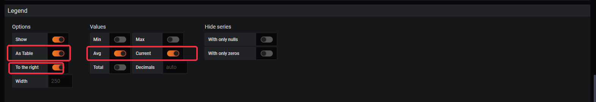
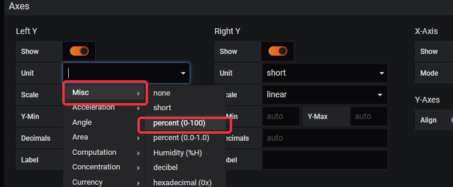

# Grafana监控进阶功能

## 预设Dashboard说明
* 下面是一些官方预设的Dashboard的统计图表说明
### Dashboard--在线状态
* 此Dashboard上实时显示了对应游戏的在线人数，是最重要的指标，一般任何服务器的异常最终都会在在线人数上体现出来
#### 图表--master统计的在线人数
* lobby人数：master统计到的所有lobby类型服务器进程的在线人数之和
* game人数：master统计到的所有game类型服务器进程的在线人数之和
* proxy连接数：master统计到的所有proxy服务器进程的在线人数之和，所有的客户端都直接与porxy保持连接；proxy连接数会大于lobby人数与game人数的和，因为还有部分玩家处于登录中，或者转服过程中，不属于任何具体的lobby或game服务器。
* 总在线人数：等于lobby人数与game人数的和，也就是实际的在线玩家数

#### 图表--master统计的登录登出人数
* 全服登录：每10秒为一个区间，玩家登录成功的人数
* 全服登出：每10秒为一个区间，玩家离线登出的人次
* 全服转服：每10秒为一个区间，玩家转服的人次

### Dashboard--服务器状态
* 此Dashboard上，实时显示了各个服务器的状态
* 状态--10：有效的服务器（配置中存在且未通过滚动更新关闭），已连接状态（唯一的正常状态）
* 状态--0：服务器不存在（配置中不存在，或者已经通过滚动更新关闭）
* 状态--1：有效的服务器，断线状态
* 状态--3：有效的服务器，正在强制关服
* 状态--4：有效的服务器，正在优雅关服
* 状态--5：部署中的候选服，检查ok会成为正常服务器
* 状态--6：滚动更新中的候选服，检查ok后状态会切换为滚动更新就绪
* 状态--7：滚动更新就绪，状态服务器不会对外提供服务；滚动服都就绪后统一切换为正常服
#### 图表--Proxy状态
* 所有代理服的状态图表

#### 图表--Lobby状态
* 所有大厅服的状态图表

#### 图表--Game状态
* 所有游戏服的状态图表，因为不同的项目，游戏服的具体type都不同，所以需要服主自己去设置具体需要关注的游戏服的type

### Dashboard--当前服务器状态
#### 图表--Proxy状态
* 所有代理服的状态图表，与**服务器状态**中的**Proxy状态**相同

#### 图表--Lobby状态
* 所有大厅服的状态图表，与**服务器状态**中的**Lobby状态**相同

#### 图表--异常状态的服务器
* 所有状态异常的服务器（状态不为10的服务器）的列表，假如有某个服务器长期处于异常状态，或者长期都有很多服务器都处于异常状态，那么多半是服务器确实出了问题

## 新增Dashboard--进程性能监控
* 服务器管理人员额外提供了服务器进程相关的一些监控数据，但是默认的Dashboard中并没有预设对应的监控图表，需要的服主可以参考下面的指引创建对应的监控图表
### 新增统计图表--进程基本内存监控
* 步骤1：点击左上角的**+**号，选择**Create Dashboard**

*  步骤2：然后点击**Add Query**，新增一个新的图表

* 步骤3：点击图中的**铅笔状图标**，切换进入**SQL**模式

* 步骤4：在查询语句中填入下面的SQL语句，并且在**ALIAS BY**中填入**$tag_process_name**
```SQL
SELECT mean("memory_rss") FROM "procstat" WHERE $timeFilter GROUP BY time(10s), "process_name" fill(null)
```

* 步骤5：点击左边的第二个图标，切换到**Visualization**配置

* 步骤6：在**Draw Modes**中，选择**Fill=0**（不填充曲线，看起来清晰点）；以及**Line Width=1**（由于服务器进程一般较多，曲线不宜太粗）
* 步骤7：在**Axes**中，**Unit**中选择**Data(IEC)-bytes**（左边Y轴的数值标注的单位会显示为KB，MB）

* 步骤8：在**Legend**中，打开**As Table**、**To the right**的开关（会将服务器进程名和对应的内存数据显示在图标的右方）；以及**Avg**、**Current**的开关（进程内存占用会显示当前值与平均值）

* 步骤9：点击左边的第三个图标，切换到**General**配置，在**Title**中可以配置这个统计图的名称

* 步骤10：修改**Title**之后，点击右上角的**磁盘**图标，保存这个Dashboard

* 步骤11：把新增的Dashboard命名为**进程性能监控**，然后点击**Save**

* 步骤12：当前，在名为**进程性能监控**的**Dashboard**上，有一个名为**进程基本内存监控**的图表，这个图表可以像windows的窗口一样，通过**拖动边框**调整尺寸

### 新增统计图表--进程基本CPU监控
* 点击右上角最左边的图标，可以在现有**Dashboard**上新增一个**统计图表**

* 重复上面的步骤2——步骤10，可以新增进程基本的CPU监控图表，唯一不太一样的是步骤4中的SQL语句，与步骤7Unit单位
* 进程基本CPU监控，步骤4中的SQL语句为
```SQL
SELECT mean("cpu_usage") FROM "procstat" WHERE $timeFilter GROUP BY time(1m), "process_name" fill(null)
```
* 进程基本CPU监控，步骤7中的**Axes**配置，**Unit**为**Misc--percent(0-100)**（CPU占用为百分比显示）

## 新增Dashboard--数据库监控
* 服务器管理人员还额外提供了数据库相关的一些监控数据，需要的服主可以参考下面的指引创建对应的监控图表
### 新增统计图表--MySQL 内存使用率
* 对应SQL语句为
```SQL
SELECT mean("memory_usage") FROM "mysql" WHERE $timeFilter GROUP BY time(1m) fill(null)
```
### 新增统计图表--MySQL CPU使用率
* 对应SQL语句为
```SQL
SELECT mean("disk_usage") FROM "mysql" WHERE $timeFilter GROUP BY time(1m) fill(null)
```
### 新增统计图表--MySQL 负载
* 对应SQL语句为
```SQL
SELECT mean("qps") FROM "project"."mysql" WHERE $timeFilter GROUP BY time(1m) fill(null)
```
### 新增统计图表--MySQL 慢请求
* 对应SQL语句为
```SQL
SELECT mean("slow_queries") FROM "mysql" WHERE $timeFilter GROUP BY time(1m) fill(null)
```
### 新增统计图表--MySQL 磁盘用量
* 对应SQL语句为
```SQL
SELECT mean("disk_usage") FROM "mysql" WHERE $timeFilter GROUP BY time(1m) fill(null)
```
### 新增统计图表--MySQL 连接数
* 对应SQL语句为
```SQL
SELECT mean("connected_clients") FROM "mysql" WHERE $timeFilter GROUP BY time(1m) fill(null)
```
### 新增统计图表--Redis CPU使用率
* 对应SQL语句为，注意这里的**host**，需要根据具体分配的Redis数据库来设置
```SQL
SELECT mean("cpu_usage") FROM "redis" WHERE ("host" = 'redis-senior01-xxxxx') AND $timeFilter GROUP BY time(1m) fill(null)
```
