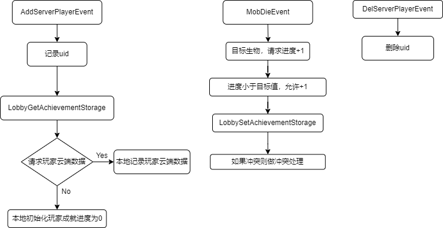
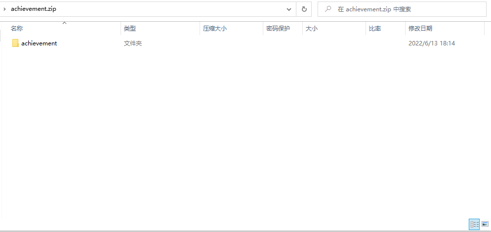
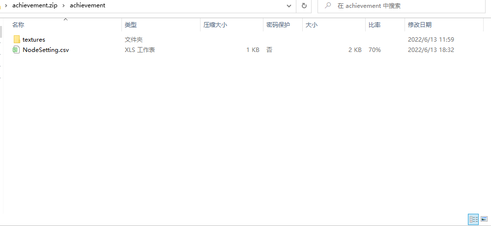
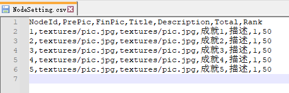

# 云成就文档

## 说明

该文档用于给亲爱的开发者们介绍云成就功能。通过学习该文档，开发者们可以了解到成就从创建到上报到最后展示的一整套流程。期待开发者们用丰富的想象力，为自己的世界配上一套有趣的成就系统。**联机大厅云成就功能将于2022年7月7号开放，网络游戏云成就功能将于2022年7月7号开放。**

**该功能将在2.2版本外放。**


## 开发者平台的操作流程
官方的成就系统功能在手机版客户端的显示需要依赖开发者平台的配置，点击[成就系统功能配置文档](./成就系统功能配置文档.html)了解开发者平台的操作流程。


## MODSDK的API与事件

### API

- <a href="../../mcdocs/1-ModAPI/接口/成就.html#lobbygetachievementstorage" rel="noopenner">LobbyGetAchievementStorage</a>

  获取成就信息

- <a href="../../mcdocs/1-ModAPI/接口/成就.html#lobbysetachievementstorage" rel="noopenner">LobbySetAchievementStorage</a>

  设置成就进度与extra信息


## 示例mod

[CloudAchievementMod](../20-玩法开发/13-模组SDK编程/60-Demo示例.html#CloudAchievementMod)展示了一个基本玩法：

- 玩法内设计了一种击杀混合种类生物的云成就事件
- 玩法监听了实体死亡事件“ MobDieEvent”，当实体死亡时，如果监测到是目标列表中的生物会调用“LobbySetAchievementStorage”上报成就进度
- 玩法涉及击杀混合种类生物的目标，所以利用了“LobbySetAchievementStorage”的extra字段用于存储各种生物已击杀的数量
- 玩家会在监测到玩家加入时调用“LobbyGetAchievementStorage”用于获得在云端存储数据，如果云端不存在数据，则进行本地数据初始化。
- demo的主要流程如下，详情可阅读demo的代码注释




## Q&A

### 数据冲突

1）什么情况下会发生数据冲突？

云成就的冲突场景出现只存在于调用“LobbySetAchievementStorage”上报进度的时候存储extra字段。如果不使用extra字段，则可以不考虑冲突问题

2）数据冲突的原因是什么？

根本原因是，可能会有多个联机大厅房间同时修改同一个玩家的数据，同一个房间的get与set操作之间，可能被插入了其他房间的set操作。

例如发生下述情况会出现冲突（冲突处理就是为了避免这种情况出现）：

​	假设条件：

​	① A、B房间都会在本地记录成就进度，当房间关闭的时候统一上传进度

​	② 成就需要使用到extra信息用于判断事件能否触发进度增加，下述用击杀混合种类生物

就有可能出现这样的情况：

​	① 目标是击杀3只牛和3只羊，总目标值为6

​	② 玩家进入房间A，在该房间击杀了1只牛

​	③ 玩家退出房间A，房间A并没有上传进度和extra

​	④ 玩家加入房间B，击杀了3只牛

​	⑤ 房间B关闭，上报成就进度与extra，此时A还没上报进度。云端存储的玩家信息为：“{进度：3，extra{击杀牛：3，击杀羊：0}}”

​	⑥ 房间A关闭，上报成就进度与extra，A上报的信息会覆盖云端原有的信息。修改后云端存储的信息“{进度：4，extra{击杀牛：1，击杀羊：0}}”

​	ps：进度采取的是add方式，不会产生冲突，只有当进度达到目标进度的时候才不允许添加

上述情况出现了房间B已经杀到了目标数量的牛，而房间A无法感知到冲突，继续上报进度，出现了extra与进度信息的不匹配。正确情况该是房间A获取到云端的extra数据，得到已经杀了足够数量的牛，判断得出不用上报进度。

### 那应该怎么保证数据的正确性？

为了防止上面所说的这种情况，每次设置数据时都会附带一个“版本号”，每次设置数据的版本都是上一次获取到的版本加一，这样云端就可以根据版本号判断数据时候被别的容器修改过，也就是冲突。这个版本号控制已经由引擎内部控制好，不需要开发者操心，您只需要按api文档里的规范处理好冲突即可。

① 当调用“LobbySetAchievementStorage”接口的callback接收到code为5的数据时，表示发生了冲突。

② callback接收参数data是云端更新前最新的数据。

③ 利用最新的数据更新本地数据，当发生冲突（callback收到的data的code值为5），需要判断是否再次上传，如需将更新完的数据上传，则设置callback返回值为True，否则False。系统将根据返回值判断是否上报新数据。

④ extra是自定义字段，需要开发者在callback里面自行决定处理冲突数据的方式，最后封装好获取extra的getExtra函数传给“LobbySetAchievementStorage”接口，接口可通过传递过来的getExtra获取实时的extra数据。

### 我的玩法不是按局计算，数据会实时更新，我应该如何减小set的频率？

1. 每隔一定时间（例如5分钟）更新数据到云端
2. 玩家退出时更新数据到云端

set接口频率上限为50次/秒，5分钟的间隔可以保证5\*60\*50=15000名以内的玩家同时在线，以此类推

如果需要承载玩家数量的量级更高，则要舍弃定时上传，只在玩家退出时上传

### 我的玩法不是按局计算，数据会实时更新，我应该如何维护数据的正确性？

对于定时上传，可以参考Mod中的写法：

```python
def callback(data):
    if data:
        if data["code"] == 0:
            logger.info("%s 节点进度增加1", node)
            if self.mPlayerProgress[playerId][node] >= self.mNodeDetail[node]["goalNumber"]:
                comp = compFactory.CreateMsg(playerId)
                logger.info("这个节点完成了%s", node)
                comp.NotifyOneMessage(playerId, node + "： 该成就已经完成！")
        elif data["code"] == 5:# 监测到冲突
            self.mPlayerProgress[playerId][node] = data["entity"]["progress"]  # 更新本地存储的进度
            self.mPlayerExtra[playerId][node] = data["entity"]["extra"]
            self.TransferLocalFromExtra(playerId)
            # 返回一个信号量用于返回更新后的extra数据是否还满足添加进度的条件，满足返回True，否则返回False，只有当code = 5，即起冲突需要放回值
            if self.mPlayerProgress[playerId][node] >= self.mNodeDetail[node]["goalNumber"]\
                or self.mLocalData[playerId][node][entity] >= self.mNodeDetail[node]["targetEntity"][entity]:
                return False
            else:
                # 起冲突了，会把上面添加进度的信息覆盖，判断允许添加进度，需要重新添加本地进度，LobbySetAchievementStorage会通过getter函数获取到最新的extra进行存储
                self.mPlayerProgress[playerId][node] += 1
                self.mLocalData[playerId][node][entity] += 1
                self.TransferExtraFromLocal(playerId)
                return True
        else:
            # 请求失败
            comp = compFactory.CreateMsg(playerId)
            comp.NotifyOneMessage(playerId, "添加进度失败！")
            self.mPlayerProgress[playerId][node] -= 1
            self.mLocalData[playerId][node][entity] -= 1
            self.TransferExtraFromLocal(playerId)
```

### 我想使用[自定义成就系统](../20-玩法开发/15-自定义游戏内容/16-自定义成就系统.md)来做云成就有什么不同吗？

1) 如果使用自定义成就系统，需要在json里面配置“is_cloud”字段为true，并设置“auto_sent_cloud”来选择上传的时机，详参[自定义成就系统](../20-玩法开发/15-自定义游戏内容/16-自定义成就系统.md)

2) 使用自定义成就系统，使用<a href="../../mcdocs/1-ModAPI/接口/自定义UI/自定义成就系统.html#addnodeprogress" rel="noopenner">AddNodeProgress</a>或<a href="../../mcdocs/1-ModAPI/接口/自定义UI/自定义成就系统.html#setnodefinish" rel="noopenner">SetNodeFinish</a> 这两个接口有限制，详参接口描述

3) 如果使用自定义成就系统，且节点json文件中配置了“auto_sent_cloud”为True，就不能使用<a href="../../mcdocs/1-ModAPI/接口/成就.html#lobbysetachievementstorage" rel="noopenner">LobbySetAchievementStorage</a>来上报进度，而是使用<a href="../../mcdocs/1-ModAPI/接口/自定义UI/自定义成就系统.html#addnodeprogress" rel="noopenner">AddNodeProgress</a>或<a href="../../mcdocs/1-ModAPI/接口/自定义UI/自定义成就系统.html#setnodefinish" rel="noopenner">SetNodeFinish</a>两个接口设置进度，这两个接口会自动将进度同步到云端，特别注意，如果是云成就，切记要将两个接口里面的callback参数传入，否则无法进行成就上报。如果“auto_sent_cloud”为False，由开发者自行选择上传时机。可以用<a href="../../mcdocs/1-ModAPI/接口/自定义UI/自定义成就系统.html#addnodeprogress" rel="noopenner">AddNodeProgress</a>接口更新本地数据，并用一个变量存储相加每次的Delta，使用云成就上报接口。

4) 如果使用<a href="../../mcdocs/1-ModAPI/接口/自定义UI/自定义成就系统.html#addnodeprogress" rel="noopenner">AddNodeProgress</a>上报，当发生冲突的时候，即callback收到的data中code为5，切记要设置callback的返回值，当True，系统将自动再调用一次上报，当为False，将不再上报，即此次上报不成功。

5) 如果使用自定义成就系统，会在“ClientLoadAddonsFinishServerEvent”事件的时候自动获取云端成就进度，如果开发者想维护一份extra数据，可使用<a href="../../mcdocs/1-ModAPI/接口/成就.html#lobbygetachievementstorage" rel="noopenner">LobbyGetAchievementStorage</a>进行获取。

## 成就包体打包

#### 成就资源











【手动打包】：在尝试手动打包成就资源时，请将成就所使用图片资源放置在textures文件夹下，并将成就资源文件夹嵌套进一个新的文件夹内。在对新的文件夹右键压缩成zip文档，即可将包体上传至开发者平台。

【注意】：NodeSetting.csv文件内PrePic、FinPic配置为图片资源相对路径。需注意NodeSetting.csv文件编码格式需要为**GBK**，否则可能会导致成就配置解析异常。


