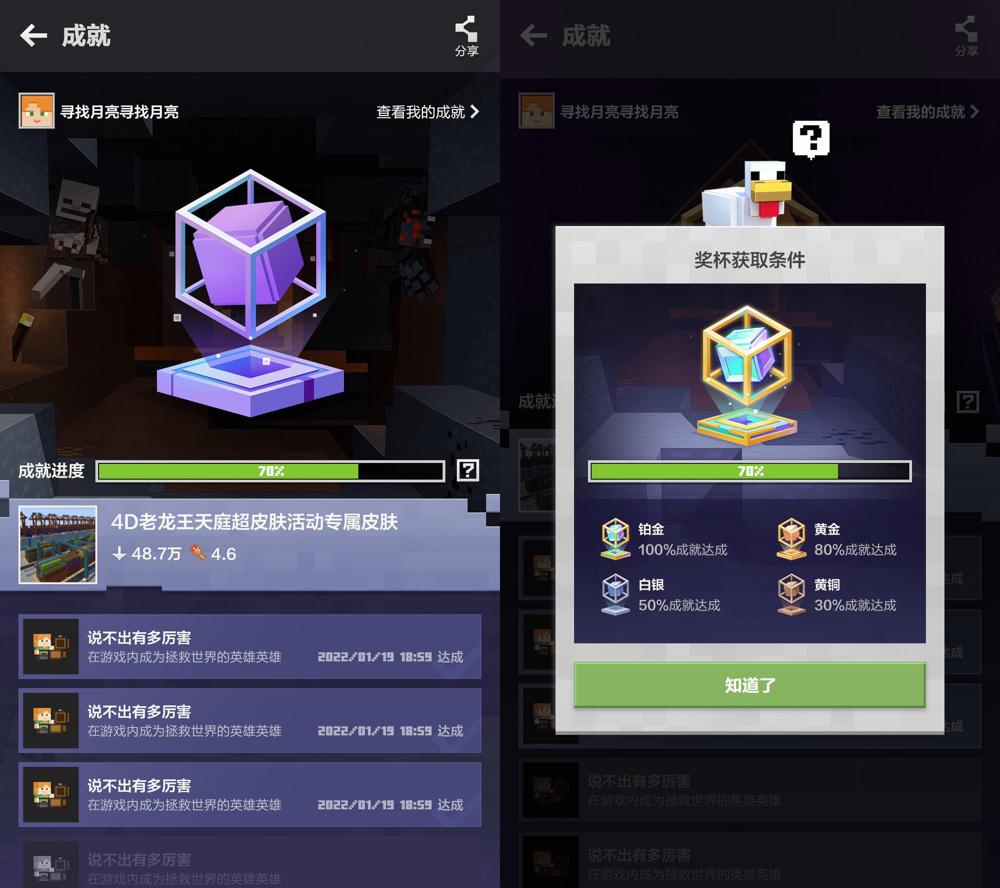
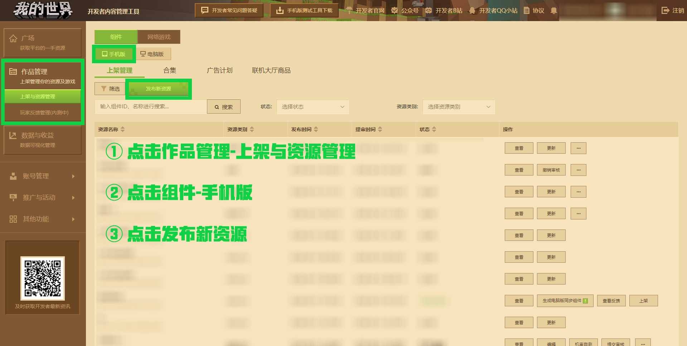
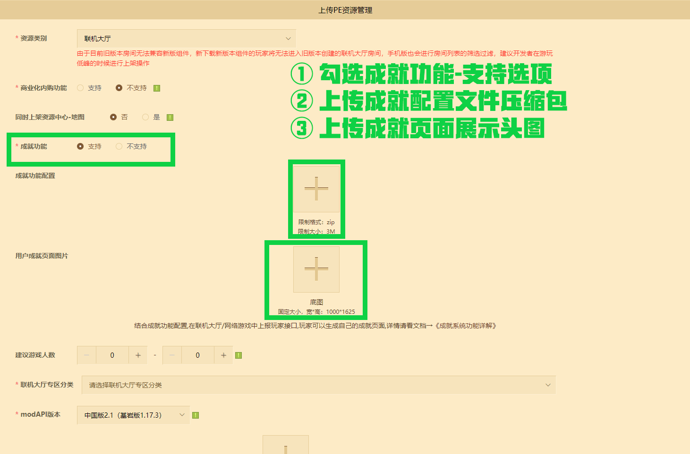
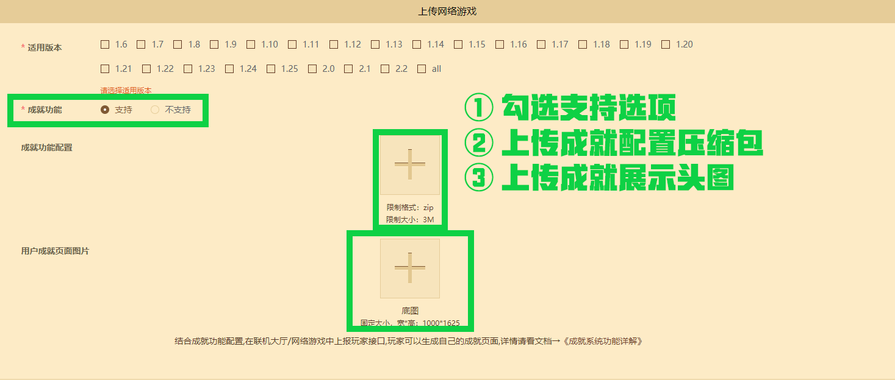

# 成就系统功能配置文档

成就机制作为现代游戏的重要组成部分，它将游戏的主题汇聚到“聚光灯”下。不仅可以确保玩家不错过容易被忽略的游戏内容，还升华游戏过程中所获得的乐趣体验。


**《我的世界》手机版联机大厅与网络游戏** 为玩家提供聚会娱乐的场所。**《我的世界》开发者平台** 也为联机功能游戏开发倾力赋能。使用成就系统配置功能，开发者可以在 **【上架与资源管理】** 模块选择 **【联机大厅】** 或 **【网络游戏】** 内容：开启【成就功能支持】，上传成就页面头图、对应的成就ICON和成就配置CSV文件。只需在游戏内埋上相应的成就达成业务逻辑，将玩家数据上传至模组SDK的云端成就接口，玩家的启动器页会自动抓取的云端成就记录并展示。




后续在资源中心详情页、个人主页等更多地方还会加入玩家获得成就的展示入口，并支持玩家将页面分享到社交平台。对开发者来说，是一种提升联机作品的传播能力和玩家渗透率的非常手段。

**注： 我们将持续收集广大开发者对成就系统配置的建议和使用反馈，您可以通过开发者平台左上方的【开发者常见问题答疑】- 【反馈其他问题】与我们取得联系。**


## 联机大厅成就系统功能配置

**注意：联机大厅成就系统功能将在7月7号上线，请开发者合理分配开发节奏。**

依次点击 **【作品管理】** - **【上架与资源管理】** ，接着点击 **【组件】** ，选择 **【手机版】** 平台，接着点击 **【发布新资源】** 。




**【资源类别】** 选择联机大厅。勾选 **【成就功能】** - **【支持】** 选项。分别上传成就配置压缩包与成就页面展示头图。



| 上传类型           | 尺寸/大小限制      |
| ------------------ | ------------------ |
| 成就配置文件压缩包 | 限制大小：3M       |
| 成就页面展示头图   | 宽x高：1000 * 1625 |

已上架过 **【联机大厅】** 的作品且未上架至 **【资源中心-地图】** 分区的，未启动过成就功能者，支持再次打开成就功能。只要在业务逻辑内对成就接口进行适配，即可让玩家享受到成就功能的体验乐趣。

**注意：目前尚不支持在电脑版的联机大厅游戏上使用成就配置功能。在电脑版平台上也将无法正常使用云端成就上报的接口。**


## 网络游戏成就系统功能配置

**注意：网络游戏成就系统功能将在7月7号上线，请开发者合理分配开发节奏。**

依次点击 **【作品管理】** - **【上架与资源管理】** ，接着点击 **【网络游戏】** ，选择 **【基岩版开服工具游戏】** 平台，在 **【上架管理】** 找到已入驻的服务器信息。



勾选 **【成就功能】** - **【支持】** 选项。分别上传成就配置压缩包与成就页面展示头图。保存后进行审核并上架，即可响应业务逻辑为玩家进行成就上传与展示。

| 上传类型           | 尺寸/大小限制      |
| ------------------ | ------------------ |
| 成就配置文件压缩包 | 限制大小：3M       |
| 成就页面展示头图   | 宽x高：1000 * 1625 |

**注意：目前尚不支持在电脑版的基岩版网络游戏服务器上使用成就配置功能。在电脑版平台上也将无法正常使用云端成就上报的接口。** 


## 成就配置文件解析

成就配置文件压缩包上传格式，请对顶部目录进行压缩打包。顶部目录内放置成就配置文件 **NodeSetting.csv** ，名字、内容固定且格式必须为 **.csv** 。以下范例可供各位开发者参考：


```yaml
Achievement: # 示例：对achievement文件夹下的内容进行压缩。请不要将顶层文件夹一同打包进压缩包内。
-textures # 放置成就ICON贴图。
-NodeSetting.csv # 配置文件入口，格式必须为csv。
```

CSV格式的文件通过逗号分隔值将信息以纯文本的形式进行储存。 使用表格工具打开时，同样被展示为表格数据。因此，使用通用的表格工具都可以导出 **csv** 的格式文件。以下是纯文本形式显示与表格工具显示的示例：

```
NodeId,PrePic,FinPic,Title,Description,Total,Rank
1,textures/03.jpg,textures/03.jpg,成就名称1,总分排名前三1次,1,1
2,textures/04.jpg,textures/04.jpg,成就名称2,总分排名前三10次,10,2
3,textures/05.jpg,textures/05.jpg,成就名称3,总分排名前三100次,100,3
```

| NodeId | PrePic          | FinPic          | Title     | Description       | Total | Rank |
| ------ | --------------- | --------------- | --------- | ----------------- | ----- | ---- |
| 1      | textures/03.jpg | textures/03.jpg | 成就名称1 | 总分排名前三1次   | 1     | 1    |
| 2      | textures/03.jpg | textures/03.jpg | 成就名称2 | 总分排名前三10次  | 10    | 2    |
| 3      | textures/03.jpg | textures/03.jpg | 成就名称3 | 总分排名前三100次 | 100   | 3    |

若使用表格工具打开CSV文件，保存时必须再次选择 **.csv** ，并且编码必须选择 **GBK** ，或是使用其他文本编辑工具进行 **GBK** 的编码转换操作，以便支持常用的字符文本。

各个字段分别保存成就展示页所需的数据内容，具体用途如下：

| 字段名称    | 字段用途                                                     |
| ----------- | ------------------------------------------------------------ |
| NodeId      | 单组件唯一成就ID：需不重，且与上报云端成就系统的接口ID参数对应。 |
| PrePic      | 成就图片路径：解锁前的状态，图片路径以当前目录为起始路径。   |
| FinPic      | 成就图片路径：解锁后的状态，图片路径以当前目录为起始路径。   |
| Title       | 成就标题：用以显示成就名称。                                 |
| Description | 成就简介：用以介绍成就信息。                                 |
| Total       | 成就进度：默认值为1，可以视为完成目标进度的数量。            |
| Rank        | 成就排序：已完成的成就按照成就完成时间降序排序，未完成的按照rank来排序，rank相同则按照服务端逻辑来排。 |

**注意：成就图片尺寸必须固定120*120，否则将会触发机审报错。**


## 云成就接口使用纪要

在开发者平台上配置好系统所需的配置后，点击[云成就使用文档](./云成就使用文档.html)了解成就开发的常规流程。


