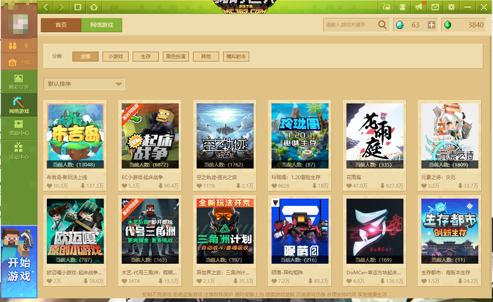

---
front:
hard: 入门
time: 5分钟
---

# 电脑端网络游戏概述与工具指引

## 电脑端网络游戏概述

电脑端网络游戏是指开发者通过 **第三方** 的服务端软件，并由官方提供物理机进行玩法搭建的多人游戏服务。在《我的世界》电脑版主页左侧侧边栏有明显的入口，用户可以通过入口找到处于 **上线阶段** 的在线多人服务器。 **网络游戏解除了本地联机的多种限制，让玩家与玩家间可以不受时间和地区因素干扰，遇到更多兴趣相投的玩家好友。**

## 电脑端网络游戏工具指引

**《我的世界》电脑网络游戏** 当前 **支持** 接入 **常见的第三方服务端如Bukkit、Spigot、Paper、CatServer、Mohist等服务端** 架设的网络游戏。这些第三方服务端软件都可以在Github找到对应仓库，这些服务端能够很好的支持本地开发和调试 ，为制作我的世界服务器创意玩法带来更多可能。在根据下方流程入驻成功后，开发者将会获得一台用于上线的 **物理机** ，物理机可以直接用于部署服务端。由于这些服务端软件并不是官方制作的，所以我们无法提供关于服务端方面的技术支持。但我们也能够提供诸如商业化、认证接入和平台等技术服务。：
