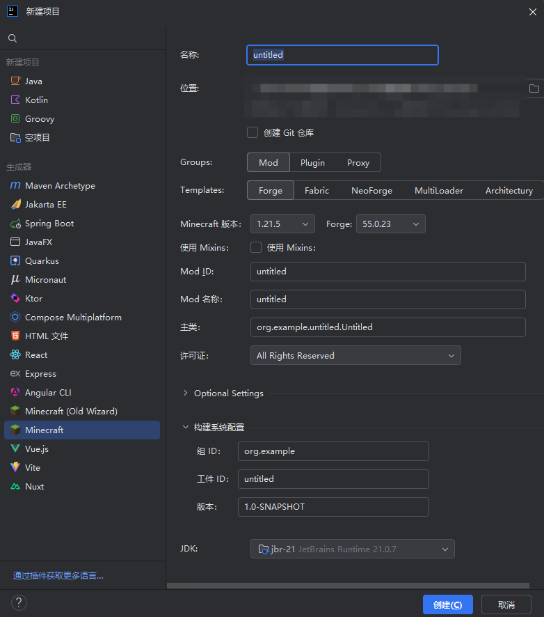

---
front:
hard: 入门
time: 5分钟
---

# 具备一定的开发能力

## 综述

由于电脑端服务端软件用到的开发语言基本为Java，这就导致开发者在对服务端进行修改或者编写服务器运行的插件，需要掌握较为牢固的Java面向对象编程技术，通过官方文档来编写可运行的插件 （少数可以用第三方库如 TabooLib、KotlinLib，使得能够用Kotlin来编写插件）

## 开发工具

我们推荐您使用IntelliJ IDEA这一款IDE来编写第三方服务端软件所需的插件、MOD等内容，其中的Minecraft Development插件就非常方便，可以通过快速此插件快速创建有关PC的项目，并自动配置Gradle或者Maven

## Linux使用

官方提供的物理机使用的系统为Linux，您需要掌握一定的Linux运维技术才能使服务器运行的更加平稳顺利，而不会出现当服务器出现崩溃等现象时出现束手无措的尴尬情况。
您可以查看[Linux基础](https://www.runoob.com/linux/linux-tutorial.html)

## 配置文件

目前第三方服务端编写的插件配置文件格式都是YAML格式，YAML 的语法和其他高级语言类似，并且可以简单表达清单、散列表，标量等数据形态。它使用空白符号缩进和大量依赖外观的特色，特别适合用来表达或编辑数据结构、各种配置文件、倾印调试内容、文件大纲（例如：许多电子邮件标题格式和YAML非常接近）。详情可以查看[YAML 入门教程](https://www.runoob.com/w3cnote/yaml-intro.html)。