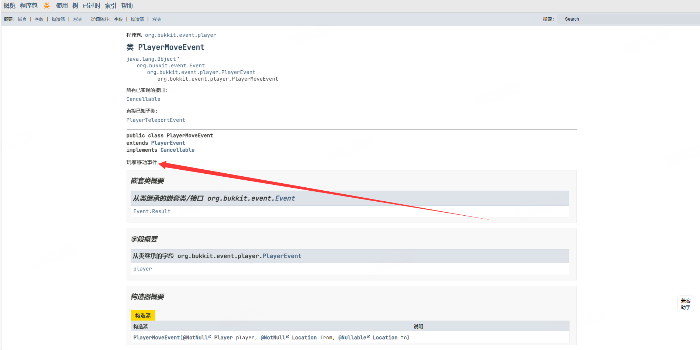

---
front:
hard: 入门
time: 10分钟
---

# 检索需要的信息

在实际开发中你肯定需要检索需要的信息.  
笔者在各个QQ群里、论坛里最经常看到的问题莫过于一些新开发者问的诸如 "XXX应该监听那个事件?"、"怎么设置玩家昵称?"、"怎么设置方块的Material?" 的问题.  
实际上, 这些问题会被人视作"劣质问题". **因为这些问题的答案就是一查就能查到**. 说心里话, **有问问题的时间, 不如自己翻一下JavaDoc自己找到答案**.   
当然, 要是真的找不到答案, 还是应该问一下.

本教程不涉及JavaDoc的基础使用, 仅作为指向提醒作用.

## Bukkit各部分以包划类, 类名即表示其作用

> 假如你想问的是`玩家移动应该监听什么事件?`这个问题.  

首先, 你想问的是监听什么事件, 请打开JavaDoc看一看BukkitAPI给出的所有的包.  
显然, 根据名称即可判断出你应当从`org.bukkit.event`包内寻找才对, 因为其他包跟"事件"这二字一点关系也没有.  
然后你会发现`org.bukkit.event`包还分为若干子包, 你同样可以按照名称判断出与玩家有关的事件应该都在`org.bukkit.event.player`包.

打开`org.bukkit.event.player`包, 你会发现与玩家有关的事件基本上都是按照`PlayerXxxxxEvent`的格式命名的. 仔细看一看便知道, `PlayerMoveEvent`事件的名称与我们想要的玩家移动这一功能即为一致, 它很有可能就是我们想要的.  

打开它的详细介绍, 看看它的描述, 是



```
Holds information for player movement events
```

所以, 这就是我们需要的玩家移动事件了.  

<br>

> 假如你想问的是`怎么获取玩家的飞行速度?`

这与玩家有关, 肯定要考虑获取玩家飞行速度的方法在`Player`类中. 我们打开`Player`类的详细介绍寻找答案.  
检索这一类的方法, 根据名称和方法描述, 可以得知我们想找的方法是`getFlySpeed`方法.