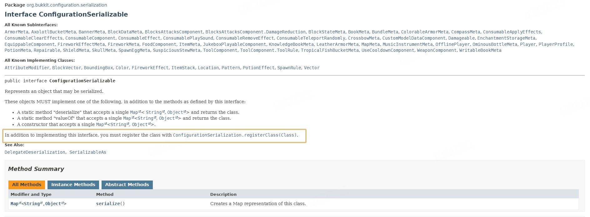

---
front:
hard: 进阶
time: 30分钟
---

# 配置API的序列化和遍历

# 序列化
## 了解序列化
如果我自己做了一个类型, 例如下面的`Person`类:

```java
public class Person {
    public String name;
    public String introduction;

    public Person(String name, String introduction) {
        this.name = name;
        this.introduction = introduction;
    }
}
```

现在我们新建一个`Person`对象:

```java
Person person = new Person("tdiant", "hello!!");
```

我们想把`Person`保存在配置文件里怎么办?  
很遗憾,直接`getConfig().set("demo",person);`是行不通的. 你会发现`getConfig.get("demo")`根本得不到这个对象.

> 哪些东西可以直接set保存呢?
> 类似getInt, 所有拥有get方法的类型都可以直接保存. (包括`List<String>`)
>
> 还有一些BukkitAPI给的类型, 例如ItemStack. 但不是全部都是这样.  
> 如果你想判断一个类型是不是可以直接set, 你可以在JavaDoc中找到它, 看它是否实现了`ConfigurationSerializable`类.


你可能想到了最简单粗暴的办法:
```java
//这样set
getConfig().set("demo.name",test.name);
getConfig().set("demo.introduction",test.introduction);
//然后保存, 用的时候这样
getConfig().getString("demo.name");
getConfig().getString("demo.introduction");
```

这的确是一种切实可行的办法. 但是这真的是太麻烦了. 有没有一种方法直接set或get这个对象的办法呢? 有! 你可以使用序列化和反序列化实现它!

## 让自定义类型实现序列化与反序列化
以上文`Person`为例. 首先让他实现`ConfigurationSerializable`, 并添加`deserialize`方法. 如下:  
```java
public class Person implements ConfigurationSerializable {
    public String name;
    public String introduction;

    public Person(String name, String introduction) {
        this.name = name;
        this.introduction = introduction;
    }

    @Override
    public Map<String, Object> serialize() {
        Map<String, Object> map = new HashMap<>();
        return map;
    }

    public static Person deserialize(Map<String, Object> map) {

    }
}
```

然后继续完善`serialize`, 实现序列化. 我们只需要把需要保存的数据写入map当中即可.  
注意, 需要保存的数据要保证可以直接set, 不能则也需要为他实现序列化与反序列化.  
```java
@Override
public Map<String,Object> serialize() {
    Map<String,Object> map = new HashMap<>();
    map.put("name",name);
    map.put("introduction",introduction);
    return map;
}
```

序列化后, 数据即可直接set进配置文件里. 为了实现直接get的目的, 还需要进行反序列化.  
```java
public static Person deserialize(Map<String, Object> map) {
    return new Person(
        (map.get("name") != null ? (String) map.get("name") : ""),
        (map.get("introduction") != null ? (String) map.get("introduction") : "")
    );
}
```
编写完毕后, 我们需要像注册监听器一样, 注册序列化. 在插件主类的`onEnable`中加入如下语句:
```java
ConfigurationSerialization.registerClass(Person.class);
```
为什么要这么做呢？
可以找到 ConfigurationSerializable的JavaDocs页面




至此, 你就可以自由地对一个自定义的对象直接地get和set了!  
下面分别演示set与get: 
```java
// set
Person person = new Person("tdiant", "hello!!");
getConfig().set("demo", person);
saveConfig();
```
默认配置文件(config.yml)将出现: 
```yml
demo:
  ==: myplugin.Person
  name: tdiant
  introduction: hello!!
```
BukkitAPI会根据`==`的值判断这段配置是由什么类序列化而来的, 进而方便其反序列化.  
不要轻易改动`==`属性的值, 否则BukkitAPI会因为找不到类或此类没有被注册(ConfigurationSerialization类的registerClass方法)而报错.
```java
// get
Person person = (Person) getConfig().get("demo");
System.out.println("name = " + person.name + " introduction = " + person.introduction);
```
控制台将输出:
```
name = tdiant introduction = hello!!
```
# 配置文件的遍历
试想, 如果存在下面的配置文件:
```yml
demo_list:
   a: 1
   b: 233
   c: 666
   d: lalalalalal
```
我应该如何对`demo_list`的子键进行遍历, 得到所有子键的对应值?  
最简单错报的方式就是将`demo_list.a`键、`demo_list.b`键...依次读取. 但这是建立在你知道`demo_list`有`a`、`b`、`c`...这些子键的基础之上的.  
如果我事先不知道`demo_list`的子键都各自叫什么, 又应该如何对`demo_list`的子键进行遍历, 得到所有子键的对应值?  

## 配置片段 ConfigurationSection
我们可以把`demo_list`键对应的部分拆出来.  
*下文假设config对象是我们现在正在操作的FileConfiguration对象.*
```java
ConfigurationSection cs = config.getConfigurationSection("demo_list");
```
这里我们得到了`ConfigurationSection`对象, 这个对象可以当做config对象`demo_list`键部分的片段, 等效于这个yaml数据:
```yml
a: 1
b: 233
c: 666
d: lalalalalal
```
对于一个`ConfigurationSection`对象, 其代表着一个完整配置数据的某个片段, 你不能直接利用诸如`saveConfig`的方式保存这个片段到另外一个yml文件里.

## 利用getKeys方法实现遍历
在上面我们得到了`ConfigurationSection`对象, 这代表着config对象`demo_list`键部分的片段.  
现在问题转化成了, 如何获取到`ConfigurationSection`对象里的所有键.  
可以利用`getKeys(false)`的方式达到目的.

```java
for(String key : cs.getKeys(false)) {
    System.out.println(key + " = " + cs.get(key));
}
```
上面的代码将输出:
```
a = 1
b = 233
c = 666
d = lalalalalal
```
这样就实现了遍历.

`getKeys`方法不只是`ConfigurationSection`拥有, 根据其继承关系, 我们可以推知对`FileConfiguration`类也拥有`getKeys`方法, 同理, `ConfigurationSection`类也有`getConfigurationSection`方法.  

但是我们刚才为什么要给`getKeys`的一个`false`的参数呢? 请看下面的yaml数据:  
```yml
test:
  a:
    b: 1
  c: 2
d: 1
```
我们得到了这个配置文件的`FileConfiguration`对象`config`, 现在对其用`getKeys(false)`进行遍历, 得到所有键.  
```java
for(String key : config.getKeys(false)) {
    System.out.println(key);
}
System.out.println("===================");
for(String key : config.getKeys(true)) {
    System.out.println(key);
}
```
输出结果如下:
```
test
d
===================
test
test.a
test.a.b
test.c
d
```
由此可知, `getKeys(false)`只能获取“一层的键”, 不能递归获取配置文件里所有的键. 而`getKeys(true)`会递归获取配置文件里所有出现的键.
