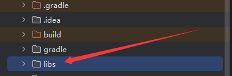
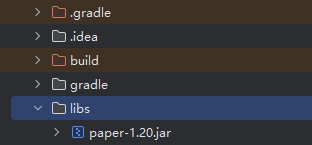
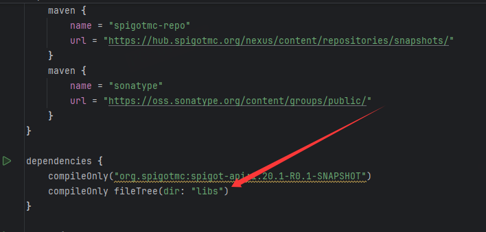
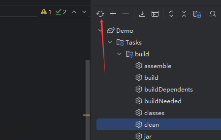
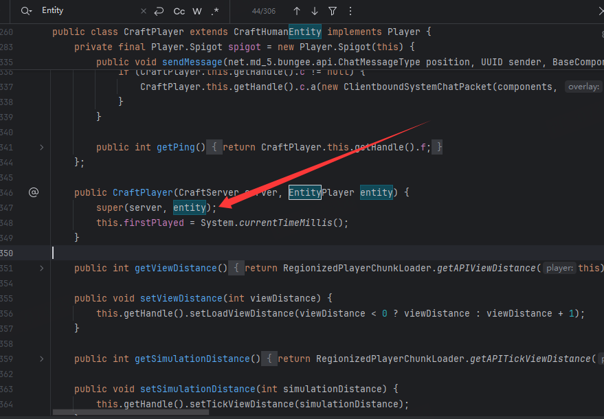
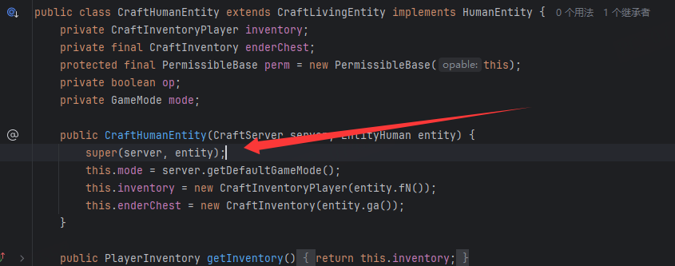
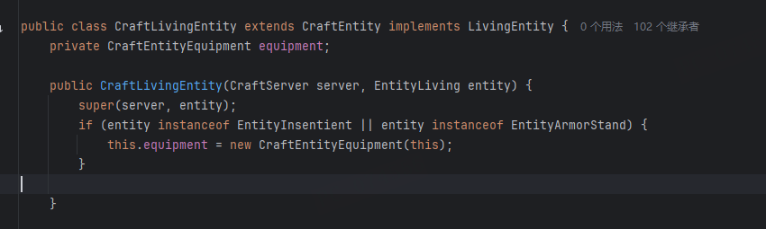
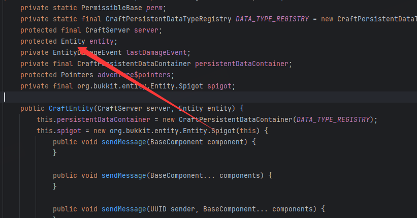

---
front:
hard: 高级
time: 20分钟
---

# 认识 NMS 和 OBC

nms，即 Java 包 `net.minecraft.server`，存放的是 Minecraft 服务端游戏逻辑代码，这篇教程将会采用 `Spigot` 作为 Bukkit API（就你们日常开发用的API） 体系的例子（CraftBukkit 也是 SpigotMC 维护，且基本所有 Bukkit 分支都是基于 Spigot 开发）

BukkitAPI 真的涵盖了不少东西，但是 BukkitAPI 并不是十全十美的，有时候我们确实需要使用 NMS。  
~~Forge其实也有个net.minecraft.server，但他和Spigot的没半点关系~~
## 使用 NMS 之前

md_5：*Wait!* 你真的需要使用 NMS 吗？  
> NMS不是API。当你遇到什么想做的事情的时候，你不应该第一时间去考虑 NMS 或者 发包  
令人费解的是，我们几乎每天都看到人们专门使用 NMS 做一些简单的事情，如 ScoreBoard、BossBar 或粒子。但是实际上，自从Mojang添加了这些东西之后，Spigot/Bukkit-API 早就有这些功能了。  

每当你考虑使用 NMS 时，请思考以下问题：
  1. 我是否需要NMS来做这个？
  2. 是否有一个API来实现这个功能？
  3. 我可以为这个贡献/创建/ ***提议*** 一个API吗？
  
  
对NMS的滥用造成的后果非常严重。
  - 1. 插件将失去版本迁移的能力（针对单个版本而言）  
  - 2. 阻碍了 API 的发展并且树立了一个坏榜样。

如果你确实想清楚确实没有现有的 API 能帮到你，那么来...

# 怎么使用 NMS
NMS 里的内容太多，故本教程**不会**教授NMS有什么东西，但是可以教你怎么玩。  

## 开发环境准备
由于DMCA的原因，Bukkit不会直接提供NMS，您需要将构建好的服务端代码引入项目中

如果没有且你正在使用 `Gradle` , `Maven` 这样的依赖管理器，考虑如下方法(图文):  

这边以Gradle为例
1. 在项目根目录创建libs文件夹用于放第三方库

2. 将构建好的服务端直接拖入libs文件夹中

3. 配置Gradle

4. 同步Gradle配置

5. 你已经成功引入NMS

## 获取到一个来自 API 背后的对象
*当你从控制台直接输出一个 `Player` 对象时，会发生什么？*  

你会得到一个 `CraftPlayer{name=玩家名}`而不是NMS里面的`EntityPlayer`。这是因为在Bukkit-API背后还有一层，他叫`OBC`，也就是`org.bukkit.craftbukkit`。  

OBC 是 Bukkit API 的实现，其本质是NMS的封装，因此我们并不需要太关心它。   

最简单的一个说法就是，实际上我们操作NMS封装API也是OBC所做的事情。

就上文问题，怎么拿到一个 NMS 里面的 `EntityPlayer`?  

首先我们需要使用反编译工具，当然了，你也可以通过IDEA直接查看。

来看 `CraftPlayer` 对 `EntityPlayer` 做了什么..


CraftPlayer 将 EntityPlayer 传给了他的父类构造器，我们接着追踪..  
 
而 CraftPlayer 的父类 CraftHumanEntity 依然将 EntityPlayer 传入父类 CraftLivingEntity，我们继续翻阅到 CraftLivingEntity 中
 
经过一条不 是 很 长的继承链后，我们找到了 `CraftEntity`，看来 `EntityPlayer` 最后是被传道这里了！
> 注意：OBC里面的类 `implements` 的都是BukkitAPI的实现，不要搞混了!

然后往上翻，看看 entity 是什么情况。  
 
他的修饰符是 `protected`，这意味着只有继承树内或者同一个包里面才能访问到它，而这在NMS/OBC中是常有的事情。  

## 反射！
我们很容易就可以写出这样的代码来获取到这个 entity 对象。

而这就需要用到Java的特性 —— 反射
```java
public static final String serverVersion = Bukkit.getServer().getClass().getPackage().getName().split("\\.")[3];
try{
  Player player = ....; // Who cares ?
  Class<?> clazz = Class.forName("org.bukkit.craftbukkit."+serverVersion+".entity.CraftEntity");
  Field f = clazz.getDeclaredField("entity");
  f.setAccessible(true);
  Object result = f.get(player);
}catch(Throwable t){
  t.printStackTrace();
}
```
现在 `result` 里面存的就是我们需要的 EntityPlayer，然后我们可以转换它...做点事情。  
为什么要这么麻烦？其实下面的代码一样可以做到这个效果：  
```java
try{
  Player player = ....; // Who cares ?
  Field f = CraftEntity.class.getDeclaredField("entity");
  f.setAccessible(true);
  Object result = f.get(player);
}catch(Throwable t){
  t.printStackTrace();
}
```

假设BukkitAPI没有封装修改经验值的方法，我们要修改玩家实体的经验值

就可以通过刚刚获取到的result的变量判断是否为 NMS 的 EntityPlayer 对象
```java
try{
    Player player = event.getPlayer();
    getLogger().info("test");
    Class<?> clazz = Class.forName("org.bukkit.craftbukkit."+serverVersion+".entity.CraftEntity");
    Field f = clazz.getDeclaredField("entity");
    f.setAccessible(true);
    Object result = f.get(player);
    if (result instanceof EntityPlayer){
        ((EntityPlayer) result).d(1000);
    }
}catch(Throwable t){
    t.printStackTrace();
}
```

> 那为什么result的方法是 `d`？
> 这是因为 Minecraft源码本身就是混淆的，OBC则是Bukkit反编译探索出来这个大概是什么方法然后进行封装的
> 所以我们在和OBC做同样的事情时，也要大概去猜测这些方法名是做什么的
> 大家可以尝试翻阅一下 EntityPlayer 源码，其中成员变量 newExp 被 方法 d() 所修改
> 所以大概猜测这个就是修改经验值的方法，调用后证实确实是这个方法


## 版本兼容性

实际上，如果你直接采用了 `CraftEntity.class` 的方法都会对这个 class 建立符号引用。  
每个版本的 Spigot，无论是 OBC 或者 NMS，他们的包名都会变化——也就是说你的插件会爆炸  
所以，如果你不想为了一个版本再把逻辑写一次，最好还是用反射的写法。对于公开的方法，也可以使用更高效的 `MethodHandle`。   

如果你有注意到的话， md_5 说过 `NMS 并不是`一个API(其实也包括OBC)。  
什么意思呢？也就是`使用NMS没有任何安全性保障`，**你反射的字段/方法或许下一个版本就会被删改。**   
实例惨案： Minecraft 1.17 Spigot大改，使用 Mojang 官方混淆表，以往 NMS 插件**全都**报废。（除了一些自带兼容的服务端）

# 本章小结
- NMS是`net.minecraft.server`，一个包名，放MC逻辑
- Spigot的NMS没有安全保障，md_5 都不推荐用
- 使用NMS之前要先找是否已经有了对应的 API
- 在 Bukkit-API 和 NMS 之间还有一个实现，它叫 OBC。