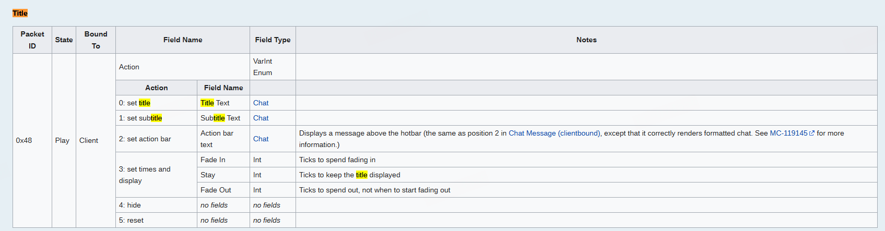
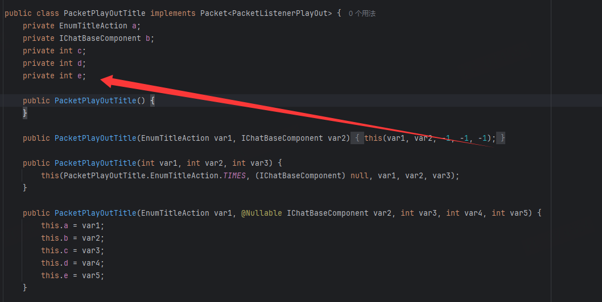

---
front:
hard: 高级
time: 30分钟
---

# 自定义发包

## 数据包介绍

翻阅NMS我们可以知道的是，服务端的数据变更一般都是通过 DataWatcher 来判断以后通过

数据包的方式发送到客户端，客户端接收到数据包后对玩家客户端内容从而进行更改

这就是为什么上一个教程中，我们更改玩家的经验时不能直接通过赋值的方式进行更改

而是通过内置的一个“神秘（混淆了）”封装的方法去更改，这是因为只有通过此方法，才能将参数传参给父类

然后在通过父类的方法赋值给 DataWatcher 

而翻阅 DataWatcher 类里的方法我们在一大堆混淆的代码发现了 
```java
public void refresh(EntityPlayer to) {
    if (!this.d()) {
        List<b<?>> list = this.packAll();
        if (list != null && to.getBukkitEntity().canSee(this.d.getBukkitEntity())) {
            to.c.a(new PacketPlayOutEntityMetadata(this.d.af(), list));
        }
    }

}
```

此方法大概率就是发送数据包的方法了.

此时你会发现，他将 `PacketPlayOutEntityMetadata` 包发了出去

那这个包是干嘛的呢？

我们查阅[我的世界维基百科数据包](https://minecraft.wiki/w/Java_Edition_protocol/Packets?oldid=2772385)

可以发现其中的EntityMetadata 正好是更新现有生物实体的元数据，而经验值属于玩家实体特有的元数据，所以符合我们上述的说法


## 如何自定义一个数据包并发出去呢

说了那么多如何自定义一个数据包发出去呢

在这里做一个示例便是

在1.8更新，我的世界更新了Title等一系列文字显示的内容，但是Bukkit并没有及时的更新相关的API

直到1.12.2才更新快速发送Title的方法，所以在1.8 - 1.11 期间，开发者想要发送Title则需要自己通过封装NMS去手动发包

我们查阅对应版本的数据包，在这里我拿1.12.2的wiki去演示 [我的世界维基百科数据包](https://minecraft.wiki/w/Java_Edition_protocol/Packets?oldid=2772385)

找到有关于Title的，可以发现此数据包



我们可以看到基本介绍，他是发送给客户端的，状态是Play，那么在NMS里应该就是 `PacketPlayOutTitle` 

再查看PacketPlayOutTitle类，虽然里面全部混淆了

但是对比成员变量与Wiki中Action描述可以不难猜出PacketPlayOutTitle包构造函数里的参数

按照顺序每个参数类型都是按照顺序填写的



我们发现有四个构造函数，那我们选择能够自定义程度最高的，也就是参数填入最多的那一个构造函数

第一个参数传入 Title 类型 （TITLE、SUBTITLE）

> 这就代表着我们要同时发2个包。一个是TITLE的数据包，另一个是SUBTITLE的数据包。

第二个参数传入 `IChatBaseComponent` ，这个是我的世界的文本基础组件。

第三个参数传入 淡入时间

第四个参数传入 停留时间

第五个参数传入 淡出时间

当我们都填写好参数后，可以写出下述代码
```java
public void sendTitle(Player player, String title, String subtitle, int fadeIn, int stayIn, int fadeOut) {
    IChatBaseComponent titlesend = IChatBaseComponent.ChatSerializer.a("{\"text\": \"" + title + "\"}");
    IChatBaseComponent subtitlesend = IChatBaseComponent.ChatSerializer.a("{\"text\": \"" + subtitle + "\"}");
    PacketPlayOutTitle packet = new PacketPlayOutTitle(PacketPlayOutTitle.EnumTitleAction.TITLE, titlesend, fadeIn, stayIn, fadeOut);
    PacketPlayOutTitle packet2 = new PacketPlayOutTitle(PacketPlayOutTitle.EnumTitleAction.SUBTITLE, subtitlesend, fadeIn, stayIn, fadeOut);
    (((CraftPlayer)player).getHandle()).playerConnection.sendPacket((Packet)packet);
    (((CraftPlayer)player).getHandle()).playerConnection.sendPacket((Packet)packet2);
}
```

此时我们即可快速调用自己写的 sendTitle 快速发送一份Title文字

但是翻阅各版本NMS可以发现，每一个版本的Packet的参数混淆名、类的位置等都不一样

所以这就导致我们通过NMS去发送title，就可能导致版本不互通

所以这就需要我们对各版本都有处理，主要就是利用到Java的接口对不同版本都有一定的兼容，这里就不再过多介绍

> 由于NMS兼容性确实很差，一般来说开发者在操作Packet的时候都是通过第三方库 ProtocolLib 处理