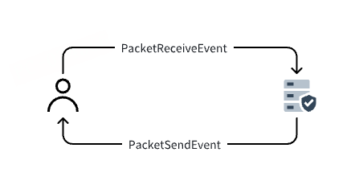
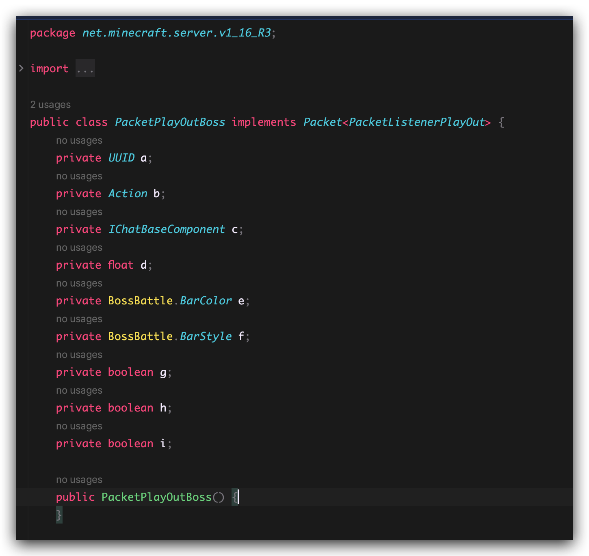
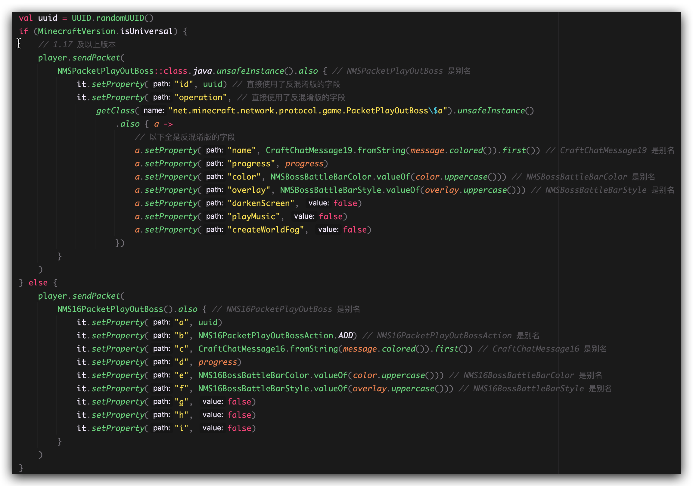

---
front:
hard: 进阶
time: 25分钟
---


# 数据包基本运用
## 介绍
本章 也可以说是发包的介绍 如何拦截数据包进行篡改 来达到效果  
或者是直接发送一个数据包 让客户端收到



## 篡改数据包
如上图所示 我们有两种类型的事件
1. PacketReceiveEvent 玩家发送给服务端的数据包
2. PacketSendEvent 服务端发送给客户端的数据包


## 例子
```kotlin
@SubscribeEvent
fun onPacketPlayOutEntityEquipment(event: PacketSendEvent) {
    if (event.packet.name != "PacketPlayOutEntityEquipment") {
        return
    }
    val item = event.packet.read<List<MoJangPair<EnumItemSlot, ItemStack>>>("slots") ?: return
    val copy = mutableListOf<MoJangPair<EnumItemSlot, ItemStack>>()
    item.forEach {
        val events = PacketReadItemEvent(event.player, toBukkit(it.second))
        events.call()
        copy.add(MoJangPair(it.first, toNMSCopy(events.itemStack)))
    }
    event.packet.write("slots", copy)
}
```

## 发送数据包
我们需要构造一个数据包的对象 以发送一个虚拟头颅方块的数据给玩家为例子
```kotlin
val parse = MojangsonParser.parse("""{Owner:{Id:"014df015-7eba-4ad0-a0e0-83164b7a45f2",Properties:{textures:[{Value:"方块的贴图"}]},Name:"自定义方块"},Rot:${rot}b,x:${x},y:${y},z:${z},id:"minecraft:skull",SkullType:3b}""".trimIndent())
val packetPlayOutTileEntityData = PacketPlayOutTileEntityData(
    BlockPosition(loc.blockX, loc.blockY, loc.blockZ), 4, parse
)
player.sendPacket(packetPlayOutTileEntityData)
```

## 复杂的例子
**发送 BossBar 实现**  
注意：这里我们减少了一些对于数据包本身的叙述（例如如何寻找我要的包的类型，这些应该是必备技能），仅介绍 TabooLib 方法。  
根据常识可知，我们应该发送 PacketPlayOutBoss 这个数据包。我们去寻找这两个包的构造参数。（这里我使用反编译的办法）
1.16 及以下的版本的参数如下：


1.17 及以上的版本的参数如下：
（这就是 TabooLib 带给我们的自信，我们可以直接使用反混淆版的服务端，由此我们可以很清楚的看到 id、operation 等字段）  
可知 1.16 及以下版本有一个无参构造函数，1.17+ 没有（有一个私有构造函数，不方便）。对于没有无参构造函数的类，我们可以通过 TabooLib Reflex 提供的函数 Class<T>#unsafeInstance() 来快速获得一个实例。



我们可以看到在 1.17+ 中，我们使用的全是反混淆（Mojang Mapping）的字段名。不用担心，TabooLib 会自动帮我们处理。    
外部调用方法： NMS.INSTANCE.sendBossBar()  
使用到的别名如下：
```kotlin
// 1.16
typealias NMS16PacketPlayOutBoss = net.minecraft.server.v1_16_R3.PacketPlayOutBoss
typealias NMS16PacketPlayOutBossAction = net.minecraft.server.v1_16_R3.PacketPlayOutBoss.Action
typealias NMS16BossBattleBarColor = net.minecraft.server.v1_16_R3.BossBattle.BarColor
typealias NMS16BossBattleBarStyle = net.minecraft.server.v1_16_R3.BossBattle.BarStyle
typealias CraftChatMessage16 = org.bukkit.craftbukkit.v1_16_R3.util.CraftChatMessage
// Universal
typealias NMSPacketPlayOutBoss = net.minecraft.network.protocol.game.PacketPlayOutBoss
typealias NMSBossBattleBarColor = net.minecraft.world.BossBattle.BarColor
typealias NMSBossBattleBarStyle = net.minecraft.world.BossBattle.BarStyle
typealias CraftChatMessage19 = org.bukkit.craftbukkit.v1_19_R3.util.CraftChatMessage
```

可以看到，1.16 以下的版本中，我们只写了一套 1.16 的实现，实际上在 1.15、1.14 等版本也可运行，因为 TabooLib 会自动帮我们处理 nmsProxy 内的跨版本和混淆表。

**数据包监听器**

TabooLib 有数据包监听器，我们可以监听数据包发送和接收。  
数据包不会自动处理跨版本和混淆表。  
使用方法：

```kotlin
/**
 * 数据包接收
 */
@SubscribeEvent
fun e(e: PacketReceiveEvent) {
    // 随便拿一个数据包举例子
    if (e.packet.name == "PacketPlayInSetCreativeSlot") {
        // 读
        val nmsItem = e.packet.read<Any>("b")!!
        // 写
        e.packet.write("b", nmsItem)
    }
}

/**
 * 数据包发送
 */
@SubscribeEvent
fun e(e: PacketSendEvent) {
    // 随便拿一个数据包举例子
    if (e.packet.name == "PacketPlayOutOpenWindowMerchant") {
        // 读
        val merchant = e.packet.read<Any>("b")!!
        // 写
        e.packet.write("b", NMS.INSTANCE.adaptMerchantRecipe(merchant, e.player))
    }
}
```