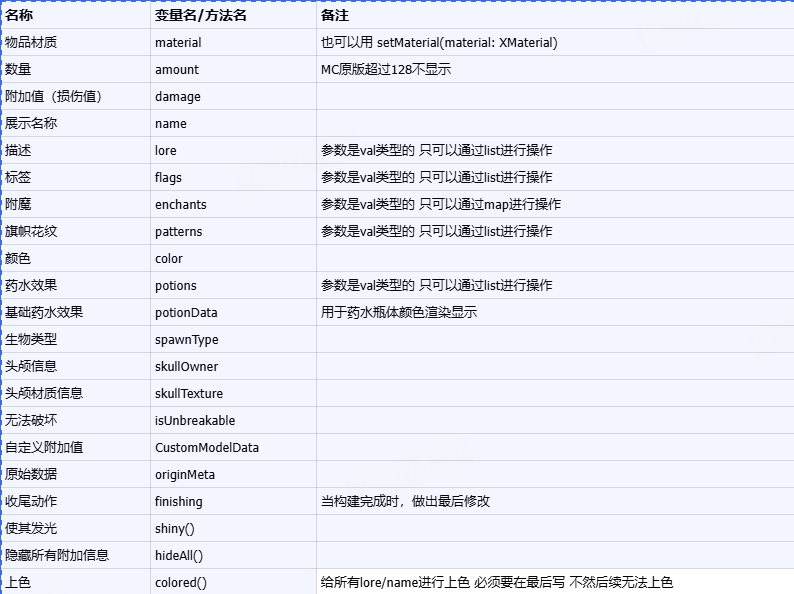

---
front:
hard: 入门
time: 12分钟
---


# 物品操作工具
## 介绍
TabooLib 内置了一套 关于 构建物品 编辑物品 修改/获取 NBT 的工具  
本文就是着重介绍 涉及到的模块包括：
1. BUKKIT_ALL
2. NMS_UTIL

## 构建物品
ItemBuilder

```kotlin
buildItem(XMaterial.APPLE) {
    name = "&d坏黑的大苹果"
    lore.add("&7这是一个坏黑的大苹果")
    colored()
}
```
然后就可以返回一个 ItemStack 供你使用
### 入口 - 以物造物
通过现有物品构建新的物品

```kotlin
fun buildItem(itemStack: ItemStack, builder: ItemBuilder.() -> Unit = {}): ItemStack
```

### 入口 - XMaterial 造物
XMaterial 是一个多版本兼容支持的类型
```kotlin
fun buildItem(material: XMaterial, builder: ItemBuilder.() -> Unit = {}): ItemStack
```

### 入口 - Material 造物
```kotlin
fun buildItem(material: Material, builder: ItemBuilder.() -> Unit = {}): ItemStack
```

### 可选参数



## 修改元数据
在Bukkit中，把物品的职能通过ItemMeta进行拆分  
比如：可掉耐久的 书本 他们都是ItemMeta的子类  
但是如果使用getMeta的方法获得到的是个clone的副本还需要再设置回去  
在TabooLib中可以通过一个DSL快速操作  
> 以掉耐久的为例 这个得看自己的版本来决定写法
```kotlin
buildItem.modifyMeta<Damageable> {
    damage = 10
}
```

## 修改 Lore
Lore是一个高频使用的功能 所以TabooLib把他从ItemMeta抽出来作为一个单独的方法使用

```kotlin
buildItem.modifyLore { 
    add("123")
    clear()
    add("&d新的一行")
    colored()
}
```

## 修改NBT
TabooLib对NBT进行了封装 叫做 ItemTag 本文作为入门教学 只提供增删改查等基础教学  
如果要深入操作 还请自行研究

### 入口
```kotlin
val itemTag = buildItem.getItemTag()
```

```kotlin
// 获取数据
itemTag.getDeep("自定义的节点.支持多节点")
// 获取数据 如果不存在则设置默认值
itemTag.getDeepOrElse("自定义的节点.支持多节点", ItemTagData("无"))
// 设置数据
itemTag.putDeep("自定义的节点.支持多节点", ItemTagData("新的值"))
// 删除数据
itemTag.removeDeep("自定义的节点.支持多节点")
// 保存数据
itemTag.saveTo(buildItem)
```

操作起来还是略显繁琐 如果NBT节点数量多 那么操作的量是毁灭的  
所以枫溪在TabooLib里内置了一个工具 ItemTagReader 让你像配置文件一样操作NBT  
### ItemTagReader  

```kotlin
buildItem.itemTagReader {
    val value = getString("自定义的节点.支持多节点", "默认值")
    set("自定义的节点.支持多节点", "新的值 + ${value}")
    // 收尾方法 写了才算写入物品 不然不会写入 减少操作可能出现的失误
    write(buildItem)
}
```

## 工具
TabooLib为了简化物品操作 内置了很多的工具函数方便你的使用

### 检查数量
检查玩家背包/容器中的特定物品是否达到特定数量
```kotlin
fun Player.checkItem(item: ItemStack, amount: Int = 1, remove: Boolean = false): Boolean
fun Inventory.checkItem(item: ItemStack, amount: Int = 1, remove: Boolean = false): Boolean
```

### 检查数量 - 过滤器
获取符合过滤器内函数的物品数量

```kotlin
fun Inventory.hasItem(amount: Int = 1, matcher: (itemStack: ItemStack) -> Boolean): Boolean

player.inventory.hasItem {
    it.type == Material.APPLE
}
```
### 扣除物品
```kotlin
fun Inventory.takeItem(amount: Int = 1, matcher: (itemStack: ItemStack) -> Boolean): Boolean

player.inventory.takeItem(50) {
    it.type == Material.APPLE
}
```
### 获取数量
```kotlin
fun Inventory.countItem(matcher: (itemStack: ItemStack) -> Boolean): Int
```