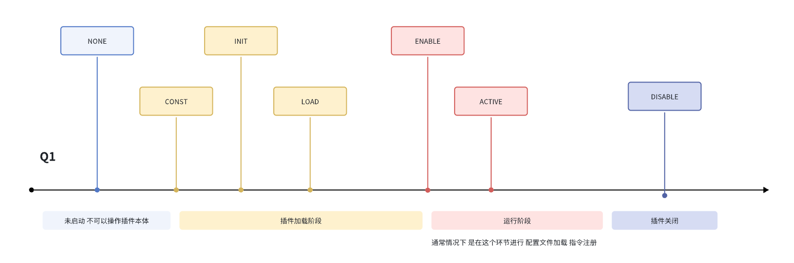

---
front:
hard: 入门
time: 12分钟
---


# 自唤醒

在Bukkit中，基本都要在主类的 `onEnable`执行自己想要注册的内容  
但是Taboolib提供了一个注解器，可以在任意地方进行注解，从而简化代码

> TabooLib 最常用的功能必须掌握

## 入口 @Awake
在服务器的某个 生命周期 自动执行 object 内的 无参方法
```kotlin
@Awake(LifeCycle.ENABLE)
fun test() {
    info("我运行了")
}
```
约等于
```java
public class SelfPlugin extends JavaPlugin{
//
    @Override
    public void onEnable(){
        getLogger.info("我运行了");
    }
}
```

而上面test方法你可以封装在任意object中  
可以大大降低每个类对主类的耦合度
要注意的点:
1. 必须在 object类内 不然会无效/报错
2. 方法不可以含有参数 (某些工具会在构建时往函数内插入参数需要检查)

## 生命周期

```kotlin
public enum LifeCycle {
    NONE, // 未启动
    CONST, // 插件初始化（静态代码块被执行时）时
    INIT, // 插件主类被实例化时
    LOAD, // 插件加载时
    ENABLE, // 插件启用时
    ACTIVE, // 服务器完全启动（调度器启动）时
    DISABLE; // 插件卸载时
}
```



## 另一种自唤醒
如果你想让一个类 继承某个接口/增加某个注解 然后初始化的时候自动执行些什么
应该这样写 你不应该自己随便写扫包模块 这是不理智的
> 如果你有这种需求 我觉得已经有一定的代码阅读能力了 应该可以看懂以下代码
```kotlin
@Awake
object ClassReader : ClassVisitor(0) {
    override fun getLifeCycle(): LifeCycle {
        return LifeCycle.ENABLE
    }

    override fun visitStart(clazz: Class<*>, instance: Supplier<*>?) {
        if (clazz.interfaces.contains(AbstractSkill::class.java)) {
            info("加载技能: ${clazz.simpleName}")
            val newInstance = clazz.newInstance()
            if (newInstance is AbstractSkill) {
                SkillManager.skills[newInstance.id] = newInstance
            }
        }
    }

}
```