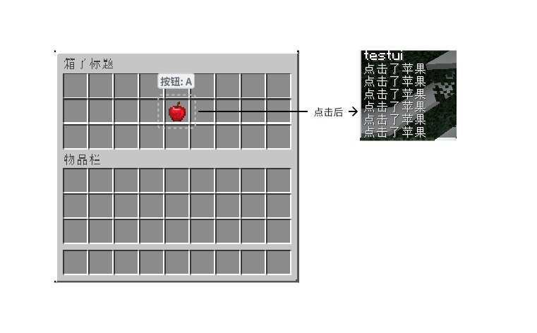

---
front:
hard: 入门
time: 30分钟
---


# 箱子页面与自定义GUI

## UI - 预声明UI框架
TabooLib 开发了以下几种类型的UI
1. Basic / Chest 基本箱子页面
2. Linked / PageableChest 可翻页的箱子页面
3. Stored / StorableChest 可储存箱子页面
4. Hopper 漏斗容器
5. Anvil 铁砧容器

## 快速上手

1. 引入模块
```kotlin
taboolib {
    env {
        install(BukkitUI)
    }
}
```

2. 刷新Gradle
3. 编写测试类
```kotlin

object TestUI {

    @Awake(LifeCycle.ENABLE)
    fun init() {
        simpleCommand("testui") { sender, args ->
            sender.sendMessage("testui")
            sender.castSafely<Player>()?.let {
                openMenu(it)
            }
        }
    }

    fun openMenu(player: Player) {
        ...
    }

}
```

4. 快速创建一个三行的箱子UI 里面包含一个按钮
```kotlin
fun openMenu(player: Player) {
    player.openMenu<Chest>("箱子标题") {
        map(
            "#########",
            "#   A   #",
            "#########",
        )
        set('A', buildItem(XMaterial.APPLE) {
            name = "&a苹果"
            lore.add("&f这是一个苹果")
            colored()
        }) {
            player.sendMessage("点击了苹果")
        }
    }
}
```



## Chest - 标准容器界面

就是普通的 箱子UI 支持最多 1~6 行  
类似于Trmenu的布局模式  
以下是主要的方法 (完整方法查询源码/GitHub)
```kotlin
interface Chest : Menu {

    /**
     * 行数
     * 为 1 - 6 之间的整数，并非原版 9 的倍数
     */
    fun rows(rows: Int)

    /**
     * 设置是否锁定玩家手部动作
     * 设置为 true 则将阻止玩家在使用菜单时进行包括但不限于
     * 丢弃物品，拿出菜单物品等行为
     */
    fun handLocked(handLocked: Boolean)

    /**
     * 页面构建时触发回调
     * 可选是否异步执行
     */
    fun onBuild(async: Boolean = false, callback: (player: Player, inventory: Inventory) -> Unit)

    /**
     * 页面关闭时触发回调
     * 只能触发一次（玩家客户端强制关闭时会触发两次原版 InventoryCloseEvent 事件）
     *
     * TODO 2023/10/09 若启用虚拟化菜单，则 player.closeInventory() 不会触发该回调函数
     */
    fun onClose(once: Boolean = true, skipUpdateTitle: Boolean = true, callback: (event: InventoryCloseEvent) -> Unit)

    /**
     * 点击事件回调
     * 仅在特定位置下触发
     */
    fun onClick(bind: Char, callback: (event: ClickEvent) -> Unit = {})

    /**
     * 整页点击事件回调
     * 可选是否自动锁定点击位置
     */
    fun onClick(lock: Boolean = false, callback: (event: ClickEvent) -> Unit = {})

    /**
     * 使用抽象字符页面布局
     */
    fun map(vararg slots: String)

    /**
     * 根据抽象符号设置物品
     */
    fun set(slot: Char, itemStack: ItemStack)
    
    /**
     * 根据抽象符号设置物品
     */
    fun set(slot: Char, itemStack: ItemStack, onClick: ClickEvent.() -> Unit = {})

    /**
     * 获取位置对应的抽象字符
     */
    fun getSlot(slot: Int): Char

    /**
     * 获取抽象字符对应的位置
     */
    fun getSlots(slot: Char): List<Int>

    /**
     * 获取抽象字符对应的首个位置
     */
    fun getFirstSlot(slot: Char): Int
}
```

## PageableChest - 可翻页的容器界面
```kotlin
player.openMenu<PageableChest<Player>>("在线玩家列表") {
    
}
```

与 标准容器不一样的是 我们在构建的时候需要传入一个类型 代表这里面需要展示的数据类型  
比如我们需要制作 玩家列表 那么应该传入 玩家对象 

```kotlin
fun openLinked(player: Player) {
    player.openMenu<PageableChest<Player>>("在线玩家列表") {
        // 布局
        map(
            "########E",
            "#@@@@@@@#",
            "L#######N",
        )
        // 设置槽位映射
        slotsBy('@')
        // 设置边界
        set('#', buildItem(XMaterial.BLACK_STAINED_GLASS_PANE) {
            name = "§8⬛"
        })
    }
}
```

然后就是设置数据来源了  
玩家列表的数据来源非常好获取
```kotlin
player.openMenu<PageableChest<Player>>("在线玩家列表") {
    // 布局
    map...
    // 设置槽位映射
    slotsBy('@')
    // 设置边界
    set...
    // 数据来源
    elements {
        Bukkit.getOnlinePlayers().toList()
    }
}
```

有数据来源了就要开始着手显示这个数据了 我们这里使用头颅  
然后注册一个点击回调

```kotlin
fun openLinked(player: Player) {
    player.openMenu<PageableChest<Player>>("在线玩家列表") {
        map...
        slotsBy('@')
        set...
        elements...
        onGenerate { player, element, index, slot ->
            buildItem(XMaterial.PLAYER_HEAD) {
                name = "§f${element.name}"
                skullOwner = element.name
            }
        }
        onClick { event, element ->
            player.sendMessage("点击了 ${element.name}")
            element.sendMessage("你被 ${player.name} 点击了")
        }
    }
}
```

接下来我们需要一个翻页的按钮

```kotlin
player.openMenu<PageableChest<Player>>("在线玩家列表") {
    map...
    slotsBy('@')
    set...
    elements...
    onGenerate...
    onClick...
    // 设置翻页按钮
    setNextPage(getFirstSlot('N')) { page, hasNextPage ->
        if (hasNextPage) {
            buildItem(XMaterial.SPECTRAL_ARROW) {
                name = "§f下一页"
            }
        } else {
            buildItem(XMaterial.ARROW) {
                name = "§7下一页"
            }
        }
    }
    setPreviousPage(getFirstSlot('L')) { page, hasPreviousPage ->
        if (hasPreviousPage) {
            buildItem(XMaterial.SPECTRAL_ARROW) {
                name = "§f上一页"
            }
        } else {
            buildItem(XMaterial.ARROW) {
                name = "§7上一页"
            }
        }
    }
}
```

至此 你已经掌握了翻页容器的基本使用


## 其他容器

其他容器都和Chest类似 查看其中的方法可以通过查看源码中封装好的方法去调用

## 布局槽位图

[官方维基百科](https://minecraft.wiki/w/Java_Edition_protocol/Inventory)