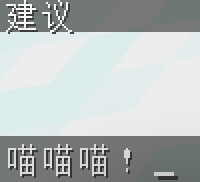

---
front:
hard: 入门
time: 8分钟
---


# 语言文件
## 介绍
用于提高插件的灵活性增加插件的国际化应用  
一般情况下语言文件是形如这样的
> lang/zh_CN.yml

```yaml
editor-input-enums: '请选择 {0}'
editor-input-chat:
  - ==: JSON
    text: ' &5&l‹ ›&r &7请在聊天框中输入你要设置的值, 当前值为: &f&n[{0}]'
    args:
      - suggest: '{0}'
        hover: '点击复制'
```

## 文件格式
通用语言文件使用 .yml 作为文件后缀，并以 zh_CN 等语言代码作为文件名。
- zh_CN.yml 为简体中文语言文件
- zh_TW.yml 为繁体中文语言文件
- en_US.yml 为英文语言文件

在文件中，每一行都是一个 键值对，键值对的格式为 键: 值 或 键: [值1, 值2, 值3]。

```yaml
example-language-list:
- '这是一个示例语言文件'
- '这是一个示例语言文件'
- '这是一个示例语言文件'
```
整个文件必须采用扁平化的结构（即不允许使用 键1: { 键2: 值 } 的格式）。

## 复合文本模式
通常一个节点可以有很多表现
```yaml
  node:
    - type: text
      text: hello world!
    - type: title
      title: hello world!
      subtitle: sub
      fadein: 1
      stay: 1
      fadeout: 1
    - type: sound
      sound: block_stone_break
      volume: 1
      pitch: 1
    - type: json
      text:
        - [hello] [world!]
      args:
        - hover: hello
          command: say hello
        - hover: world!
          command: say world
```
我们举个例子 以Trmenu的 打开UI提示PAPI拓展不足举例

```yaml
Menu-Expansions-Header:
  - '&8[&3Tr&bMenu&8] &7你必须安装 PAPI &f{0} &7个拓展以使用此菜单.'
  - type: JSON
    text: '&7请在安装后 [&3&n点击重载] &7拓展'
    args:
      - hover: '&7点击重载 PAPI 拓展'
        command: '/papi reload'
Menu-Expansions-Format:
  - type: JSON
    text: '&8- [&a{0}]&r'
    args:
      - hover: '&7点击下载'
        command: '/papi ecloud download {0}'
```

如果你觉得上文的复合文本模式比较复杂且难以编写，那么是时候了解一下 `TabooComponent` 了这是类似于 `MiniMessage` 的功能。  
它允许你在单行内设置相应参数。需要操作的文本使用 `[]` 框住，在其后面加上 `()` 用以配置具体参数。参数之间使用 `;` 分隔。  
如果我们想在语言文件中使用这个功能时，需要手动打开这个功能：

```kotlin
object ExamplePlugin : Plugin() {
    override fun onEnable() {
        //你的启动逻辑...

        // 启用 TabooLibComponent
        Language.enableSimpleComponent = true
    }
}
```

```yaml
node: 'TabooLib真[强]（b;u）啊'
node1: '[点我]（hover=快点我啊！;suggest=测试）送屠龙宝刀'
```
使用 sendLang 发送给玩家后得到的效果就是：


那么如果你需要在发送的文本中显示 `[]`，那么就需要进行转义。转义的方法很简单，只需要在对应文本前加上 `\` 符号即可，例如：
```yaml
node: '[\[点我\]]（command=/stop）关服'
# 复合文本要套在一个 [] 内
nodes: 这是一条[红色的[\[可点击\]]（command=sb;hover=测试）的]测试信息。
# [红色的[可点击]（command=test;hover=测试）的]
```

已知支持转义的字符有：`[ ]` `( )` `;` `=` `\\`

## 可选参数
`TabooComponent` 支持很多参数，如下表格为已知的可选参数：

| 名称      | 别名  | 功能                    | 案例                                                  | 效果图                     |
|---------|-----|-----------------------|-----------------------------------------------------|-------------------------|
| s       |     | 删除下划线                 | [删除线]（s）                                            |  |
| u       |     | 添加下划线                 | [下划线]（u）                                            |  |
| italic  | i   | 添加斜体                  | [斜体]（i）                                             |  |
| bold    | b   | 添加粗体                  | [粗体]（b）                                             |  |
| obf     | o   | 添加模糊，也就是一直变化的代码       | [模糊]（o）                                             |  |
| reset   | r   | 移除所有装饰和颜色             | [&6移除]（r）                                           |  |
| newline | nl  | 换行                    | 坏黑，[]（nl）我爱你！                                       |  |
| font    | f   | 改变字体                  | [TabooLib]（f=uniform）                               |  |
| url     |     | 点击后打开链接               | [\[点击\]]（url=https://tabooproject.org/）打开TabooLib官网 |  |
| command | cmd | 点击后执行对应指令             | 点击[\[关服\]]（cmd=/stop）                               |  |
| hover   | h   | 鼠标悬停显示内容使用`<br>`，可以换行 | [悬浮]（h=这是悬浮信息）                                      |  |
| suggest |     | 点击后在输入框填入内容           | [建议]（suggest=喵喵喵！）                                  |  |
| copy    |     | 点击后将内容复制到剪切板          | [点击以复制喵喵喵]（copy=喵喵喵！）                               |  |
| color   | c   | 设置颜色，支持hex或原版颜色       | [我是粉色的]（c=#e44b8d）                                  |  |
| gradient  | g   | 设置渐变色                 | []（gradient=#f6d365,#fda085）                        |  |
| insertion   | insert    | 按住shift点击后插入文本      | [&6按住shift点我]（insert=坏黑爱我）告诉你一个秘密                   |  |
| keybind   | key   | 替换文本为键位      | 按下[key.jump]（key）以跳跃                                |  |
| translate   | trans   | 替换文本为当前语言下的译名      | 我叫[block.minecraft.diamond_block]（trans）            |  |

## 调用 - 直接发送

那么语言相关内容在代码里如何书写呢?
可以直接使用 `CommandSender#sendLang("路径节点",参数0,参数1,参数2)` 方法
```kotlin
if (expansions.isNotEmpty()) {
    e.isCancelled = true
    viewer.sendLang("Menu-Expansions-Header", expansions.size)
    expansions.forEach { viewer.sendLang("Menu-Expansions-Format", it) }
}
```

## 调用 - 获取文本
结合菜单功能 我想给菜单也做 I18n 我应该如何写呢

```kotlin
fun openMenu(player: Player) {
    player.openMenu<Chest>(player.asLangText("ui-title")) {
        map(
            "#########",
            "#   A   #",
            "#########",
        )
        set('A', buildItem(XMaterial.APPLE) {
            name = player.asLangText("ui-apple-name")
            lore.addAll(player.asLangTextList("ui-apple-lore"))
            colored()
        }) {
            player.sendLang("ui-apple-click")
        }
    }
}
```

## 设置语言文件
```kotlin
@SubscribeEvent
fun lang(event: PlayerSelectLocaleEvent) {
    event.locale = config.getString("Lang", "zh_CN")!!
}

@SubscribeEvent
fun lang(event: SystemSelectLocaleEvent) {
    event.locale = config.getString("Lang", "zh_CN")!!
}
```