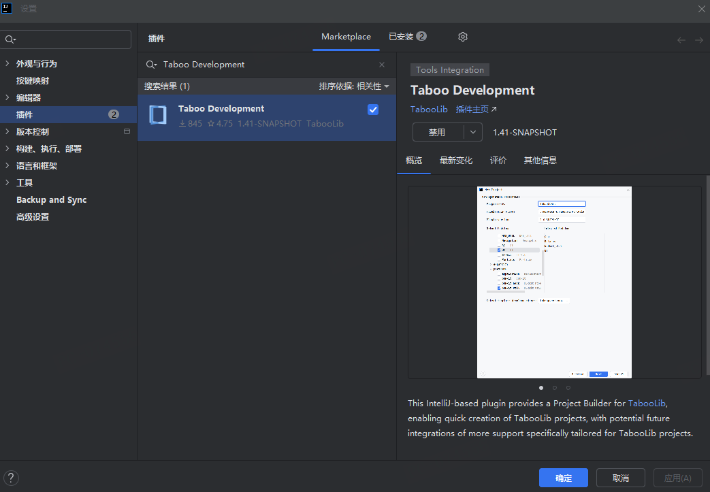
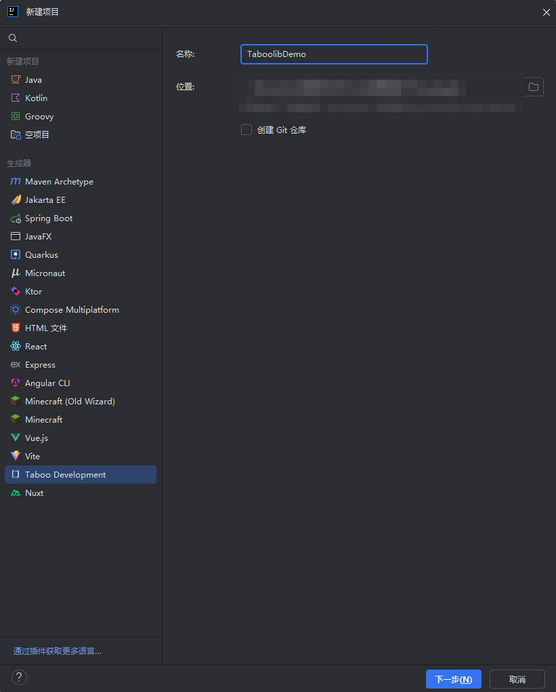
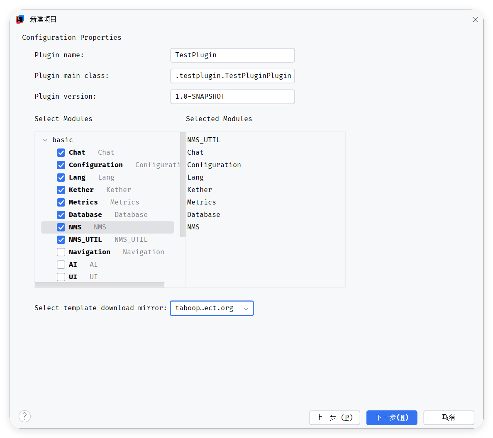
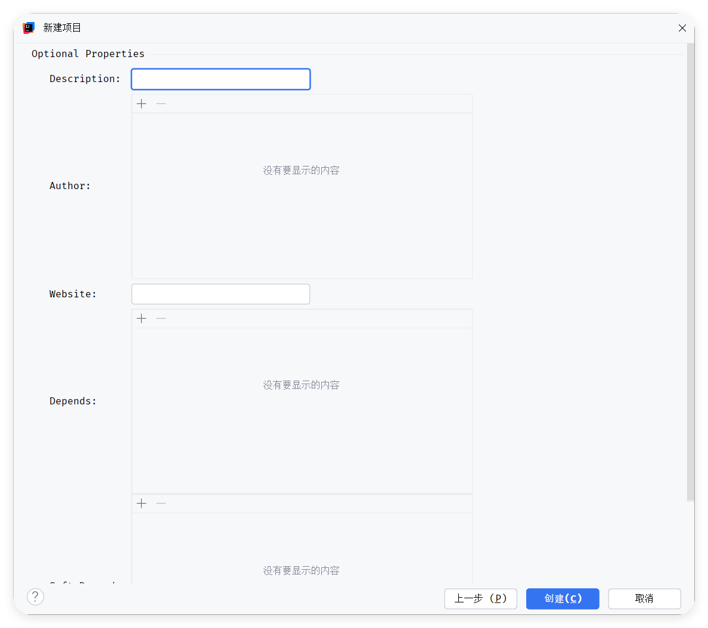
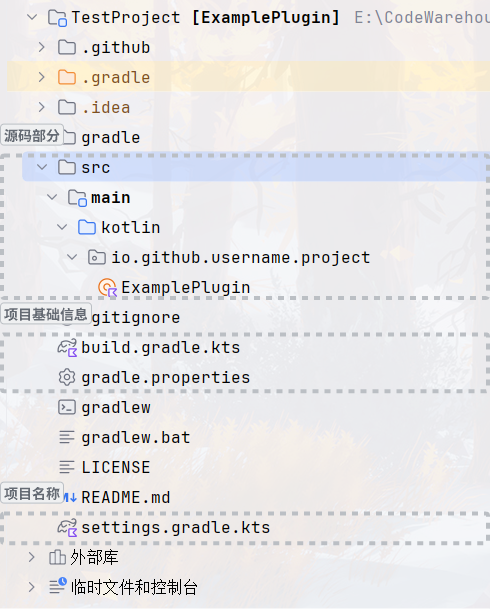
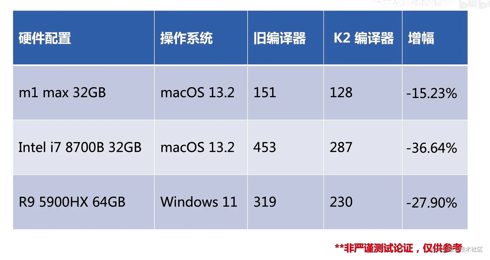
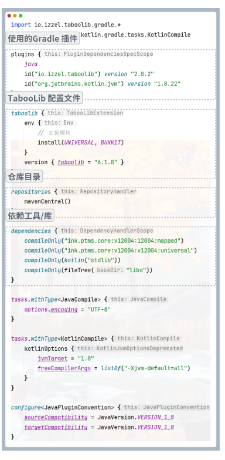

---
front:
hard: 入门
time: 10分钟
---


# 快速上手

## 创建项目

打开 IDEA -> Plugins -> 搜索 Taboo Development -> 安装此插件



> https://plugins.jetbrains.com/plugin/25210-taboolib-development

新建项目中选择 Taboo Development .
选择项目名称和项目位置.



输入插件名、 主类、 版本等信息
选择需要用到的模块



> 模块化是`TabooLib`特点之一，开发者无需下载不需要的前置库，各取所需即可
> 如果还不确定自己会用到什么模块也不要着急，后续仍然可以在`Gradle`配置文件中配置Install

接下来输入插件基本信息




## 认识目录



### 修改项目名

在`settings.gradle.kts`中.
你会看到 `rootProject.name = "TestProject"`.

修改后同步Gradle可以快速修改项目名.

### 修改基础信息

在`gradle.properties`中.
您可以在这里面修改插件的基础信息

```java-properties
group=top.maplex.testproject
version=1.0.0
kotlin.incremental=true
kotlin.incremental.java=true
kotlin.caching.enabled=true
kotlin.parallel.tasks.in.project=true
kotlin.experimental.tryK2=true
kapt.use.k2=true
```

这其中包括了是否开启Kotlin2

> 为什么要用Kotlin2呢，您可以看看这个图



**节省了将近一半的编译时间**

### 构建配置

在`build.gradle.kts`，这个是构建配置文件，非常重要



如果你需要使用Kotlin2
在构建配置中 id("org.jetbrains.kotlin.jvm") version "1.9.22" 版本设置成 1.9.22

```kotlin

plugins {
    java
    id("io.izzel.taboolib") version "2.0.6"
    id("org.jetbrains.kotlin.jvm") version "1.9.22"
}

```

然后再代码块中新增一个信息

```kotlin

kotlin {
    sourceSets.all {
        languageSettings {
            languageVersion = "2.0"
        }
    }
}

```