# 用 Mod PC 开发包进行局域网多人测试

在这篇教程中，你将了解如何在我的世界开发工作台(MC Studio) 中启动 Mod PC 开发包，进行同一局域网内的多人联机测试。

## 一、安装我的世界开发工作台(MC Studio) 

因为多人测试需要通过官方编辑器进入，你需要：

- 一个开发者账号
- 在电脑上安装好 我的世界开发工作台

1. 访问 [我的世界开发者官网](https://mc.163.com/dev/index.html)，将页面滚动到中间，直至能看到 我的世界开发工作台(MC Studio) 的部分：

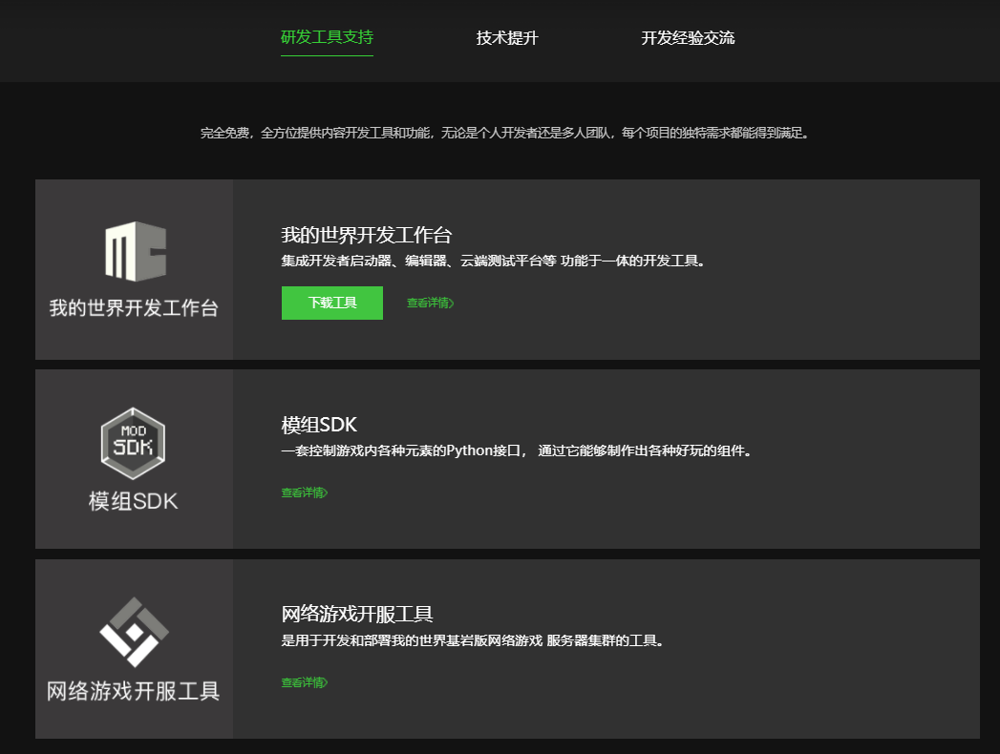

2. 点击【下载工具】，下载并安装软件，安装完成后，就可以进入下一步了。
   

## 二、局域网联机测试的两种情况和步骤：
        注：文中的 "A"，"B"仅为便于理解所加。
    A. 单个开发者在单台设备进行联机测试
        1. 运行当前编辑器正在开发的Mod，此时会启动一个【Mod PC开发包A】
        2. 在编辑器中启动一个新的【Mod PC开发包B】
        3. 在【Mod PC开发包B】的【好友界面】找到并加入步骤1中启动的【Mod PC开发包A】
        4. 进行多人联机测试

    B. 多个开发者多台设备进行多人联机测试   
        1. 开发者A运行当前编辑器正在开发的Mod，此时会启动一个【ModPC开发包A】
        2. 同一局域网内的开发者B在编辑器中启动一个新的【Mod PC开发包B】
        3. 开发者B在【Mod PC开发包B】的【好友界面】找到并加入开发者A启动的【Mod PC开发包A】
        4. 开发者A和开发者B进行多人联机测试

上述两种步骤的本质都是：

    1. 在编辑器中点击运行，启动【Mod PC开发包A】（与单机测试相同）
    2. 根据不同情况选择在自己电脑或另一位开发者的电脑上启动一个新的【Mod PC开发包B】
    3. 通过局域网的好友联机功能进行多人测试
## 三、在编辑器中运行当前Mod
首先我们在编辑器中点击右上角的运行，启动Mod PC开发包A对我们的Addon或玩法地图进行测试，这一步骤与本地单机测试一样，只需要点击运行，等待Mod PC开发包启动并自动进入游戏即可：
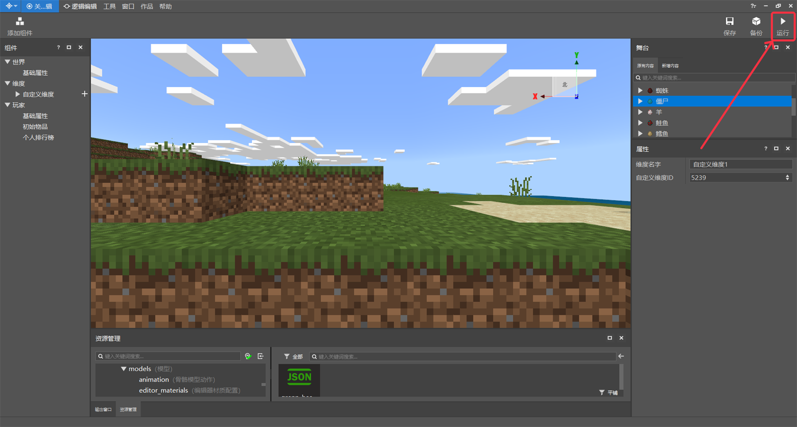

## 四、启动新的 Mod PC 开发包
    注：根据步骤二中的不同情况选择在自己电脑或另一位开发者的电脑上进行本步骤操作
1. 打开【MC Studio主界面】，进入【作品库】，能看到右上角有个【工具箱】按钮：

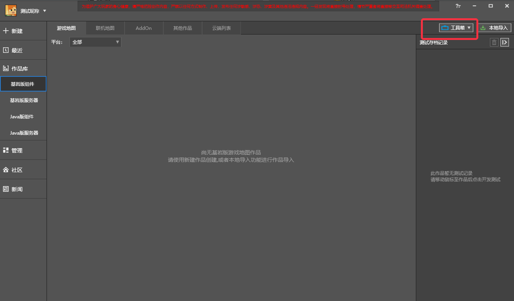

2. 点击【工具箱】，选择【Mod PC开发包】，点击启动 MC 游戏：

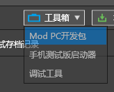

3. 此时会弹出版本选择窗口，点击最新的稳定版即可：

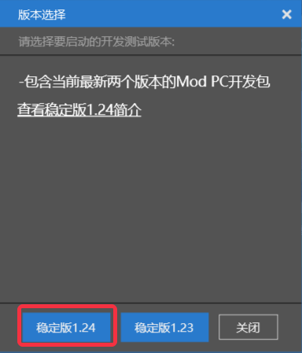

等待加载一段时间后，你最终会看到游戏的主界面：

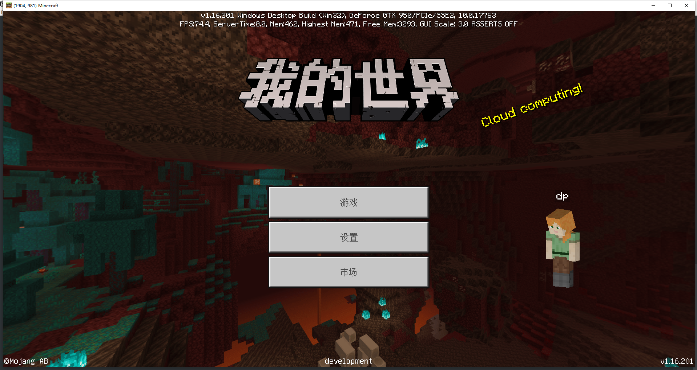

## 五、找到并进入其他人的局域网世界

1. 在主界面，点击【游戏】：

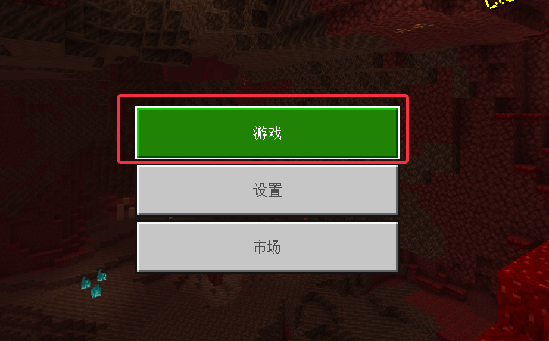

2. 在顶部的分页中，找到【好友】，点击打开：

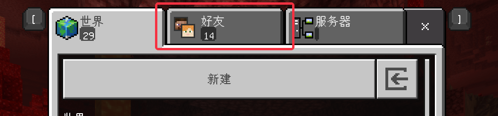

3. 在好友界面中，你能看到同一局域网下其他人的游戏，在其中找到要测试的地图名，点击进入游戏：

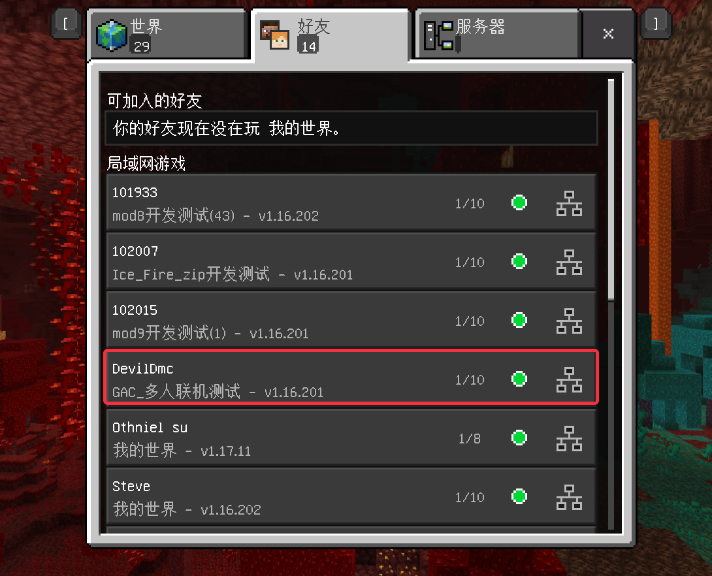

4. 如果弹窗询问是否下载行为包和资源包，是因为房主所在的游戏加载了额外的资源，点击【下载并加入】

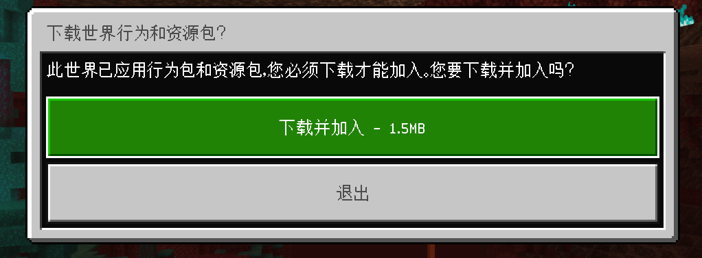

5. 加载一段时间进入游戏后，在 Esc 打开的菜单中，你应该可以看到游戏内的自己和其他玩家，此时便可以开始进行多人联机测试了

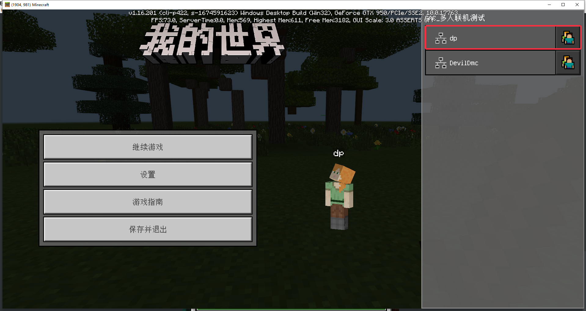

## 六、修改测试选项
在启动器设置可以修改部分ModPC开发包测试时的选项，如下图

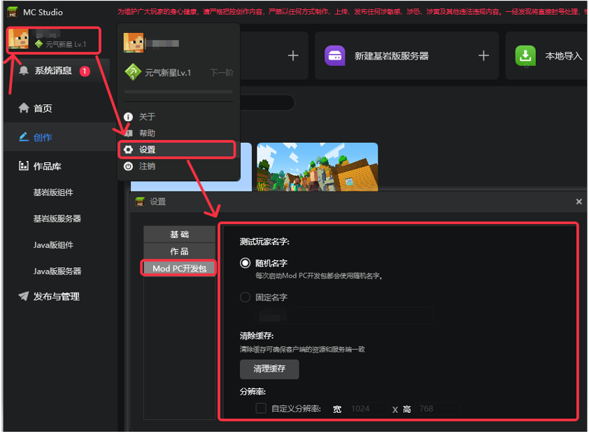

1. 测试玩家名称：即修改开发包测试时玩家的名称，如图
 
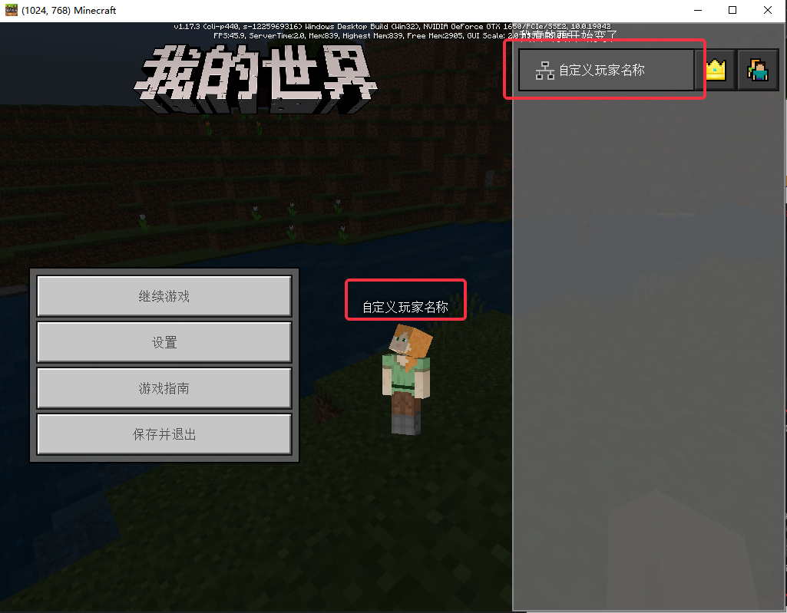

> 这里的设置暂时只对通过工具箱打开的ModPC开发包生效，开发测试和编辑器内的运行测试暂不生效
2. 清除缓存：即清除开发包的缓存，使得开发包客户端与服务端一致

3. 自定义分辨率：即修改开发包启动时的分辨率，在多分辨率适配时，可通过此处设置固定分辨率进行测试，如图

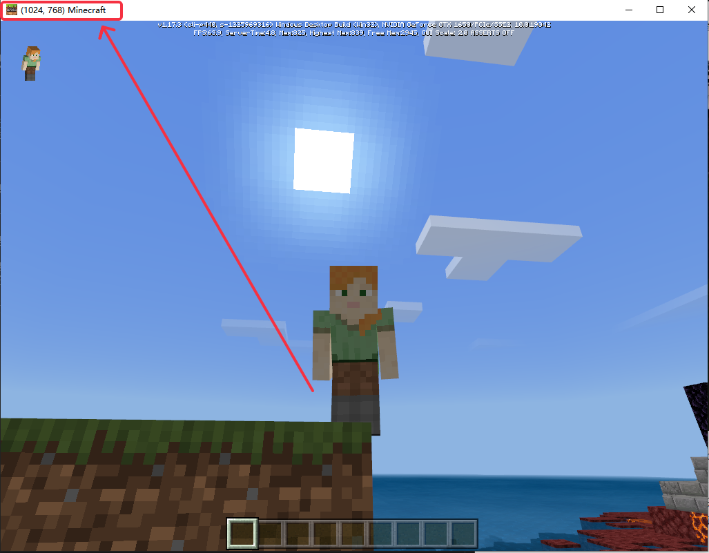