# Mod PC开发包介绍
ModPC开发包是开发者在使用我的世界工作台(MCStudio)进行模组开发测试过程中非常重要和常用的一个功能，下面对其进行简单的介绍。
## 一、什么是Mod PC开发包
Mod PC开发包本质上是一种特殊类型的MC游戏客户端，而MC游戏客户端主要负责加载MC的游戏存档，基于存档来构建专属于这个存档的游戏世界。普通版本的MC游戏客户端是玩家进入游戏的窗口，而Mod PC开发包的主要使用人群是模组的开发者们。

我们都知道开发模组实际上是修改游戏的存档和脚本逻辑，当我们写完一个玩法或功能时，需要将模组存档用游戏客户端运行起来，进入游戏世界来验证自己的功能是否生效，而Mod PC开发包就是负责加载开发者们模组存档的应用程序。举个例子，当我们在编辑器中点击运行进行测试时，实际上就是使用ModPC开发包打开我们的当前编辑的模组存档，如下图所示。

## 二、开发者菜单
ModPC右上角有一个开发者菜单，该菜单内置了一键热更、重载存档、新建存档测试和呼出调试日志窗口等开发者测试时最常用的功能，帮助开发者提升测试效率，如下图所示。

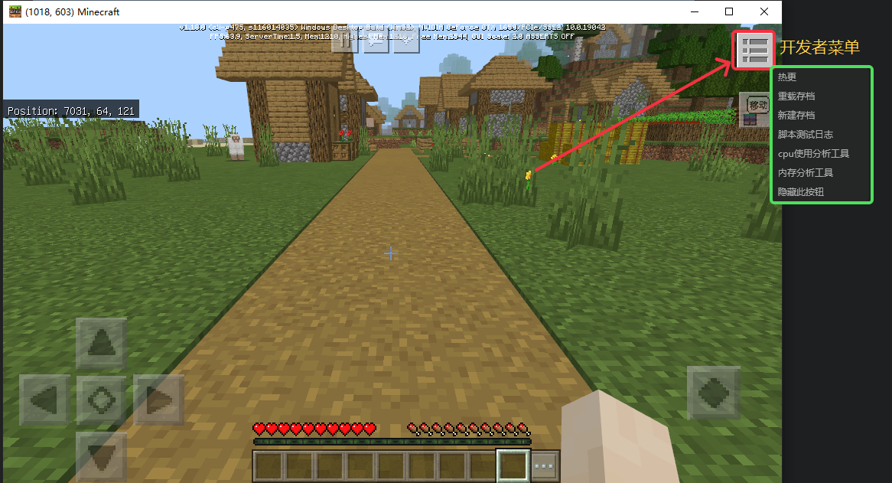

1. **热更**：修改零件代码并保存后，ModPC开发包会自动重载零件代码，此热更功能是在自动热更不生效时使用,热更成功的标志可以参考调试日志窗口中的重载日志，如下图所示：

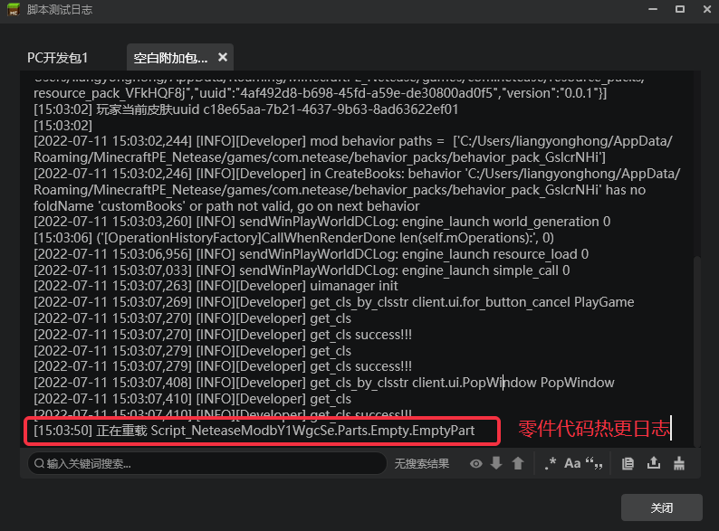

2. **重载**：关闭存档并重新加载，需要多次重复测试同一个存档时使用，该操作等同于在ModPC开发包如下操作：esc调出菜单→点击退出→点击确定→等待退出→点击游戏→选择刚才关闭的存档→等待加载，进入存档进行测试。

3. **新建存档**：关闭当前存档，新建另一个存档进行测试，在需要新开一个存档时使用，该操作等同于，关闭ModPC开发包，后台创建一份新存档并勾选导入当前编辑的组件，ModPC开发包加载该存档进行测试。

4. **脚本日志测试、CPU使用分析工具和内存分析工具**：用于开启对应的功能窗口，等同于我的世界开发工作台中的工具箱中的同名功能，如下图所示

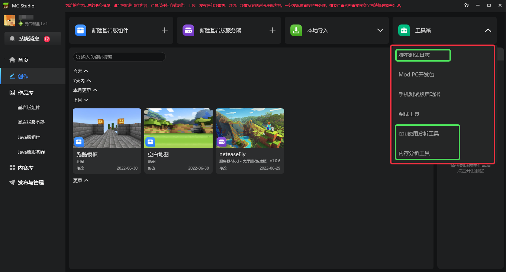

5. **隐藏此按钮**：关闭开发者菜单按钮，如需再次开启需在我的世界开发工作台的设置菜单中开启，如下图所示

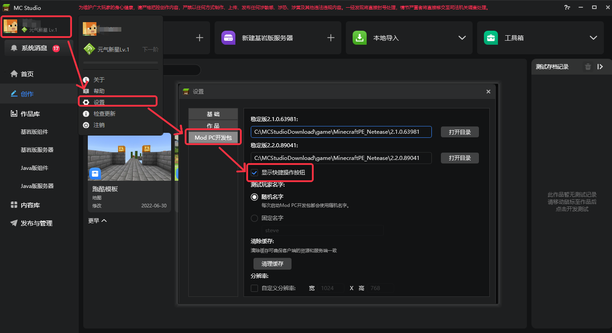

## 三、Mod PC开发包的其他特色功能

为了提升开发者进行模组开发和测试效率，ModPC开发包内置了许多调试相关的功能

如下图，在ModPC开发包打开设置菜单，我们可以发现新增了"调试"和 "飞行调试"两个选项（如下图中1所示)，在这两个菜单中，内置了丰富的调试相关选项，下面着重介绍三个与调试关联较大的部分：

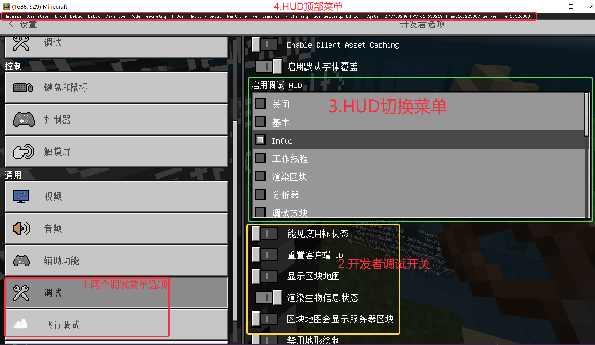

### 1.开发者选项

如上图中2所示，调试菜单中有用数十个调试相关的开发者选项，运用这些选项，能够帮助玩家更直观的了解游戏运行的信息，从而更好的对自己开发的功能进行调试。如下图，我们打开显示区块地图、边界和打开生物信息的选项，就能在游戏中看到对应的信息，帮助我们判断对应的游戏状态。

### 2. 调试HUD

调试HUD是指将一些调试相关的信息直接显示在ModPC开发包最上层，能让开发者直观了解游戏的实时运行信息。根据显示内容，调试HUD分成了多个界面，其开关和切换的方式有两种

    a.开发者选项中HUD切换菜单，通过下拉菜单切换到不同的HUD，查看对应的游戏信息，如下图所示，选择渲染区块菜单，HUD中便会显示与渲染区块相关的信息。

 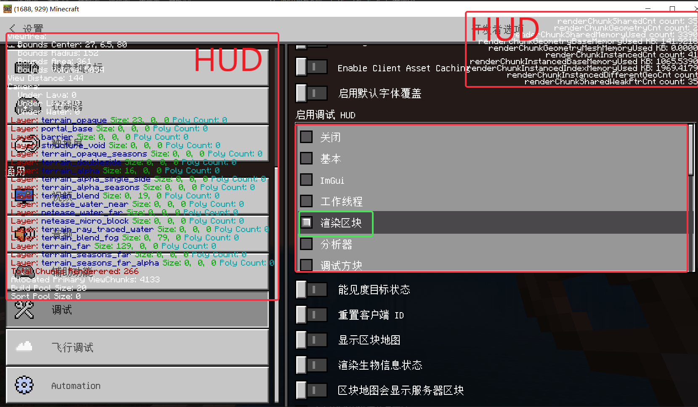

    b.在ModPC开发包中使用按键F3和F4进行HUD的切换，效果与a一致。
### 3. 顶部菜单栏
通过上一步的两种切换方式，切换到顶部菜单栏，这里集成了多种游戏内资源/信息的查看和调整功能，如网易版的后处理效果，动画混合树，方块信息查看等等，接下来简要介绍几个与开发调试相关性较强的功能。
>注意：顶部菜单栏的功能是为了让开发者了解到游戏世界运行背后的信息，并对部分游戏功能进行调试，不当的修改操作可能会导致存档损坏，开发者需要谨慎进行修改操作，并视情况做好存档的备份工作。

1.  PostProcess(后处理效果):如下图所示打开后处理功能，在这里可以进行几种后处理效果的调试，当前有5种效果已经支持用API调用(图中绿色框内)，可参考<a href="../../mcdocs/1-ModAPI/接口/后处理/索引.html" rel="noopenner"> 后处理接口 </a>

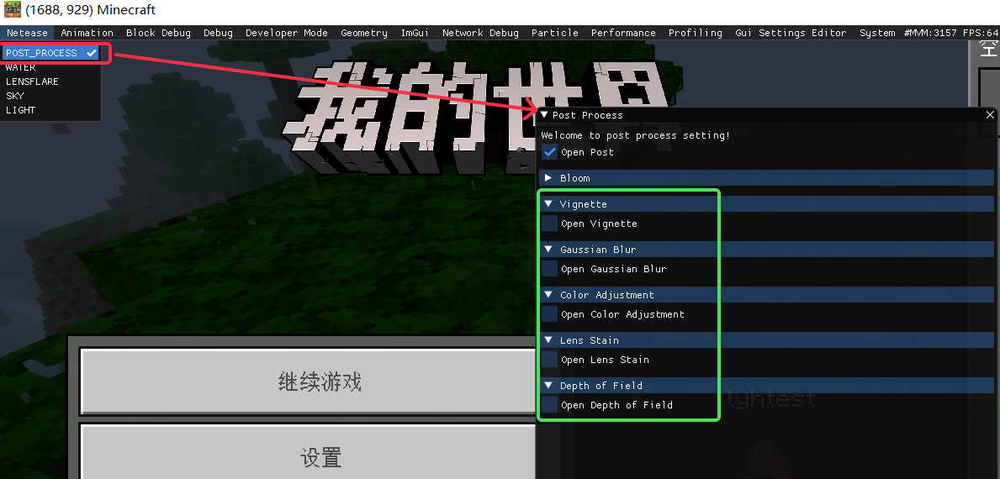

2.  Animation(动画编辑器)：如下图所示打开动画编辑器，在这里可以查看和修改玩家的动画混合树(修改会生效存盘，请谨慎修改原版动画)

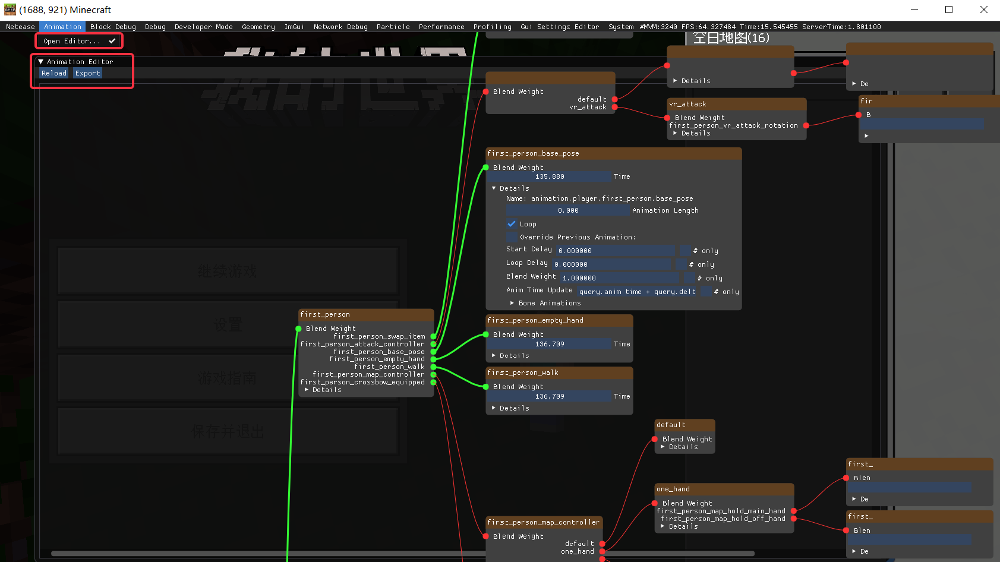

3. Block Debug(方块调试)：如下图所示打开方块调试功能，在这里能个显示当前玩家准心所对准的方块信息，方便开发者了解方块的状态。

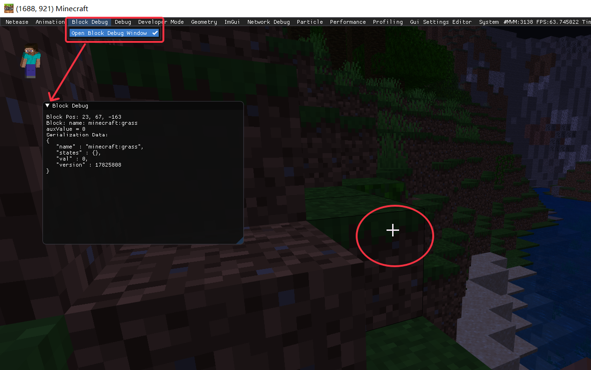

4. Debug Control(调试控制)：如下图所示打开调试控制窗口，在这里你可以自定义一些指令，并把它创建为按钮触发，这样能让开发者快速多次地执行常用的指令，如创建一个围栏用于测试，传送玩家到固定点等等

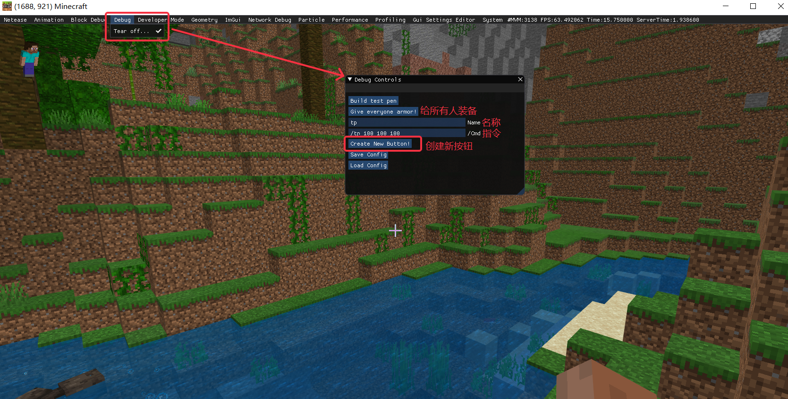 

5. Level Debug(世界调试)：如下图打开世界调试窗口，在这里可以查看当前世界和区块的一些信息，也可以点击重载世界按钮重新加载存档。

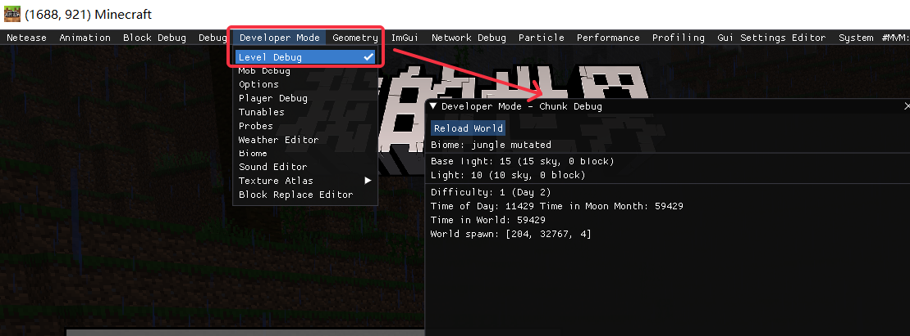 

6. Mob Debug(生物调试)：如下图所示打开生物调试窗口，在这里你可以使用`Ctrl`加上`鼠标右键`选中一个生物，并查看它的信息

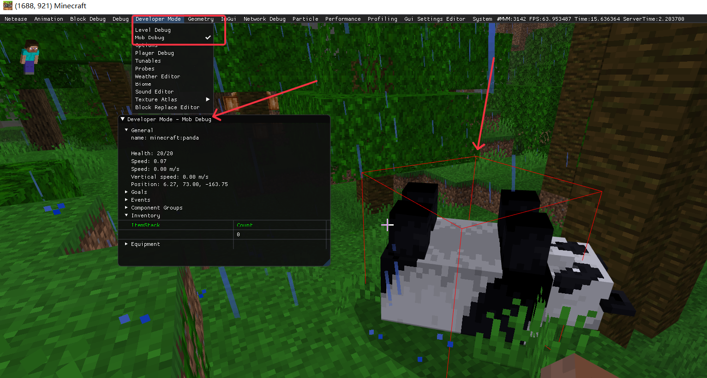 

7. Options(选项)：如下图所示打开选项窗口，这里你可以查看和编辑游戏的所有选项设置

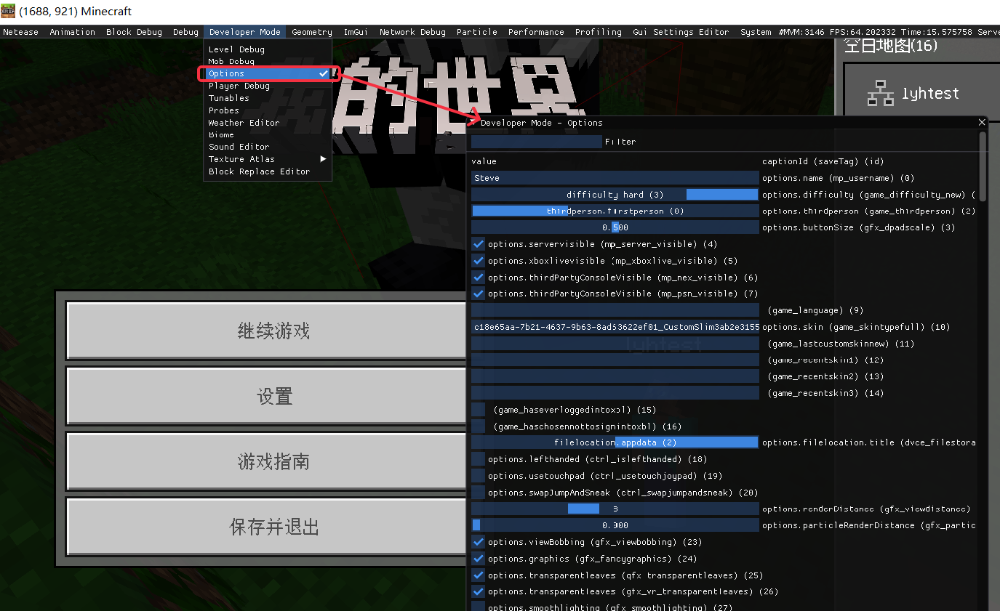 

8. Player Debug(玩家调试)：如下图打开玩家调试窗口，在这里你可以查看与玩家相关的信息

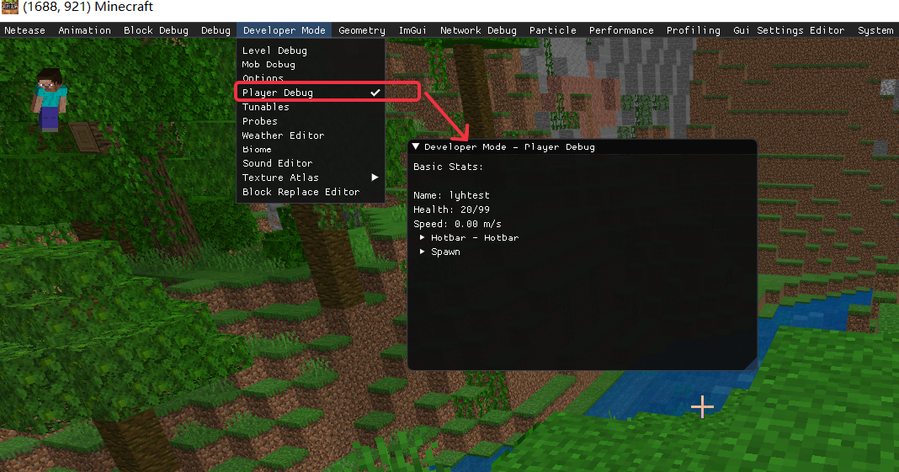 

9. Weather Editor(天气编辑器)：如下图所示打开天气编辑器效果，在这里你可以查看和编辑天气相关的属性

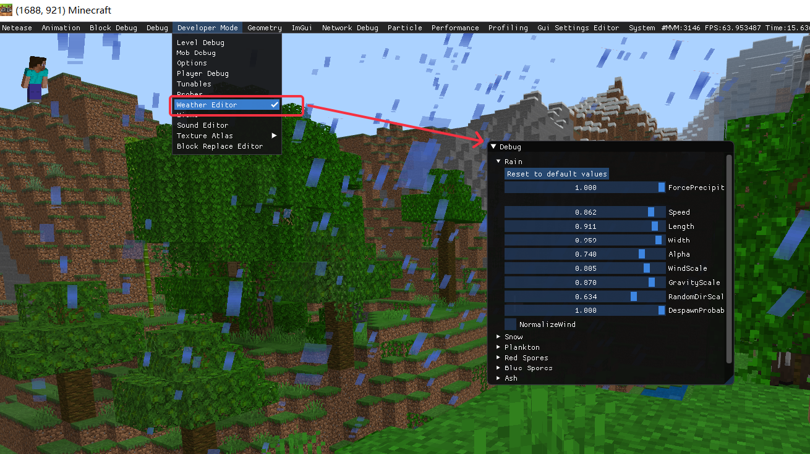 

10. Sound Editor(音效编辑器):如下图所示打开音效编辑器，在这里你可以查看和试听游戏内的音效

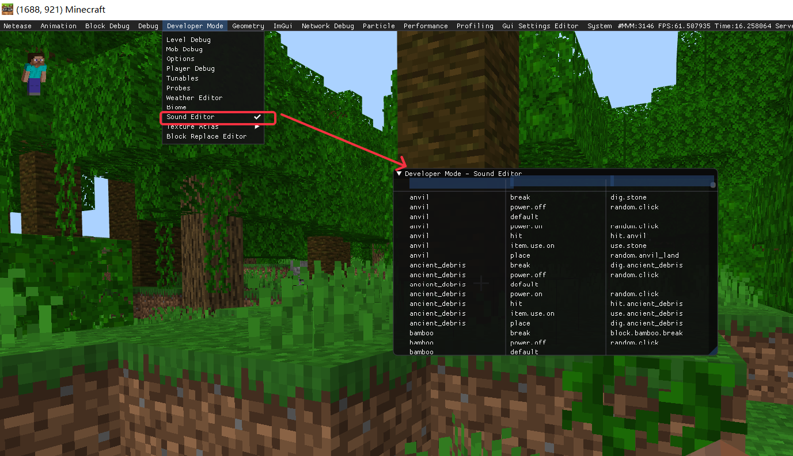 

11. Geometry Editor(网格编辑器):如下图所示打开网格编辑器，在这里你可以查看和编辑游戏所有模型的网格信息(修改会存盘，需谨慎)

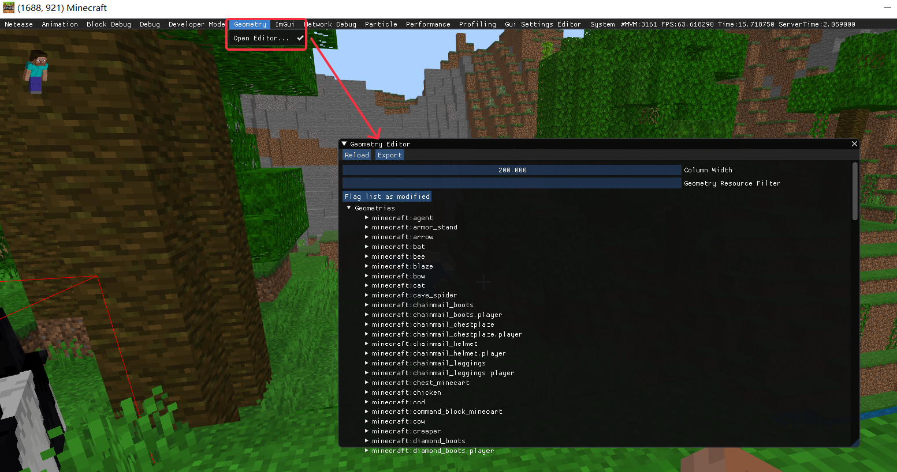 

12. Track(性能跟踪)：如下图所示分别打开性能跟踪窗口，在这里你能查看游戏运行时的内存占用和各类线程触发情况。

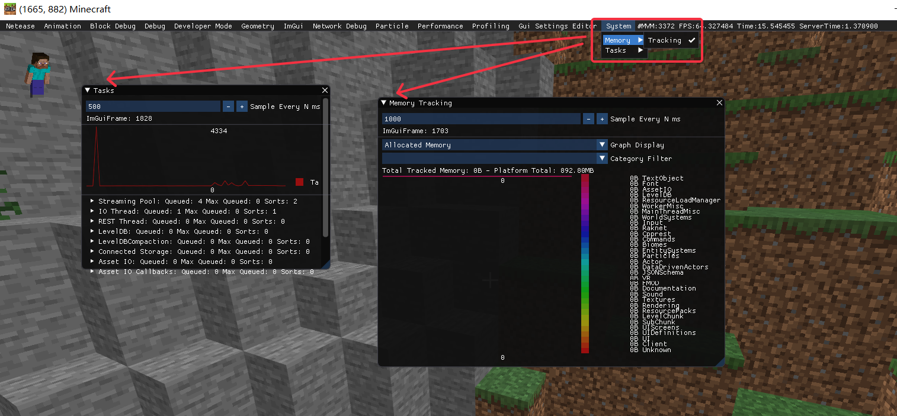 

>注：其他未提及内容开发者可自行体验，后续会对部分内容进行调整。
## 四、什么时候需要用到Mod PC开发包
   了解了Mod PC开发包的特色功能，那么什么时候会用到它呢？下面列出了Mod PC开发包的几大使用场景。

### 1. 内嵌编辑器
当我们用编辑器打开一个存档时，后台会启动一个内置的Mod PC开发包，以支持我们在编辑器进行地形编辑，资源放置等功能。
>注：内嵌编辑器的ModPC开发包只开启了部分功能，如游戏地形区块的加载和卸载，我们在地形编辑器所操作的地形就依赖这个功能。

 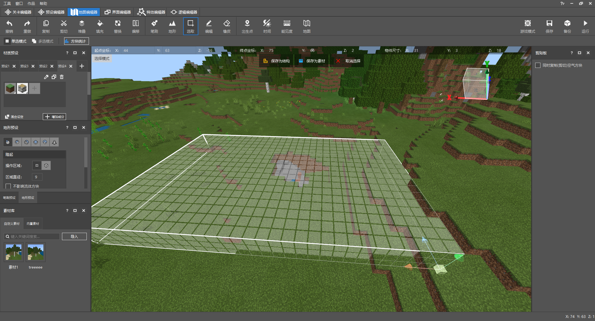 

### 2. 编辑器内运行测试
当我们在编辑器的右上角点击运行时，实质上就是打开一个新的ModPC开发包来加载模组存档（不同于编辑器内置的ModPC开发包），让开发者进行测试，如下图所示。

### 3. 启动器中进行开发测试
在启动器界面，当我们把鼠标悬浮在一个模组作品上时，会出现`开发测试`的按钮，点击开发测试的本质实际上也是用ModPC开发包打开模组存档，但开发测试可以在加载之前调整一些游戏的设置选项，如下图所示

 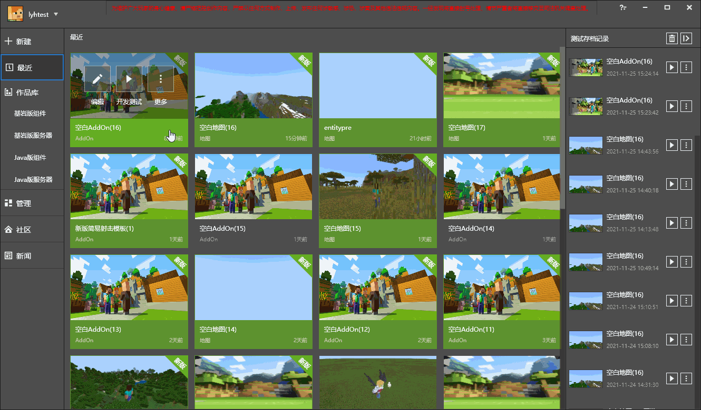 

### 4. 工具箱打开Mod PC开发包（多人联机测试）
就像[ModPC开发包多人测试](./0-ModPC开发包多人测试.md)的教程中所说的那样，当我们需要在一台电脑开多个ModPC开发包时，可以通过工具箱中找到对应的选项单独打开未加载存档的ModPC开发包

 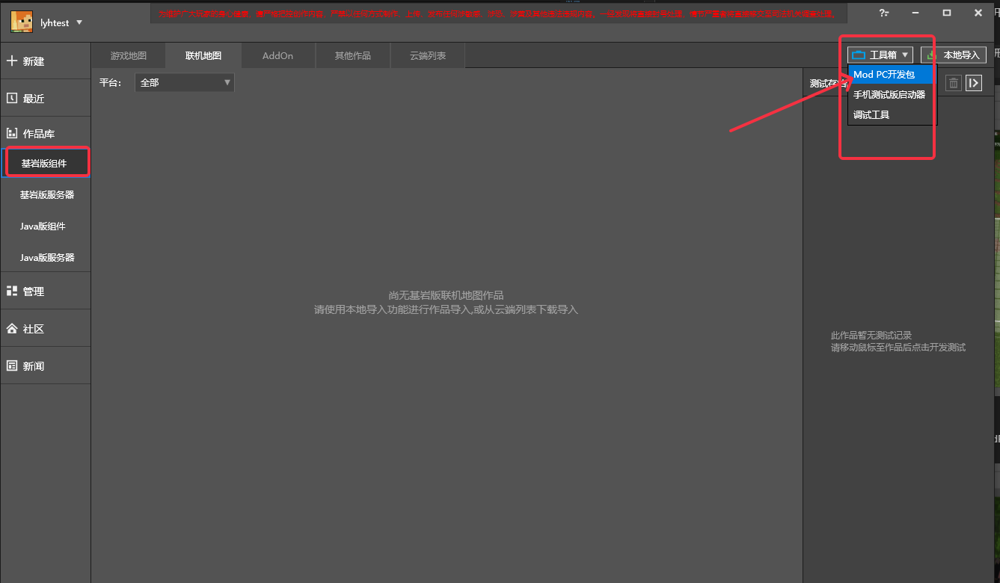 

## 四、注意事项
>当我们将云端列表中的作品下载到本地时，选中作品有一个`上线测试`的功能，这里的`上线测试并不是用ModPC包打开存档`，恰恰相反，为了让开发者在上线前对自己的作品进行更接近实际应用场景的测试，上线测试功能使用了官方正式版客户端进行模拟测试，让开发者能够了解模组真正上线后的运行情况。