---
front: 	https://nie.res.netease.com/r/pic/20220926/9ef0cb38-6193-48b9-aa7e-d0aef0bda97c.png
hard: 入门
time: 20分钟
selection: true
---

# 使用调试工具进行手机和电脑端调试


## 调试工具简介

调试工具是一款强大的测试辅助工具，经过本次升级，它现在的主要功能有：

1. [多端日志查看](#多端日志查看)：在电脑上查看本机和其他设备上测试游戏的日志，包括手机测试客户端和其他PC开发包的测试日志。
2. [指令调试](#指令调试)：对正在进行中的游戏测试进程直接使用python代码进行调试，并且提供代码补全功能。
3. [组件管理与同步](#组件管理与同步)：自测阶段在PC端修改组件文件，直接同步到手机测试端，省去漫长的机审等待时间。

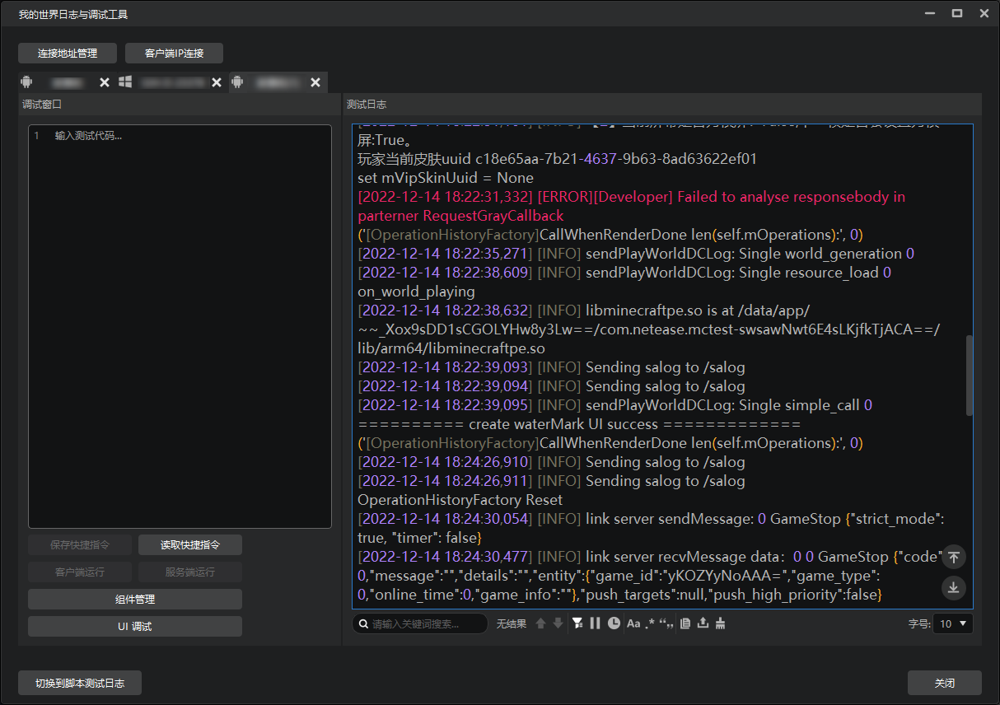

## 启动方式

由于现在调试工具已经正式取代了脚本测试日志，现在在PC端进行开发测试时将自动拉起调试工具。

此外，如果是使用调试工具进行手机测试端调试，我们可以从【作品库】中的【基岩版组件】或【基岩版服务器】分页，点击【工具箱】按钮，选择【调试工具】启动。

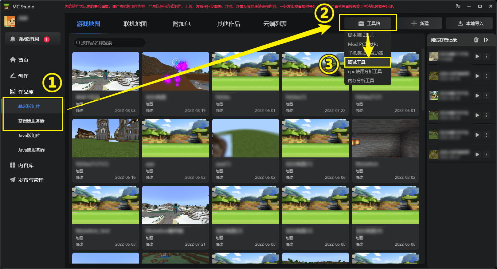

> 如果你仍希望继续使用旧版脚本测试日志，可以点击左下角的【切换到脚本测试日志】按钮。同样，在脚本测试日志窗口也可以切换使用调试工具。

## 界面介绍

调试工具的界面共分为以下几个部分:
1. **连接选项**：将客户端与调试工具连接起来，并且可以管理连接设备。
2. **日志分页**：用于在不同日志分页之间进行切换。分页页签上会显示测试平台类型icon和账号。
3. **日志窗口**：查看PC开发包、手机测试服的进程日志，支持搜索、筛选等；
4. **调试窗口**：汇集多个重要调试功能于一体，主要包括：
   ① 输入python调试代码在客户端/服务端运行；
   ② 查看指令历史记录，同时还能将指令保存为快捷指令便于后续重复使用；
   ③ 上传文件/文件夹至手机测试服组件目录，或从客户端下载文件；
   ④ 将PC端对组件源文件的修改直接同步至手机测试服。

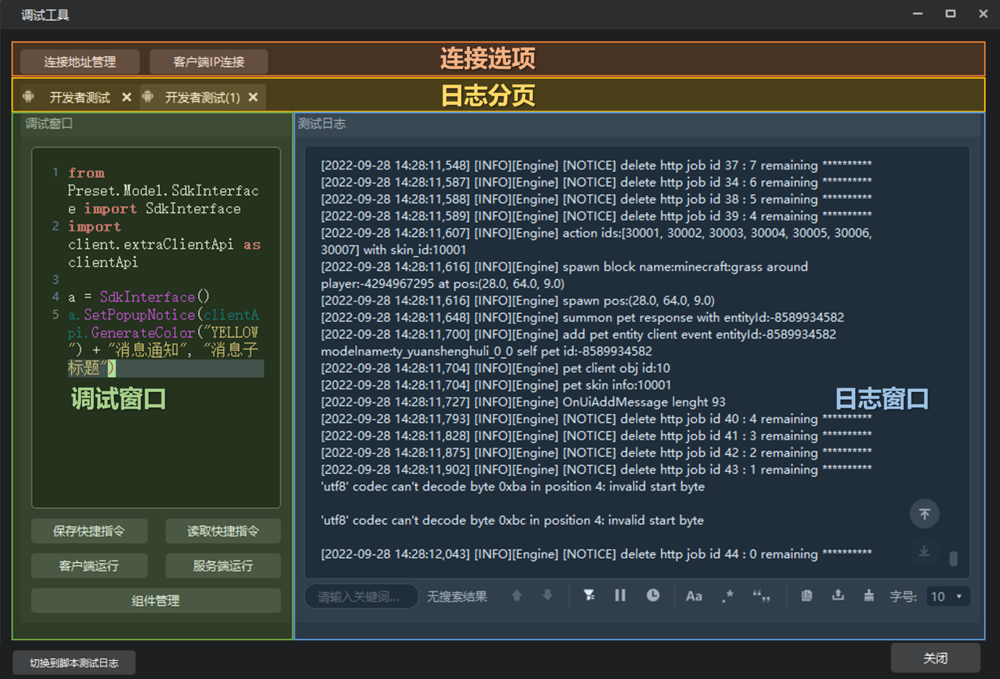


## 连接客户端

如果是在电脑端测试作品，调试工具将被自动拉起并连接到现在正在测试的作品。

**对于连接手机测试客户端的情况：** 打开调试工具后，我们会看到如下界面。由于尚未连接测试客户端，我们只能看到两个连接选项按钮，以及“等待客户端连接”的提示信息。

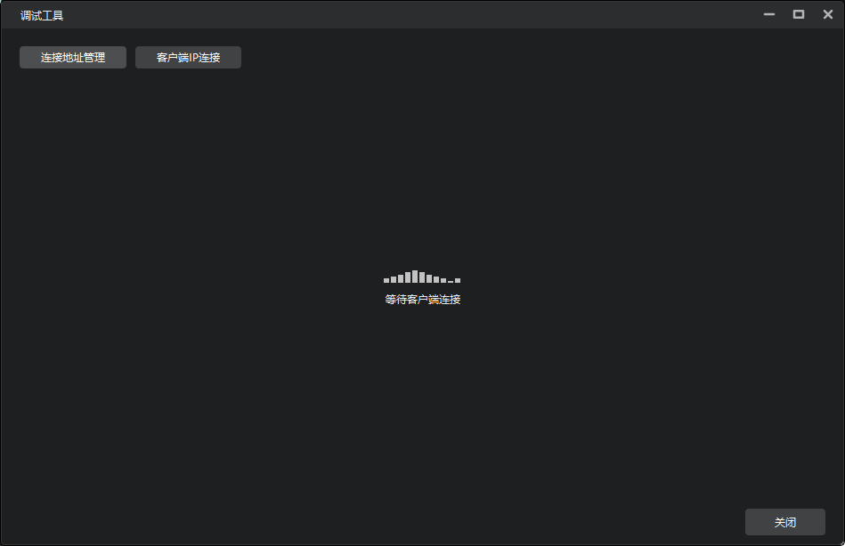

由于我们是第一次打开调试工具，所以需要**手动**进行客户端的连接。

调试工具支持的客户端类型包括：
1. 安卓手机测试客户端
2. iOS手机测试客户端
3. ModPC开发包

> 其中，手机测试客户端可以从[开发者平台](https://mcdev.webapp.163.com/#/square)首页顶部①位置点击下载，登录自己的开发者账号后即可在手机上进行组件自测。
>

我们**首先启动上述的客户端**，然后回到调试工具。我们有两种方式将测试客户端与我们电脑上的调试工具相连。

### 1.通过“客户端IP连接”按钮直接添加客户端

当我们需要快速添加设备时，可以点击【客户端IP连接】按钮，输入测试客户端的IP地址，然后点击【确定】，即可发现调试工具连接上了客户端，日志开始打印。


### 2.通过“连接地址管理”管理客户端连接

【连接地址管理】给开发者提供了添加、浏览、移除当前调试工具允许连接的测试客户端的功能。

当我们需要添加新的客户端时，首先点击【连接地址管理】按钮，然后点击【+】新增一个连接设备，输入我们要连接的测试客户端的IP地址，最后点击【确定】即可。

再次点击【连接地址管理】按钮我们可发现，接受的连接地址列表中出现了我们刚刚添加的设备。列表中会显示出我们连接设备的IP地址、设备登录的玩家昵称、设备的登录平台（安卓、windows等）。


此外，为了便于区分不同的连接过的客户端，开发者可以在对应客户端的【自定义别名】列，对其添加更多描述信息。如果这里添加了别名，那么当该客户端连接了调试工具后，分页标签会显示这个别名。

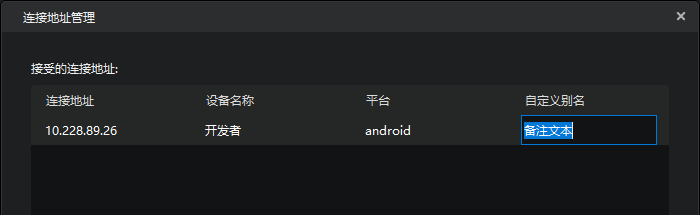
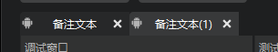

> **注：IP地址查询方式**
> - 对于 Windows 平台，可以打开**网络和Internet 选项**，选择当前的**以太网**，在属性里就可以看到 IPv4 地址。或者按住 win+R 输入 `cmd`，打开命令行，输入 `ipconfig`，可查看当前的 IPv4 地址
> - 对于 Android 平台，点击 wifi 按钮，进入查看当前 wifi 的详情页，即可看到当前 wifi 的 IP 地址

**客户端的连接遵守如下规则：**

1. 当客户端从未连接过任何调试工具时，需要调试工具主动连接，连接方法参考上文。

2. 当客户端成功连接过调试工具时，会自动向上次连接的调试工具请求连接。

3. 当客户端已经连接到调试工具，其他调试工具无法再主动连接该客户端，需要它与现有的调试工具断连后才能继续连接。


## 多端日志查看

日志查看是调试工具的基本功能。在本次更新中，我们在旧版基础上丰富了日志窗口的功能，给开发者的日志查看提供更多便利。

除了基本的日志信息显示外，日志窗口还支持一下功能：

### 1.关键词搜索

输入关键词后，会在日志区搜索并高亮关键词，按回车键可跳转至下一个关键词。输入框右侧会显示当前搜索到的关键词数，以及目前定位的是其中第几个。

- 搜索结果通过蓝色底色标出，当前定位的搜索结果通过白色底色标出。
- 输入关键词后，除了按回车键定位到下一条搜索结果外，也可通过右侧的上下箭头跳转到上一条或下一条搜索结果。

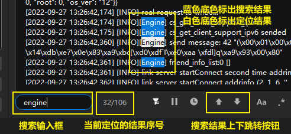

### 2.暂停打印与继续打印

点击【暂停刷日志】按钮，即可暂停日志打印。暂停期间的日志将被缓存，并在右侧显示缓存的日志条数。当开发者点击【重新显示日志】按钮时，即会将暂停期间的日志重新显示在日志窗口中，而不会丢失。


### 3.日志数量上限与过往日志

调试工具的日志显示数量是有上限的。开发者在日志区右键，可调整日志消息数量上限。

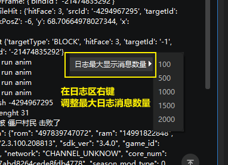

例如我们调整数量上限为1000，那么当日志消息数超过1000以后，调试工具将只会显示最新的1000条日志消息。如果开发者有查看过往日志的需求，可以点击【显示过往日志】按钮，它将自动帮你打开过往日志存放的文件夹，找到对应的txt文件即可浏览之前的日志消息。

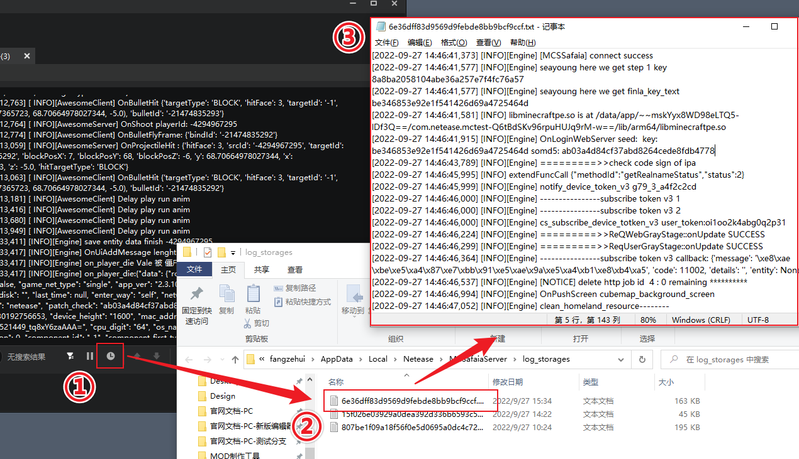

### 4.日志搜索条件选项

搜索条件选项部分，我们提供了大小写匹配、全字匹配、正则匹配三种选项供开发者使用。

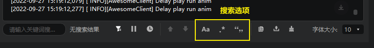

### 5.日志按标签过滤

点击标签过滤器按钮，会显示当前可用的标签筛选项。过滤器会有默认的四个标签：
- MCSSafaia
- Developer
- Engine
- INFO


过滤器默认不勾选任何一个标签，代表过滤器未开启，同时按钮显示为灰色。当开发者勾选其中任何一个选项时，则会**仅显示包含该字段的日志**。另外，如果同时勾选了两个或两个以上标签的日志，则会显示**至少包含其中一个标签的日志**。

另外开发者也可以通过在日志中加**自定义标签**。点击【自定义日志标签管理】选项，在上方输入框输入想要被定义为标签的字段，点击【添加】按钮，即可将其添加到日志标签列表中，并默认将其勾选。被添加为自定义标签的字段，将在日志中被显示为亮绿色。


### 6.日志拷贝、复制与清除

日志操作相关的选项一共有3个：
1. **日志拷贝**：拷贝当前日志窗口中的所有日志。因为超过日志显示数量限制被截去的部分不会被拷贝，开发者可以在过往日志文件夹找到。
2. **日志导出**：导出当前日志窗口中的所有日志。因为超过日志显示数量限制被截去的部分不会被导出，开发者可以在过往日志文件夹找到。
3. **清除日志**：清空当前日志窗口中的所有日志。

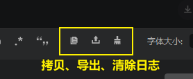

### 7.日志浏览选项

日志窗口右下角可以通过下拉框选择需要显示的字体大小，同时开发者也可以直接按住ctrl后上下滚动鼠标滚轮条件字体大小。

另外还支持一键跳转至当前日志窗口中的第一条日志和最后一条日志，见下图。


> **温馨提示：**
> 对于日志来说，包含 4 个颜色级别，分别为 debug，info，warning，error，在打印日志里使用 [DEBUG]，[INFO]，[WARNING]，[ERROR] 关键字可以显示不同的颜色，对于开发者来说，通过使用这些关键字可以方便的区分开发者日志和原有日志。

### 8.日志窗口与调试窗口的收起与展开

如果你觉得不需要查看日志窗口和调试窗口中的任意一个，可以拖动二者之间的中线至窗口最左或最右侧，收起其中一个窗口。

窗口在收起状态下会在边缘显示一个展开按钮，点击可以展开被收起的窗口。

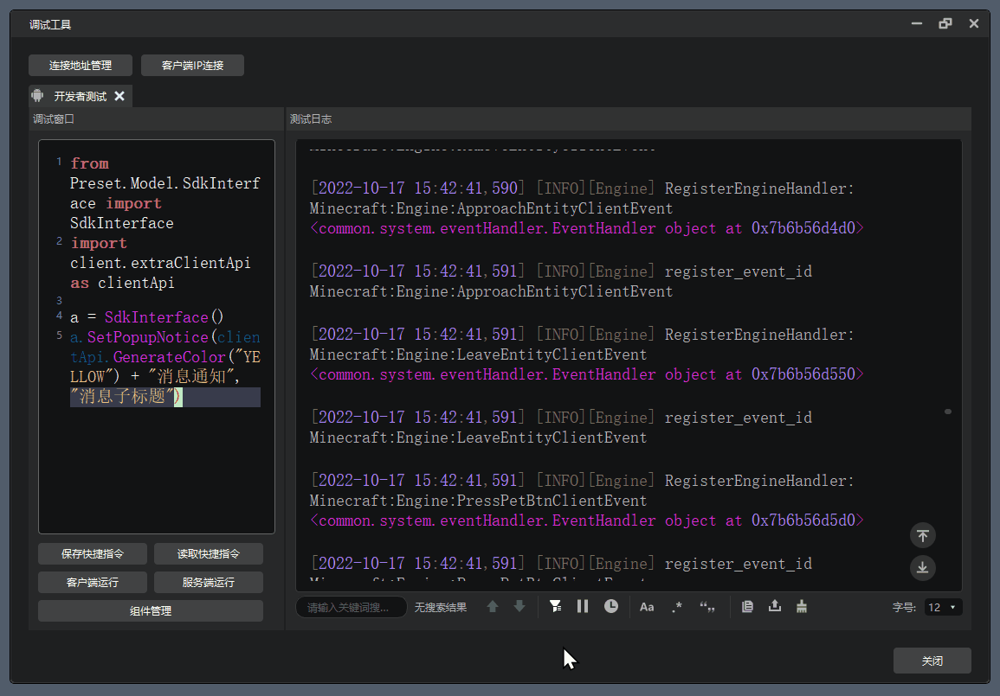

## 报错信息跳转

报错信息跳转功能可以帮助您通过调试工具快速点击报错信息，直接跳转到对应的代码文件，从而迅速定位并修复问题。

::: danger 注意

需要开发测试或编辑器内启动`ModPC`开发包，直接启动`ModPC`开发包或在开发测试过程切换存档会导致跳转失败。

:::

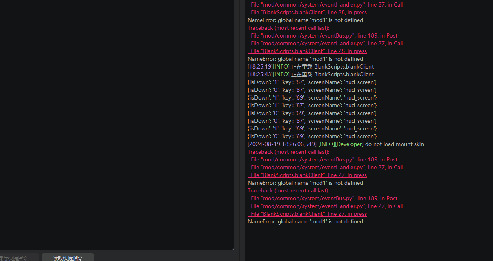

## 指令调试

指令调试是调试工具的另一重要功能，可用于输入游戏脚本层 python 测试代码，例如 import 部分模块用于执行功能，或者打印某些全局变量等。另外开发者还可以使用指令历史记录、读取快捷指令等方式快速复用之前使用过的指令。

> **注意：指令调试功能仅进入游戏后才会生效。**

### 1.输入python代码进行调试

开发者可以在代码输入框中输入python代码，然后根据需要选择【客户端运行】或【服务端运行】。

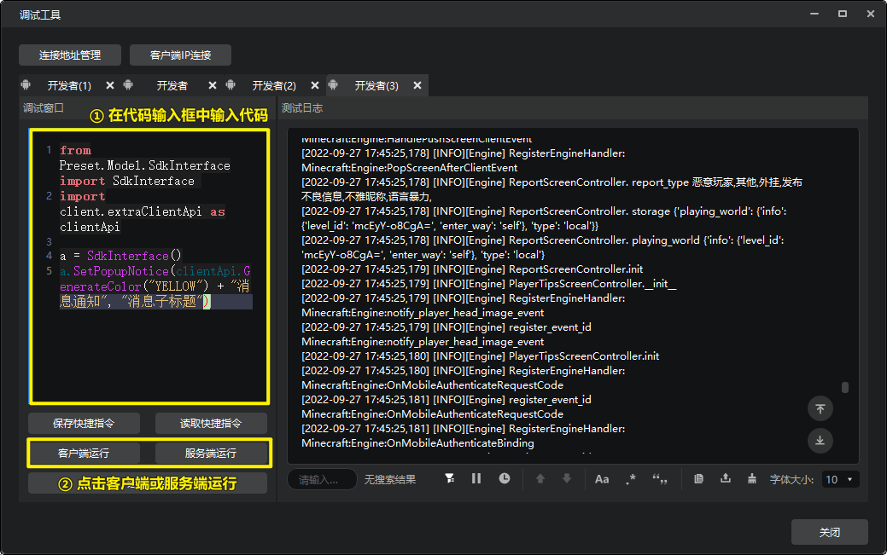

并且，调试工具的代码输入框**支持补全库**。

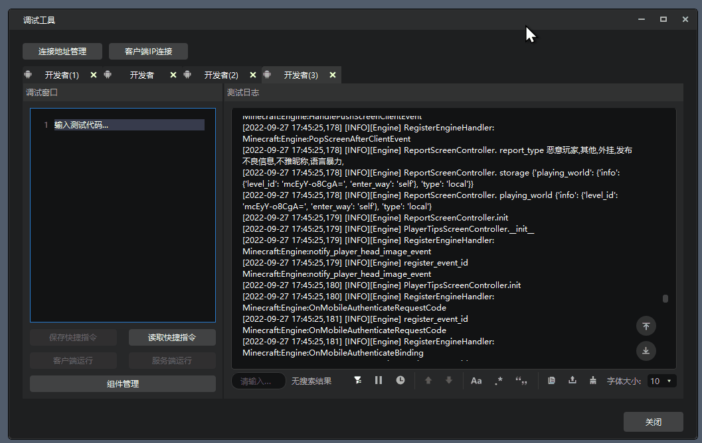

举个例子，当我们手机测试客户端进入游戏后，可以在调试工具的代码输入窗口输入：

```
from Preset.Model.SdkInterface import SdkInterface
import client.extraClientApi as clientApi

a = SdkInterface()
a.SetPopupNotice(clientApi.GenerateColor("YELLOW") + "消息通知", "消息子标题")
```

然后点击【客户端运行】按钮执行代码，即可在手机上看到物品栏上方弹出了提示信息。

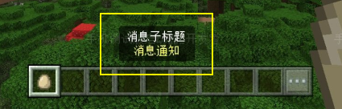

### 2.查看代码调试历史记录

开发者的之前输入**并执行**过的调试代码都会被记录下来。

需要查看、复用历史调试代码时，我们需要点击左侧调试窗口的【读取快捷指令】选项，打开快捷指令窗口。在【历史记录】分页中，我们可以看到之前被执行过的所有代码。

点击每条记录左侧的三角按钮可以展开对应的代码，开发者如有需要也可以直接在这里对历史记录代码进行编辑。

如果需要复用某一条代码，直接点击其右侧的【复制】按钮，即可将该代码完整复制到剪贴板。然后我们回到主界面，在调试窗口的代码区进行粘贴就能再次执行

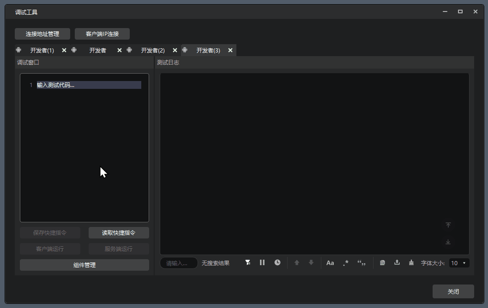

### 3.保存和读取快捷指令

开发者可以将调试窗口代码区里的python代码保存为快捷指令，供后续需要使用的时候快速复用。

点击【读取快捷指令】按钮，在左侧点击【个人指令】分页，即可创建自定义指令的分类。不同的分类可以让开发者按照自己的使用习惯对指令进行归类管理。

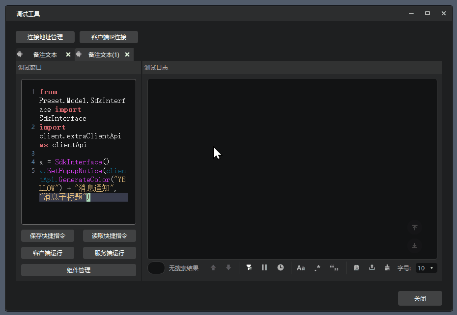

创建好分类后，我们在调试窗口输入框中输入代码，并点击【保存快捷指令】按钮，然后为保存的指令输入一个指令名称（例如这里我们将其命名为“指令1”），并选择这条指令需要保存到哪个分类中（这里我们选择“分类1”）。选择完毕点击保存后，即可在【快捷指令】窗口发现该指令被保存到了分类1下。


在保存快捷指令的时候，如果有需要，也可以直接在指令分类选择框下部直接输入一个新的分类名称，按回车后，即可用该名称创建一个新的分类。点击【确认】后，即可将当前指令保存到这个新的分类下。


与历史记录中一样，我们只需要在【快捷指令】窗口下点击每个指令右侧的【复制】按钮，就可以将指令复制到剪贴板中，然后粘贴到调试窗口的输入框中就可再次运行。

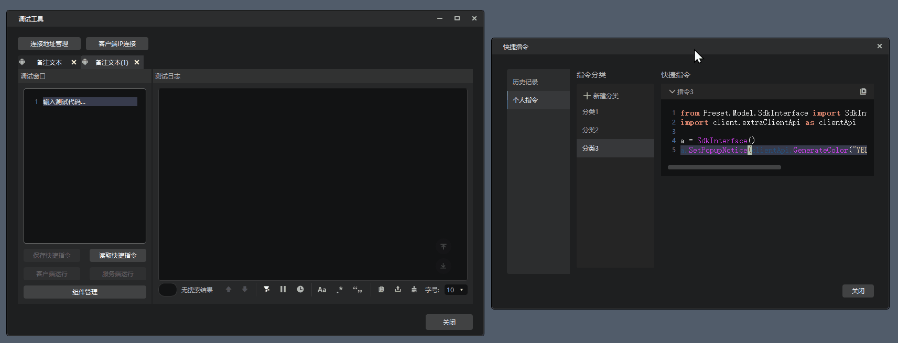

## 组件管理与同步

当我们需要在手机端进行测试时，很可能会遇到需要调整部分代码的情况，但为了修改几行代码，重新走一遍完整的机审流程，会造成很多不必要的时间耗费。这次更新，我们在调试工具上新加入了组件管理与同步功能，尽最大可能帮助开发者减少调试过程中的时间成本。

> **注意！！！**
> 组件同步功能暂时只能同步组件中的`behavior packs`、`resource packs`中的文件，不可用于同步对地图做出的修改。

### 1.组件管理

首先，我们可以点击左侧调试窗口的【组件管理】按钮，打开管理窗口。这里会展示我们测试客户端上装载过的所有组件。

> “装载”指在客户端上下载过的，并非当前测试游戏进程中加载的。

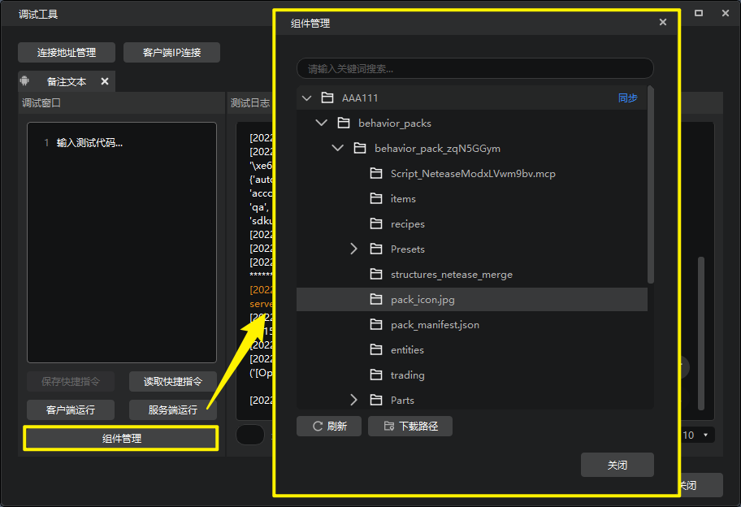

我们可以选择任意组件展开他们的层级，查看内部详细文件结构。右键其中的文件/文件夹，可以进行如下操作：
1. **下载**：下载选中的文件/文件夹到下载路径。下载路径可以点击窗口左下方的【下载路径】按钮打开。
2. **上传文件**：仅对`behavior packs`或`resource packs`的子文件夹有效。点击后可以向测试客户端该文件夹中上传文件。
3. **上传文件夹**：仅对`behavior packs`或`resource packs`的子文件夹有效。点击后可以向测试客户端该文件夹中上传另一个文件夹，作为其子文件夹。
4. **删除**：仅对单独的文件或`behavior packs`或`resource packs`的子文件夹有效。点击可以从客户端删除该文件/文件夹。
5. **重命名**：仅对单独的文件或`behavior packs`或`resource packs`的子文件夹有效。点击可以重命名该文件/文件夹。

### 2.组件同步

如果我们希望将电脑上做出的修改整体同步到测试客户端，可以点击每个组件名称右侧的蓝色【同步】按钮。点击后，我们选择电脑中需要被同步过去的组件的路径，再按需要选择【全量同步】或【差量同步】。等同步进度条读条完毕，即代表选中的组件被同步至客户端了。

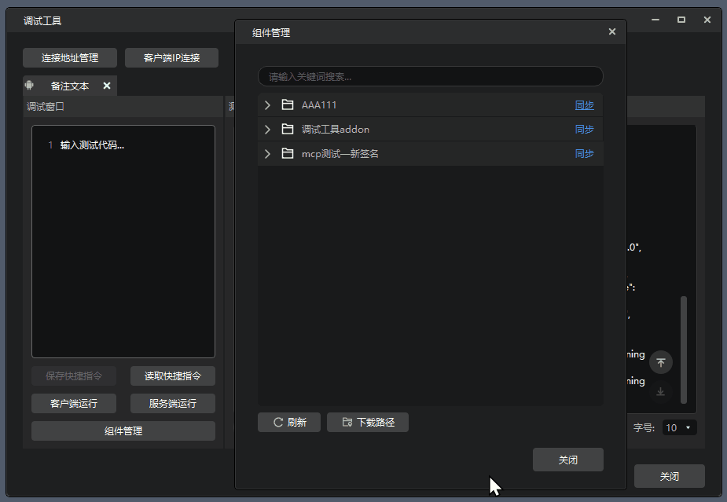

> **2022.12.15版本更新：直接选择Studio作品进行同步**
> 现在在进行组件同步时，新增了通过下拉框直接选择Studio作品库作品进行同步的方式
> 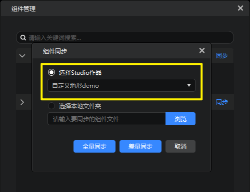


> **全量同步可差量同步的区别：**
> - 全量和差量的区别主要在于对脚本目录（Script）中文件的处理方式。
> - **全量同步**不管脚本目录是否发生变化，都会将脚本文件重新打包并同步
> - **差量同步**会检测脚本目录是否发生变化从而选择性打包脚本目录同步。
> - 其余非script目录的文件都是发生变化才同步。

> **选择同步路径的注意事项：**
> - 需要注意的是，一定要点击选中该路径再点击确定，否则可能会出现文件夹没有正确选中，导致无法同步的问题。
> 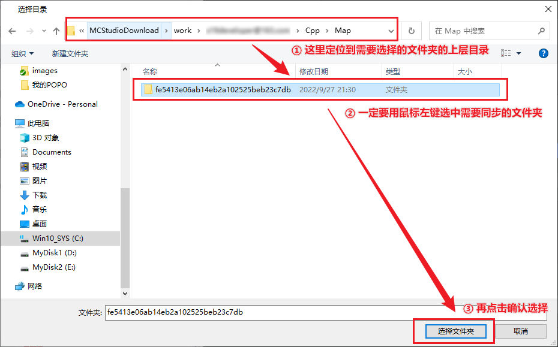
>
> - 如果选择的路径有误，比如：
>   ① 选择的不是一个可识别的作品路径
>   ② 电脑上尝试同步的组件与测试客户端上选择的组件中manifest文件的uuid无法匹配
>   则会弹窗提示修改同步失败，需要开发者选择正确的路径再进行同步。
>   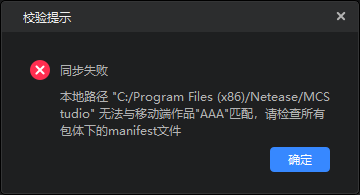

### 3.组件同步示例

例如我们手机测试端原本有一个纯空白地图组件，现在我们打开其PC端的工程文件，在其中添加一个玩家预设，挂接一个蓝图零件，并使用逻辑编辑器编辑其逻辑为：每帧发送消息“AAA”的蓝图零件。

我们保存修改，然后直接使用组件同步功能，将PC端的修改同步至手机测试端。等同步完毕，我们就可以在手机测试端上重新打开该地图组件，并发现成功实现每帧发送消息“AAA”。


## 客户端断开连接

客户端退出、网络异常等因素都会导致与调试工具的连接断开。断开后：
- 日志窗口会保留断连之前的日志记录，开发者依旧可以使用搜索、筛选等功能，只是日志不会继续打印了；
- 左侧调试窗口将不再可用，下方按钮会全部置灰；
- 会有【断开日志连接】消息提示。

   

重启客户端，会再次自动连接至调试工具，并通过另开分页的形式记录新的日志。
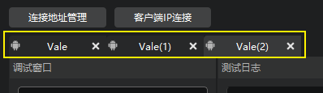

## 更多菜单

调试工具右上角有一个【更多】菜单，包括以下功能：

1. 工具版本号查看
2. 官网教程文档跳链
3. 开发者常见问题汇总
4. 最新版本手机测试包下载链接
5. 清除工具缓存

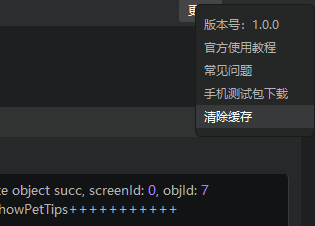