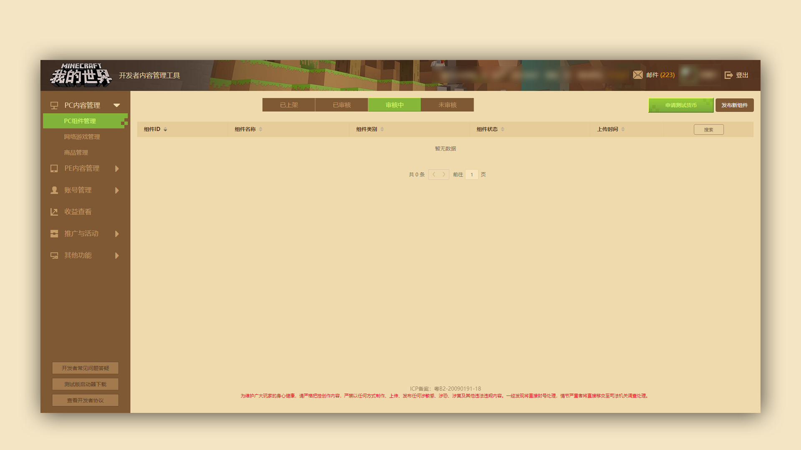
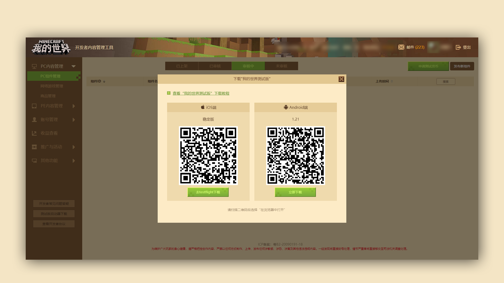

# PE测试版启动器下载简要介绍

***

### 阶段目标：了解并下载PE测试版启动器

#### TAG： PE测试版启动器

#### 第一阶段：找到【测试版启动器】下载位置 

####  第二阶段：下载并使用测试版启动器

 

为了方便开发者们测试自己的PE组件，我们为大家准备了PE测试版启动器，供大家在测试环境查看组件表现。

在开发者平台的左下方，找到【测试版启动器】下载按钮，点击后会弹出PE测试版启动器的下载二维码及按钮，根据自身手机的情况选择不同的二维码下载即可。

#### 具体测试办法（需要成功安装测试版客户端）：

1、 将需要测试的组件，上传至开发者平台并提审，使组件处于“审核中”的状态

2、 打开手机上的测试客户端，使用开发者账号登入游戏

3、 找到提审的组件，下载安装即可进行测试

 

注意：如在提审时将组件设置为付费，可以在测试版中申请钻石进行购买，目前该功能仅限安卓PE版测试用启动器。