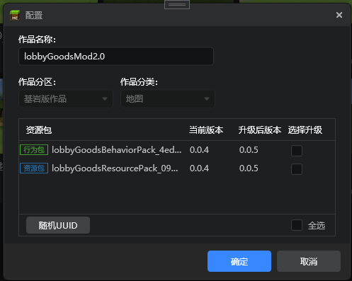
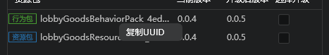
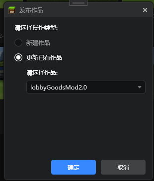
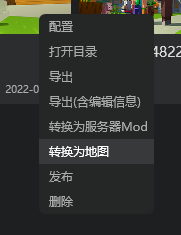

# 组件打包发布

## 组件配置

在组件的右键菜单，选择配置，可以对作品的UUID与版本号进行修改

点击随机UUID，将会自动对所有资源包和行为包的UUID进行随机

选中对应的资源包，右键可以复制其UUID

在开发测试阶段，并不需要关注版本号，而当你的组件需要发布到平台，为了让组件上线后能顺利更新，每次发布前需要提升组件版本号，这里你既可以单独升级个别资源包，也可以全选升级所有资源包。

## 组件发布

当你的组件一切准备就绪，就可以在组件的右键菜单里，点击进行发布。

发布时会自动选中平台已有的同名组件，并自动勾选更新已有作品，因此请尽量保持作品与平台名称一致。

点击确定后，我们会对作品进行自检，然后导出必要的文件，并压缩成<名称_时间.zip>的命名格式，上传到开发者平台，并打开浏览器对应链接，你可以在这个页面进一步编辑器组件的详情，最后点击保存。

##  组件转换

同时我们还提供了组件间的转换功能，你可以在右键菜单里找到它，将AddOn方便的转换为地图或服务器Mod

