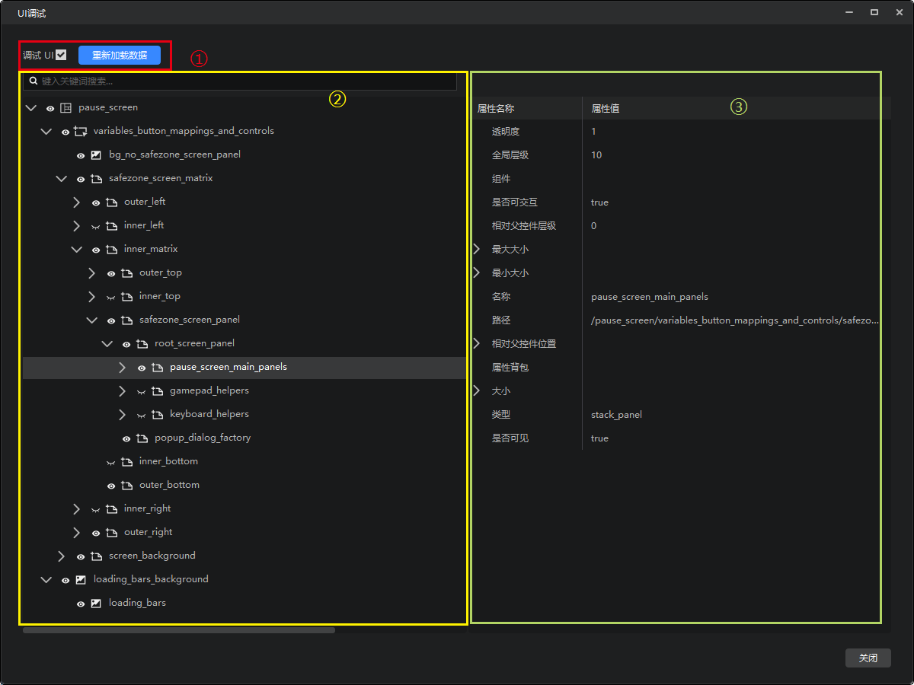

---
front:
hard: 入门
time: 10分钟
selection: true
---

# UI调试工具

## 简介

UI调试工具是调试工具的子工具，主要用于调试游戏运行时的界面，它的主要功能包括：

1. 原生界面支持：支持对《我的世界》原生的界面进行调试，当然也支持调试您的自定义界面。
2. [控件结构树解析](#控件结构树解析)：支持对控件结构进行解析，以树的形式展示，并包含基础信息。
3. [游戏中定位控件](#游戏中定位控件)：支持通过游戏中点击的方式快速定位控件。
4. [控件属性展示](#控件属性展示)：展示选中控件的属性。

除了调试之外，UI调试工具对熟悉和学习原生界面也大有帮助。

## 启动方式

> 目前仅支持电脑端UI调试，我们会在2.5版本支持手机端

首先，我们需要对希望调试的作品进行开发测试，并打开调试工具，参考[使用调试工具进行手机和电脑端调试](./1-使用调试工具进行手机和电脑端调试.md)。

调试工具连接到开发包后，点击调试工具的**UI调试**按钮，在新的窗口中打开UI调试工具。

## 界面介绍

调试工具的界面共分为以下几个部分:
1. **调试操作**：用于开关UI调试功能以及重新加载数据。
2. **控件树展示**：在这里展示游戏当前的界面的控件结构，以及基础信息。
3. **属性面板**：展示控件树中选中的控件的属性值，例如控件当前的路径。

## 开始调试

在游戏中打开希望调试的界面，然后在UI调试工具中勾选“调试UI”，开始调试。

> 建议电脑端调试时，使用触屏模式，更方便在游戏和UI调试工具之间切换。

开始调试之后，游戏的鼠标点击将用于控件选择，而非游戏内的操作。此时按键的反应仍然是可以正常生效的。

如果需要在游戏中切换界面，可以先取消勾选“调试UI”。

游戏中切换界面时，UI调试工具会自动刷新控件结构。如果没有正常刷新，可以手动点击上图中的“重新加载数据”按钮，对控件结构进行刷新。

## 控件结构树解析

下图中的界面表示当前游戏内界面的控件结构。

此界面中展示如下信息：

- 控件的树结构，即父子关系
- 控件名称，例如：pause_screen
- 眼睛符号，表示该控件是否可见。例如：pause_screen当前可见
- 控件的基础类型，以图标的形式展示，图标与界面编辑器中的图标含义相同，例如pause_screen是一个画布。
- 

支持在此界面进行控件搜索，在搜索框内输入控件名称或者部分名称，按回车键可以进行搜索，例如下图。

> 目前不支持模糊搜索，请准确输入包含下划线在内的控件名称或者控件的部分名称

点击眼睛符号可以切换其可见性，如下图。但是控件的可见性可能受多种因素控制，因此在此界面控制可见性不一定会生效

右键控件，可以复制其控件路径，我们目前提供两种复制方法，以下图的loading_bars_background控件为例
- 相对根节点的路径为："loading_bars_background"
- 完整路径为："/pause_screen/loading_bars_background"

## 游戏中定位控件

开启调试工具后，在游戏中点击，可以快速定位当前界面的控件。

开启显示控件轮廓后，可以对UI控件轮廓进行显示，辅助进行UI控件的点选。

不同控件的轮廓颜色和透明度如下表所示：

| 控件类型（英文） | 控件类型（中文） | 控件颜色 | 控件颜色透明度 |
| --- | --- | --- | --- |
| custom | 自定义渲染类型 | 橘色 | 25.00% |
| dropdown | 下拉框 | 橘色 | 25.00% |
| edit_box | 文本编辑框 | 橘色 | 25.00% |
| label | 文本框 | 红色 | 50.00% |
| image | 图片 | 粉红色 | 10.00% |
| scrollbar_box | 滚动块 | 橘色 | 25.00% |
| scroll_track | 滚动条 | 绿色 | 10.00% |
| selection_wheel | 选择滚轮 | 橘色 | 25.00% |
| slider | 滑动条 | 绿色 | 10.00% |
| slider_box | 滑动块 | 橘色 | 25.00% |
| toggle | 开关 | 橘色 | 25.00% |
| button | 按钮 | 绿色 | 10.00% |
| combox | 多选框 | 橘色 | 25.00% |
| rich_text | 富文本 | 橘色 | 25.00% |
| mul_lines | 多行文本 | 橘色 | 25.00% |
| anim_porecess_bar | 动画进度条 | 橘色 | 25.00% |
| grid | 网格 | 蓝色 | 1.50% |
| input_panel | 输入面板 | 蓝色 | 1.50% |
| panel | 面板 | 蓝色 | 1.50% |
| scroll_view | 滚动列表 | 蓝色 | 1.50% |
| stack_panel | 布局面板 | 蓝色 | 1.50% |
| stack_grid | 布局网格 | 蓝色 | 1.50% |
| screen | 画布 | 透明 | 0.00% |

# 控件属性展示

对于选中的控件，在属性面板中会显示他的属性，如下图。目前主要以查看为主，没有修改的功能。可以在属性的值上右键，通过菜单来拷贝某个属性的值。

