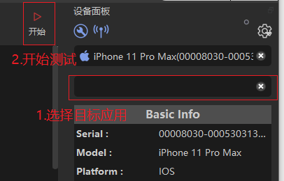
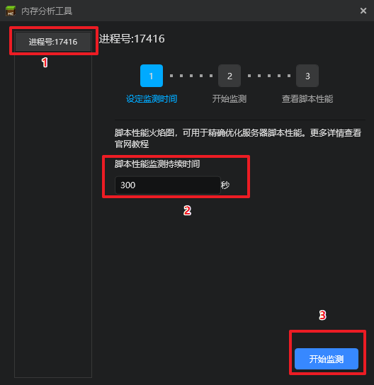

---
front:
hard: 入门
time: 60分钟
selection: true
---

# 性能监测与调试

随着模组内容的不断扩充和发展，开发者们制作的模组体量和复杂度越来越高，所需要的计算机资源越来越大，因此可能导致同一个模组在高性能设备和低性能设备的表现差异较大，开发者也会经常收到来自玩家的反馈，模组卡顿，游戏闪退等情况，为了尽可能保证大部分玩家的正常游戏体验，维护开发者的口碑，我们强烈建议开发者在模组制作后期，使用编辑器的性能工具对模组进行监测和调试，评估模组的性能表现，并寻找可以优化的性能问题。

## 1.方块探针

### 准备工作

首先您需要登陆到您的MCStudio，如果您还没有账号，可以点击[**开发者平台链接**](https://mcdev.webapp.163.com/#/login)进行注册：

### 连接到我的世界

如果想连接到《我的世界》，共有以下两种方式：

方式一：

进入MCStudio，您会到达首页，左侧有一系列页签，点击**基岩版组件①**以切换

选中您的任意项目点击**开发测试②**

选择当前**最新的版本③**并点击**开始④**启动ModPC实例

进入ModPC开发包实例后，点击右上角**设置按钮⑤**展开菜单，选择性能**诊断⑥模块**，点击**方块探针⑦**

启动后方块探针会自动连接本实例并开始抓取性能数据，助您快速分析性能瓶颈

方式二：

进入MCStudio，您会到达首页，左侧有一系列页签，点击**基岩版组件①**以切换

切换到**基岩版组件**页签后，您可以看到在右上位置的**性能诊断②**，点击即可展开，选择**方块探针③**工具

随后会启动方块探针程序，此时的方块探针并未连接任何我的世界进程，您需要手动进行连接

方块探针会自动扫描同一局域网下的我的世界进程，并显示在开始页面，您可以**点击直接连接④**

如果您的设备未被扫描到，也可以通过**输入ip地址⑤**的方式进行连接，**移动端设备的ip地址⑥**可以在连接的wifi信息下找到，**电脑端的ip地址⑦**可以在设置-以太网-连接的网络名称这里找到

### 快速入门

Main Thread:

此线程为客户端主线程，用于观察客户端的性能开销堆栈

MC\_SERVER:

此线程为服务器线程，用于观察服务端的性能开销堆栈

观察MC\_SERVER线程时，可以切换到MCSERVER，这样方便时间刻度对齐到MC\_SERVER线程

按住鼠标右键拖拽视图

使用statistics可以搜索想要查看节点

选中任意函数后可点击Child Zones进行性能刨析，一层一层向下分析耗时较高的函数

### 开始使用（Get started）

1. **Get started（开始使用）**: 这是界面的标题部分，表示用户可以从这里开始使用 Tracy Profiler。

2. **Tracy Profiler 0.9.1**: 显示当前软件版本为 0.9.1。

3. **Manual（手册）**: 点击此按钮可以访问 Tracy Profiler 的使用手册，获取详细的文档和指南。

4. **Web（网页）**: 点击此按钮可以访问 Tracy Profiler 的官方网站，获取更多信息和资源。

5. **Chat（聊天）**: 点击此按钮可以加入 Tracy Profiler 的聊天频道，与其他用户讨论问题和分享经验。

6. **Client address（客户端地址）**: 显示当前客户端的 IP 地址（例如：10.223.55.135）。

7. **Connect（连接）**: 点击此按钮可以连接到 Tracy Profiler 服务器，开始性能数据的收集和分析。

8. **Open saved trace（打开保存的跟踪）**: 点击此按钮可以打开先前保存的性能跟踪文件，进行分析和查看。

- **Options**（选项）
- **Find Zone**（查找区域）
- **Statistics**（统计）
- **Messages**（消息）
- **Compare**（比较）
- **Info**（信息）

图示区域：

- **Frames: N**（帧数：N）
- **Time span: X ms**（时间跨度：X 毫秒）
- **Trace loaded in Y ms**（跟踪加载时间：Y 毫秒）

使用方法：

1. **加载跟踪文件**：打开 Tracy Profiler 软件，然后通过顶部菜单栏的 **Options**（选项）加载性能跟踪文件，或者直接通过主界面的 **Open saved trace**（打开保存的跟踪）按钮加载文件。

2. **查看线程活动**：界面显示了多个线程的活动情况，每个线程以不同的颜色区分。你可以通过滚动和缩放来查看不同时间段的性能数据。

3. **查找特定区域**：使用顶部菜单栏的 **Find Zone**（查找区域）功能，可以查找特定的代码区域或函数，帮助你快速定位性能瓶颈。

4. **查看统计信息**：点击 **Statistics**（统计）按钮，可以查看详细的性能统计数据，包括函数调用次数、平均时间、最大时间等。

5. **查看消息**：点击 **Messages**（消息）按钮，可以查看应用程序在运行时生成的所有消息日志，帮助你了解程序的运行状态和潜在问题。

6. **比较数据**：如果你有多个性能跟踪文件，可以使用 **Compare**（比较）功能来比较不同跟踪文件之间的性能差异，以找出优化前后的效果。

7. **查看信息**：点击 **Info**（信息）按钮，可以查看关于当前跟踪文件的详细信息，如文件名、生成日期和时间等。

8. **查看详细信息**：在性能图中，移动鼠标到特定的区域，会弹出详细信息窗口，显示该区域的具体性能数据，如函数名、执行时间等。

### 选项界面（Options）

#### 选项部分
- **Draw empty labels**（显示空标签）
- **Draw frame targets**（显示帧目标）
  - **Target FPS**（目标帧数）: 60
  - **16.67 ms**

#### CPU 区域绘图选项
- **Draw CPU zones**（绘制 CPU 区域）
  - **Zone colors**（区域颜色）
    - **Ignore custom**（忽略自定义）
  - **Source location dynamic**（动态源位置）
  - **Zone name shortening**（区域名称缩短）
    - **Disabled**（禁用）
    - **Minimal length**（最小长度）
    - **Space + alpha**（空格 + 字母）
    - **Space + numeric**（空格 + 数字）
    - **Space + normalize**（空格 + 归一化）

#### 绘图选项
- **Draw plots**（绘制图表）
  - **Plots（1）**（图表（1个））
    - **Select all**（全选）
    - **Unselect all**（取消全选）

#### 可见线程
- **Visible threads（5）**（可见线程（5个））
  - **Select all**（全选）
  - **Unselect all**（取消全选）
  - **CPU usage**（CPU 使用率）：50 数据点

#### 线程列表
- **Main thread**（主线程）(21,712) - 208 个顶层区域
- **Streaming Pool（0）**（流池(0)）(1,004) - 436 个顶层区域
- **MC_SERVER**（MC 服务器）(6,760) - 4,356 个顶层区域
- **44948**（线程 ID 44948）(4,528) - 1,309 个顶层区域
- **MCRESERVER**（MC 资源服务器）(613) - 3 个顶层区域

#### 可见帧集
- **Visible frame sets（2）**（可见帧集（2个））
  - **Select all**（全选）
  - **Unselect all**（取消全选）
  - **Frames**（帧数）：194 个帧
  - **MCSERVER**（MC 服务器）：613 个帧

#### 使用方法：

1. **调整绘图选项**：
    - 你可以启用或禁用一些绘图选项，例如 **Draw empty labels**（显示空标签）和 **Draw frame targets**（显示帧目标）。
    - 设置目标帧数（Target FPS）来调整性能分析的基准。

2. **配置 CPU 区域绘图**：
    - 选择是否绘制 CPU 区域（Draw CPU zones）。
    - 调整区域颜色设置，选择是否忽略自定义颜色（Ignore custom）。
    - 选择源位置的动态显示（Source location dynamic）。
    - 配置区域名称的缩短方式，例如禁用缩短（Disabled）或根据不同规则进行缩短（Minimal length、Space + alpha 等）。

3. **绘制图表**：
    - 启用或禁用绘制图表（Draw plots）。
    - 在 **Plots** 下选择要显示的图表，使用 **Select all**（全选）或 **Unselect all**（取消全选）来快速选择或取消选择所有图表。

4. **管理线程显示**：
    - 在 **Visible threads** 部分选择要显示的线程，使用 **Select all**（全选）或 **Unselect all**（取消全选）来快速选择或取消选择所有线程。
    - 你还可以查看每个线程的 CPU 使用率和顶层区域数。

5. **管理帧集显示**：
    - 在 **Visible frame sets** 部分选择要显示的帧集，使用 **Select all**（全选）或 **Unselect all**（取消全选）来快速选择或取消选择所有帧集。

通过这些设置，你可以有效地配置 Tracy Profiler 的显示选项，使得性能数据的分析更加直观和有针对性。

### 查找区域（Find zone）

#### 顶部工具栏：
- **Go（开始查找）**
- **Clear（清除）**
- **Ignore case（忽略大小写）**
- **Limit range（限制范围）**

#### 主要显示区域：
- **Matched source locations**（匹配的源位置）
  - **skinned[All] (8,003) Engine**
- **Histogram（直方图）**
  - **Minimum values in bin（最小值桶）**: 1
  - **Log values（记录值）**: 0
  - **Log time（记录时间）**: 0
  - **Self time（自身时间）**: 0
  - **Total time（总时间）**: 115.3 ms
  - **Total calls（总调用次数）**: 4716
  - **Zone top %（区域顶层百分比）**: 0.04 %
  - **Mean（平均值）**: 30.59 µs
  - **Median（中位数）**: 36.45 µs
  - **Mode（众数）**: 36.45 µs
  - **99th percentile（第99百分位）**: 178.65 µs
- **Selection range（选择范围）**
  - **Selection time（选择时间）**: none
  - **Selection calls（选择调用次数）**: none
  - **Selection time %（选择时间百分比）**: none
- **Group range（组范围）**
  - **Group median（组中位数）**: none
  - **Group mean（组平均值）**: none

#### 底部显示区域：
- **Mean time（平均时间）**
- **Median time（中位时间）**
- **Group mean（组平均值）**
- **Group median（组中位数）**

#### 使用方法：

1. **查找区域**：
    - 在顶部工具栏中，输入你想要查找的函数或代码区域的名称，然后点击 **Go（开始查找）** 按钮。
    - 使用 **Clear（清除）** 按钮可以清除当前的查找结果。
    - 勾选 **Ignore case（忽略大小写）** 可以在查找时忽略大小写。
    - 勾选 **Limit range（限制范围）** 可以限制查找的时间范围。

2. **查看匹配的源位置**：
    - 在 **Matched source locations（匹配的源位置）** 部分，你可以看到查找到的所有源位置及其调用次数。
    - 点击某个源位置，可以在直方图中查看该位置的性能数据分布。

3. **分析直方图**：
    - **直方图（Histogram）** 显示了所选区域的性能数据分布情况。
    - **Minimum values in bin（最小值桶）** 可以调整直方图的最小值桶大小。
    - **Log values（记录值）**、**Log time（记录时间）** 和 **Self time（自身时间）** 可以切换直方图的显示模式。
    - 直方图下方的各种统计数据，如 **Total time（总时间）**、**Total calls（总调用次数）**、**Mean（平均值）** 等，帮助你了解该区域的性能表现。

4. **选择范围**：
    - 在直方图中拖动鼠标可以选择一个时间范围。
    - 选择范围后，**Selection range（选择范围）** 部分会显示该范围的详细信息，如选择的时间和调用次数。

5. **组范围**：
    - **Group range（组范围）** 部分显示了所选区域的组中位数和组平均值等统计数据。

通过这些功能，你可以详细分析代码区域的性能数据，找出性能瓶颈和优化点。

### 统计信息（Statistics）

- **Instrumentation（检测）**：显示检测的统计数据。
- **Total time（总时间）**：472 ms
- **Visible area（可见区域）**：471 ms
- **Timing（计时）**：Self（自身时间）

**Filter string（过滤字符串）**
- **❌ Clear（清除）**：清除当前的过滤条件。
- **Limit range（限制范围）**：限制统计的时间范围。

| Name（名称） | Location（位置） | Total time（总时间） | Counts（次数） | MTPC（每次平均时间） |
|--------------|------------------|----------------------|----------------|----------------------|
| ...          | ...              | ...                  | ...            | ...                  |

#### 使用方法：

1. **查看统计数据**：
    - 在界面上方，可以选择查看 **Instrumentation（检测）** 的统计数据。
    - 统计数据包括 **Total time（总时间）**、**Visible area（可见区域）** 和 **Timing（计时）**。你可以选择显示 **Self（自身时间）** 或其他计时模式。

2. **过滤和清除**：
    - 使用 **Filter string（过滤字符串）** 输入框，输入你想要过滤的字符串，以便查找特定的函数或区域。
    - 点击 **❌ Clear（清除）** 按钮，可以清除当前的过滤条件，显示所有的统计数据。
    - 勾选 **Limit range（限制范围）** 可以限制统计的时间范围，使得数据分析更加精确。

3. **查看详细信息**：
    - 在表格中，你可以看到每个函数或区域的详细统计数据，包括 **Name（名称）**、**Location（位置）**、**Total time（总时间）**、**Counts（次数）** 和 **MTC（每次平均时间）**。
    - 你可以通过点击表头来排序这些数据，例如按总时间排序，找出耗时最多的函数或区域。

通过这些功能，你可以详细分析程序中各个函数或区域的性能表现，找出瓶颈并进行优化。

### 跟踪信息（Trace information）

- **Program（程序）**: Minecraft.Windows.exe
  - **Build time（构建时间）**: 2024-11-07 15:24:33
  - **Trace capture time（跟踪捕获时间）**: 2024-11-07 15:27:04
  - **File（文件）**

**Enter description of trace（输入跟踪描述）**

**PID（进程ID）**: 44920
- **Host info（主机信息）**:
  - **OS（操作系统）**: Windows 10.0.19045
  - **Compiler（编译器）**: MSVC 1929
  - **User（用户）**
  - **Arch（架构）**: x86
  - **CPU**: Intel(R) Core(TM) i7-10700 CPU @ 2.90GHz
    - **CPU cores（CPU核心）**: 16
  - **RAM（内存）**: 32474 MB

**按钮**:
- **Trace statistics（跟踪统计）**
- **Frame statistics（帧统计）**
- **Stats per thread（每线程统计）**
- **Source location substitutions（源位置替换）**

#### 使用方法：

1. **查看程序信息**：
   - 在界面的顶部，你可以看到正在分析的程序名称（Minecraft.Windows.exe）、构建时间和跟踪捕获时间。
   - 文件路径显示了保存跟踪数据的文件位置。

2. **输入跟踪描述**：
   - 在 **Enter description of trace（输入跟踪描述）** 文本框中，你可以输入对当前跟踪数据的描述，以便后续参考。

3. **查看进程和主机信息**：
   - **PID（进程ID）** 显示了当前分析的进程ID。
   - **Host info（主机信息）** 部分显示了运行该程序的主机的信息，包括操作系统版本、编译器、用户、架构、CPU型号和频率、CPU核心数以及内存大小。
   - **CPU** 部分具体显示了CPU的型号和频率。

4. **查看详细统计信息**：
   - 点击 **Trace statistics（跟踪统计）** 按钮可以查看整个程序运行期间的详细统计数据。
   - 点击 **Frame statistics（帧统计）** 按钮可以查看每一帧的性能统计数据。
   - 点击 **Stats per thread（每线程统计）** 按钮可以查看每个线程的详细统计信息。
   - 点击 **Source location substitutions（源位置替换）** 按钮可以查看和管理源代码位置的替换信息。

### 比较跟踪（Compare traces）

这个界面是比较不同执行跟踪（trace）的工具界面。它主要用于比较两个不同时间点或不同版本程序的性能表现。

- **Program**: Minecraft.Windows.exe
- **Build time**: 2025-03-10 21:17:01
- **External trace**: Minecraft.Windows.exe @ 2025-03-10 21:17:01
- **Load**: 加载
- **Unload**: 卸载
- **Compare mode**: 比较模式
- **Find**: 查找
- **Clear**: 清除
- **Ignore case**: 忽略大小写
- **Matched source locations**: 匹配的源位置
- **Link selection**: 链接选择
- **Current trace**: 当前跟踪
- **External trace**: 外部跟踪
- **Names**: 名称
- **Frames**: 帧
- **Source diff**: 源代码差异

#### 使用方法
1. **加载和卸载跟踪文件**：
   - 点击 **Load（加载）** 按钮加载需要比较的跟踪文件。
   - 点击 **Unload（卸载）** 按钮卸载当前加载的跟踪文件。

2. **选择比较模式**：
   - 使用 **Compare mode（比较模式）** 下拉菜单选择你希望进行的比较模式。这可以是性能比较、内存使用比较等。

3. **查找和过滤**：
   - 在 **Find（查找）** 输入框中输入你希望查找的函数或区域名称。
   - 点击 **Clear（清除）** 按钮清除当前的查找结果。
   - 勾选 **Ignore case（忽略大小写）** 选项来忽略名称查找时的大小写。

4. **查看匹配的源位置**：
   - **Matched source locations（匹配的源位置）** 显示了在当前跟踪和外部跟踪中匹配的源代码位置。

5. **链接选择**：
   - **Link selection（链接选择）** 选项可以让你在两个跟踪文件中链接选择的区域，以便更容易进行比较。

6. **性能和源代码差异比较**：
   - **Current trace（当前跟踪）** 和 **External trace（外部跟踪）** 列表显示了当前跟踪和外部跟踪中的函数或区域名称及其性能数据。
   - **Frames（帧）** 列显示了每个函数或区域在两个跟踪文件中的帧数。
   - **Source diff（源代码差异）** 列显示了两个跟踪文件在源代码上的差异。

通过这些功能，你可以详细分析两个不同执行跟踪的性能表现，找出性能瓶颈和代码差异，从而进行优化。

## 2.方块易测

> 该工具支持在ModPC开发包、手机测试端启动器使用，不支持上线测试的正式客户端。

在启动器的性能诊断中打开方块易测，如图

### 了解界面

启动客户端后我们可以先看一下布局，主要包括菜单栏、用户信息栏、功能栏、多功能面板（设备、场景）以及最重要的性能曲线面板。

其中，设备面板中可以看到连接的设备信息，场景面板中则能看到我们之前已经创建的场景信息。

### 连接设备

接下来我们将准备待测试的设备并且用AirPerf和它们进行连接。

有线模式：

1. 安卓设备：进入开发者模式，开启USB调试功能。通过USB线连接电脑之后，若设备上弹出是否允许USB调试的提示框，请勾选始终允许使用这台计算机进行调试并确定，然后断开USB线再重新连接。
1. iOS设备：在电脑上下载并安装iTunes。启动iTunes后将设备连接电脑，若设备上弹出信任这台电脑的提示框，请点击信任，然后断开USB线再重新连接。iOS16及以上的设备需在设置-隐私与安全性当中打开开发者模式。
1. Win PC：一般无需安装其他应用软件，对于之前没有选过win节点进行测试的客户端，在airperf和win采集器的连接初始化的时候可能会触发防火墙提醒，此时允许通过即可。

无线模式：

1. 无线模式需要保证设备与电脑处于同一无线局域网中，连接设备并拿到设备信息后，设备列表中选择需要切换无线模式的设备条目，点击**WIFI模式**按钮；
1. 稍等一下，AirPerf客户端会弹出**拔掉USB连线**的提醒，按照提示拔掉数据线；
1. AirPerf客户端会自动切换到无线设备并完成占用和环境初始化操作；
1. 与有线设备一样，您可以选择应用进行测试；
1. 测试结束后，再次点击**WIFI模式**按钮就会释放该无线设备。

完成上述初始化操作后，在客户端设备面板上方的设备列表中选择该目标设备，设备面板中加载出详细信息，说明已连接成功。

在设备成功连接之后，如果新安装或者卸载了一些应用，又或者是设备出现了一些异常运行情况，您可以通过点击**重载环境**按钮对选中的目标设备进行重载以及重新获取设备信息。

### 开始测试

设备连接成功后，我们可以对设备上安装的目标应用进行性能测试。

1. 确认在设备上待测应用已经启动。

2. 从AirPerf客户端应用列表中选择该目标应用，然后点击功能栏的开始采集按钮开启数据采集。

3. 数据采集过程中，我们可以进行若干次场景标记。具体操作为，在右侧场景管理面板中点击某场景标签开始标记，再次点击该标签可以结束标记。两次标记中间的数据即为该场景的测试数据。

4. 客户端会根据系统及版本的不同默认显示一些图表。用户可以通过点击功能栏的筛选图表按钮来设置某个指标是否采集，以及该指标对应的图表是否显示/隐藏。

5. 当所有场景测试结束时，点击右上角**停止采集**按钮。客户端会提示您进行数据保存，请选择合适的路径存放您的测试数据。

## 3.性能监测工具
> 该工具仅支持在ModPC开发包使用，不支持上线测试的正式客户端。

性能监测工具是用于开发者监测ModPC开发包运行游戏时的帧率、内存、CPU占用率等常规性能数据的一款工具，开发者可以在启动开发包并加载模组后打开此工具，选择对应的游戏进程进行监测，通过监测工具的数据曲线变化，我们可以了解到这个模组运行过程中，对GPU、CPU和内存的占用情况，从而判断玩家在体验模组过程中的游戏体验是否流畅。
例如：原生游戏的帧率（FPS）一般在60帧左右，如果开发者加载模组后，发现帧率曲线存在强烈的波动，且均值在20帧左右，那么这个模组会严重破坏玩家的游戏体验，甚至导致游戏崩溃，强烈建议开发者对此模组进行优化。

### 使用方式
1. 通过编辑器→运行，开发测试，直接启动ModPC开发包等方式加载对应的存档或模组
2. 在启动器的工具箱中打开性能监测工具，如图

>也可以直接在ModPC开发包的快捷菜单中打开

3. 选择第1步中启动的游戏进程，一般来说，单人测试只需启动一个ModPC开发包，也只有一个游戏进程。

4. 在ModPC开发包进行正常游戏操作，并同时观察监测工具中的数值与曲线变化。

5. 当停止监测时，会自动将当前的监测数据保存为图片，点击下方历史记录即可查看。

## 4.CPU使用分析工具

CPU使用分析工具用于监测模组/存档中，脚本代码内不同函数的调用耗时火焰图。
### 使用方式
1. 与性能监测工具类似，先使用ModPC开发包加载某个存档，并在工具箱或快捷菜单中打开此工具。

2. 选择游戏进程后，配置监测时间，并开启监测，如图：

3. 耐心等待监测结束，点击【查看火焰图】。

4. 根据火焰图结果定位调用频率过高或耗时过长的函数，进行对应的代码优化

## 5.内存分析工具

内存分析工具与CPU使用分析工具类似，主要用于监测模组/存档中，不同脚本对游戏内存的占用火焰图。
### 使用方式
1. 使用ModPC开发包加载某个存档，并在工具箱或快捷菜单中打开此工具。

2. 选择游戏进程后，配置监测时间，并开启监测，如图：

3. 耐心等待监测结束，点击【查看火焰图】。

4. 根据火焰图结果定位调用频率过高或内存占用过大的脚本，进行对应的代码优化。

