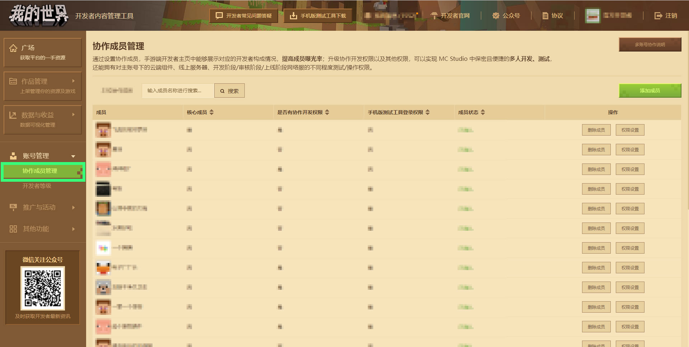
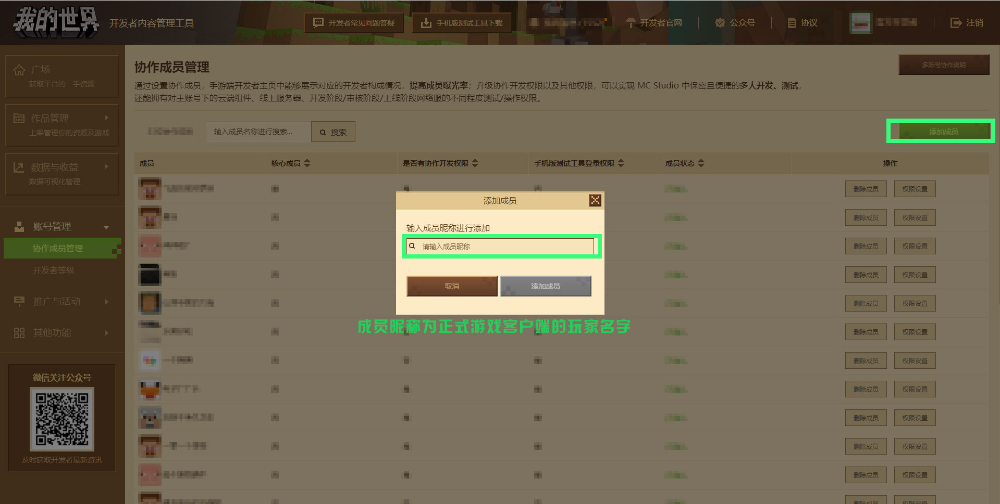
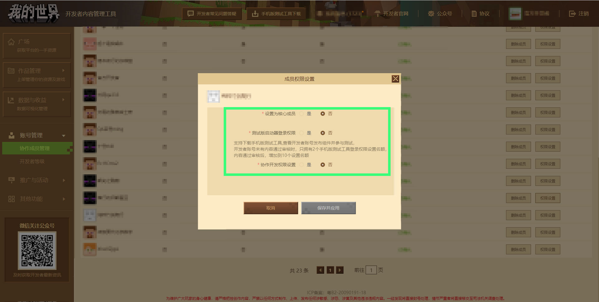
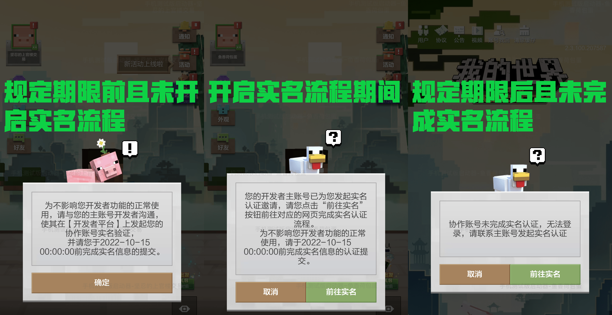
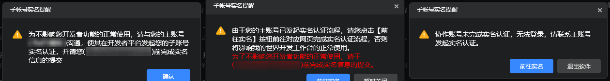
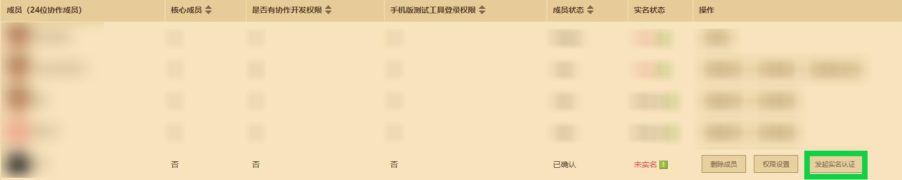

# 使用协作成员管理模块实现多账号协作

点击账号管理下的 **【协作成员管理】** 按钮，跳转至成员管理页面，在此可以自定义开发者的成员信息，绑定自己的游戏账号。

点击 **【添加成员】** 按钮，在输入框内输入成员昵称，然后点击按钮，这个账号就会被添加到开发者成员中。 **注意：开发者成员账号不能是其他账号的协作子账号，如有重复情况平台将会进行统一清理，敬请了解。**

开发者账号需对成员账号发起实名认证流程，才能保证后续成员账号能正常使用协作功能，有关实名认证流程请看[开发者成员账号实名认证流程](#开发者成员账号实名认证流程)与[开发者成员账号实名认证FAQ](#开发者成员账号实名认证FAQ)。

对于已加入并实名的成员，可以将其删除、设为核心成员，为其打开测试版启动器登录权限、协作开发权限或使用《我的世界》开发工作台：

- 删除成员：将该成员移除。
- 设为核心成员：在游戏的开发者主页中显示为核心成员。
- 测试版启动器登录权限：设置成员是否可以使用手机版测试工具。开发者有内容通过审核后，最多可以设置10个子账号登录手机版测试启动器。未曾有过过审内容者，最多只能设置2个名额。 **注意：未经过实名认证的开发者主账号无法使用手机版测试启动器。**
- 协作开发权限设置：可以登录我的世界开发者工作台看到主账号的云端组件、网络服等，也可以通过手机测试段与主账号联机测试。若开发者有网络游戏作品，还可以对成员额外设置是否在 **【开发阶段允许配置、部署与热更】** 、 **【上线阶段允许控制台调试】** 等功能。
  - 开发阶段允许配置、部署与热更：允许成员使用我的世界基岩版网络游戏开服工具对主账号的开发中服务器进行配置、部署与热更。有关网络游戏开服工具的配置、部署与热更功能，[详细教程可查看此处](../27-网络游戏/课程2：Apollo基础知识/第4节：部署.html#部署)。
  - 上线阶段允许控制台调试：允许成员使用我的世界基岩版网络游戏开服工具对主账号的上线阶段服务器进行控制台调试。有关网络游戏开服工具控制台调试功能，[详细教程可查看此处](../27-网络游戏/课程7：开发技巧/第3节：控制台调试.html)。

成员管理模块不仅仅用于管理团队，对于开发也起着很重要的作用：

- 联机测试：可使用我的世界基岩版手机版开发启动器在外网网域下远程联机作品，<a href="../../mconline/10-addon教程/第18章：打包导出你的作品/课程03.在手机和电脑上测试你的作品.html#使用开发者子母账号在手机测试端上联机" rel="noopenner">详细教程可查看</a>；
- 多账号协作：可在网络游戏开服工具下实现多账号协作，[详细教程可查看此处](../27-网络游戏/课程1：成为Apollo服主及相关准备/第7节：McStudio多账号协作.md)；

## 多账号协作说明

### 可添加开发者成员、并且协作账号符合开发者成员账号添加的条件：

- 在《我的世界》开发者平台发布过内容作品的开发者才可添加开发者成员。
- 开发者成员账号只能是网易 163 邮箱账号，第三方账号或通过短信验证码登录的手机账号均不符合要求。
- 开发者成员账号不能是开发者账号或者 UP 主账号，或者申请成为开发者或UP主账号。
- 开发者成员账号不能是其他账号的协作子账号（除非取消原协作账号关系）。
- 开发者成员账号在我的世界手机版上登陆过至少一次。

### 开发者成员账号实名认证流程

成员账号新增 **【未实名】** 、 **【等待实名】** 与 **【已实名】** 三种实名状态。

请查看实名状态旁的 **规定期提示** ，并在 **规定时间** 前对现有成员账号发起实名认证，通知账号本人在《我的世界》开发工作台或手机版测试工具尽快实名，以保障后续正常使用协作功能，此时可以正常使用协作功能与工具。

在 **规定时间** 后依旧未实名的 **现有** 成员账号或 **新加入** 的成员账号，每次登录《我的世界》开发工作台与手机版测试工具时将被拦截。

点击账号管理下的 **【协作成员管理】** 按钮，跳转至成员管理页面，对单个成员账号右侧点击 **【发起实名认证】** 即可触发成员账号实名流程。

**【发起实名认证】** 后，实名状态会变为 **【等待实名】** 。请尽快提醒成员账号本人在《我的世界》开发工作台或手机版测试工具进行认证。也可以引导对方前往[《我的世界》开发者平台在线认证网址](https://mcdev.webapp.163.com/#/subAccountAuth)进行实名认证。

认证成功后，该名成员账号实名状态将变为 **【已实名】** 。

## 开发者成员账号实名认证FAQ

### 有哪些情况会造成成员账号实名认证不通过？

答：成员账号实名时所使用的个人实名信息不能与开发者账号实名信息一致。成员账号登记的个人实名信息需唯一，不能与其开发者主账号或其他开发者账号下的成员账号实名信息一样，否则认证将不会通过。

### 什么是成员账号实名认证规定期，对我的成员有什么影响？

答：成员账号实名认证流程上线后，在 **规定时间** 前尚未实名的开发者成员账号可以继续正常使用协作功能。但在 **规定时间** 后依旧未实名的 **现有** 成员账号或 **新加入** 的成员账号，每次登录《我的世界》开发工作台与手机版测试工具时将被拦截。开发者需尽快发起成员账号实名认证请求，并协助他人尽快在《我的世界》开发工作台或手机版测试工具进行认证。

### 由于我的成员账号是渠道服，我如何进行成员账号实名认证呢？

由于渠道服账号的权限相较于安卓测试包和开发工作台中的子账号权限有所不同，因此渠道服账号暂时不需要进行成员账号实名认证，并且不会影响其功能使用。已经提交成员账号认证的开发者，也无需进行处理。