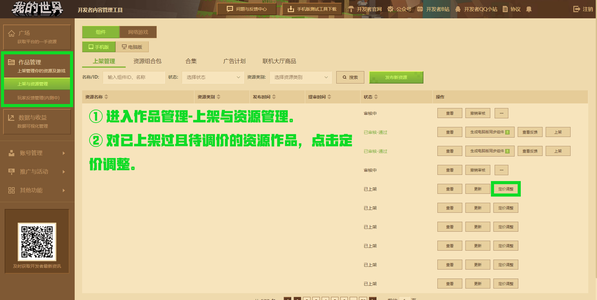
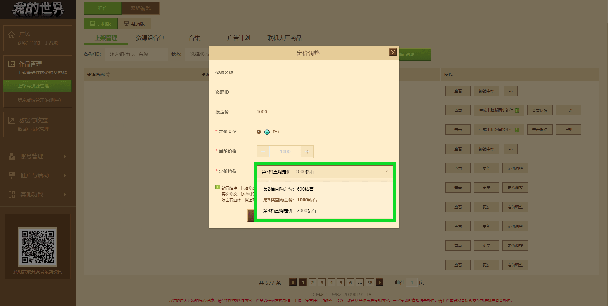
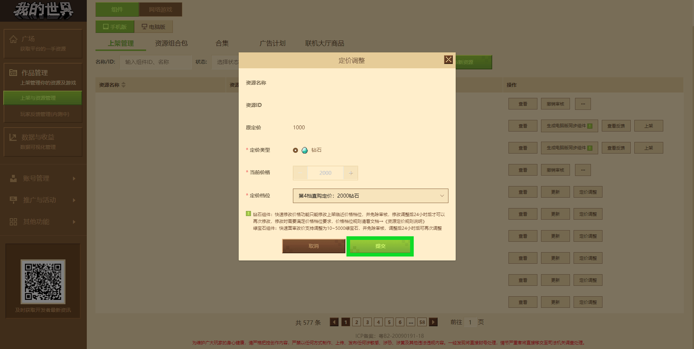

# 资源定价规则说明

> 文档版本：2023.3.9， **更新资源定价规则说明** 。

为持续完善创作生态，为开发者提供更加优质的创作环境， **《我的世界》** 综合过去以来开发者的定价建议及参考了Minecraft Marketplace等平台规范，自2023年3月15日起正式启用新版 **《资源定价规则说明》** 。

针对此次说明，**《我的世界》开发者平台** 的 **电脑版** 与 **手机版** 发布平台的作品定价功能已作出调整：

- 已经上架的资源作品将无法在 **免费** 、 **绿宝石** 、 **钻石** 之间进行降级修改 **（即钻石不能改为绿宝石或免费、绿宝石不能改为免费）** 。
- 组件定价与折扣功能受直购定价档位管理，不同的直购定价档位会有明确的钻石数目与最低折扣区间，且部分直购定价档位需要有对应的开发者能力贡献等级。有关组件开发者贡献能力等级，请查看[开发者能力贡献等级说明](../32-开发者账号与团队/课程14-开发者等级.html?catalog=1#开发者能力贡献等级说明)。其余可点击[此处](#直购定价档位说明)跳转至对应说明。

相应涉及功能变动的开发者文档也在 [**《我的世界》开发者官网**](https://mc.163.com/dev/guide.html) 进行了更新。

若您是新的开发者，可通过[认识作品管理模块](./课程04-认识作品管理模块.html)开始了解资源作品上架与管理。若过去已经有过发布资源作品的经验，您可以阅读[正确上传组件资源作品的方式及途径](./课程05-正确上传作品的方式及途径.html)了解组件定价功能调整对上传作品的流程变化。

此项规则说明将带您了解：

- 不同的直购定价档位与对应的钻石数目、折扣区间和开发者能力贡献等级限制等。
- 使用定价调整功能快速调整钻石或绿宝石资源作品的定价。

## 直购定价档位说明

<table>
	<thead>
		<tr style="height: 16.50pt;">
			<th>定价类型</th>
			<th>定价档位</th>
			<th>最低折扣区间</th>
			<th>最低折扣时钻石价格</th>
			<th>组件开发者能力贡献等级</th>
		</tr>
	</thead>
	<tbody>
		<tr style="height: 16.50pt;">
			<td>免费</td>
			<td>0钻石且0绿宝石</td>
			<td rowspan="3">无</td>
			<td rowspan="2">无</td>
			<td rowspan="5">无</td>
		</tr>
		<tr style="height: 16.50pt;">
			<td>绿宝石</td>
			<td>0钻石且绿宝石大于0</td>
		</tr>
		<tr style="height: 16.50pt;">
			<td>第1档直购定价</td>
			<td>300钻</td>
			<td>300钻</td>
		</tr>
		<tr style="height: 16.50pt;">
			<td>第2档直购定价</td>
			<td>600钻</td>
			<td rowspan="6">60%</td>
			<td>360钻</td>
		</tr>
		<tr style="height: 16.50pt;">
			<td>第3档直购定价</td>
			<td>1000钻</td>
			<td>600钻</td>
		</tr>
		<tr style="height: 16.50pt;">
			<td>第4档直购定价</td>
			<td>2000钻</td>
			<td>1200钻</td>
			<td rowspan="4">奋斗老铁及以上</td>
		</tr>
		<tr style="height: 16.50pt;">
			<td>第5档直购定价</td>
			<td>5000钻</td>
			<td>3000钻</td>
		</tr>
		<tr style="height: 16.50pt;">
			<td>第6档直购定价</td>
			<td>10000钻</td>
			<td>6000钻</td>
		</tr>
		<tr style="height: 16.50pt;">
			<td>第7档直购定价</td>
			<td>20000钻</td>
			<td>12000钻</td>
		</tr>
	</tbody>
</table>

免费资源作品与绿宝石资源作品定价档位如下：

- 免费资源作品定价为0钻石且0绿宝石，无折扣区间。
- 绿宝石资源作品定价为绿宝石大于0，无折扣区间。
- 上传免费与绿宝石资源作品无开发者能力贡献等级要求。

付费资源作品定价档位如下：

- 第1档直购定价钻石数为300钻。
- 第2档直购定价钻石数为600钻。
- 第3档直购定价钻石数为1000钻。
- 第4档直购定价钻石数为2000钻。
- 第5档直购定价钻石数为5000钻。
- 第6档直购定价钻石数为10000钻。
- 第7档直购定价钻石树为20000钻。
- 除第1档定价档位外，其余档位最低折扣为原价的60%。
- 第4档直购定价及以上区间，开发者能力贡献等级需在奋斗老铁以上。

**注意** ：

- 此次组件定价功能调整针对电脑版及手机版发布平台的组件资源。
- 网络游戏商品内购、联机大厅商品内购不在以上价格档位中。
- 内购联机大厅的本体资源若设置为付费资源作品，资源本体同样适用直购定价档位。
- 资源组合包依据[资源组合包概览](./课程11.1-资源组合包概览.html)的相关条规继续执行。

## 定价评定标准

- 组件规模：

这是一个开发者创作投入的直观指标。一般来说，组件规模能够在一定程度上反映了开发者所投入的创作精力与努力。

- 组件可玩性与内容丰富度：

在规模相近的组件之间，我们会更加看重其可玩性和内容丰富度。

- 组件的游玩时长：

游玩时长是衡量冒险家对组件内容兴趣程度和投入度的重要指标，一定程度上可以反映组件的质量和吸引力。

- 组件的使用情况：

玩家对组件的喜爱程度通过实际使用情况来体现，以及组件的长线更新也会对游玩体验有较大的影响。

## 快速调整钻石或绿宝石定价

登录 [**《我的世界》开发者平台**](https://mcdev.webapp.163.com/#/login) ，进入作品管理-上架与资源管理，对已上架且待调价的 **付费钻石或绿宝石资源作品** 点击 **定价调整** 。

接着可以在 **定价档位** 下拉栏中选择不同直购定价档位，如原定价1000钻石但未定过定档价位，则可以选择全部直购价格档位。已有过定价档位的则可以调整为当前定价的临近档位。

点击提交即可完成修改。

绿宝石资源作品同样可以使用该功能，定价支持调整为10~5000绿宝石区间内。 若调整范围超过该区间，则需要前往资源作品编辑页进行绿宝石定价调整，并等待审核通过。

**温馨提示：30天内可修改组件定价档位2次 （包含组件保存修改及组件快速修改价格两种方式），其中快速修改价格功能只针对钻石组件及部分绿宝石组件（10-5000绿宝石），可以修改上架临近价格档位，但再次修改需24小时后才可进行调整，使用后资源作品定价将直接变更为新的价格并直接过审。折扣生效中的资源及使用一键同步手机版组件至电脑版平台的资源作品无法使用该定价调整功能，默认使用手机版的资源作品定价。**

