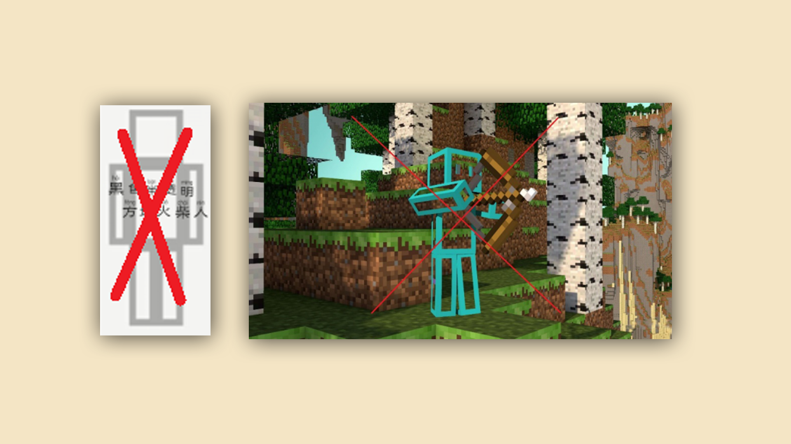
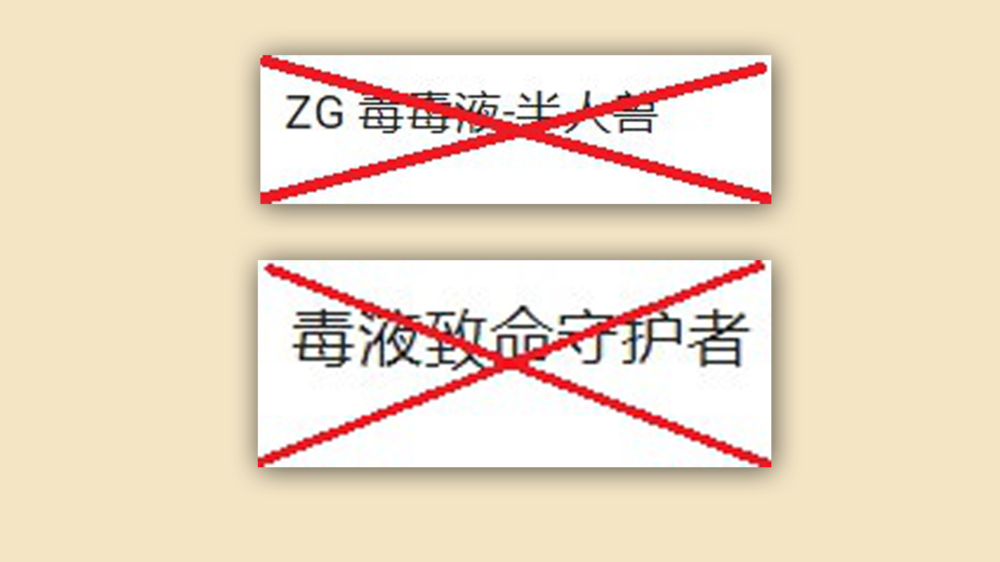
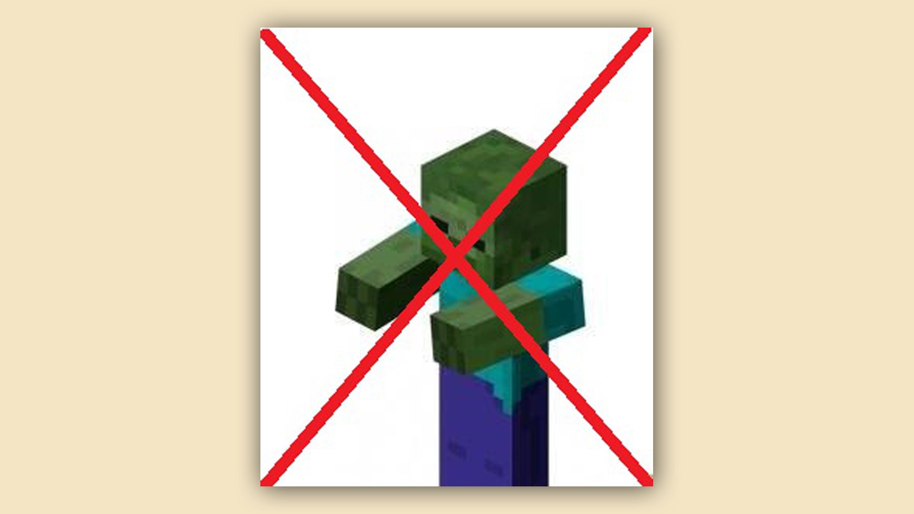
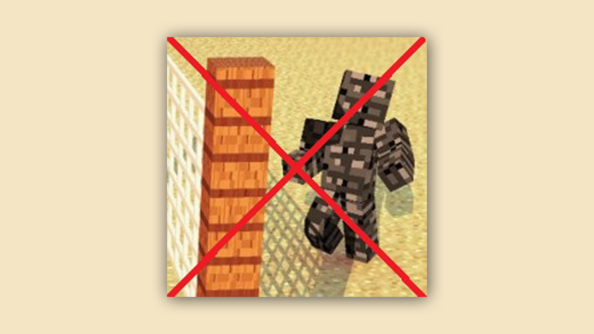
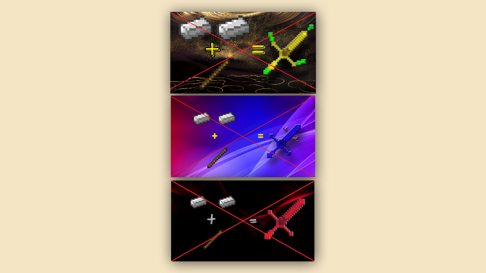

# 组件上架的规范及过审攻略

### 阶段目标：了解上架时应该避免的红线行为

#### TAG：过审 上架规范 攻略

#### 阶段结构：

#### 第一阶段：初步了解过审攻略

#### 第二阶段：自行下载并阅读附件《我的世界》组件审核修改建议

附件下载链接：[http://mc.netease.com/thread-417091-1-2.html](http://mc.netease.com/thread-417091-1-2.html)

各位开发者你们好~在日常开发组件后上传审核时，是不是也经常收到审核人员的无情拒绝呢？这边联系了我们的审核员，给大家推荐一些组件被拒之后的快速修改过审攻略，帮助大家尽快将组件实装到游戏中~

在组件被拒绝时，一般会有以下一些反馈，审核员将为大家一一解答：

#### 操作失败，无法下载（加载组件无效果）：

当拒绝提示为操作失败，无法下载的时候，说明组件的文件包体存在问题，（例如：文件名使用了中文等情况）

检查组件包体，如果有中文文件名改为非中文文件名即可，并且需要检查文件名是否带有括号，文件没有分层或者在资源包/行为包外多了一层文件夹，多余层级，这些情况都会有可能导致无法下载，加载组件无效果的情况出现。

#### 枪械类：

组件的封面，简介不得存在真实的枪械贴图与名称，如果有请作修改。

详细请参考：[http://mc.netease.com/thread-532700-1-1.html](http://mc.netease.com/thread-532700-1-1.html)

#### 皮肤贴图缺失（皮肤无浏览图）：

皮肤出现贴图缺失，皮肤在组件介绍页面无浏览图，可能是因为皮肤的格式不正确导致，请检查上传皮肤的格式即可～贴图缺失就是以下图片的情况，也是非常建议在上传皮肤的时候，通过测试端检查一下皮肤是否能够正常显示和使用。

#### 诱导消费：

简介带有下载该组件5鸡腿好评会随机挑取幸运玩家赠送现金红包，钻石奖励为诱导消费，删除相关文字即可。

#### 不得出现二维码信息，不得存在外链以及第三方平台的宣传：

在组件的简介，游戏内，作者信息不得存在二维码，外部网址链接，以及第三方平台的宣传文字（比如xx直播搜索房间号：xxxxx 或者 xx平台搜索xx了解更多游戏知识）

#### 组件影响游戏平衡：

加载后可以在服务器内获得矿透，永久夜视等功能，以及皮肤过多透明部分（如图）。都是属于影响游戏平衡的组件。

请删除影响到游戏平衡的对应的功能，皮肤减少透明部分即可。

#### 版权问题：

版权问题，除了搬运组件涉及版权以外，还有引用其他未经授权的的创作（例子：火影忍者，口袋妖怪等等未经授权不得使用，如下图类型的名称，没有授权不可直接使用。）

搬运组件需出示授权证明，引用其他未经授权的的创作如果没有授权证明，需要修改涉及版权的名称，简介，内容。

#### 敏感人设/敏感内容：

组件带有不符合现代社会价值观，以及涉及政治等的内容，人设都是属于违规内容。（例子如下图）

如果组件存在不符合现代社会价值观，以及涉及政治等的内容，人设，只需将违规的内容删除即可。

#### 组件使用过多原版贴图，过于简单：

直接使用了僵尸的贴图

直接使用了基岩的贴图

这些皮肤虽然需要经过多次的裁剪和合成，但是因为使用了过多的原版的贴图材质，缺乏原创而无法通过被拒绝，这种情况可以在原有的基础上添加更多的原创细节，比如给僵尸换一身好看的衣服。

#### 已有多款同类型组件，功能性不足：

比如只是修改了一把剑，或者是三叉戟的材质，装备上之后可以有一些属性的加成，因为目前该类型的组件数量过多，所以会因为功能性不足被拒绝。（例子如下图）

类似于这种情况的组件被拒绝无法通过审核，可以适当加入更多的物品材质，更多的功能效果或者是更好看的外形设计。

#### 已有多款同类型皮肤（只是更换了颜色）：

这类型被拒绝的皮肤都是数量过多或者是有同款的皮肤只是颜色不一样，可以在原有的基础上，添加一些有特色的饰品，装饰，皮肤上的细节创意。

#### 更多内容请查看附件《我的世界》组件审核修改建议