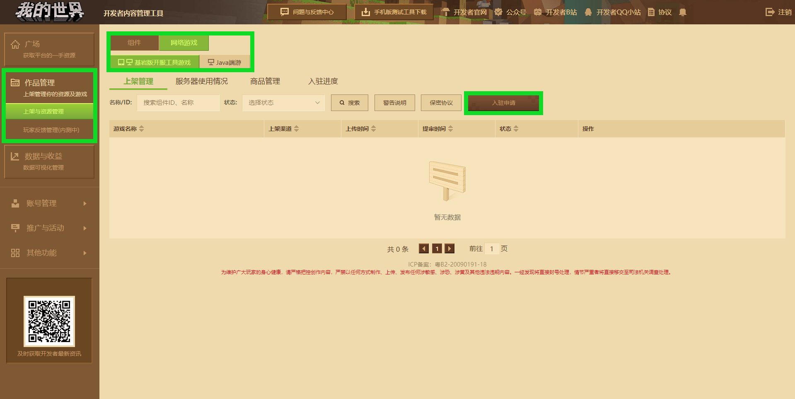

---
front:
hard: 入门
time: 10分钟
---

# 认识作品管理模块

> 文档版本：2023.3.9， **更新作品管理模块的使用说明** 。

在登入[开发者平台](https://mcdev.webapp.163.com/#/login)后，如需进行上传资源操作，则需要在平台左侧的 **作品管理** - **上架与资源管理** 中进行。

目前投稿平台分为 **手机版** 以及 **电脑版** 平台；其中， **电脑版** 又分为 **基岩版** 和 **JAVA版** 。可以发布的作品类型也有两种： **组件** 和 **网络游戏** 。

- **组件：** 玩法地图、附加包、模组等可以下载至本地设备，供玩家随意游玩的内容。
- **网络游戏：** 服务器，令玩家可以加入其中一同游玩。

## 上传资源作品

在作品管理页点击 **【发布新资源】** 按钮即可跳转至发布资源页面。需要注意的是，不同的投稿平台发布资源的位置是不一样的，在页面左上角可以切换平台为手机版或电脑版。

- **手机版** 可以发布的资源类型有：

  | 资源类型 | 资源说明                                                     |
  | -------- | ------------------------------------------------------------ |
  | 地图     | 建筑地图、携带add_ons的玩法地图或通过原版命令与命令方块制作的地图等。 |
  | add_ons  | 能够改变游戏运行规则的功能包体。                             |
  | 材质光影 | 为玩家提供自定义材质纹理、模型、音乐、音效、字体、UI等的资源包体。 |
  | 皮肤     | 自定义玩家角色形象的纹理图片，支持基岩版64x64、128x128的分辨率。 |
  | 联机大厅 | 面向多人游戏的联机地图，详情可在[联机大厅作品与商品上传文档](../26-联机大厅/5-联机大厅作品与商品上传文档.html)找到。 |

- **电脑版** 可以发布的资源类型有：

  | 资源类型 | 资源说明                                                     |
  | -------- | ------------------------------------------------------------ |
  | 功能组件 | 能够改变游戏运行规则的功能包体，基岩版为add_ons，JAVA版为Mod。 |
  | 地图组件 | 建筑地图、携带add_ons 或 Mod的玩法地图，以及通过原版命令与命令方块制作的地图等。 |
  | 视觉组件 | 为玩家提供自定义材质纹理、模型、音乐、音效、字体、UI等的资源包体。 |
  | 形象组件 | 自定义玩家角色形象的纹理图片，分别支持JAVA版的64x32、64x64、128x128与基岩版64x64、128x128的分辨率。 |
  | 联机大厅 | 面向多人游戏的联机地图，但仅支持上传基岩版内容，详情可在[联机大厅作品与商品上传文档](../26-联机大厅/5-联机大厅作品与商品上传文档.html)找到。 |

上架组件资源作品请查看[正确上传组件资源作品的方式及途径](./课程05-正确上传作品的方式及途径.html)。

使用[一键同步手机版组件至电脑版组件中心功能](./课程14-一键同步手机版组件至电脑版组件中心功能介绍.html)，可以在电脑版投稿平台上一键同步已上架手机版平台的基岩版资源。

由于手机版平台不支持上传JAVA版资源，因此上传JAVA版资源需在电脑版投稿平台上创建并上传。

## 上传网络游戏

在作品管理页上方切换至 **网络游戏** ，就可以申请并上传 **网络游戏** ，与资源作品一样，网络游戏也分为 **手机版** 和 **电脑版** ，需要进行区分，点击 **入驻申请** 按钮即可申请网络游戏入驻资格。

手机版 **网络游戏使用[基岩版开服工具（Apollo）](../27-网络游戏/课程0：基岩版网络游戏概述/第1节：基岩版网络游戏概述与工具指引.html)** ，为开发者提供基于 **基岩版网络游戏** 与基于 **JAVA版网络游戏** 两种开服模式，以服务手机版与电脑基岩版的玩家。 [**基于基岩版网络游戏**](../27-网络游戏/课程1：成为Apollo服主及相关准备/第1节：Apollo介绍.html) 的开服模式，适合已经有在手机版平台使用`Python`语言进行功能玩法开发的开发者。而 [**基于JAVA版网络游戏**](../27-网络游戏/课程10：使用Spigot开服/10-支持基岩版客户端的Java版网络游戏概述.html) 的开服模式，适合对 **JAVA版网络游戏** 和 **JAVA版网络游戏插件** 有一定概念的开发者。

上线网络游戏前，还必须先获得网络游戏入驻资格，请查看 **[基岩版网络游戏入驻指南](./课程12.1-基岩版网络游戏入驻指南.html)** 与 **[JAVA网络游戏入驻指南](./课程13-《我的世界》中国版JAVA网络游戏入驻指南.html)** 。

## 上传联机大厅商品

创建 **手机版联机大厅** 作品资源后，开发者还可以继续上传对应的 **联机大厅商品** ，探寻联机大厅作品商业化之路。详情可在[联机大厅作品与商品上传文档](../26-联机大厅/5-联机大厅作品与商品上传文档.html)找到。

## 管理广告计划

广告计划面向付费组件进行征集，开发者参与计划并设置观看次数后，冒险家可通过观看指定次数的广告免费下载参与计划的组件。同时开发者将通过广告的观看次数获取经济收益。该功能面向上架超过180天，评分4分以上的付费组件列表，在 **广告计划** 页面中将自动获取开发者账号下，符合条件的组件列表，并直接从列表中选择参与的组件，简单几步，即可完成设置。

进入我的世界开发者平台，通过 **作品管理** - **上架与资源管理** 进入到 **广告计划** 页面。

接下来，只需点击页面筛选过后显示的资源右侧的 **加入推广** ，通过 **设置观看次数限制** 输入兑换组件所需观看广告次数并点击 **确认** 后，即参与计划。同时，玩家观看广告的单天次数也有上限，具体请查看窗口说明。

官方将根据一定周期，汇总全平台所有广告收益，计算出单次广告的收益值，根据玩家观看开发者组件的广告总次数，计算对应的分成给予开发者。此外，开发者还可以在 **广告计划** 页面中，点击页面筛选过后显示的资源右侧的 **收益查看** 了解组件的广告收益。

### 广告计划注意事项：

- 可以申请将已上架并且180天内未修改过上架组件资源包的资源加入广告计划中。
- 可以设置对应需要获取该组件需要观看广告的次数，限制在10~100次以内。
- 参与广告计划的组件资源仅官服玩家可通过观看广告次数获得。
- 官方每个月统计上个月玩家观看开发者组件的广告总次数，并统计确认上个月广告展示收益，因此开发者在实际广告展示月份后两月可结算广告分成。
- 试运行阶段每位开发者同一时间只能选择1个组件参与广告计划。
- 试运行阶段单个组件参与广告计划有效期为1个月（30天），到期后组件自动退出广告计划。
- 试运行阶段单个组件退出广告计划后，存在30天冷却期，无法再次加入广告计划。
- 组件观看获取的次数设置不支持线上修改。