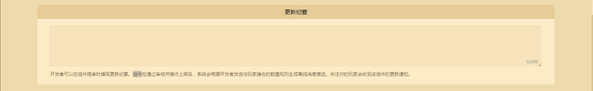
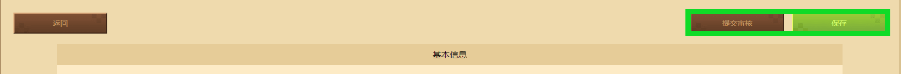

---
front:
hard: 入门
time: 10分钟
selection: true
---

# 正确上传组件资源作品的方式及途径

> 文档版本：2023.3.9， **更新正确上传组件资源作品的方式及途径的文档内容** 。

在开发者页面左侧点击 **作品管理** ，接着点击 **上架与资源管理** ，即可进入作品上传页。发布时需注意区分发布平台。

在发布作品时，请先留意部分规则：

-  **资源名称必须唯一**： 资源作品的名称不能重复，所以要避免一些过于大众化的名称。

-  **确保资源的著作来源**： 如果是搬运，需要如实上传相关依据用于平台审核判断，以免发生版权纠纷。

-  **资源售价限制**：请查看[资源定价规则说明](./课程02-资源定价规则说明.html)。

## 编辑手机版资源

进入手机版发布页面后，按照表单要求根据自身的设定填写组件信息即可。

按照要求由上至下对应填写：

- 资源名称：资源作品名称需唯一。
- 是否为原创作品：若为搬运作品，请勾选 **否** 并如实上传搬运/合作证明截图。若为原创作品请勾选 **是** 。
- 是否为官方联动内容：若没有参加官方联动活动的资源请选 **否** ，否则请选 **是** 。

**定价类型** 请根据实际上传的组件资源进行选择。当选择为钻石作品时，需根据钻石价格缴纳一定比例的押金。具体收取规则请前往开发者平台左上方的 **问题与反馈中心** 查看。

选择免费时，价格默认为0且不支持设置折扣。

若选择钻石定价，请根据[资源定价规则说明](./课程02-资源定价规则说明.html)，以评估资源作品的体量来提议定价。上传作品时，可以根据资源作品的定价进行折扣设置，并设置多个折扣时间段，对应的折扣区间请同样参考[资源定价规则说明](./课程02-资源定价规则说明.html)。

接着选择 **资源类别** ，资源主类别可点击[此处](./课程04-认识作品管理模块.html?catalog=1#上传资源作品)了解类型的区别。副类别通常被视为资源内容的标签，供玩家在资源中心对组件资源作品进行二级筛选。有关资源类型的打包规则，请查看[《我的世界》资源上传规则](./课程11-我的世界中国版资源上传规则.html)文档。

**详细信息** 请填写资源作品的相关介绍，可以插入图片、富文本等信息。但建议介绍文字控制在1000个字符以内。如果介绍文字过多，建议用图片介绍的形式上传 **（上传图片总宽高不能超过1000x4000）** 。

填写 **更新纪要** 可以在组件通过审核上架时，令关注自己的玩家在手机客户端的订阅区显示资源作品上新或更新卡片。并为他们的手机系统推送消息通知。

接下来根据要求依次上传编辑资源作品的图片。**新icon** 指作品封面，**POS机** 指在购买组件时弹出显示的图片，**轮播图** 指组件资源详情页显示的宣传图，如下图所示：

付费内容除 **皮肤类型** 作品外，均须上传视频介绍。视频内容可包含：组件内容介绍、玩法介绍、特色内容、制作过程等，且视频的内容对审核过程结果有影响。上传视频时请注意视频文件格式，详情请参考文档：[《作品视频格导出与规范》](./课程06-作品视频格式导出与规范.html)。

所有信息填写完毕后，找到右上角的 **保存** 按钮，点击后 **保存** 该组件的信息，或者直接点击 **立即提交审核** 。

## 编辑电脑版资源

进入电脑版资源作品发布页面后，与手机版一致，按照表单要求根据自身的设定填写组件名称、是否为原创作品与是否含有地图。

**组件标签** 与 **组件简介** 主要用于审核资料提交。填写 **前置组件** 可方便玩家在购买与下载该电脑版资源作品时同步获得前置组件。此处请填写前置组件的组件名称进行关联联想并选定。 **在关联前，请确保该前置组件已上架至电脑版组件中心。**

**定价规则** 与手机版资源作品一样。

电脑版的上传组件信息中适用版本分为JAVA版和基岩版，上传时请确认组件支持的版本并勾选，JAVA版组件支持适用多个JAVA版版本，但需要针对不同的版本号上传多个资源压缩包。**联机大厅** 分类目前仅支持基岩版地图。其余上传规则请查看[《我的世界》资源上传规则](./课程11-我的世界中国版资源上传规则.html)。

同时，若上传的资源作品有收录进MCMOD百科，可通过 **添加百科词条** 功能关联资源作品。但需确保百科词条收录的资源作品名称与上传至电脑版组件中心的资源作品名称一致，否则无法添加成功。

组件资源的适用范围请根据组件可支持的端进行选择。通常情况下可参考此表格进行勾选：

| 适用范围 | 组件类别                                       |
| -------- | ---------------------------------------------- |
| 客户端   | 形象组件、视觉组件、只带有客户端逻辑的功能组件 |
| 服务端   | 只带有服务端逻辑的功能组件                     |
| 双端     | 地图组件、带有双端逻辑的功能组件、联机大厅组件 |

点击上传组件作品文件包的加号，文件命名必须是 **非中文** ，否则会上传失败。JAVA版组件使用的JAVA版本判断：

- 组件版本小于1.11.2则勾选JAVA 7，否则勾选JAVA 8。
- 1.18版本开始需指定为JAVA 17。
- 若组件服务低版本但使用了更高的JAVA版本进行编译，请根据实际选择。

由于基岩版使用的底层语言不同，因此基岩版组件默认选择JAVA 8，版本100.0即可。

**详细信息** 上传内容与手机版一致。

图片与视频要求与手机版一致，请按照要求依次上传图片和视频即可。

## 审核资源方式

在编辑完资源作品的各项信息后保存资源，在待提交审核状态下点击 **提交审核** 按钮即可开始对作品进行审核，审核会有两个阶段：

- 机器审核：主要保证资源在玩家客户端上能正常解压、运行与游玩，机器审核不通过会返回平台内机审邮件，请在开发者平台右上角邮箱处查收。并根据[打包错误信息文档](../50-常见问题答疑/60-我的世界中国版打包错误信息汇整.html)的提示进行调整。
- 人工审核：主要保证资源不会破坏开发者生态、符合正能量、意识形态和基本的游戏品质。审核不通过同样会返回审核意见邮件和短信，请根据邮件结果对作品内容进行调整。

组件审核日期一般在3个工作日，若上架或更新时间紧迫可以 **申请加急** 。每14天，开发者可以对满足申请加急的作品申请一次加急审核，原因合理则会由审核加速处理。

作品资源需要满足以下条件方可申请加急：

- 联机大厅作品资源需包含内购商品。
- 其他作品资源定价需在 **第二档直购定价600钻** 及以上价位。

无论审核通过与否，开发者可以通过平台内邮件和手机短信两种途径得到通知。审核成功后，可在作品管理页面上架作品或设置定时上架时间。

