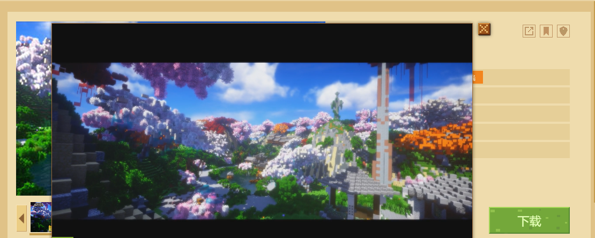
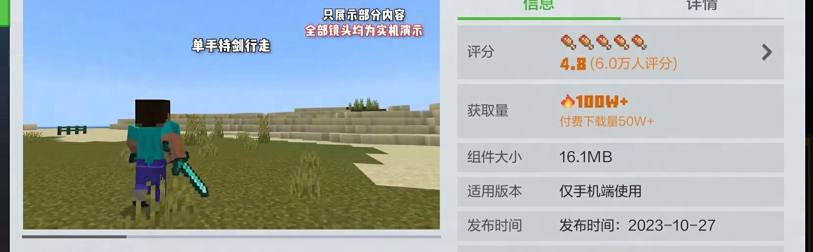

---
front:
hard: 入门
time: 20分钟
---

# 作品视频格式导出与规范

《我的世界》开发者内容管理平台支持作者上传作品的视频资源。只需上传正确的资源格式，玩家便可在 **【电脑版组件中心】** 或 **【手机版资源中心】** 的作品资源页上看到。

 **【电脑版组件中心】** 

 **【手机版资源中心】** 

在通常情况下，一个小巧精良的视频可以很好的概括和突出作品的特色，使玩法内容便于理解。

由于视频格式众多，规范复杂。目前，开发者平台支持多媒体视频格式，需要按照以下规范进行导出：

| 格式种类     | 规范限制           |
| ------------ | ------------------ |
| 视频编码格式 | H.264编码的MP4格式 |
| 视频显示格式 | 1080P              |
| 音频编码格式 | AAC编码            |
| 视频比例限制 | 16：9长宽比        |
| 视频时长限制 | 一分半以内         |
| 限制大小     | 50M                |

**视频时长通常会影响观众对内容的期望值，时长较长的视频观众可能会判断内容中是否涵盖足够的干货，来决定是否完整观看；时长较短的视频观众一般会完整观看。**
**建议各位开发者在20秒时长的视频中，将精彩内容在10秒内集中展示，这样能极大提高观众观看视频完整度，也能更好加深观众对作品的印象，从而提高作品销量。**

同时，建议采取以下视频压缩参数，满足开发者内容管理平台的视频大小需求：

| 格式种类 | 规范限制 |
| -------- | -------- |
| 视频码率 | 3M       |
| 视频帧数 | 24帧     |

开发者可以使用第三方软件进行视频编辑导出。

## 还有解决不了的问题？

你可以通过[开发者平台](https://mcdev.webapp.163.com/#/square)顶部的开发者常见问题答疑的反馈其他问题进行反馈，也可直接点击[这个链接](https://mcdev.webapp.163.com/#/feedbackModal)。官方将通过开发者平台站内信与您取得联系。

