# 我的世界中国版资源上传规则

资源上传规则章节包含【如何对资源打包】和【如何将资源发布】两部分内容，有助于开发者在上传资源时规避平台机器审核退回的风险。

### 包体打包

#### PE资源

#### 地图：

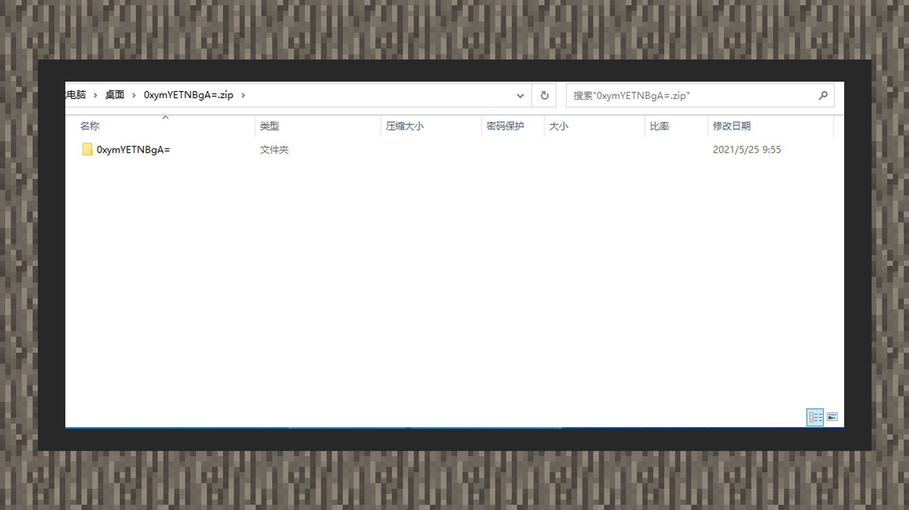

【手动打包】：在尝试直接打包地图时，需注意包体应有且仅有一个顶级文件夹目录。在对地图文件夹右键压缩成zip文档后，即可将包体上传至开发者平台。

#### 联机地图：

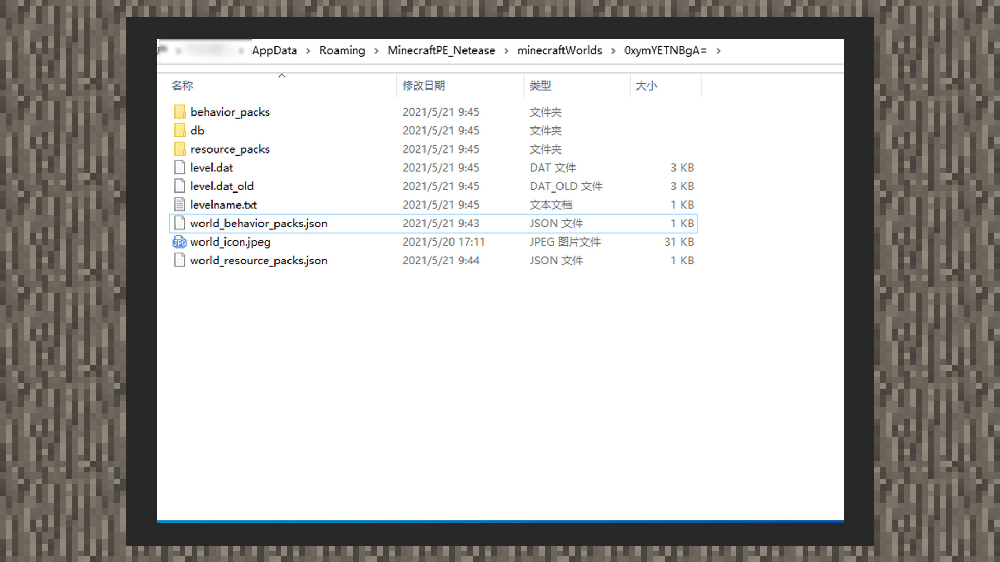

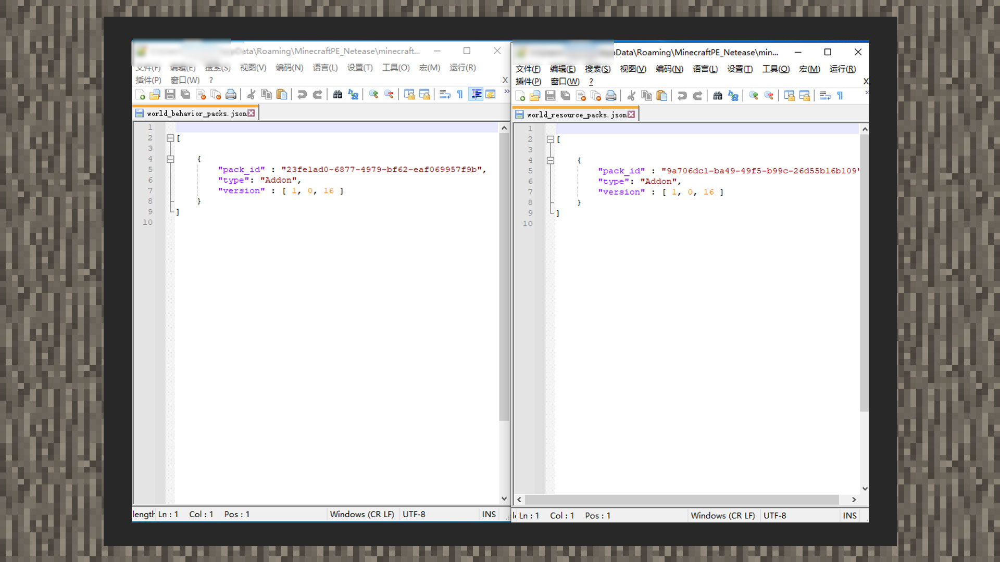

【手动打包】：在尝试手动打包联机地图组件时，若联机地图携带Add-on，请确保存在world_behavior_packs.json/world_resource_packs.json文件。请在对应的类型中填选对应的manifest.json下header内的uuid和version内容，并添加"type":"Addon"字段。最后在对地图文件夹右键压缩成zip文档后，即可将包体上传至开发者平台。

#### Add-on：

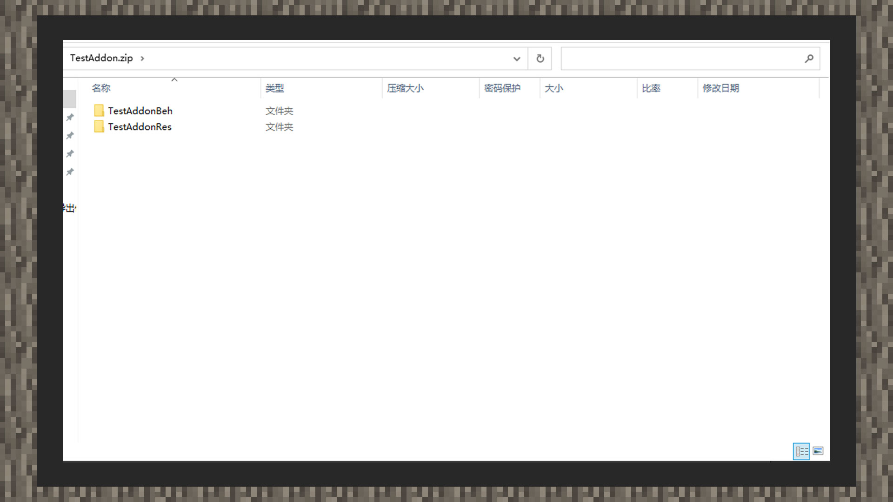

【手动打包】：在尝试手动打包Add-on组件时，请直接框选材质包文件夹和行为包文件夹后右键压缩成zip文档，即可将包体上传至开发者平台。

#### 材质光影：

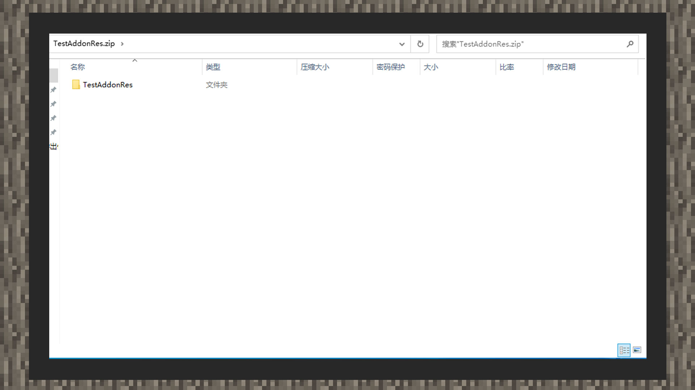

【手动打包】：在尝试直接手动打包材质光影组件时，请将材质文件夹嵌套进一个新的文件夹内。再对新的文件夹右键压缩成zip文档，即可将包体上传至开发者平台。

#### 【注意】：基岩版材质光影组件必须保证材质包文件夹内携带textures文件夹，否则会导致上传失败。

#### 皮肤：

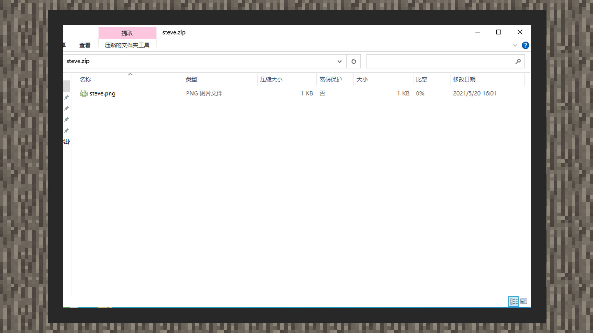

【手动打包】：可以直接将带有透明通道的png皮肤文件上传至开发者平台即可。

#### PC资源

#### 【注意】：JAVA组件资源若有版本条件，请记得在开发者平台指定游戏版本。可以同时指定多个版本，否则默认适用全部版本。

#### 地图/玩法：

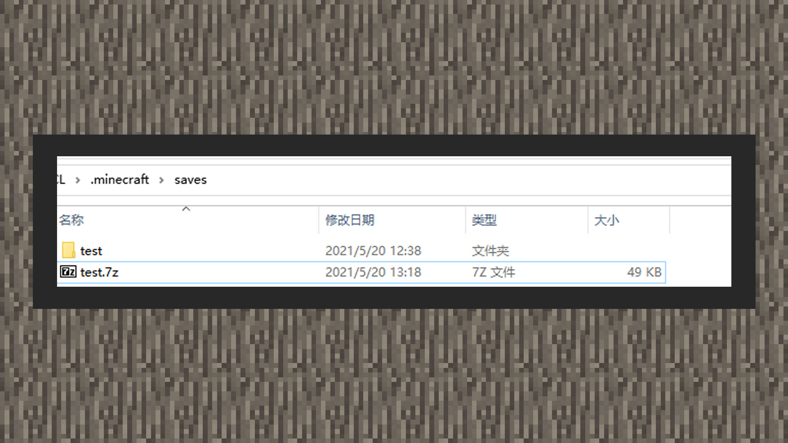

【手动打包】：在尝试直接打包地图时，请直接对地图文件夹右键压缩成7z文档后，即可将包体上传至开发者平台。

#### MOD：

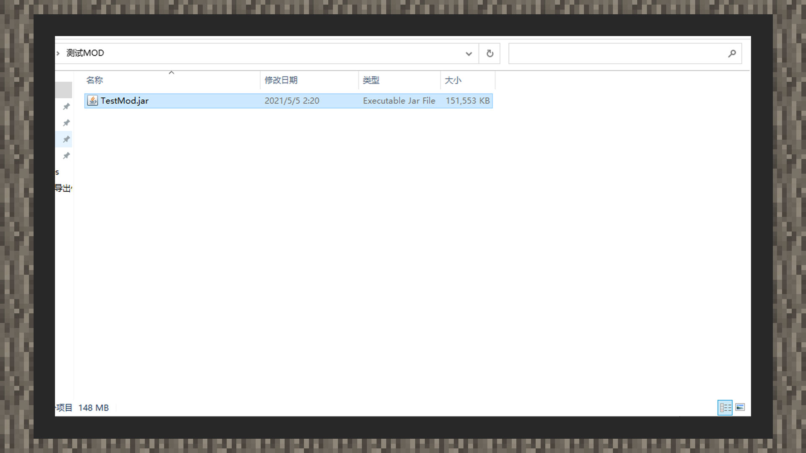

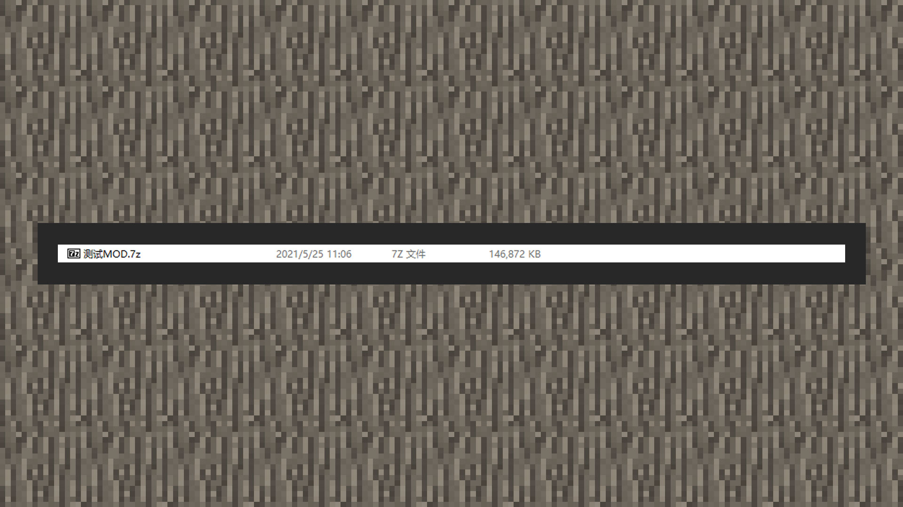

【手动打包】：在尝试手动打包MOD组件时，请将Mod Jar文件嵌套进一个新的文件夹内。再对新的文件夹右键压缩成7z文档，即可将包体上传至开发者平台。

#### 材质：

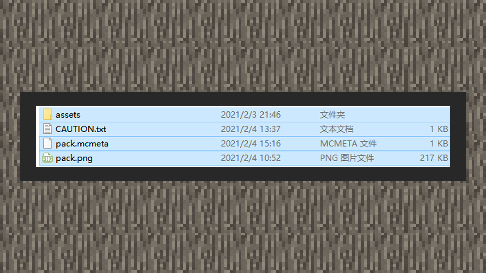

【手动打包】：右键框选所有内容压缩成 zip 文档，再将zip文件放入一个文件夹内，最后对文件夹进行7z格式的打包后即可上传至开发者平台。

#### 光影：

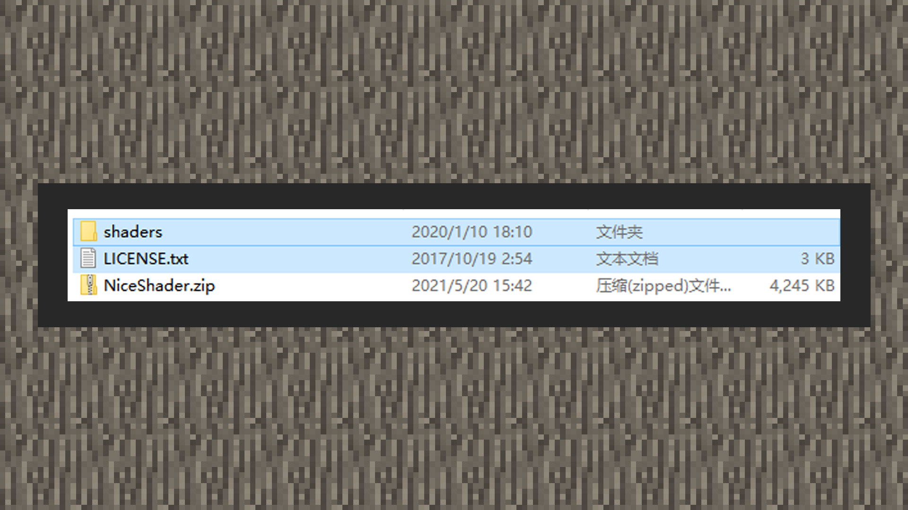

【手动打包】：右键框选所有内容压缩成 zip 文档，再将zip文件放入一个文件夹内，最后对文件夹进行7z格式的打包后即可上传至开发者平台。

#### 皮肤：

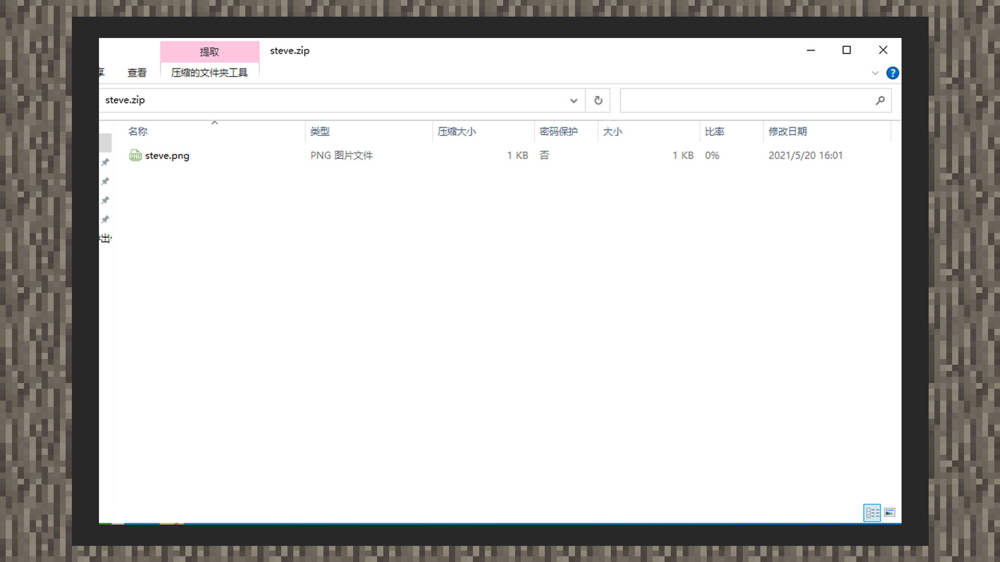

【手动打包】：可以直接将带有透明通道的png皮肤文件上传至开发者平台即可。

### 包体发布

#### 资源配布

【开发者平台】：可以在资源发布页上点击【上传PE资源管理】面板下的+号上传资源源文档。当前平台默认会加密PE资源源文件。请妥善备份资源源文档。

#### 上传事项

1) 请确保组件的【著作来源】。若组件非原创作品，请上传具体搬运/合作证明截图，官方将以此作为依据在有发生版权纠纷的情况下进行仲裁。

2) 使用钻石作为组件定价时，需要依照单价支付相同数额的【押金】。当押金累计交满600元后就无需再交。

3) 上传PC资源时，请预先设定好组件资源支持的游戏版本和JAVA版本。一般不做额外考虑的情况下，JAVA版本统一选择Java 8即可。基岩版组件上架PC资源中心统一选择100.0的版本。

4) 上传PE资源时，需要先确认组件的MODAPI版本。若上传组件没有用到MODAPI，默认选择最新即可。MODAPI会随每次游戏版本大更新时更新，渠道版用户存在延迟更新的状况。可以选择上一个版本或等待正式版本放出时选择最新MODAPI。

5) 组件资源上传后，基岩版可以选择手机自测组件。可以通过下载【测试版启动器】进入资源中心进行下载测试。

### PE资源上传时可能遇到的报错信息及解决方案

### UUID：

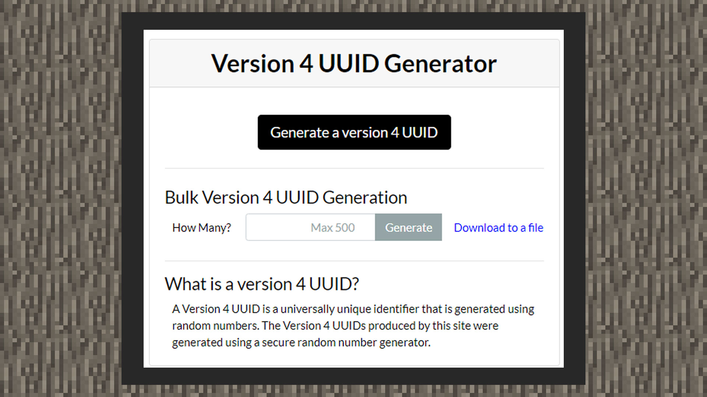

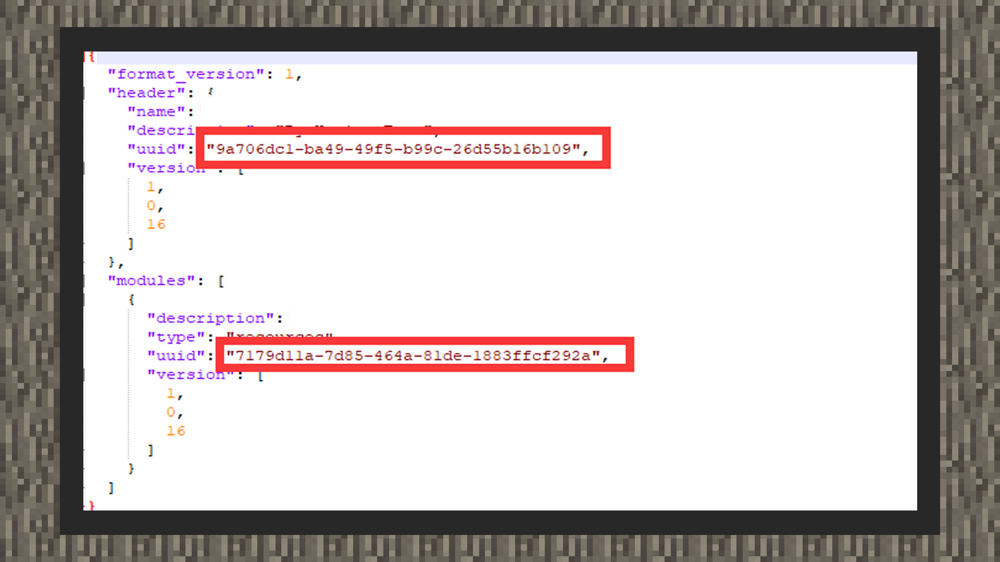

1) 如果报错组件是PE组件且是Add-on，请在行为包(behavior_packs)和资源包(resource_packs)文件夹中打开manifest文件，用网络在线工具重新再生成uuid后替换json文件内的uuid的值即可；生成工具：[https://www.uuidgenerator.net/](https://www.uuidgenerator.net/)

2) 如果报错的是地图，请直接清空行为包(behavior_packs)和资源包(resource_packs)文件夹内的文件，然后再把netease_world_behavior_packs文件和netease_world_resource_packs文件内的代码全部清空输入null保存即可。

