---
front:
hard: 入门
time: 15分钟
selection: true
---

# 资源组合包概览

> 文档版本：2023.2.21， **首次更新资源组合包的使用说明** 。

《我的世界》资源组合包是一种面向玩家的新型购物模式，它能将多个上线组件捆绑在一起进行打折销售，为开发者的专一粉丝提供附加价值与更多惠益。针对常见情况，有两种普遍的使用场景：

- 结合 主包 搭配 DLC 的模式销售系列组件。
- 根据组件题材进行分类，帮助粉丝玩家更短时间找到喜欢的内容。

原合集功能将支持一键同步合集组件至资源组合包，后续开发者也无法创建新的合集，详情请查看[一键同步合集组件至资源组合包](./课程11.2-一键同步合集组件至资源组合包.html)。 **资源中心** - **开发者主页** 的合集分区将替换为资源组合包分区。 **且资源组合包当前仅支持《我的世界》手机版。**

《我的世界》开发者平台将在 **2月21日** 上线资源组合包功能，玩家可在 **3月23日** 后下载资源组合包。

期待各位开发者挖掘资源组合包的更多组合，使用上的建议与反馈可以通过[问题与反馈中心](https://mcdev.webapp.163.com/#/feedbackModal?target=browser)与我们取得联系。《我的世界》开发者平台也会提供独立的资源组合包流量位，敬请期待。

## 创建资源组合包

进入 《我的世界》开发者平台，点击 **作品管理** - **上架与资源管理**，接着点击 **组件** - **手机版** - **资源组合包**。

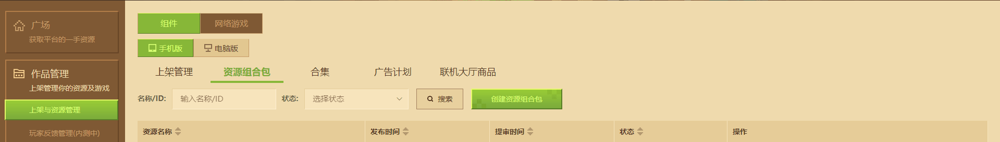

点击 **创建资源组合包** ，可先设置 **组合包名称** 、 **组合包类型** 、 **基础折扣** 与 **限时折扣** 。

- 组合包类型：分为 **普通组合包** 、 **纯皮肤组合包** 、 **纯地图组合包** 。
  -  **普通组合包** ：可以选择任一类型的组件。
  -  **纯皮肤组合包** ：只能选择 **皮肤组件** 。
  -  **纯地图组合包** ：只能选择 **地图组件** 。
- 组合包名称：将作为资源组合包的名称进行展示。
- 基础折扣：必填，资源组合包上线后的默认折扣。
- 限时折扣：选填，可设置资源组合包在特定时间期间的折扣。资源组合包内的基础折扣与限时折扣同时生效时， **优先使用限时折扣** 。

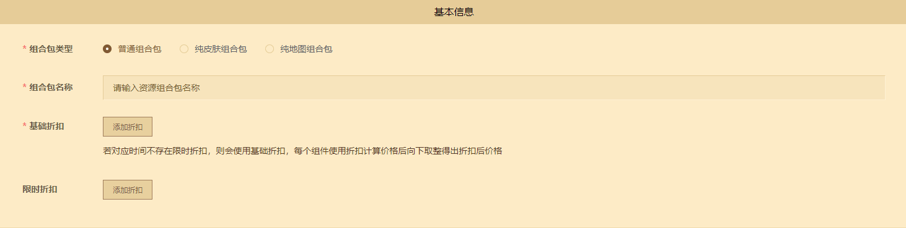

**纯皮肤组合包** 、 **纯地图组合包** 最低折扣为50%， **普通资源组合包** 有价格限制，最低折扣需按组件原价折后价**500钻石**设置。组合包类型将根据包内组件类型情况进行自动选择。

组件购买价格将按照**组件本身的折扣**以及**组合包限时折扣**进行叠加，若组合包限时折扣不存在时，将由组合包基础折扣代替。

折扣的运作模式可参考下图：

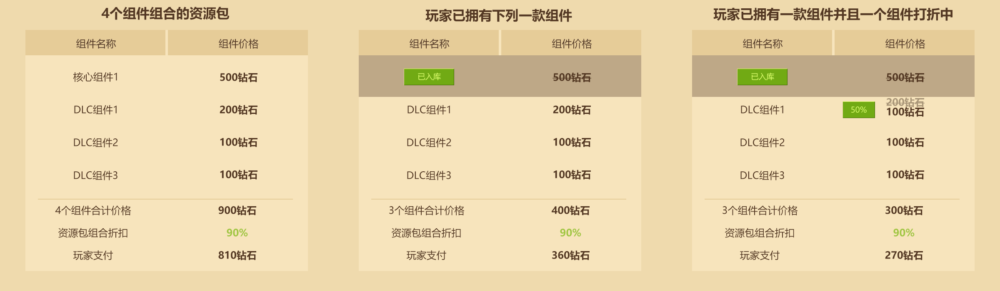

接着在资源区域添加与组合包关联的组件。其中，资源组合包最多关联20个，最少关联2个 **有过审记录的组件资源** 。 **单个组件资源可加入的资源组合包次数不限** 。

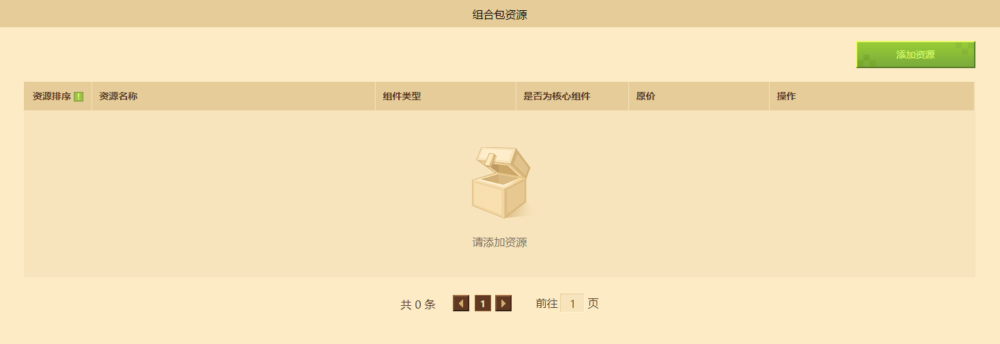

添加组件资源后，必须设置其中一个组件为核心组件。核心组件默认在第一顺位展示。开发者可在每次关联组件时，通过添加顺序管理新增的组件展示顺序，未来也会提供直接调整非核心组件的展示顺序功能，敬请期待。

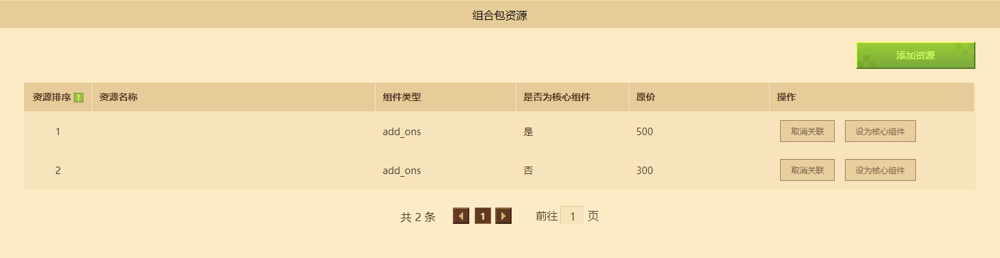

接着填充 **详情信息** 、**编辑图片** 和 **上传视频** 区域的相关内容，这些信息内容将会展示在资源组合包详情页中。也可直接点击同步按钮同步核心资源的资源描述，减少人工操作的时间。

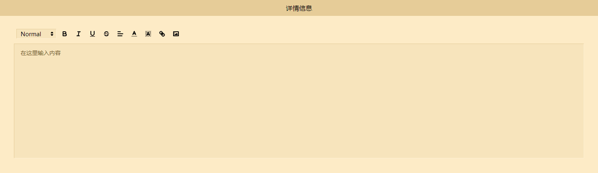

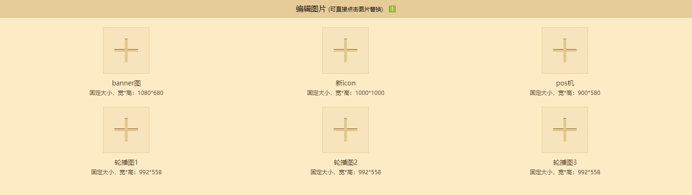

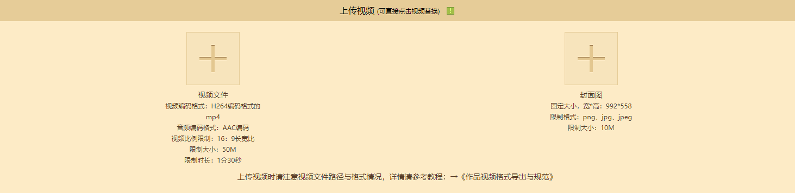

与编辑组件上传信息不同，资源组合包的 **更新纪要** 为必填内容。设置之后会在玩家的订阅功能中同步生成资源卡片，并会在手机消息通知中同步收到提醒。

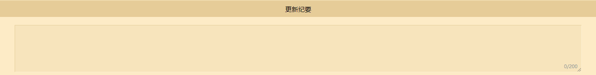

## 自测、提审与更新资源组合包

进入 《我的世界》开发者平台，点击 **作品管理** - **上架与资源管理**，接着点击 **组件** - **手机版** - **资源组合包**。

对已创建好的资源组合包，可在《我的世界》2.6整包Beta更新后，点击自测按钮进行 **自测** ，在手机版测试启动器中预览对应的资源组合包。

点击 **提交审核** 按钮对资源组合包提交审核，点击后需进行二次确认才可提审，同样支持在二次确认弹窗中补充提审说明。

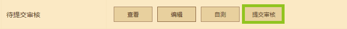

点击 **编辑** 按钮可重新进入资源组合包编辑页面，编辑更新后记得保存。

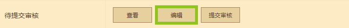

## 下架资源组合包

在单个资源组合包详情页中，找到 **上架设置** 。编辑 **上架设置** ，勾选 **弱下架** ，并提供 **弱下架原因** 。

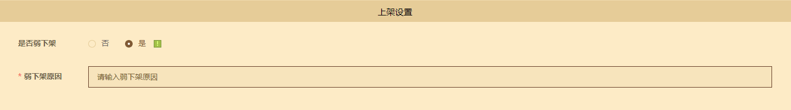

最后重新提审，等待审核通过后即可下架资源组合包。

## 资源组合包FAQ

### 资源组合包的展示位置在哪里？

答：资源组合包会在 **关联的单个组件详情页** 下进行展示，也可在开发者主页下的 **资源组合包分区** 中找到。

### 资源组合包的折扣后价格是如何计算得出的？

答：价格是所有关联资源组合包的组件当前总价与资源组合包折扣相乘后的折扣价格， **折扣后的价格出现小数点时，将向下取整到整数钻石** 。例如其中一个组件原价20钻石，使用组件折扣5折，并添入基础折扣为88折的资源组合包，则该组件最终在资源组合包的价格向下取整至8钻石。其余细则具体可查看 [创建资源组合包](#创建资源组合包)的折扣运作模式。

### 资源组合包的评分与评论系统来源是哪里？

答：资源组合包的评分与评论系统将直接使用核心资源的评分与评论。

### 资源组合包支持加入购物车、心愿单与索要转赠功能吗？

答：资源组合包暂不支持搭配购物车、心愿单与索要转赠功能使用。

### 是否可以将资源组合包加入折扣特卖或作品活动？

答：目前尚不支持开发者登记资源组合包至[折扣特卖或作品活动](../40-活动、推广与收益/课程08-对作品进行推广与活动.html?catalog=1#活动参与)。

### 是否可以使用资源组合包的参与手机版推广位申请与竞拍？

答：目前尚不支持在[推广位申请与竞拍功能](../40-活动、推广与收益/课程16-推广位申请与竞拍试运行指南.html?catalog=1#申请手机版轮播图推广位)内选择资源组合包，请期待后续更新。

### 资源组合包的审核流程是什么形式？

答：与组件审核流程一致，开发者需要点击提审进入审核队列，并通过开发者邮箱与短信获得审核结果。

### 已购组件在资源组合包内会如何展示？

答：已购组件会在资源组合包内的组件列表显示已购标识，同理，未购组件也会显示未购买标识。

### 如何更换/新增/取消关联核心组件与非核心组件？

答： **在资源组合包首次上架前，开发者可以随时更换/新增与取消关联相应的核心组件与非核心组件。** 但在上架后，就无法更换/取消之前的核心组件或非核心组件，只允许关联其他新的组件资源为非核心组件。

### 核心组件或其他关联组件下架时，资源组合包会如何处理？

答：核心组件下架后，资源组合包列表不受影响。其他关联组件下架时，资源组合包会清除对应组件信息。