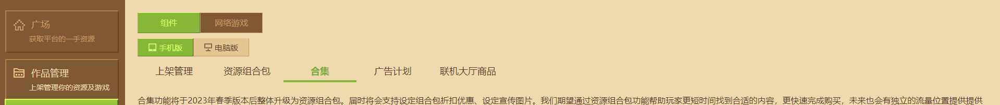
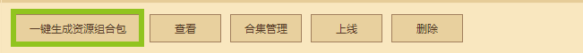

---
front:
hard: 入门
time: 10分钟
---

# 一键同步合集组件至资源组合包

> 文档版本：2023.2.21， **首次更新合集组件迁移资源组合包的使用说明** 。

资源组合包功能推出后，原合集功能不再支持创建新的合集，组件管理页面也不再支持将组件加入原有的合集。

有关资源组合包的使用说明，请查看[资源组合包概览](./课程11.1-资源组合包概览.html)。

**资源中心** - **开发者主页** 的合集分区将替换为资源组合包分区，合集内容不再展示。使用 **一键生成资源组合包功能** 可以帮助开发者快速导入合集组件信息至新的资源组合包，减少人工操作的时间。

## 使用一键生成资源组合包功能

进入 《我的世界》开发者平台，点击 **作品管理** - **上架与资源管理**，接着点击 **组件** - **手机版** - **合集**。

在原有的合集列表下，点击 **一键生成资源组合包** ，进入资源组合包编辑页。

按照[创建资源组合包](./课程11.1-资源组合包概览.html?catalog=1#创建资源组合包)的步骤完成配置，点击 **保存** 或 **提交审核** 即可完成迁移。

## 一键同步功能FAQ

### 资源组合包功能上线后，合集功能还能继续使用吗？

答：合集功能将在资源组合包功能上线后不再显示在 **资源中心** - **开发者主页** ，且原合集功能也不再支持创建新的合集，因此无法继续使用。