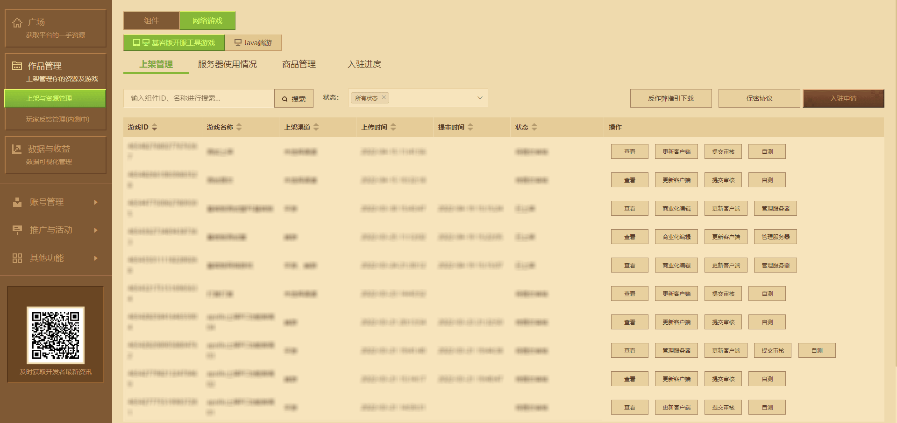
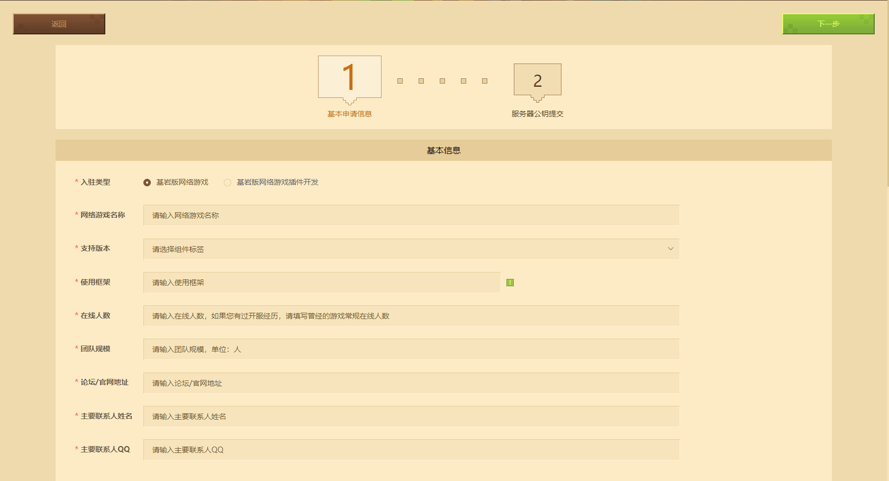
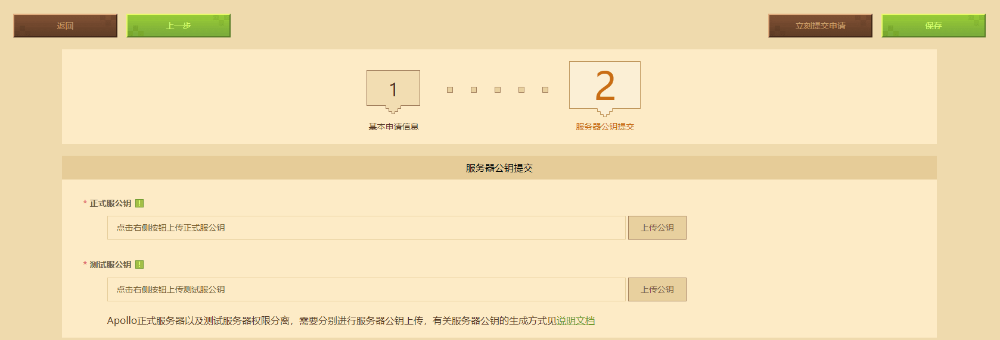
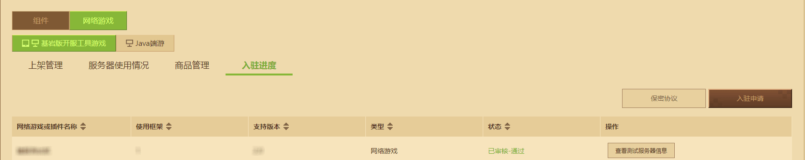
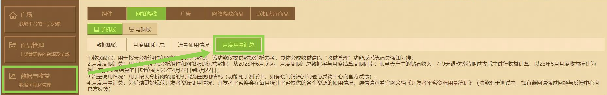

---
front:
hard: 入门
time: 15分钟
---

# 基岩版网络游戏入驻指南

入驻基岩版网络游戏在流程依赖开发者平台，想要入驻成功，首先需要拥有一个开发者账号。想知道如何注册开发者账号可以查看[此链接](../12-入门教程/10-注册成为开发者.html)。

在本篇指南里你将学会：

- 找到入驻申请入口并提交有效的申请信息。✔
- 上传开发机器与正式机器所需的机器登录公钥。✔

## 开始入驻申请

使用开发者账号登录[开发者平台](https://mcdev.webapp.163.com/)。点击左侧的 **【作品管理】** - **【上架与资源管理】** ，接着选择 **【网络游戏】** - **【基岩版开服工具游戏】**。再次点击 **【入驻申请】** 打开申请表单。

开始填写前，请确认入驻类型为 **【基岩版网络游戏】** 。

请如实并详细填写**基本信息** ：

- **【网络游戏名称】** 会将名称显示在 **网络游戏大厅** 内，在入驻通过后依旧可以多次更改。
- **【支持版本】** 默认选择all。
- **【使用框架】** 目前默认只支持 **网络游戏开服工具** ，底层为C++，使用的开发语言是Python。

- **【在线人数】** 可填写以往开经历的实际游戏常规在线人数，未有开服经验请填写 **【无】** 。
- **【团队规模】** 可填写当前有意愿共同开发网络游戏的人数数量，单位为 **【人】** 。
- **【论坛/官网地址】** 可填写以往开服经历对外宣传的自架论坛或官网地址，以便审核人员能够更好了解开发者过去的开服能力。
- **【主要联系人姓名】**  需输入主要联系人的姓名。
- **【主要联系人QQ】** 需输入个人的联系方式，以便在未来入驻成功后，官方能与开发者取得联系。

梳理完 **基本信息** ，请在 **网络游戏介绍** 内下方的三个服务器自我陈述问题中，详细告知官方对于 **【基岩版网络游戏】** 入驻后的企划与开发规划。此类入驻陈述将会作为官方评判入驻申请是否通过的 **重要指标** ，请认真填写：

-  **特色传达** ：指在特色内容描述中，讲清服务器的主要玩法，以及相较于同类服务器的独特卖点。

| 定义                                                         | 评分 |
| ------------------------------------------------------------ | ---- |
| 只提到了粗略的玩法品类，对具体玩法的印象仍然模糊。           | 1    |
| 提到了常见的玩法名称，能确定玩法规则、引起联想的游戏内容。   | 2    |
| 提到了有原创玩法，但印象模糊的。                             | 3    |
| 提到了原创玩法的具体名称， 能感知到微创新的存在，或提及了独到之处。 | 4    |
| 能感知到高原创性玩法的存在，并且给出充分信服的卖点信息。     | 5    |

- **开发能力** ：Python开发能力描述可信，且与服务器开发相关，有实力证明自己能够在取得入驻资质和机器后能实现建筑和玩法插件。

| 定义                                                         | 评分 |
| ------------------------------------------------------------ | ---- |
| 未提及开发能力，或自述前后站不住脚。                         | 1    |
| 提到了可信的开发能力，但与服务器开发关联较弱，比如提及的是其他应用领域层面、或与网络游戏单元无关的开发实力。 | 2    |
| 提到了服务器建设的相关开发能力，但缺少案例，不确定是否属实。 | 3    |
| 在3分基础上，提到了具体的案例并能关联自本人，并在外部渠道查证情况属实。 | 4    |
| 在4分基础上，提到更多细节信息，如系统模块、实现细节，能让人感觉到其对开发较为熟悉。 | 5    |

- **服务器经验** ：开发者曾运营或开发过其他服务器，与其他创作者在网络游戏内容上的合作经历。

| 定义                                                         | 评分 |
| ------------------------------------------------------------ | ---- |
| 没有经历、未提及，或自述前后站不住脚。                       | 1    |
| 曾经开过具有联机性质的《我的世界》多人游戏服务或大型租赁服。 | 2    |
| 提到了开过Java版或基岩版的公开网络游戏服务，或参与过相关内容的开发，但较难查证的。 | 3    |
| 在3分基础上，有提及可查实的细节，比如网络游戏名称、网络游戏发布贴子。 | 4    |
| 在4分基础上，提到网络游戏数据良好、或是已知入驻《我的世界》电脑版游戏中心服主、或曾开过其他入驻《我的世界》基岩版网络游戏的经历。 | 5    |

除以上客观因素外，若开发者名下有使用《我的世界》制作并发布的 **在线作品** ，能体现出 **较高品质** 且玩家反馈良好的，在查证属实后，与上述三个维度结合时有      **更大概率成功** 。

## 上传公钥

在资料填写完成后，点击 **【下一步】** 进入 **【服务器公钥提交】** 环节。

**《我的世界》基岩版网络游戏** 入驻后，官方将会发放用于开发测试的 **小小云服务器** 。

**正式服务器和测试服务器** 使用的系统Linux发行版 Debian。连接Debian系统前，开发者需生成SSH密钥中并提供密钥对中的公钥。SSH密钥采用两个密钥成对使用的方式，只要私钥得到妥善保存，不做泄露，就能够有效保障连接传输数据与操作的安全性。

**正式服务器和测试服务器** 权限分离，为保证开发者的服务器安全，官方建议生成两对密钥并妥善保管。

有关生成SSH密钥和连接小小云服务器的教程，可以在开发者官网的<a href="../../mconline/30-网络服插件教程/1-准备知识/4-小小云链接.html" rel="noopenner">网络服插件教程中查阅</a>。

最后点击立即提交申请即可立即提审入驻申请，或保存以便在未来提交申请。

审核通过后，点击右侧查看 **【测试服务器消息】** 可查看到小小云的服务器IP、数据库等信息。

审核不通过时，可重新编辑 **基本信息** 与 **网络游戏介绍** 再次提交。官方也会通过开发者平台邮件反馈审核理由。

## 开发者平台资源用量统计功能 ##

为了在后续能够更好地规范开发者的资源使用情况，帮助开发者合理地使用资源用量，助力建设更加有序的开发环境，开发者平台新增开发者平台资源用量统计功能。

**使用资源用量统计功能**

进入《我的世界》开发者平台，点击首页的 **数据与收益 - 数据分析（公测）**，点击**网络游戏**选项，选择对应的**手机版**或者**电脑版**类型，然后点击**月度用量汇总**进入查看服务器资源用量的具体内容。

开发者可以通过**筛选月份筛选**，选择查看对应当月服务器在平台提供的各资源的具体用量情况。

## FAQ

### 提交基岩版网络游戏入驻申请时是否需要提交押金？

答：开发者入驻基岩版网络游戏不收取押金费用。

### 入驻基岩版网络游戏时是否需要自备机器？

答：开发者无需自备测试开发服务器，官方会为入驻通过的网络游戏开发者提供 **小小云开发测试机** 。

### 在上架基岩版网络游戏时是否需要自备机器？

答：不需要。满足[一审玩法跑测](./课程12.2-基岩版网络游戏审核与上架规范.html#一审跑测操作)后，开发者即可申请用于正式游戏上线的网络游戏正式服务器。

### 申请的入驻资格要多久才能得到回复？

答：基岩版网络服务器申请提交后，一般审核周期为15个工作日。不管审核通过与否，最后都会用开发者平台邮件与短信告知审核结果。

### 申请的服务器名额是否有数量上限？

答：原则上申请入驻游戏没有数量上线，但入驻审核会根据您入驻申请数量与情况、以及已通过入驻申请网络游戏的经营情况决定是否通过后续的入驻游戏申请

### 已经通过审核的申请，等待发送测试服务器需要多久？

答：测试服务器小小云目前已实现自动发放。在入驻申请通过后，资源池会自动配布测试服务器并发送至开发者的网络游戏入驻进度下。

### 月度资源用量功能上线后，我能在每月的几号查询到服务器上月的资源用量？

答：月度资源用量功能上线后，开发者可以在每月上旬查看上个月的用量情况。

