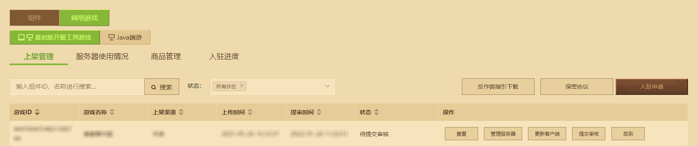
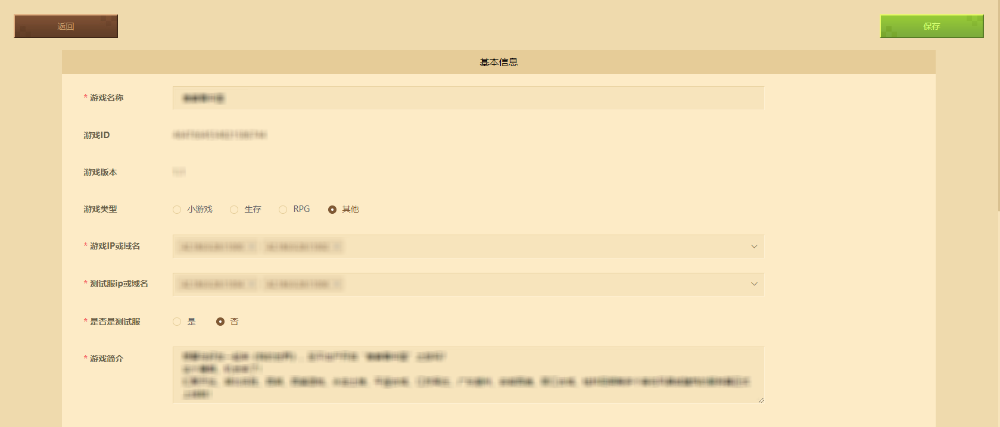
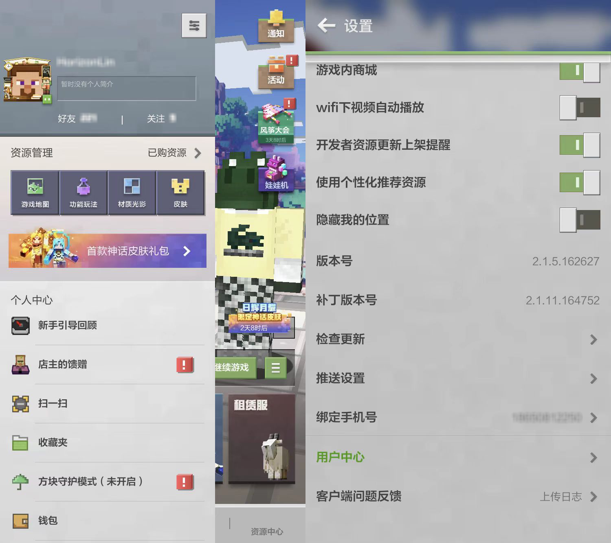
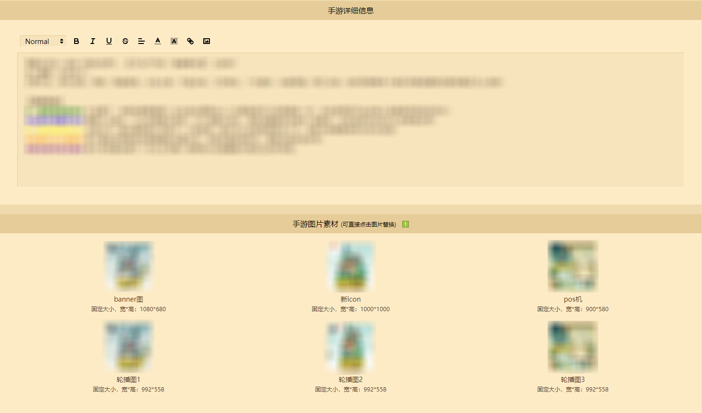
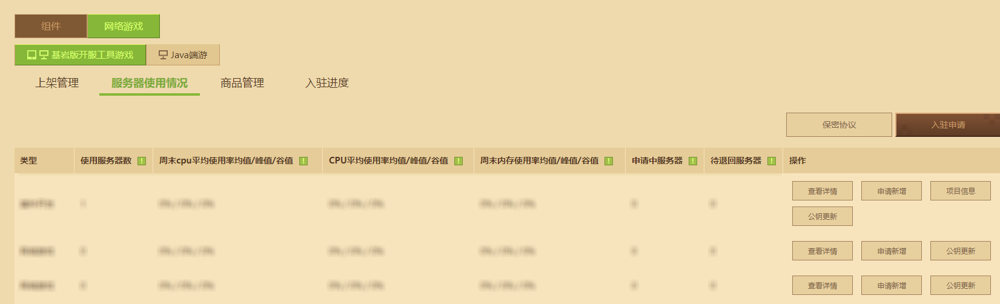
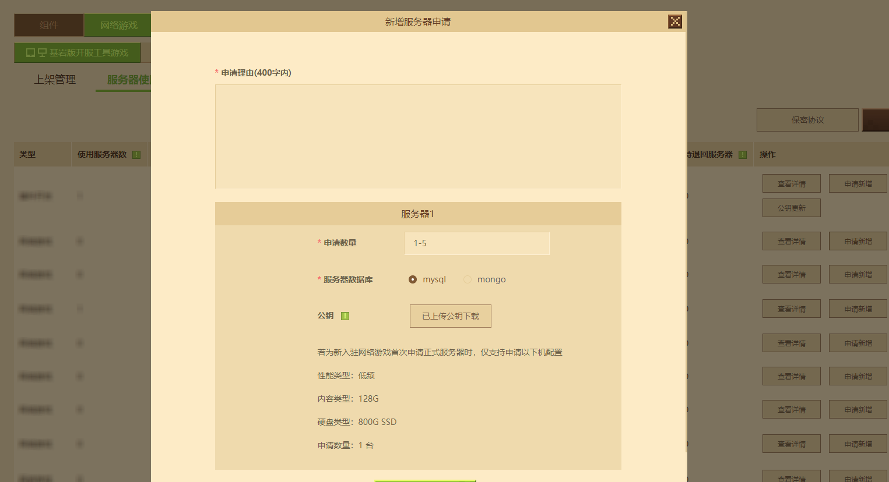
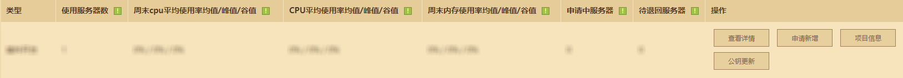

---
front:
hard: 入门
time: 10分钟
---
# 基岩版网络游戏审核与上架规范

在 **小小云服务器** 上搭建好网络游戏内容，就可以在开发者平台上自助进行网络游戏"一审"提审操作。审核通过时，开发者可以在开发者平台申请用于正式网络游戏内容搭建的正式机器。一切准备好后，再次执行提审操作进行“二审”跑测，审核通过即可进行“上架”操作。

在网络游戏运营期间，不可避免会遇到需要进行游戏内容更新、游戏Bug修复、游戏运营活动落地的需求。因此建议合理利用提审与免审上架功能，减少玩家的等待时间。

在本篇指南里你将学会：

- 进行一审提测并获得正式机器。✔
- 通过二审提测最终上架网络游戏。✔
- 学习日常提审与免审上架操作。✔

## 一审跑测操作

在测试环境里准备好等待跑测的完整游戏内容后，就可以在 **上架管理** 里为玩法跑测进行 **一审跑测操作** 。

点击 **【查看】** ，基本信息内按需填写：

- **游戏名称** ：网络游戏在网络游戏大厅内实际显示的名字。
- **游戏ID** ：网络游戏资源的唯一ID。
- **游戏版本** ：网络游戏资源的编辑版本。
- **游戏类型** ：网络游戏的游戏类型。
- **游戏IP或域名** ：绑定的正式服IP或绑定正式服IP的域名， **一审期间没有正式服务器IP可不填** 。
- **是否是测试服** ：跑测时需勾选为“是”，正式上架或日常提审时请勾选“否”。
- **游戏简介** ：提供审核人员参考的游戏资料。

**上传网络游戏** 可指定连接该网络游戏的玩家客户端版本。开发者可以在《我的世界》手机版主页点击左上角头像，点击弹出栏右上角的**【设置】** 按钮，下拉看到客户端的版本号。

**详细信息** 和 **图片素材** 可用来在网络游戏大厅内展示网络游戏简介 **（除了支持文字，还可以插入长图等富文本）** ，并为玩家展示网络游戏的Banner、Icon、Pos机与轮播图。

编辑成功后可直接点击 **【提审】** ，官方审核人员将对正式上架前的内容进行第一次审核。

## 正式服务器申请操作

在一审通过后，开发者就可以在 **服务器使用情况** 申请正式服务器。

在 **新增服务器申请** 表单中，请按实际填写服务器资源申请理由，并提供资源的申请数量、数据库种类。若在入驻时已上传正式服公钥，则公钥上传步骤跳过。

**注意：若为新入驻的网络游戏，在首次申请正式服务器时，仅支持申请以下机器配置。**

物理机发放后，开发者可以在项目信息中查到网络游戏的 **正式项目代号** 、 **数据库信息** 与 **数据监控平台** 的登录信息。有关数据库连接、数据监控平台的使用或项目代号的用途，可在<a href="../27-网络游戏/课程9：服务器上线/第1节：平台发布.html">开发者官网-开发指南-网络游戏分类</a>下找到相关教程。

## 二审跑测与上架操作

在获得正式机器后，开发者可以在将测试服的玩法转移到正式服务器中，并按照先前的 **编辑** 流程，勾选 **【是否为测试服】** 为"否"。

在 **上架管理** 操作服务器提审。目前基岩版网络游戏中心在首次上架前，还会官方审核人员进行服务器的第二次内容审核。审核通过后，即可点击 **【上架】** 按钮上架网络游戏。

点击 **【管理服务器】** ，将 **运行状态** 设置为“正常运行”。玩家评论开关可视开发者需求而定。

**至此，一个完整的基岩版网络游戏上架流程结束。**

## 日常提审与免审上架操作

网络游戏需要长线经营，在日常维护中需要新增内容或修复问题时，同样需要在开发者平台进行提审并上架的操作。

为了减轻开发者更新内容造成的审核时间成本负担，可查看<a href="../../mcguide/27-网络游戏/课程9：服务器上线/第9节：上线阶段热更.html">基岩版网络游戏开发指南-上线阶段热更</a>了解如何在不停服的情况下，将代码更新到服务器。满足热更条件时，开发者平台会自动协助提审的网络游戏触发免审机制，接着点击上架即可完成内容更新。

若某次维护不可避免地需要修改函数外实现，新增插件或引擎版本更新，则还是需要等待审核人员进行审核并通过后，方可上架。

## FAQ

### 服务器准备申请正式服务器，多久能得到一审结果？

答：服务器开发完成并自测无误后，请您在平台提交审核并联系QQ 2840356667对接上架前审核。

### 服务器准备申请正式上架，多久能得到二审结果？

答：服务器正式上架前，请您在平台提交审核并联系QQ 2840356667对接上架前审核。