# 《我的世界》中国版JAVA网络游戏入驻指南

## PC网络游戏概括

### 什么是PC网络游戏？

PC网络游戏是指开发者通过官方提供的服务器资源进行玩法搭建的多人游戏服务。可以在端游客户端左侧选单里点击【游戏中心】找到处于上线阶段的多人服务器。

网络游戏解除了本地联机的多种限制，让玩家与玩家间可以不受时间和地区因素干扰，遇见更多兴趣相投的玩家好友。

您可以前往 开发者平台 <https://mcdev.webapp.163.com/> ，通过填写各项信息从而申请入驻，详细可以翻阅下方教程。

### 入驻后优点

官方不仅能够提供一台稳定的正式机用于部署您的网络游戏、还可以提供性能更强劲的官方租赁机器为您服务器运行保驾护航。

官方还会不定期的举办活动，邀请优质服务器参与从而更进一步的提高曝光量，提高日活。

并且，您在入驻后还可以获得大量的流量扶持和稳定的现金流，显著提升您的收入水平。

相关数据:

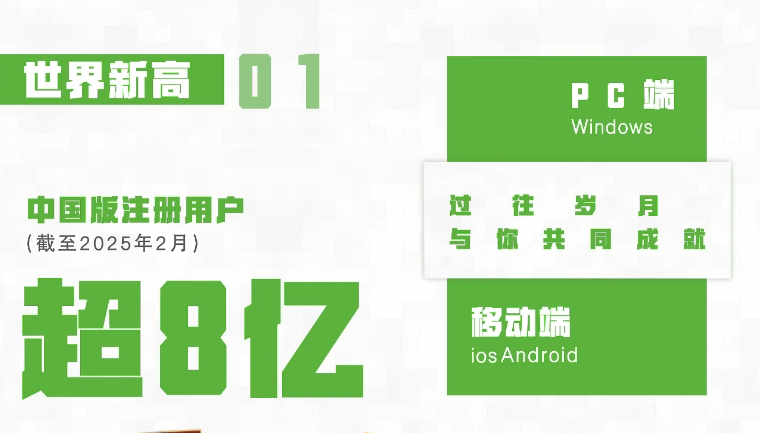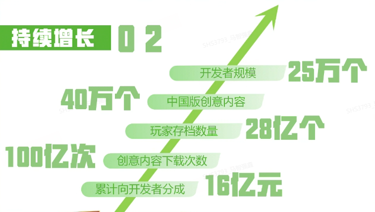

### PC网络游戏技术服务

官方会为您提供商业化接口、认证接口、端内推广位自助申请、开发者收益快速提现等技术服务。

后续还会继续扩大项管技术服务以确保您的服务器能够更好的保持长线运营。

但由于PC的工具链生态已经足够完善，开发所需要的服务端核心(Spigot、Paper) 和客户端开发库 (Forge) 还请自行准备。

## 入驻申请

### 发起入驻申请

首先前往 开发者平台 <https://mcdev.webapp.163.com/> ，注册您的开发者账号 登记您的实名认证。

找到作品管理后打开新的页面后点击网络游戏 -> 电脑版，找到 入驻申请，点击后进入入驻页面

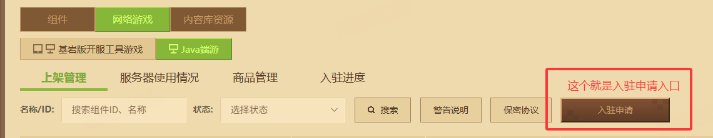

### 填写入驻服务器信息

您可以按照下方图片信息来填写入驻信息

资料填写完毕后，回到页面右上角点击【保存】可以保存申请资料。您也可以点击【立刻提交审核】进行提审。申请可以在【网络游戏入驻申请进度】进行提审、退审等操作。

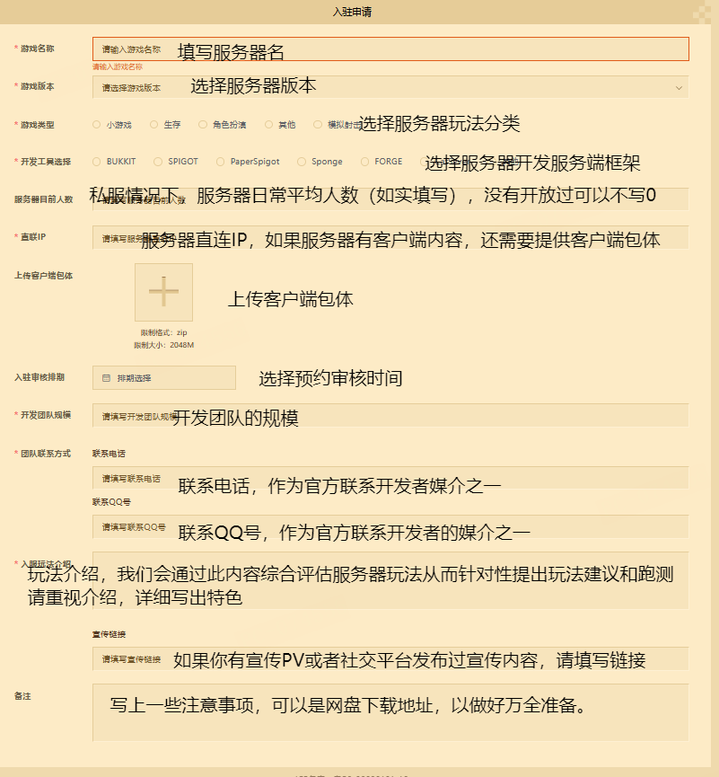

在审核表单中您可以选择预约审核时间

选择的审核日只能是下一个自然周以后可选择的时间

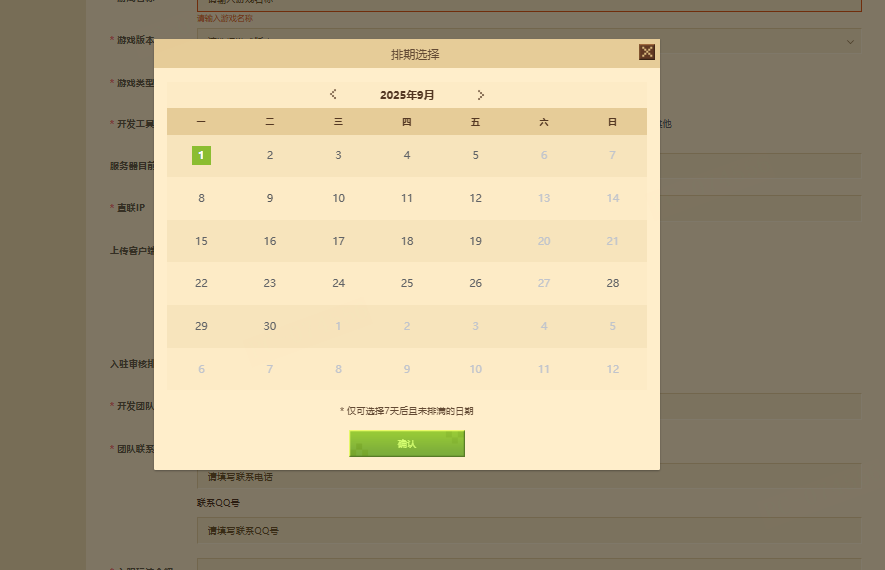

选择确认后，并且表单中的所有信息都填写完毕即可提交

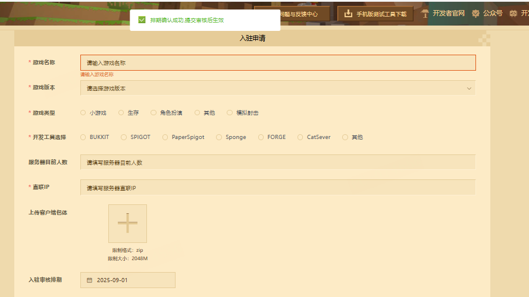

提交审核后邮件会通知你具体选择的时间

后续耐心等待即可

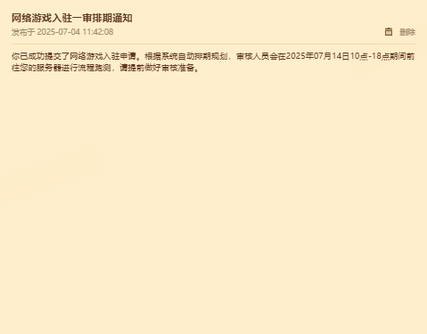

目前官方支持的版本有 1.7.10 - 1.20.1

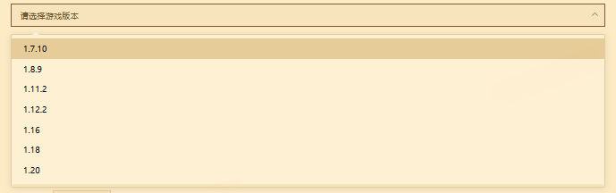

### 对接教程

#### 等待入驻审核 （一审）

当您申请入驻后，您可以点击 入驻进度 实时查看您的入驻申请进度

在审核过程中，您可以随时选择撤回申请。但请注意：一旦撤回后重新提交，您的审核批次将自动排到所有服务器队列的末尾。

因此，官方建议您在填写入驻申请页面时，务必一次性完整、准确地填写所有信息，以免影响审核进度

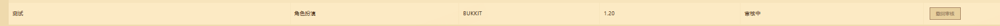

#### 入驻审核失败 （一审失败）

当您的服务器存在: 流程无法跑通、玩法同质化严重、美术资源廉价混乱等问题时将无法通过入驻审核。

审核未通过时，系统会自动发送一封入驻失败的通知邮件。

但请不要灰心，邮件会详细说明需要整改的具体问题。根据提示进行修复和优化后，便可以重修提交审核。

入驻审核不设置次数限制，欢迎您持续完善内容并再次申请。

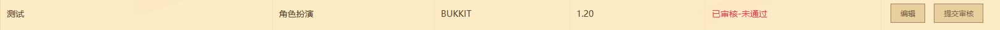

#### 入驻审核成功 （一审通过）

当您的服务器通过入驻审核后，系统会通过开发者平台邮件通知您的入驻结果，对接人员会在1-3天内主动添加您的好友

如果你没有接收到好友申请，您也可以主动添加对接人员的QQ号

对接人员的QQ号会提供在开发者邮箱中，请您按照邮件内容格式添加好友，对接人员在确认服主身份后方可同意您的申请。

**注意: 请勿将对接人员的QQ号泄露给任何人，否则官方有权对您的入驻流程进行终止。**

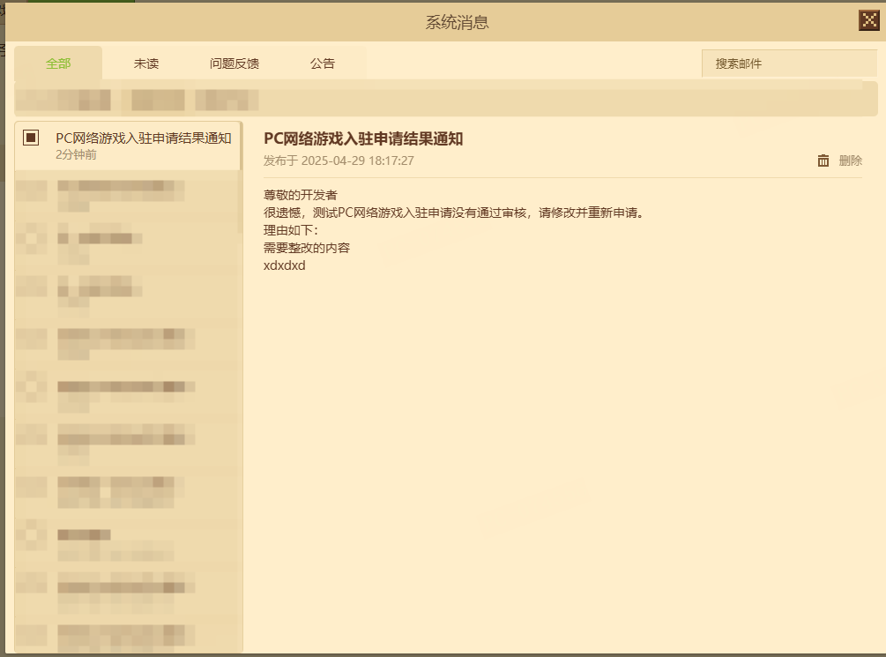

#### 申请正式机

当您一审通过后您需要主动在 网络游戏-服务器使用情况 处申请正式机

正式服请先申请新增，后续根据自身运营情况再选择租赁服务器或申请服务器

##### 关于申请类服务器

申请类服务器性能较差，但能够保障开发者的基本开服需求，满足开发者早期运营需求，随着服务器日益壮大，此类服务器可能会出现性能瓶颈。

##### 关于租赁类服务器

租赁类服务器是性能更强、配置更崭新的可选方案，开发者可以通过付费租赁此类服务器来为服务器运营保驾护航。

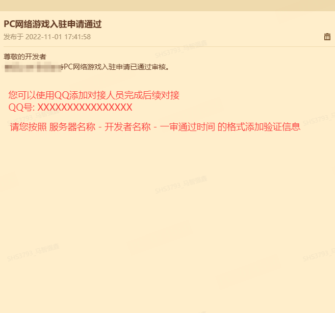

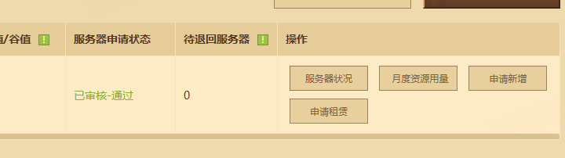

#### 选择正式机

初次申请服务器请根据您的服务器具体情况进行申请。如果您申请的服务器库存不足，官方会自动调整成其他服务器。

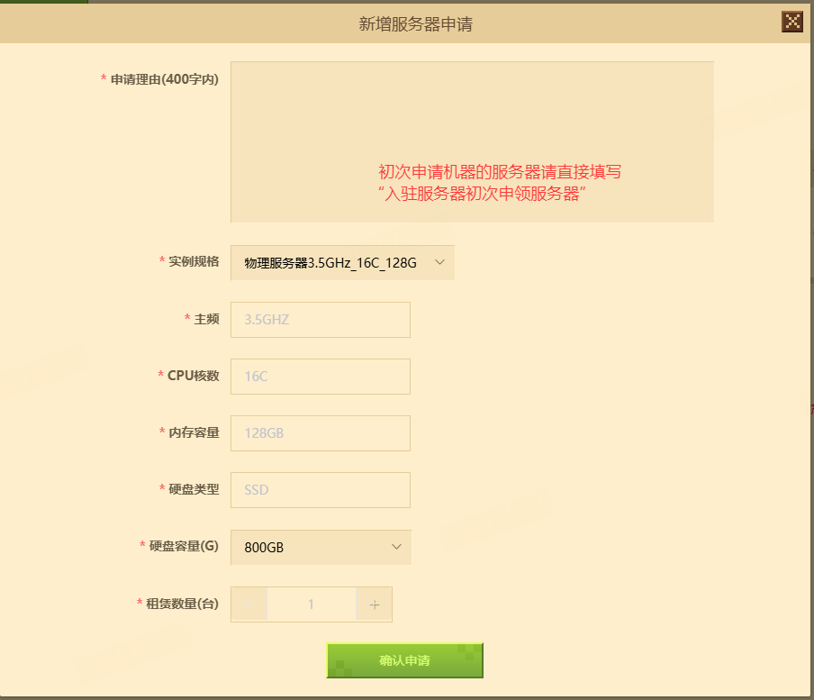

#### 服务器迁移

当您的正式服下来以后，官方会通过开发者平台邮件告知您 正式机的配置和连接信息。

您可以通过 XShell 、 XFTP 等 SSH工具来快速管理您的服务器。

第一次连接服务器您需要使用 JumpServer跳板机 来绑定您的个人信息，Jumpserver 还可以作为远程管服的一个便携式工具。

具体教程官方会在发放正式机后将教学文件发放于您。

当您一切都配置好以后，您就可以通过XFTP、JumpServer等传输工具将您的服务端上传至正式机后，配置环境后进行开服准备二审

机器默认开放25566/25565端口 作为测试服或正式服入口，额外的端口需要申请，请提前说明（比如数据库远程管理端口3306）

#### 认证接入

服务器入驻中国版时需对BungeeCord认证接入进行修改，以接入官方的认证接口。

在您服务器拿到正式机以后，官方对接人员会将文件发放于您以便对接。

**上述认证接口属于保密性质文件，官方会在发放正式机以后将参考文件全部发放于您。但一定要记住，是保密文件，请勿外传。**

#### 网络游戏配置

当您完成了认证接入以后，就需要在开发者平台配置您的服务器

在这个页面点击更新客户端，进入新的页面后进行配置

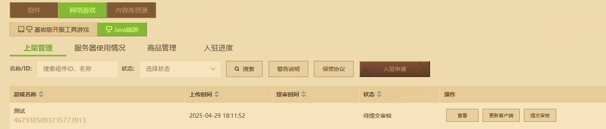

填写完成后点击保存后 开始二审

#### 内容审核 （二次审核）

本次审核主要是针对在迁移以后是否存在流程跑通的问题。

大大在迁移完服务端后，便可以在开发者平台网络游戏管理中更新客户端填写基本信息

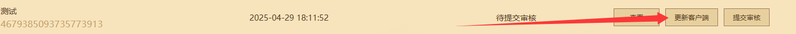

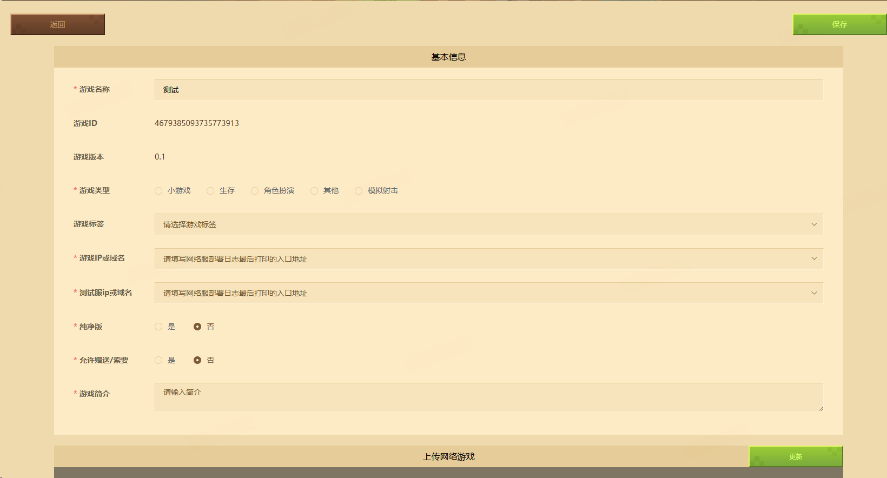

按照表单中的内容全部完成后，点击保存然后提交审核

提交审核后官方对接人员会在1-3天内主动与你沟通二审时间。

如果没有收到二审，也可以主动在对接讨论群中与官方对接人员沟通二审时间，然后进行二审。

二审通过后您便可以进行商业化对接或直接上架。

### 商业化对接与提审

商业化是非常重要的一个模块，您可以通过接入官方的商业化接口实现自助快速发货。

您在通过一审后，官方对接人员也会把商业化对接教程和商业化接口信息发放给您。

**上述商业化接口属于保密性质文件，官方会在发放正式机以后将参考文件全部发放于您。但一定要记住，是保密文件，请勿外传。**

### 正式上架

恭喜您完成上述所有内容，现在您可以直接上架，完成全部流程。

### 开发者平台资源用量统计功能

为了在后续能够更好地规范开发者的资源使用情况，帮助开发者合理地使用资源用量，助力建设更加有序的开发环境，开发者平台新增开发者平台资源用量统计功能。

**使用资源用量统计功能**

进入《我的世界》开发者平台，点击首页的**数据与收益 - 数据分析（公测）**，点击**网络游戏**选项，选择对应的**手机版**或者**电脑版**类型，然后点击**月度用量汇总**进入查看服务器资源用量的具体内容。

开发者可以通过**筛选月份筛选**，选择查看对应当月服务器在平台提供的各资源的具体用量情况。

## FAQ

Q: 官方提供的服务器是什么系统的？

A: 官方提供的服务器是Linux系统，官方也注意到很多私服服主仅接触过WINDOWS SERVER系统。所以官方推荐在您一审通过后尽可能的学习Linux的一些基础运维知识确保后续运营不会出现严重的问题。

Q: 预约审核的时间突然感觉不合适，如何更改？

A: 您可以撤回审核，然后重新选择预约时间即可

Q: 我的审核时间中途被更改了是怎么回事？

A: 这是由于你选择的那一天，审核人员有其他事务需要处理，无法准时审核，所以我们这边便会主动修改你的审核日期

Q: 为什么我选择预约时间后，提交审核提示位置不够后，我再选择会提示重复名称？

A: 这是我们系统的一个小瑕疵，开发者可以通过修改服务器名来规避内容，后续我们会将此内容进行优化

Q: 入驻申请是否会产生费用呢，是否需要押金呢？

A: 您在入驻申请 到 正式上架，官方都不会收取费用，也不会收取押金。

Q: 入驻服务器有没有名额限制？

A: 原则上官方不会设置入驻申请数量限制，但后续官方还是会根据您之前服务器的运营情况进行综合评判。

Q: 我入驻网络游戏需要自备机器吗？

A: 没有，服主第一次入驻官方会免费发放一台正式机用于使用，但正式机的性能比较差可能会对后续长期运营造成一定影响。

Q: 那后续如果服务器性能出现瓶颈怎么办？

A: 您可以继续申请一台低频率的正式机，也可以选择租赁性能非常强劲的租赁物理机。

Q: 入驻一审一直失败会不会影响后续评分？

A: 原则上不会影响后续评分，但官方希望您能够避免多次审核，尽量一次性把缺点修改。

Q: 我入驻可以用其他人的服务端进行提审，然后上架后更换吗？

A: 这个是红线行为，官方决不允许此类情况的发生，一经发现官方将按照规程进行处罚。

还希望开发者能够用自己创造的世界去给冒险家们提供服务。

Q: 入驻的新服有什么流量扶持呢？

A:

1、当服务器正式上架以后，您可以主动申请 游戏中心、精彩世界、弹窗 其中一个进行推广，第一次申请的服务器无需写更新内容，只需要写上是第一次服务器申请。

2、开发者还可以申请近期推荐进行新服推广，持续 一个月。

3、上述流量扶持完全免费，不会产生任何费用，后续推广则需要开发者自行根据更新需求写上以后进行申请了哦。

4、对于热门服和讨论度极高的服务器入驻以后，官方还会有特殊的流量扶持流程为您的服务器提高核心竞争力。

推广位详情可以查看开发者文档中的 活动、推广与收益。
