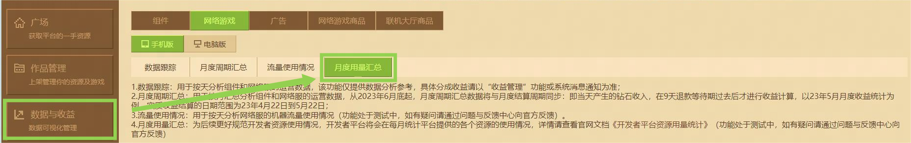

# 《我的世界》中国版JAVA网络游戏入驻指南

#### PC网络游戏概述

#### 什么是PC网络游戏？

PC网络游戏是指开发者通过官方提供的服务器资源进行玩法搭建的多人游戏服务。可以在端游客户端左侧选单里点击【游戏中心】找到处于上线阶段的多人服务器。

网络游戏解除了本地联机的多种限制，让玩家与玩家间可以不受时间和地区因素干扰，遇见更多兴趣相投的玩家好友。

#### 网络游戏使用的工具

中国版官方不提供对JAVA版服务器开发工具的技术支持和技术指导。开发爱好者们可选择第三方稳定工具进行服务器开发，例如Bukkit、Forge等。

#### 如何发起入驻申请

#### PC网络游戏入驻页：

使用开发者账号登录开发者平台：[https://mcdev.webapp.163.com/](https://mcdev.webapp.163.com/)。接着点击首页的【作品管理】，版本会选择【PC端】。接着点击【网络游戏】选项即可在旁边看到【入驻申请】入口，单击即可进入入驻申请页。

#### PC网络游戏入驻申请页：

1) 进入PC网络游戏入驻申请页面后，请您请如实并详细进行信息填写，审核人员将根据填写资料了解开发者开发能力是否足够支撑开发与持续维护网络游戏，进行资格入驻发放。注意：当前服务器入驻版本只支持到1.12.2及以下版本。同时若您能提供一个完整的DEMO客户端和直连的体验服务器，这将能够让审核人员快速直接进行游戏状况的体验，后续流程更高效。

2) 资料填写完毕后，回到页面右上角点击【保存】可以保存申请资料。您也可以点击【立刻提交审核】进行提审。申请可以在【网络游戏入驻申请进度】进行提审、退审等操作。

#### PC网络游戏提审/上架操作：

1) 入驻审核通过后，您可以在【服务器使用情况】分栏内可以申请上线需要用到的正式物理机。同时平台会收集机器资源占用率并更新列表内的相关信息，方便服主根据服务器承载能力来调配机器资源。

2) 收到物理机审核通过的结果后，可以进入【网络游戏上架管理】分栏内对相应的网络游戏进行客户端的配布与更新。

3) 当上述步骤全部完成后，您可以在【网络游戏上架管理】分栏内管理服务器，设置服务器运行的状态、更新公告以及开启白名单功能，白名单下输入的每个玩家ID后面使用英文逗号分隔。若无其他情况，即可点击【提交审核】进行上架审核。

#### 开发者平台资源用量统计功能 

为了在后续能够更好地规范开发者的资源使用情况，帮助开发者合理地使用资源用量，助力建设更加有序的开发环境，开发者平台新增开发者平台资源用量统计功能。

**使用资源用量统计功能**

进入《我的世界》开发者平台，点击首页的 **数据与收益 - 数据分析（公测）**，点击**网络游戏**选项，选择对应的**手机版**或者**电脑版**类型，然后点击**月度用量汇总**进入查看服务器资源用量的具体内容。

开发者可以通过**筛选月份筛选**，选择查看对应当月服务器在平台提供的各资源的具体用量情况。

#### FAQ

#### 我提交网络游戏入驻申请时是否需要提交押金？

答：您入驻申请时不需要提交任何押金。

#### 我入驻网络游戏时是否需要自备机器？

答：不需要。官方会对入住审核通过的开发者提供正式物理机开展网络游戏服务。

#### 我申请的服务器名额是否有数量上限？

答：原则上申请入驻游戏没有数量上线，但入驻审核会根据入驻申请数量与情况、以及已通过入驻申请网络游戏的经营情况决定是否通过后续的入驻游戏申请。

#### 月度资源用量功能上线后，我能在每月的几号查询到服务器上月的资源用量？

答：月度资源用量功能上线后，开发者可以在每月上旬查看上个月的用量情况。

