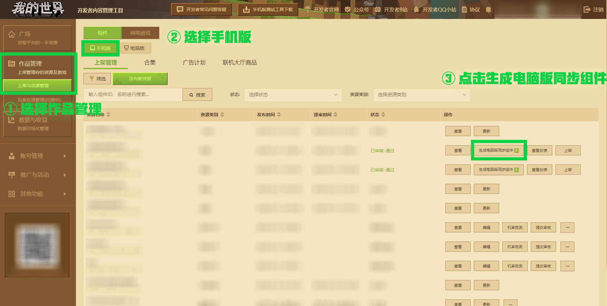
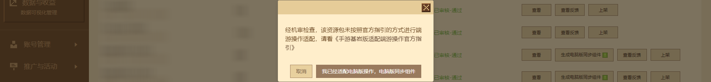

# 一键同步手机版组件至电脑版组件中心功能介绍

**手机版组件** 是由开发者上传至手机基岩版资源中心的作品资源，其涵盖 **皮肤组件** 、**材质纹理组件**、**功能玩法组件**、**地图组件**、**光影组件**等类型。

借助我的世界基岩版跨平台的特点，开发者只需将手机版组件上架至电脑版平台，电脑基岩版玩家也可以享受到同样的乐趣，并且获得更多的收益和好评。

新版 **【一键同步手机版组件至电脑版组件中心】** 功能优化了不同平台间基岩版作品的同步流程体验，其中主要包括：

- **更加醒目的同步入口**。**手机版组件** 查看页面内的 **【生成电脑版同步组件】** 按钮移动到 **手机版组件列表页** ，所有 **未同步到电脑版组件中心且已通过审核** 的组件作品都会出现 **【生成电脑版同步组件】** 按钮。
- **友好的悬浮气泡式引导**。同步上架到电脑版基岩版的组件可能存在用户终端输入适配的问题，如：在手机上可使用手势触发的按钮逻辑，在电脑版上需要匹配到按键或鼠标。现在 **【生成电脑版同步组件】**  按钮旁的 **悬浮气泡** 提示会引导至 **【手游基岩版适配端游操作官方指引】** 文档。
- **对同步来源进行闭环**。同步后的电脑版基岩版同款组件将展示同步来源的 **手机版组件** ID，之后每次操作手机版组件上架时，会自动同步手机版组件的资源包体、资源定价等相关设置到电脑版组件中。

## 学会使用生成电脑版同步组件功能

进入《我的世界》开发者平台，点击【作品管理】，选择【资源】为分页标签，并选择【手机版】作品平台。

在手机版组件列表页内，可以在 **【已审核-通过】** 的组件作品操作栏位旁选择 **【生成电脑版同步组件】** 。

点击按钮，会弹出确认窗口。再次确认组件已适配电脑操作模式后，点击 **【我已适配电脑版操作，电脑版同步组件】** ，则当前页面将跳转至电脑版平台资源编辑页。若对于双端适配没有把握，请参考 [电脑基岩版适配电脑操作指引](../20-玩法开发/19-手机电脑适配/1-PE模组适配PC.html)。

**【同步来源手机版组件ID】** 表示组件同步后的手机版组件来源，并且不支持修改，目前仅作为判断组件同步来源归属。 **【组件名称】** 则会与原先的手机版组件保持同名，因此，若电脑版组件中心已存在上架的同名组件，同步后的电脑版组件资源将无法保存。请修改原始的手机版组件名称后再进行同步操作。

同时，**【是否为原创内容与授权证明】、【资源定价】、【组件一级类别】、【作品资源包体】和【适用版本】** 字段或选项也不支持修改，这些基本信息将与同步的手机版组件信息保持一致。

电脑版平台资源还允许设置组件作品的**【组件标签】、【是否含有地图】、【组件二级类别】、【添加百科词条】和【前置组件】**，对于未使用过电脑版组件中心的开发者，可以参考下方表格了解对应用途：

| 编辑名称     | 编辑说明                                                     |
| ------------ | ------------------------------------------------------------ |
| 前置组件     | 表示玩家必须拥有这款组件后才能在世界中加入基于它创作的组件资源。因此若有此类需求，请务必优先完善此段信息。 **注：前置组件必须是已上架端游版组件中心的组件，否则无法在配置栏位中获取到它的组件信息。** |
| 组件二级类别 | 端游版组件中心的 **【全部组件】** 栏目下，使用组件二级分类为不同资源类型的组件进行再分类。 **如：标记为【工具类】的功能玩法，很可能是辅助生存类型的玩法组件。** |
| 是否含有地图 | 若组件作品带有地图，请记得勾选该选项。                       |
| 添加百科词条 | 如果该组件在[MC百科](http://www.mcmod.cn/)存在相应词条，输入并选中组件名称，即可将该词条详情加载进组件详情-百科资料位置。请保证组件名称一致。 |

更多有关电脑版平台组件编辑的内容，请参考 [教学中心-开发者平台-正确上传作品的方式及途径](./课程05-正确上传作品的方式及途径.html)。在检查完毕后，点击【保存】按钮即可保存同步后的电脑版基岩版组件，在 **电脑版组件列表页提审组件** 后，审核通过即可上架。之后玩家便可在一端上购买同步组件后，在另一端根据购买记录畅玩关联组件。

## 同步功能常见问题答疑

### 为什么已创建的手机版组件没有显示【生成电脑版同步组件】按钮呢？

答：手机版组件必须在过审后才会在手机组件列表页下显示对应的 **【生成电脑版同步组件】** 按钮。

### 同步后的电脑基岩版组件是否可以直接上架呢？

答：还需要提交审核后，经过审核同意才能上架。

### 删除电脑版基岩版同步组件后，还可以再次同步原始的手机版组件至电脑版平台吗？

答：是可以的。删除电脑基岩版同步组件后，原始的手机版组件会在 **【已审核-通过】** 状态下再次显示 **【生成电脑版同步组件】** 按钮。