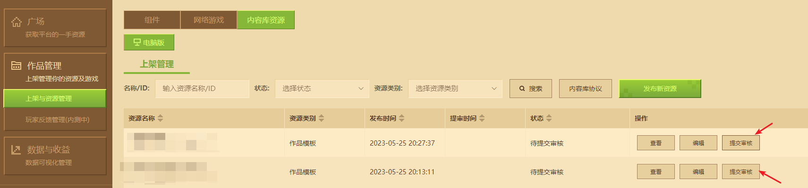

# 内容库资源投递指南


## 一、什么是内容库
内容库是一个在线的免费开发资源库，存放了附加包配置，预设零件，结构素材，特效贴图等一切与开发者组件和服务器游戏相关的资源，这些资源可供开发者们灵活改编和复用，主力开发者更快制作出更好的开发者组件和服务器游戏，具体使用请参考[内容库使用说明](../15-资源管理/11-内容库.md)，在此文档，我们将主要介绍如何投递内容库资源。

## 二、资源分类
内容库资源分为**资源包**、**作品模板**和**其他**三个类型：
- 资源包:可直接导入到当前已有作品的资源包文件（.mep后缀），通常是一些可以直接让开发者在已有作品内使用后的零件、贴图、结构等等。
- 作品模板：等同于普通的组件，可直接导入到开发者的工作台成为一个作品，与新建作品的参考模板类似，通常是一个完善的示例或玩法模板，如起床战争，空岛生存等等。
- 其他：无法直接用于编辑器，但对模组开发仍有帮助的第三方格式的模型、工具、示例等资源。


## 三、投递指南
1. 根据投递类型准备好对于的资源包体，保存为mep（资源包）或zip格式（作品模板和其他）。
2. 进入开发者[内容管理平台](https://mcdev.webapp.163.com/)→上架与资源管理→内容库资源→上架管理→发布新资源，如下图：


3. 填写资源相关信息
```
资源名称：填写一个最符合资源内容的名称，不超过20字符
资源简介：填写资源的相关信息，包括但不限于以下内容
        1.包体主要内容
        2.资源使用方式
        3.作者介绍
        4.联系方式
资源类型：投递资源包时，这里应该选择资源包
资源标签：选择最适合你的资源的标签，不超过5个。
提交备注：不超过1000字符
```


4. 上传资源宣传图，展示资源的主要内容，可以参考现有内容库资源的宣传图。


5. 上传准备好的资源包体文件，仅支持100M以内的MEP/ZIP格式。
> 一般来说，通过编辑器快捷发布的资源，都会自动打包并上传，如有更新，可以点击【选择文件】重新选择包体。


6. 点击页面右上角的保存

7.  进入内容库资源的上架管理页，点击提交审核



8. 经过系统校验→人工审核之后，就可以在上架管理中点击上架


9. 已上架的资源可以点击更新按钮进行内容修改


## 四、快速发布指南
对于资源包和作品模板，我的世界开发工作台提供了一键发布的快捷方式，详见下方说明：

### 1. 资源包快捷发布
1. 编辑器打开想要投递的作品
2. 点击导出按钮
3. 勾选对应的文件资源
4. 点击【发布到内容库按钮】


5. 在弹出的文件对话框选择导出路径

6. 点击成功弹窗前往开发者内容管理平台填写资源相关信息，如下图所示：


### 2. 作品模板快捷发布
1. 在我的世界开发工作台准备好投递的附加包或地图作品
2. 在作品的更多菜单找到【发布为内容库资源】选项并点击


3. 等待上传成功后，自动跳转至发布页。

> 其他类型的资源仅支持到[开发者内容管理平台](https://mcdev.webapp.163.com/)手动上传包体进行投稿。


## 五、自行测试
1. 开发者在内容库资源上架管理页的所有作品，都可以在内容库的【我的资源】分页进行查看、下载和测试，如下图：


## 六、注意事项
1. 发布内容库资源的开发者需要阅读并同意内容库发布协议，详见上架管理页的【内容库协议】按钮，如下图：


2. 若已上架的组件出现侵权、违规等问题，将会被采取弱下架等处理措施，资源将变回待提审状态。
3. 若您发布的资源被其他开发者违规使用，请通过开发者平台向我们[反馈](https://mcdev.webapp.163.com/#/feedbackModal)。

