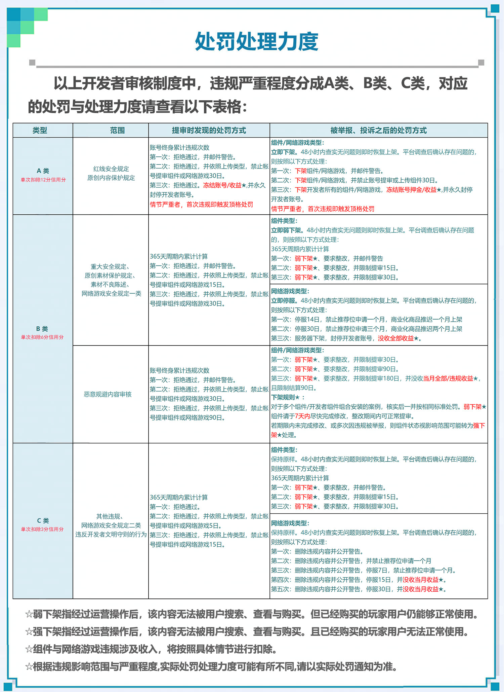

# 开发者内容审核制度介绍

阶段目标：了解开发者内容审核制度

TAG：内容审核 制度

## 了解开发者内容审核制度

亲爱的开发者们：

网易《我的世界》中国版建立的开发者制度体系，旨在保护游戏玩家尤其是“未成年”玩家体验及信息安全，同时为开发者创造良性发展的市场环境，帮助开发者展现创意与获取收益。我们正式确立了新版《开发者内容审核制度》，旨在维护每位开发者的权益，给予玩家用户更好的游戏体验。该制度于2021年1月18号正式启用生效。

 以下是新版《开发者内容审核制度》的完整内容：

## 内容安全制度

网易《我的世界》中国版为开发者们提供了广阔的创作空间，但涉及政治、色情、侵权或其他违法违规内容，则严重影响着玩家的游戏体验与身心健康，威胁其他开发者的创作自由；开发与提交资源前，请务必避免触犯以下内容：

### 1. 红线安全规定

**政治敏感类**：

不得存在反政府、反社会、反动性质、侮辱国家领导人、扰乱国家统一与稳定等政治敏感内容成分，不得出现国旗、党旗、国徽等政治敏感标志与符号。

**色情类：**

不得存在暴露、色情、挑逗、色情交易情节等色情或具有色情诱导倾向的相关内容。

**仇恨言论类：**

不得存在针对特定群体（如民族群体、弱势群体）、战争历史的攻击、诽谤、仇恨、嘲弄等相关内容，不得出现战争/历史等敏感内容。

### 2. 重大安全规定

**恐怖暴力：**

限制出现恐怖暴力情节与内容，尤其是惊悚、恐怖、枪支等题材的使用。

**不良引导：**

不得出现自杀、校园暴力、高恐坠落、不文明用语、性暗示语言等不利于未成年人成长、及有不良暗示或引导的情节与内容。

**赌博：**

不得使用任何真实或虚拟货币进行赌博、博彩、竞猜、夺宝或其他形式的随机抽取活动。

**侵犯版权与IP、不正当竞争：**

不得搬运有版权的组件，以及引用、使用其他未经授权的他人作品，或未经授权对他人作品进行改编等等，或者存在任何涉嫌不正当竞争的内容。

**违背法律法规：**

不得使用任何违反国家法律、法规、行政命令的内容。

**违背公序良俗：**

不得使用任何影响国家社会公共秩序与公共道德的内容。

**使用未经允许的接口和模块：**

不得使用未经允许的接口和模块。

### 3. 网络游戏服务安全规定

其中根据网络游戏的特性，有以下两类特有网络游戏审核规定

**一类：**

**违规付费行为：**

禁止以平台/卡密充值途径、私人赞助或线下交易等违规付费行为。

**违规篡改服务器数据：**

禁止通过非正常手段篡改服务器数据，例如：

​                                                                        通过机器人挂机等方式虚增在线人数

​                                                                        违反 [互通人数显示规则](../27-网络游戏/课程9：服务器上线/第6节：在线人数显示.md)，将在线人数进行合并统计

**二类**：

**违规外部引流**：

禁止出现非中国版的服务器游戏宣传广告/违规外链。

**违规敏感内容：**

禁止出现如色情、政治等违规内容或其他违规行为。

**违规抄袭内容：**

禁止抄袭、盗用等侵权行为。

**违规虚假内容：**

禁止上传与提审内容不一致的游戏内容，含有枪械的游戏内容也同样不允许上传和上架。

**违规拖延行为：**

受到整改处罚的网络游戏开发者，不得私自拖延整改时间，超时亦判定为违规行为。

**违规商业化行为：**

禁止不按照商业化指南进行商业化的行为。

处罚与举报方式请看[【处罚与举报】](#处罚与举报)。

## 内容上架要求

为保证平台内容质量，促进开发者生态良性发展，上架在网易《我的世界》中国版的内容需要满足以下内容本身、内容素材、定价的要求：

### 1. 内容基本要求

**严查影响平衡性内容**
对于会严重影响功能平衡性的内容如矿透、永久夜视、皮肤过多透明部分等内容的审核将更为严格。
**确认基本功能保障**
请使用开发者工具进行自测，确认无误后方可上传，以确保组件/地图内容/add等资源的正常运作，同时确保贴图、皮肤等正常、完整显示，语言无障碍。

### 2. 素材不良陈述

内容素材是玩家理解内容本身的重要途径，以下状况则判定为素材的不良陈述：

**虚假宣传：**

对相关素材没有进行如实描述、隐瞒目前内容的重要真实情况，或存在宣传与目前实际内容现状不符的、宣传后续再更新迭代内容的情况。

**流量外引：**

未经许可，使用包含不限于QQ、微信、微博、二维码、外部链接、直播平台、租赁服宣传、线下交易内容等外部诱导内容的情况。

**恶意诱导：**

出现包括不限于购买赠送、好评送红包、分享裂变等疑似恶意诱导行为出现。

**原创度低：**

素材使用过多原版贴图，或与已存在的同类型组件相似，原创性与功能性不足。

### 3. 绕开、规避或对抗内容审核规则行为

开发者提交审核的内容应与实际发布、呈现的内容一致。开发者不得通过特殊技术或其他手段，绕开、规避、对抗内容审核规则的监管，包括但不限于以下行为：

（1）通过特殊技术手段绕开审核：

* 通过主包副包/前置组件等方式组合安装得以重现违规内容。
* 通过自定义的特殊指令或道具组合调用显示隐藏内容。
* 通过JSON，命令方块等方式重现违规内容。（如，拼接贴图、地图画等）。
* 游戏内加入自定义功能还原违规内容，如支持生物改色、部件组装枪械/军事车辆等。

（2）控制其他账号规避、对抗审核：

* 处罚期间通过控制其他账号上传相同、相似的内容。
* 恶意制造舆论，煽动玩家情绪对抗审核，如在官方社媒/社群、公共沟通账号、开发者平台等，对审核人员进行人身攻击与恶意辱骂。

（3）其他绕开、规避、对抗内容审核规则监管，扰乱平台正常秩序及游戏正常运营的行为

注：平台将根据实际违规情况，对涉事账号及其他关联账号进行处罚。

处罚与举报方式请见下方[【处罚与举报】](#处罚与举报)。

## 原创保护制度

为了维护开发者生态的健康发展，网易《我的世界》中国版将不留余力保护原创内容，坚决打击各种侵犯他人权益的行为，针对原创保护有以下两大制度规定：

### 1. 原创内容保护规定

开发者组件的代码、内容中开发者首次独创的部分（包括人物形象设计、场景设计、艺术风格设计等），属于开发者原创内容，其它开发者不得进行任何形式的抄袭行为。

### 2. 原创素材保护规定

内容素材中开发者首次独创的部分，包括介绍视频、介绍图片、内容名称、内容描述、内容关键词等，属于开发者原创素材，若出现与原创素材相同或过分相似，则属于违反原创素材保护规定。

处罚与举报方式请见下方[【处罚与举报】](#处罚与举报)。

## 处罚与举报

违反开发者内容审核制度的开发者，将会按照[【处罚处理力度】](#处罚处理力度)进行处罚处理；若发现开发者有违反内容审核制度或侵权行为，可以通过网易我的世界手游或端游客户端的举报功能进行举报。

### 1. 处罚处理力度

### 2. 举报：

**如何举报抄袭、盗版、侵权的组件？**
答：《我的世界》中国版获得微软正版授权，对开发者版权保护也极为重视，严厉打击盗版及侵权行为。对于触犯版权保护的行为，一旦证实，将被冻结相关收益、押金，严重者将永久封禁开发者账号。

如需举报，请提供被盗图作品的相应证据（链接地址、截图等）到论坛，按照以下格式在[问题与反馈中心](https://mcdev.webapp.163.com/#/feedbackModal?target=browser)选择 **反馈类型-抄袭举报** 进⾏举报：

以截图为主，文字为辅，包括但不限于：

1. 设计雷同，涉嫌抄袭。
2. 组件中有其他创作者的签名或标记。
3. 其他平台作者有上传时间更早的相同组件。

以上为新版《开发者内容审核制度》的全部内容。感谢开发者们对该制度提出宝贵建议，我们将严格执行，与您共同打造一个优质、公平、健康、高效的内容创作平台。如有任何疑问，欢迎您通过[问题与反馈中心](https://mcdev.webapp.163.com/#/feedbackModal?target=browser)与我们联系。