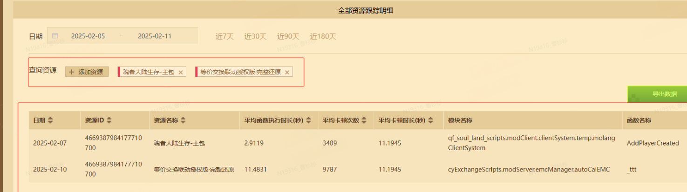
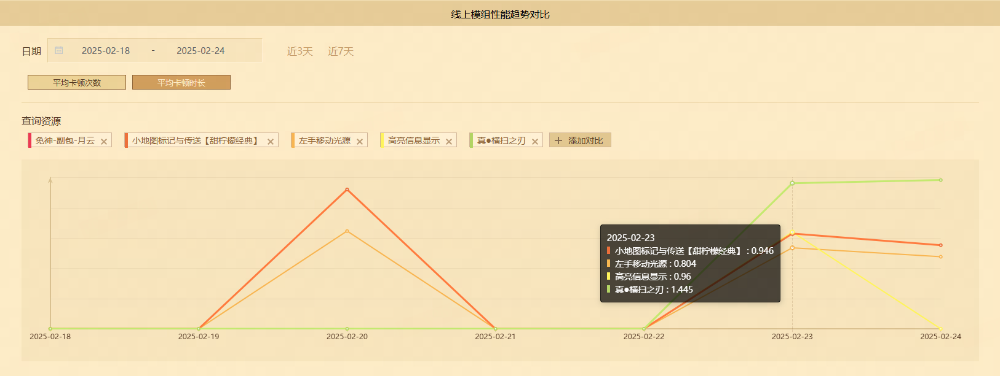
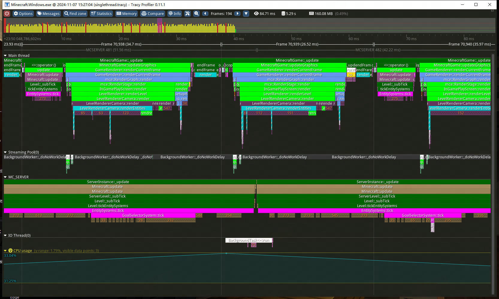
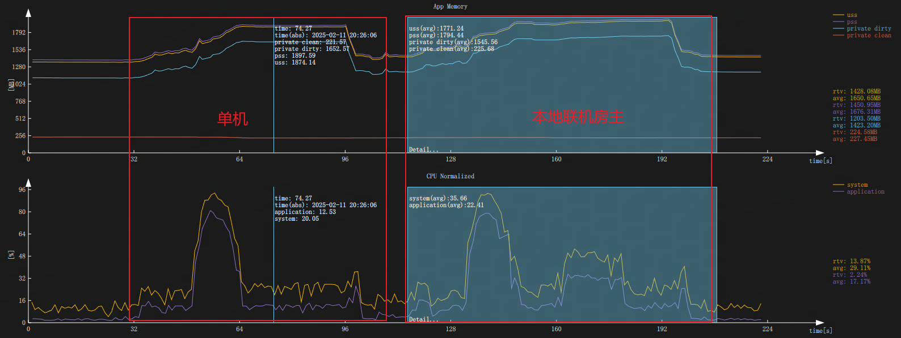

# 机器审核流程及指标介绍

目前机审的流程主要由以下几个步骤构成：

- 代码机审
- 组件核价
- 性能检测

## 代码机审

系统对上传的包体进行静态代码审核，检测是否存在违规代码、恶意脚本或不符合规范的代码结构。此步骤的作用是确保组件的代码安全性和规范性，避免潜在的安全风险。

若代码机审不通过，将返回平台内机审邮件，请在开发者平台右上角邮箱处查收。并根据[打包错误信息文档](../50-常见问题答疑/60-我的世界中国版打包错误信息汇整.html)的提示进行调整。

## 组件核价

系统根据组件的复杂度、资源占用情况等因素，自动生成组件的最低定价标准。

如果开发者提审时的最终售价（包括折扣）小于推荐区间的最低价格，则以开发者平台站内信的方式通知开发者进行定价更改。

此步骤的作用是根据标准限定售卖价格区间，消除当前存在的价格内卷现象，使整体市场的售卖价格趋向合理和体系化。

## 性能检测

开发者上传包体后，系统自动将包体上传至手机测试集群环境，模拟玩家操作进行性能测试，主要检测进入时长、内存占用、平均帧率三个指标是否符合要求。避免因性能问题导致玩家体验下降，确保组件在不同设备上都能流畅运行。

从组件的运行周期来看，主要由启动和运行两个阶段产生性能问题。

- 启动阶段：启动加载时长和组件大小，该数据将显著影响用户成功进入游戏的意愿
- 运行阶段：内存峰值、CPU占用、体验流畅度（帧率、卡顿）等
- 其他兼容性问题，包括脚本代码错误

### 线上性能数据

截至2025.3.5，对线上存量组件，进行性能测试，性能分布情况如下：

| 性能指标         | 指标范围  | 占比     | 机审拦截 |
| ---------------- | --------- | -------- | -------- |
| 平均帧率         | [0,10]    | 0.04%    | 是       |
|                  | (10,30]   | 0.22%    | 是       |
|                  | (30,40]   | 0.48%    | 是       |
|                  | (40,~)    | 99.26%   |          |
| 加载时长（秒）   | [0,10]    | 97.52%   |          |
|                  | (10,60]   | 0.66%    |          |
|                  | (60,120]  | 0.09%    |          |
|                  | (120,~)   | 0.07%    | 是       |
| 内存峰值（MB）   | [0,150]   | 88.88%   |          |
|                  | (150,450] | 9.33%    |          |
|                  | (450,950] | 1.58%    | 是       |
|                  | (950,1250]| 0.09%    | 是       |
|                  | (1250,~)  | 0.12%    | 是       |

注：上述数据基于多台中端机设备（高通 骁龙778G，高通 骁龙765G，MTK 天玑900，海思 Kirin 980）跑测结果，具备一定参考价值，但不同的玩家设备，操作系统版本，会略有差别。

### 组件性能标准

结合现状和线上玩家设备情况，组件性能标准如下

| 阶段     | 指标           | 优秀       | 平台建议   | 达标      |
| -------- | -------------- | ---------- | ---------- | --------- |
| 启动阶段 | 加载时长（秒） | <10        | <60        | <120      |
| 测试阶段 | 内存峰值（MB） | <150       | <300       | <450      |
|          | 平均帧率       | >55        | >50        | >40       |
| 线上数据 | 平均卡顿次数   | /          | /          | /         |

### 核心指标介绍

- 内存峰值：组件内存占用超过设备阈值时，可能引发崩溃等问题，严重影响用户体验。
- 平均帧率：低帧率会使游戏画面卡顿，影响流畅性，严重影响用户体验。
- 平均卡顿次数：卡顿会导致游戏画面不流畅，进而影响玩家的体验，严重时甚至可能破坏整个游戏的乐趣。为了评估卡顿情况，我们会记录线上Python执行时间时长超过一定时间的函数，并在一定时间范围内计算其平均发生次数。

### 评测环境与方法

我们主要从开发、审核和线上三个环境进行评测。

- 在开发阶段，核心指标为内存、帧率和卡顿次数。开发者可使用Airperf和Tracy工具来监测内存、帧率和卡顿情况，并进行优化，确保玩家能有高质量性能体验。
- 在审核阶段，我们将对组件进行核心指标性能测试，性能不达标的组件将被拒审。因此，开发者需在开发阶段进行自查，确保审核顺利通过。
- 在线上环境，我们将采集玩家的帧率、内存和卡顿情况，以验证组件的性能。开发者可以通过开发者平台性能看板查看这些性能数据。

### 开发者工具指引

为了帮助开发者发现和解决性能问题，我的世界开发组提供了相应工具，以提高问题排查和解决的效率，详见[性能监测与调试](../30-测试/5-性能监测与调试工具.md)。

#### 开发者平台

后台展示了线上帧率，卡顿情况，可以查看和验证线上问题情况，效果如下图：

#### 方块探针（Tracy）

卡顿排查工具，可以逐帧分析函数耗时，定位高消耗函数，帮助发现和解决问题，效果如下图

#### 方块易测（Airperf）

基础性能检测工具，可以抓取帧率，内存等数据，用于自测是否达标，效果如下图：

