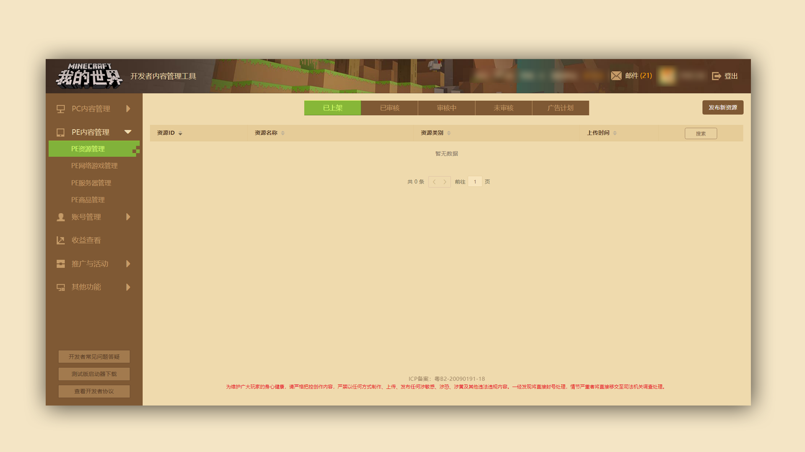
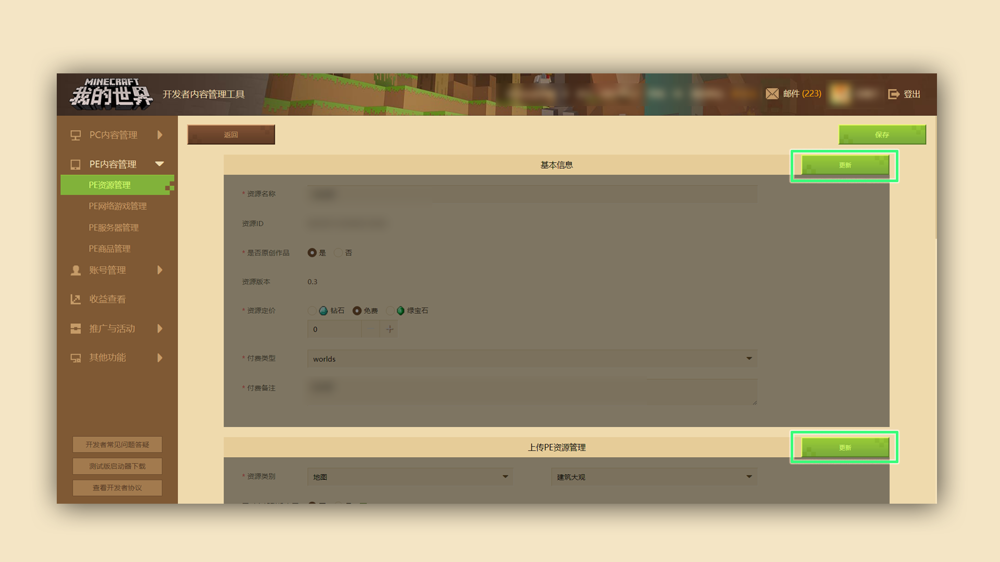
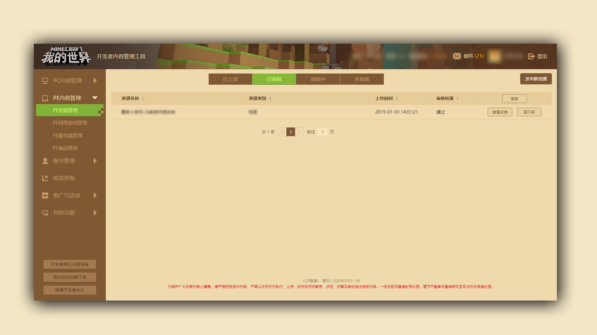

# 下架作品的方式方法（不包含服务器）

### 阶段目标：成功对作品进行弱下架

#### TAG：下架

#### 阶段结构：

#### 第一阶段：了解并找到下架作品的位置

#### 第二阶段：理解“弱下架”的含义

***

本教程以PE内容为例，PE内容操作方式与PE内容相同。

前往开发者平台【PE资源管理】模块，点击“已上架”按钮，在列表中找到需要下架的组件资源，并点击“更新”按钮：

下拉编辑页面，找到“上架设置”模块，点击“更新”：

在是否弱下架选择“是”并写明下架原因，如下图：

随后组件会回到“未审核”页面，需要再次提审该资源。

等待审核通过后，在“已审核”页面点“弱下架”，该组件就正式被弱下架成功。

注：弱下架指经过运营操作之后，该内容无法被用户搜索、查看与购买

但已经购买的玩家用户仍能够正常使用