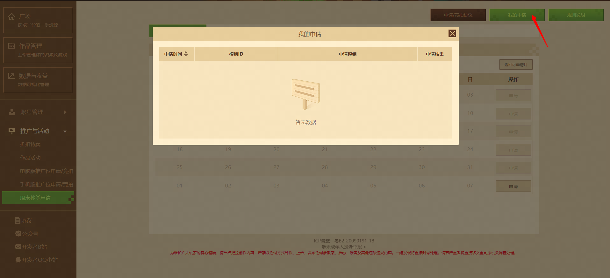

# 周末秒杀活动说明

## 一、什么是【周末秒杀】活动

每周五、六、日三天，将限时开启周末秒杀活动，报名并中标的模组将在活动当天20:00-23:59获得额外曝光，进行限时秒杀。

## 二、【周末秒杀】报名规则

1. 开发者平台新增【周末秒杀】报名通道，报名流程可查看【报名流程图解】
   - 每个秒杀日有且仅有15个模组可进行申请报名
   - 满15个模组在申请队列中时，此秒杀日将不再接受申请
   - 每个秒杀日有且仅有一个模组能够中标

2. 信用分满12分的开发者均可在：开发者平台 - 折扣与优惠 - 【周末秒杀】 页面进行报名：
   - 开发者至少提前9个自然日、至多提前22个自然日进行申请（e.g. 7月11-13日的秒杀模组，最晚在7月2日申请，最早在6月18日申请）
   - 每位开发者同一时间最多有6个模组处于申请中状态
   - 申请中状态：审核中、已通过、已上架
   - 以下情况不在申请中：未通过、已下架

3. 可申请的模组需满足以下条件：
   - 申请的模组6周内未参与过秒杀活动
   - 申请的模组必须为：原价大于100钻， 且是钻石付费模组
   - 秒杀份数最少为1000份，最多为10000份

4. 申请后，开发者可在【我的申请】中查看42天内申请历史

5. 申请通过/未通过时，我们将通过 站内信的形式 告知各位开发者

## 三、【报名流程图解】

1. 在开发者平台【折扣与优惠 - 周末秒杀申请】页面

2. 选择想要申请秒杀的周末，点击【申请】

3. 在【申请弹窗】中选择对应的日期，填写: 模组ID 、秒杀份数

4. 申请后，开发者可在【我的申请】中查看42天内申请历史

