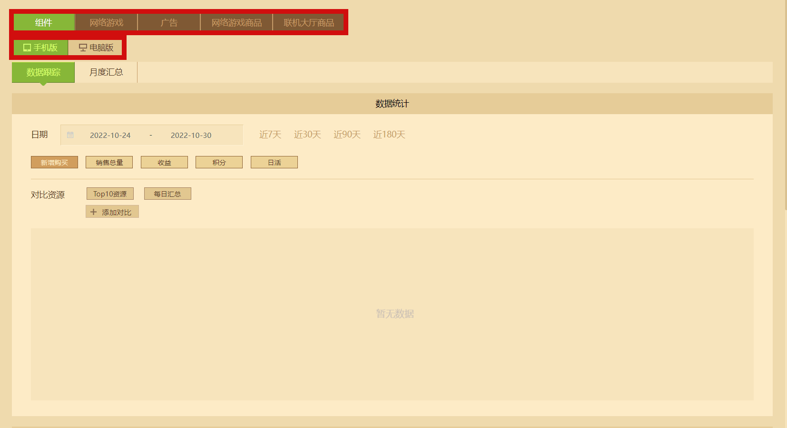

# 利用数据分析跟踪资源

> 文档版本：2022.10.31，优化文档内容。

在开发者平台左侧的 **【数据与收益】** 中，可以跳转至数据分析页面。数据分析功能的最终目的是更好的帮助开发者了解玩家的购买行为，以便更好地推广其作品和服务。数据分析对于开发者来说非常重要！

您可以利用图表和筛选功能了解最受欢迎的作品是哪些，明白新用户向忠实用户转化的资源题材是什么，根据相关数据来做出更好的作品开发方向和销售决策。判断用户会分阶段购买商品，如假期、时事等各种外部环境。

**在本教程中，您将学习以下内容** ：

- 学会使用数据跟踪功能。
- 学会使用月度汇总功能。

## 学会使用数据跟踪功能

数据追踪可以分为两大主要功能板块： **折线图表** 和 **跟踪明细表** 。这两大板块的功能均可以用于 **组件** 、 **网络游戏** 、 **广告** 、 **网络游戏商品** 和 **联机大厅商品** ，同时也分为手机版和电脑版。需要注意的是， **广告** 与 **联机大厅商品** 的相关数据仅适用于手机版查看。

### 折线图表

进入数据分析页面，默认就可以看到折线图表，通过 **添加对比** ，可以添加任意作品用于数据比较，具体操作方式如下：

1. 点击 **添加对比** 。
2. 在输入框内，输入资源名称匹配资源。
3. 下方的最终区域，可查看最近匹配过的资源。
4. 点击确认，提交资源对比清单，供后续数据分析使用。

在添加需要分析的作品后，需给定日期维度。接着可以选择相应的过滤器进行对比：  **新增购买** 、 **销售总量** 、 **收益** 、 **日活** 、 **积分** 。

| 过滤器类型 | 过滤器说明                                                   |
| ---------- | ------------------------------------------------------------ |
| 新增购买   | 在同一期间内，资源产生的新增购买数量。                       |
| 销售总量   | 在同一期间内，资源产生的购买总量。                           |
| 收益       | 在同一期间内，资源产生的钻石收益。若对比资源内存在非钻石定价的资源，默认显示0。 |
| 日活       | 在同一期间内，资源每日的玩家活跃量。                         |
| 绿宝石积分 | 在同一期间内，资源产生的绿宝石积分收益。若对比资源内存在非绿宝石定价的资源，默认显示0。 |

也就是说，在数据分析中，必须存在日期长度和至少一个对比资源，才能从平台后端抓取到数据源。

**注意：由于线上的资源数据量大，数据分析功能的数据源需要一定运算及同步时间，当日数据可能无法在次日0点立即完成处理，因此会出现数据标0的情况。您可在稍晚时间进行查看。**

接着可以任意选择一个过滤器搭配时间分析消费者的购买行为。下面借2022年10月24日至2022年10月30日期间的4个组件数据对比进行举例说明：

<strong>分析2022/10/24-2022/10/30手机版组件数据对比</strong> 1.  添加4个组件源。 2.  选择日期期间2022/10/24-2022/10/30。 3.  过滤器选择新增购买。 4.  阅读数据折线图。了解日期对给定组件<strong>新增购买</strong>的影响。

可以清楚得看到，钻石组件的新增收益主要集中在该周周五与周六两天。由于周日的数据源暂未同步，此处数据显示为0.

除此之外，针对查询日期超过7天的情况。图表同样允许拖拉、放大与缩小，以便在较长的时间跨度中，既能看到总体走向，也能放大查看每日的数据细节。

### 跟踪明细表

在数据分析页面向下拉，可以看到 **【全部资源跟踪明细】** ，这里会出现折线图中选择资源的全部数据信息。表格会累积所有对照资源的统计数据。点击各个数据维度的箭头，可进行升序、降序后从上往下看。

右上角的导出数据功能会将表格数据打包为 **CSV格式** （常见表格软件都可打开）。

## 学会使用月度汇总功能

点击 **月度汇总** 按钮，从数据跟踪页面转至月度汇总，与 **数据跟踪** 的 **每日汇总数据源** 相比，只是在时间跨度上将时间单位 **从天变为月** 。因此某一资源的新增购买变为该月日均新增购买，收益变为月度资源总收益。

右上角的导出数据功能会将表格数据打包为 **CSV格式** （常见表格软件都可打开）。

